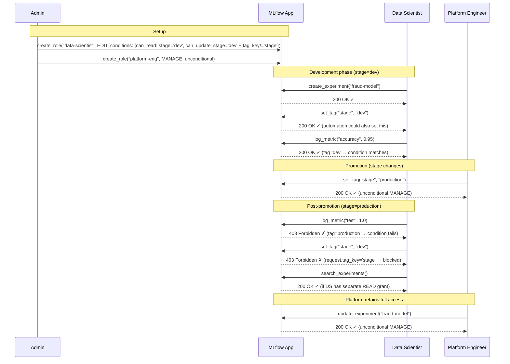
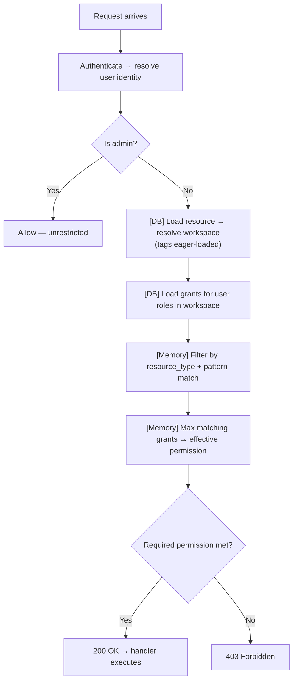
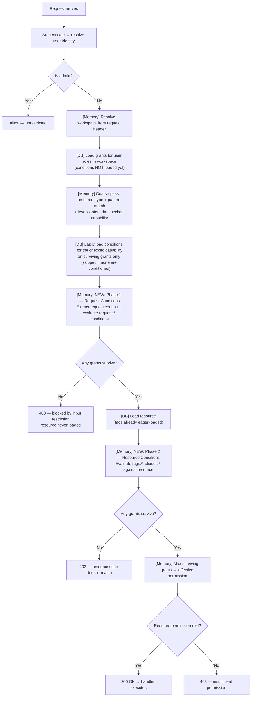

start_date: 2026-08-18
mlflow_issue: https://github.com/mlflow/mlflow/issues/24742
rfc_pr:

# Summary

MLflow RBAC grants access based on resource type and identity — but not based on
resource state. Once a user has EDIT on experiments in a workspace, they can
modify any experiment regardless of its lifecycle stage, sensitivity, or ownership.
There is no way to express "this user can edit dev experiments but not production
ones".

This RFC proposes condition-based access control: grants can optionally specify
conditions that must be satisfied for the grant to take effect. Conditions can match
against existing resource attributes (tags, aliases), enabling dynamic permission
boundaries within a workspace. When a resource's attributes change (e.g., tagged
for production), access automatically adjusts without admin intervention.

# Basic example

A data science team and a platform engineering team share a workspace. Data
scientists freely iterate on experiments and models during development. Once a
model is promoted to production, only the platform team should be able to modify
it — but the model stays in the same workspace, preserving lineage.

```python
# Admin setup: two roles with different conditional access
ds_role = client.create_role(name="data-scientist", workspace="ml-team")
client.add_role_permission(
    role_id=ds_role.id,
    resource_type="experiment",
    resource_pattern="*",
    permission="EDIT",
    conditions={
        # can read dev experiments; can mutate them only while stage=dev, and may
        # never rewrite the stage tag itself
        "can_read":   "tags.stage = 'dev'",
        "can_update": "(can_read) + request.tag_key != 'stage'",
        "can_use":    "(can_read)",
    },
)

platform_role = client.create_role(name="platform-eng", workspace="ml-team")
client.add_role_permission(
    role_id=platform_role.id,
    resource_type="experiment",
    resource_pattern="*",
    permission="MANAGE"  # unconditional — full access regardless of stage
)
```

**Lifecycle:**



```python
# 1. DS creates experiment, tags it dev — has full EDIT access
mlflow.set_experiment_tag(exp_id, "stage", "dev")
with mlflow.start_run(experiment_id=exp_id):
    mlflow.log_metric("accuracy", 0.95)  # ✓ allowed (stage=dev matches condition)

# 2. Model is ready — platform promotes it
mlflow.set_experiment_tag(exp_id, "stage", "production")  # platform does this

# 3. DS tries to modify — blocked (stage=production doesn't match their condition)
mlflow.log_metric("test", 1.0)  # ✗ 403 Forbidden

# 4. DS tries to revert the tag — blocked (request.tag_key != 'stage' fails)
mlflow.set_experiment_tag(exp_id, "stage", "dev")  # ✗ 403 Forbidden

# 5. Platform team retains full access (unconditional grant)
mlflow.set_experiment_tag(exp_id, "owner", "platform-team")  # ✓ allowed
```

The resource never moved. Lineage is intact. Access changed dynamically based on
the tag value.

# Motivation

MLflow RBAC grants match resources by exact ID or wildcard (`*`). There is no
way to express "grant access to resources matching a condition." This forces
admins into coarse-grained choices:

1. **Dev/prod boundary within a team:** A data science team works in a single
   workspace. During experimentation, models and experiments are freely editable
   by the team. Once a model is promoted to production (tagged `stage=production`),
   it should no longer be modifiable by the dev team — only the platform team
   should be able to alter production-tagged resources. Since the model originated
   in the same workspace, there is no current way to enforce this conditional
   permission boundary without moving the resource to a different workspace.
   Moving resources between workspaces is not viable: (a) sub-resources (runs,
   traces, logged models) inherit workspace from their parent experiment — you
   can't move individual resources independently; (b) the origin experiment
   constitutes lineage — re-parenting severs the experimental history; (c)
   workspace name uniqueness constraints create collision risk on move. Today,
   the only options are: give everyone EDIT and rely on convention, create
   separate workspaces and copy artifacts between them (breaking lineage), or
   enumerate specific resource IDs in grants (doesn't scale, breaks as new
   resources are created).

2. **Alias/promotion protection:** Only designated users should be able to set
   the `@champion` alias on a registered model. Today, anyone with EDIT on the
   registered model can set any alias.

3. **Restricting mutation inputs:** A data scientist needs EDIT to log runs and
   update model descriptions, but should not be able to set certain tag keys
   (e.g., `stage`, `approved`) or aliases (e.g., `@champion`, `@production`) that
   have operational significance. Today, EDIT grants unrestricted access to all
   tag and alias operations — there is no way to say "can edit the resource but
   cannot set this specific value." A deployment script that pulls models by the
   `@champion` alias would pick up any model a DS promoted, even if no review
   process was followed.

Conditions solve these by making grants dynamic — permissions follow the resource's
attributes without per-resource admin intervention, and without moving resources.
Request conditions additionally restrict *what values* a user can set, preventing
unauthorized promotion or classification.

### Use cases

Each use case below is expressed as a concrete grant using the capability-keyed
`conditions` model (see *Detailed design*). `#32` (sub-resource permissions)
supplies *type-level* carve-outs; conditions supply *attribute/value-level*
granularity — the two compose.

**1. Dev/prod boundary within a workspace**

A data-science team edits experiments freely during development, but loses mutate
access once a resource is promoted (`stage=production`). Read stays so prod remains
visible.

- **Example user:** a data scientist working alongside promoted resources.
- **Policy:** `(experiment, *, EDIT, {can_update: "tags.stage='dev'", can_delete: "tags.stage='dev'"})`
- **Result:** can read all experiments; can mutate/delete only while `stage=dev`.
  When the tag flips to `production`, `can_update`/`can_delete` stop matching and
  edit access evaporates automatically — no admin action, no resource move.

**2. Alias/promotion protection**

Only the platform role may set the `@champion` alias; everyone else may set other
aliases.

- **Example user:** a data scientist who manages aliases except the protected one.
- **Policy:** `(registered_model, *, EDIT, {can_update: "request.alias != 'champion'"})`
- **Result:** can set/move any alias except `champion`; the platform role gets an
  unconditional grant (or one that explicitly permits `champion`). This is a
  *request* condition — it gates the value being set, not the resource's state.

**3. Restricting mutation inputs (protected tag keys)**

A data scientist may edit resources but must not set operationally-significant tag
keys (e.g. `cost_center`, `approved`).

- **Example user:** a data scientist with broad edit rights but fenced-off keys.
- **Policy:** `(experiment, *, EDIT, {can_update: "request.tag_key != 'cost_center'"})`
- **Result:** all edits allowed except writing the protected tag key. Composes with
  use case 1 in one capability filter:
  `can_update: "tags.stage='dev' AND request.tag_key != 'cost_center'"` — a mixed
  resource+request condition (the resource must be dev-staged *and* the write must
  not touch the protected key).

**4. Sensitive-data isolation**

Experiments tagged `data_classification=restricted` are invisible to most roles; a
cleared role sees them.

- **Example user:** a general team member without clearance for restricted data.
- **Policy:** `(experiment, *, USE, {can_read: "tags.data_classification != 'restricted'"})`
- **Result:** restricted experiments are filtered out of reads and search
  (`SearchExperiments` prefilters via the `can_read` condition); a cleared role
  gets a grant without the `can_read` condition. This is the one use case gating
  `can_read`.

### Out of scope

- **Artifact-layer (S3) protection.** MLflow RBAC controls the metadata layer
  (MLflow API). Protecting the underlying artifact storage (S3 objects) requires
  complementary IAM policies. This proposal does not address S3-layer access.
- **Owner-based conditions** (e.g., "users can only modify resources they
  created"). This requires tracking resource ownership, which is a separate
  feature. The condition framework could support it in the future.

# Detailed design

## Condition model

Conditions are filter expressions attached to role permission grants. They come
in two types, evaluated at different phases of the request lifecycle:

- **Resource conditions** — checked against the resource's current attributes
  (tags, aliases). Controls *which resources* a grant applies to.
- **Request conditions** — checked against the incoming request payload (input
  values). Controls *what mutations* a grant's holder can perform.

### Conditions are scoped per capability, not per grant

A permission level is a **cumulative bundle of capabilities**
(`MANAGE > EDIT > USE > READ`):

| Permission | Can read | Can use | Can update | Can delete | Can manage |
|------------|:--------:|:-------:|:----------:|:----------:|:----------:|
| READ       | ✓ | | | | |
| USE        | ✓ | ✓ | | | |
| EDIT       | ✓ | ✓ | ✓ | | |
| MANAGE     | ✓ | ✓ | ✓ | ✓ | ✓ |

Every operation checks exactly **one capability** (`GetRun` → `can_read`,
`UpdateRun` → `can_update`, `DeleteRun` → `can_delete`, …). Conditions therefore
attach to a grant **keyed by capability**, not to the grant as a whole:

```
grant = (resource_type, resource_pattern, LEVEL, conditionsByCapability)

conditionsByCapability = {
    "can_read":   <filter>,
    "can_use":    <filter>,
    "can_update": <filter>,
    "can_delete": <filter>,
    "can_manage": <filter>,
}
```

**Why capabilities and not levels.** Capabilities are *atomic* — no implication
between them — whereas a *level* implies every lower capability it bundles. Keying
a condition on a level (e.g. "EDIT: tags.stage='dev'") would be ambiguous: EDIT
contains `can_read`, so it is unclear whether the condition also gates reads.
Keying on the atomic capability makes each condition **independent by construction**.
For example, a `can_read` condition `tags.stage = 'dev'` gates *reading* existing
experiments by their tag, but has nothing to say about `can_use` in its
create-in-workspace sense — there is no resource yet, so the tag condition simply
does not apply to create. Because the condition is attached to `can_read`, not to a
level that bundles both, there is **no inheritance between capabilities** to reason
about: the read gate does not have to be argued out of applying to create.

**Alternative considered — a flat condition set, filtered at evaluation time.** The
grant could instead hold a single flat set of clauses, and the permission model could
decide *at evaluation time* which clauses apply to the current action (e.g. skip a
`request.*` clause on a read, skip a resource clause on create). This works
mechanically, but it is opaque from a **reading and authoring** standpoint: looking at
a grant, an admin cannot tell which clause governs which action — the mapping lives in
engine logic, not in the grant. That silent filtering means the system is not visibly
honoring the clauses as written; two grants with the same clause set can behave
differently depending on rules the reader can't see. Keying each clause to an explicit
capability makes the action↔condition mapping **authored and visible** on the grant, so
what you read is what is enforced.

Rules:

- **Independent per capability.** Each capability's filter is self-contained and
  evaluated alone; the same filter appearing under two capabilities is duplicated
  explicitly (this is deliberate — it avoids any cross-capability inheritance or
  escalation ambiguity). AND composes only *within* a capability's filter; never
  across capabilities.
- **An absent capability key means the operations that check that capability are
  UNCONDITIONAL** (the grant authorizes them at its level with no condition).
  Absence is never a deny — deny is `NO_PERMISSIONS`, a separate concern.
- **Level is the ceiling.** A condition may only be attached to a capability the
  grant's level actually confers (`keys(conditionsByCapability) ⊆
  capabilities(LEVEL)`). A `can_update` condition requires level ≥ EDIT;
  `can_delete`/`can_manage` require MANAGE. Violations are rejected at grant
  creation — a condition can only *gate* a conferred capability, never *enable* one.
- **Evaluation:** an operation resolves to its capability `C`; the grant authorizes
  `C` iff `C ∈ level` **and** `conditionsByCapability[C]` is satisfied (absent =
  unconditional). Grants still compose with max-wins across grants.

#### Capability composition (authoring shorthand)

To avoid retyping a shared filter, a **higher** capability may compose a **lower**
one's conditions plus its own terms:

```python
# can_update reuses can_read's filter, adding a request restriction
conditionsByCapability = {
    "can_read":   "tags.stage = 'dev'",
    "can_update": "(can_read) + request.tag_key != 'stage'",
}
# can_update expands at creation to: tags.stage='dev' AND request.tag_key!='stage'
```

This is **compile-time expansion into a standalone per-capability filter**, not
runtime inheritance — each capability still stores and evaluates an independent
filter. The reference direction is **higher-references-lower only** (prevents
cycles; a lower capability holds only broadly-valid resource conditions, so
borrowing them upward is always valid). The 5-condition limit is enforced on the
**expanded** filter (`referenced + own ≤ 5`).

### Condition shape

A condition is a filter expression string following the format below, reusing
MLflow's existing search filter syntax:

```
<entity>.<key> <operator> <value>
```

Example conditions:
```
"tags.stage = 'dev'"
"request.tag_key != 'stage'"
"aliases.champion EXISTS"
"tags.stage IN ('dev', 'staging')"
```

**Resource condition entities** (matched against the resource's current state):

| Entity | Description | Example |
|--------|-------------|---------|
| `tags` | Resource tags (key-value pairs) | `tags.stage = 'dev'` |
| `aliases` | Model aliases (registered_model only) | `aliases.champion EXISTS` |

**Request condition entities** (matched against the incoming request payload):

| Entity | Description | Example |
|--------|-------------|---------|
| `request` | Incoming request payload fields | `request.tag_key != 'stage'` |

**Supported operators:**

| Operator | Meaning | Example |
|----------|---------|---------|
| `=` | Equals | `tags.stage = 'dev'` |
| `!=` | Not equals | `request.tag_key != 'stage'` |
| `EXISTS` | Key/field is present | `tags.reviewed EXISTS` |
| `NOT EXISTS` | Key/field is absent | `tags.stage NOT EXISTS` |
| `IN` | Value in set | `tags.stage IN ('dev', 'staging')` |
| `NOT IN` | Value not in set | `request.alias NOT IN ('champion', 'production')` |

### AND vs OR semantics

Conditions within a **single capability's filter** compose with **AND** — all
must be satisfied for the grant to authorize that capability:

```python
# The can_update filter requires BOTH terms (AND):
client.add_role_permission(role_id=5, resource_type="experiment",
    resource_pattern="*", permission="EDIT",
    conditions={"can_update": "tags.stage = 'dev' AND request.tag_key != 'stage'"})
```

Conditions across **different grants** are inherently **OR** — if any grant
authorizes the capability, that grant participates in the max:

```python
# These two grants give OR behavior for can_update:
# Grant A: EDIT-update if stage=dev
client.add_role_permission(role_id=5, ..., permission="EDIT",
    conditions={"can_update": "tags.stage = 'dev'"})
# Grant B: EDIT-update if stage=staging
client.add_role_permission(role_id=5, ..., permission="EDIT",
    conditions={"can_update": "tags.stage = 'staging'"})

# Effective: can_update if stage=dev OR stage=staging
# (equivalent to: "tags.stage IN ('dev', 'staging')" on a single can_update filter)
```

AND never composes *across* capabilities — each capability's filter is evaluated
independently for the operation that checks it.

### Condition limits

A maximum of **5 conditions per capability** (enforced on the *expanded* filter
when capability composition is used). This bounds the per-operation evaluation
cost, since an operation consults exactly one capability's conditions. If more
complex logic is needed, admins should split across multiple grants (which compose
with OR).

### Grants without conditions

A grant with no conditions behaves exactly as today — fully unconditional. It
always participates in the max regardless of resource state or request content. A
single unconditional grant will always override conditional grants of the same or
lower permission level. Likewise, a capability **omitted** from a grant's
`conditions` map is unconditional for the operations that check it — absence of a
condition is never a denial.

### Two-phase evaluation

Conditions are evaluated in two phases, enabling early rejection before the
resource is loaded:

**Today's authorization flow:**



**Proposed flow with conditions:**



The resolver evaluates a single operation, identified by the **capability** it
checks, in four steps:

1. **Load candidate grants** for the user / resource_type / workspace — the coarse
   grant query, unchanged from today. Conditions are *not* joined here.
2. **Coarse pass** — keep only grants whose level actually confers the checked
   capability (pattern/parent match + the level ceiling). No conditions, no resource
   load yet; if none survive, deny.
3. **Fine pass** — for the survivors, lazily load **only this capability's**
   conditions and evaluate them (absent ⇒ unconditional): the request phase first
   (against the `request_attributes` the operation's validator surfaced — no resource
   needed), then the resource phase (against the loaded resource's tags/aliases).
4. **Max-wins** across the grants that authorized the capability.

An absent condition set is treated as **unconditional**, so a capability with no
rows authorizes freely. On the search path the capability is `can_read` and the
request phase is vacuous — matching the fast/slow-path filter above.

### Request context extraction

Request attributes are extracted by the **per-operation validator that already exists
in the call path** — not by a separate parallel registry. Today every mutating
operation is mapped in `BEFORE_REQUEST_HANDLERS` to a `validate_can_*` function that
already reads the request (e.g. `SetRegisteredModelAlias → validate_can_update_registered_model`,
which parses the request to resolve the model), and that map is dispatched from the
before-request hook (`_find_validator(request)` in `mlflow/server/auth/__init__.py`).
This is exactly where request attributes are produced and where the condition check runs.

Concretely, the validator for a mutating operation:
1. parses its typed request via the same `_get_request_message(<Op>(), ...)` the handler
   uses (so the field names come from the operation's own proto/schema — no second
   source of truth to keep in sync);
2. returns the attributes it read as a small `dict` (e.g. `{"tag_key": ...}`) on the
   `AuthorizationRequirement.request_attributes` channel;
3. the backend evaluates the `request.*` conditions for the checked capability against
   that dict.

```python
# The validator already in BEFORE_REQUEST_HANDLERS reads the request; it now also
# surfaces the attributes it read. No parallel REQUEST_CONTEXT_EXTRACTORS map.
def validate_can_update_experiment_set_tag():
    req = _get_request_message(SetExperimentTag())          # same parse the handler does
    return AuthzInput(
        capability="can_update",
        request_attributes={"tag_key": req.key, "tag_value": req.value},
    )
```

An operation whose validator surfaces no attributes (reads, searches, plain deletes)
simply provides no `request_attributes`; `request.*` conditions are then vacuously
true for it. Because the mapping lives on the operation's own validator — which must
exist for the operation to be authorized at all — there is no separate registry that
can drift out of sync, and the "which fields does this operation expose" knowledge
stays next to the operation's existing request parsing. (The condition-kind validity
check in *Condition-kind × capability validity* keys off exactly whether a mutating
operation surfaces request attributes.)

### Extendable evaluation

Condition evaluation is delegated to a registry of evaluator functions, keyed by
entity type. New condition types can be added in the future by registering an
evaluator — no changes to the resolution engine or schema required.

```python
CONDITION_EVALUATORS: dict[str, Callable] = {}

def register_condition_evaluator(entity: str, evaluator: Callable):
    CONDITION_EVALUATORS[entity] = evaluator

# Built-in evaluators:

def _evaluate_tag_condition(condition, resource) -> bool:
    tags = {t.key: t.value for t in resource.tags}
    return _compare(tags.get(condition.key), condition.operator, condition.value)

def _evaluate_alias_condition(condition, resource) -> bool:
    aliases = getattr(resource, "aliases", {})
    return _compare(aliases.get(condition.key), condition.operator, condition.value)

def _evaluate_request_condition(condition, request_context) -> bool:
    if request_context is None:
        return True  # No request context for this operation — condition doesn't apply
    value = request_context.get(condition.key)
    if value is None:
        return True  # Field not in this request — condition doesn't apply
    return _compare(value, condition.operator, condition.value)

def _compare(actual, operator, expected) -> bool:
    if operator == "=": return actual == expected
    elif operator == "!=": return actual != expected
    elif operator == "EXISTS": return actual is not None
    elif operator == "NOT EXISTS": return actual is None
    elif operator == "IN": return actual in expected
    elif operator == "NOT IN": return actual not in expected
    return False

register_condition_evaluator("tags", _evaluate_tag_condition)
register_condition_evaluator("aliases", _evaluate_alias_condition)
register_condition_evaluator("request", _evaluate_request_condition)
```

### Condition routing

The resolver separates conditions by entity type for two-phase evaluation:

```python
def _request_conditions_match(conditions, request_context) -> bool:
    """Evaluate only request.* conditions."""
    request_conds = [c for c in conditions if c.entity == "request"]
    if not request_conds:
        return True  # No request conditions on this grant
    return all(evaluate_condition(c, request_context) for c in request_conds)

def _resource_conditions_match(conditions, resource) -> bool:
    """Evaluate only resource-state conditions (tags.*, aliases.*)."""
    resource_conds = [c for c in conditions if c.entity != "request"]
    if not resource_conds:
        return True  # No resource conditions on this grant
    return all(evaluate_condition(c, resource) for c in resource_conds)
```

### Condition-kind × capability validity

Not every condition kind is meaningful on every capability, and the answer is
**resource-type dependent** — because a capability like `can_use` or `can_delete`
means different things per type:

- `can_use` on a workspace = *create* an experiment/model (sets initial values);
  `can_use` on a gateway endpoint = *invoke* (sets no value).
- `can_delete` on a run = plain remove (no value); `can_delete` on a registered
  model via `DeleteRegisteredModelAlias(name, alias)` = deletes *by* an alias
  value.

So validity is **(kind × capability × resource_type)**, and the source of truth is
whether the operation's validator surfaces request attributes (see *Request context
extraction*) — not a static table:

- **Request-condition validity is validator-derived (fail-closed).** A `request.*`
  condition may be attached to a capability **iff at least one operation of that
  resource_type at that capability carries request attributes** (has a non-null
  extractor). No extractor → the request condition has nothing to gate → **rejected
  at grant creation.** This also resolves the "missing evaluator" gap (see Open
  questions): an unregistered/absent extractor fails closed at creation rather than
  passing vacuously at request time.
- **Resource-condition validity = existing-resource.** A `tags.*`/`aliases.*`
  condition is valid on any capability that acts on an existing resource. The only
  exclusion is the *create* sense (no resource yet — e.g. workspace `can_use`),
  where a resource condition is vacuous.

Combined with the level ceiling (a condition's capability must be conferred by the
grant's level), grant creation rejects any condition whose (kind, capability,
resource_type) is invalid.

### Search filtering

Search operations check `can_read`, so search filtering consults **only each
grant's `can_read` condition** (the other capabilities are irrelevant to reads,
and request conditions never apply to search). Search results already include tags
in their response objects, so no extra queries are needed.

```python
def filter_search_results(user_id, resource_type, results, workspace, grants):
    """Filter search results based on user's effective permissions."""

    # Fast path: if user has any unconditional wildcard READ+ grant, return all
    has_unconditional_wildcard = any(
        g.resource_pattern == "*" and g.permission >= READ and not g.conditions
        for g in grants
        if g.resource_type == resource_type
    )
    if has_unconditional_wildcard:
        return results  # Short-circuit — no per-result evaluation needed

    # Slow path: evaluate per-result (only when all grants are conditional)
    filtered = []
    for result in results:
        effective = [g for g in grants
                     if g.resource_type == resource_type
                     and (g.resource_pattern == "*" or g.resource_pattern == result.id)
                     and _resource_conditions_match(g.conditions, result)]
        if effective and max(g.permission for g in effective) >= READ:
            filtered.append(result)
    return filtered
```

The fast path ensures no performance regression for the common case (unconditional
wildcard grants). The slow path only triggers when all grants are conditional,
and uses tags already present on the search result objects — no extra DB queries.

## Relationship to RFC 0008 (pluggable auth)

This proposal is designed to layer onto the merged pluggable-auth contract (RFC
0008) without changing its core shape. RFC 0008 already establishes the split this
design relies on: **core owns route knowledge and resolves the requirement; the
backend owns the decision.** Conditions slot into that split cleanly.

**What already fits, unchanged:**

- **Capabilities are 0008's action verbs.** 0008's six actions
  (`read | use | update | delete | manage | create`) map 1:1 onto the capability
  booleans (`can_read`, …). The capability a condition is keyed to is exactly the
  `AuthorizationRequirement.action` core already emits — so "which condition applies
  to this operation" needs no new routing: it is the action 0008 already resolves.
- **The decision stays in the backend.** Core never evaluates a condition; it only
  supplies the attributes a condition references (below). This is the same
  "core resolves structure, backend decides" pattern 0008 uses for `workspace`
  (and #32 uses for the parent tier).
- **The condition store is backend-private.** `role_permission_conditions` is the
  **default DB backend's** realization; it is not part of the 0008 contract. A
  third-party backend (OPA, etc.) expresses equivalent conditions in its own policy
  language. The contract only covers the attribute channels and the search shape
  below.

**What this proposal adds to the 0008 shapes (proposed extensions):**

1. **`request_attributes` on `AuthorizationRequirement`** — a
   `Mapping[str, str]` of the mutation's attempted input values (e.g.
   `{"tag_key": "stage"}`), surfaced by the **per-operation validator already in the
   call path** (see *Request context extraction*), which reads the request with the
   same `_get_request_message` parse the handler uses. This is what lets the backend
   evaluate a `request.*` condition without ever seeing the raw request — preserving
   0008's rule that `RequestContext` never carries request material. Extraction (core)
   is distinct from evaluation (backend).
2. **`resource_attributes` on `AuthorizationRequirement`** — the target resource's
   tags/aliases for the single-resource path, supplied wholesale by core (it already
   loads the resource to resolve workspace/parent). Type-bounded and loaded only when
   a surviving grant is conditioned (the two-phase / lazy-load flow above). This lets
   the backend evaluate a `tags.*`/`aliases.*` condition without reading the resource
   DB (the 0008 boundary).
3. **A `predicate` channel on `AuthorizedResources`** for search. 0008's
   `list_authorized` returns `AuthorizedResources{all, resource_ids}`; a resource
   condition on a wildcard grant is neither "all" nor a finite id set, so it is
   emitted as a **filter predicate** core ANDs into the store search. The shape stays
   flat — `{all, resource_ids, predicate}` — because id-match and condition-test are
   evaluated in separate phases (coarse then fine), never fused into one clause. When
   the store grammar cannot express the predicate, it degrades to 0008's existing
   `all=None` per-row fallback.

**Boundary summary:** core extracts request attributes and loads resource
attributes (the only party that can read the request and the resource DB); the
backend owns every decision and every condition. `request_attributes` /
`resource_attributes` are the *same category of act* as 0008 resolving
`workspace`/`action` — dispatch inputs, not authorization logic. A backend that does
not model conditions simply ignores the extra attributes and behaves as an
unconditional RBAC backend.

## API change

`add_role_permission` gains an optional `conditions` parameter — a mapping from
**capability** to an AND-ed filter string (MLflow's existing search filter
syntax). A capability absent from the mapping is unconditional.

```python
store.add_role_permission(
    role_id=5,
    resource_type="experiment",
    resource_pattern="*",
    permission="EDIT",
    conditions={
        "can_read":   "tags.stage = 'dev'",
        "can_update": "tags.stage = 'dev' AND request.tag_key != 'stage'",
    },
)
```

At creation time, for each capability entry the filter string is:
1. Parsed using the same parser as search `filter_string`.
2. Expanded if it uses capability composition (`(can_read) + …`) — the referenced
   lower capability's filter is inlined (higher-references-lower only).
3. Validated:
   - the **capability** must be conferred by `permission` (level ceiling — e.g.
     `can_update` requires ≥ EDIT); no-escalation.
   - entities/operators must be registered/supported, and the **(kind, capability,
     resource_type)** must be valid (request conditions only where an extractor
     exists; resource conditions only on capabilities acting on existing state).
4. Split into individual clauses and stored as `role_permission_conditions` rows
   tagged with `capability` + `entity`.
5. Rejected with `INVALID_PARAMETER_VALUE` if malformed, if a capability isn't
   conferred by the level, if the (kind, capability, resource_type) is invalid, or
   if any capability's **expanded** filter exceeds 5 AND clauses.

The response returns each capability's condition as its filter string:

```json
{
    "role_permission": {
        "id": 5,
        "role_id": 2,
        "resource_type": "experiment",
        "resource_pattern": "*",
        "permission": "EDIT",
        "conditions": {
            "can_read": "tags.stage = 'dev'",
            "can_update": "tags.stage = 'dev' AND request.tag_key != 'stage'"
        }
    }
}
```

A grant with no `conditions` (or `conditions: null`) is fully unconditional —
today's behavior. A capability omitted from a non-empty `conditions` map is
unconditional for the operations that check it.

## Schema change

```sql
CREATE TABLE role_permission_conditions (
    id INTEGER PRIMARY KEY AUTOINCREMENT,
    role_permission_id INTEGER NOT NULL REFERENCES role_permissions(id) ON DELETE CASCADE,
    capability VARCHAR(20) NOT NULL,  -- "can_read","can_use","can_update","can_delete","can_manage"
    entity VARCHAR(50) NOT NULL,      -- "tags", "aliases", "request"
    key VARCHAR(255) NOT NULL,        -- tag key, alias name, request field
    operator VARCHAR(10) NOT NULL,    -- "=", "!=", "EXISTS", "NOT EXISTS", "IN", "NOT IN"
    value VARCHAR(512)                -- NULL for EXISTS/NOT EXISTS
);

CREATE INDEX idx_rpc_permission_id ON role_permission_conditions(role_permission_id);
CREATE INDEX idx_rpc_capability ON role_permission_conditions(role_permission_id, capability);
CREATE INDEX idx_rpc_entity_key ON role_permission_conditions(entity, key);
```

This is additive — existing `role_permissions` rows have no condition rows
(unconditional, today's behavior). No data migration required.

Rows are grouped by `capability`; evaluation for an operation consults only the
rows matching that operation's capability. Multiple rows for the same
`(role_permission_id, capability)` compose with AND semantics — all must be
satisfied for the grant to authorize that capability. A capability with no rows is
unconditional.

**Example:**

```sql
-- Grant 5 (EDIT): on experiments where stage='dev' (readable + editable),
-- and additionally may not set the stage tag when updating.
-- can_read gates visibility; can_update adds the request restriction.
INSERT INTO role_permission_conditions
    (role_permission_id, capability, entity, key, operator, value)
VALUES
    (5, 'can_read',   'tags',    'stage',   '=',  'dev'),
    (5, 'can_update', 'tags',    'stage',   '=',  'dev'),
    (5, 'can_update', 'request', 'tag_key', '!=', 'stage');
```

## Performance

### Time complexity

- **Grant loading:** O(R) where R = number of roles for the user (typically 1-5). Unchanged.
- **Condition evaluation per grant:** an operation consults only the **one capability** it checks; each condition is O(1) (a dict lookup + comparison; `IN`/`NOT IN` operands are parsed into a set at load time, so membership is also O(1)). A capability has at most 5 conditions, so per-grant evaluation is bounded constant work.
- **Total per request:** O(G × C) where G = matching grants (typically 3-10), C = max 5 conditions on the checked capability. Worst case: 50 string comparisons.
- **Search filtering:** O(N × G × C) where N = result count, consulting only each grant's `can_read` conditions. Fast path (unconditional wildcard grant exists) reduces to O(1).

### Protection against unbounded growth

Conditions could degrade performance if unconstrained:

| Risk | Mitigation |
|---|---|
| Too many conditions per capability | **Hard limit: 5 conditions per capability** (on the expanded filter). Enforced at creation time. Reject with `INVALID_PARAMETER_VALUE`. |
| Too many conditional grants per role | **Soft limit: 20 grants per role.** Warning at creation. This is an existing operational concern (not new to conditions). |
| Large tag sets on resources | Tags and aliases are already eager-loaded by the existing code path (both single resource access and search use `eager=True` subquery load). Condition evaluation reads from the in-memory object — no additional query possible. Tag count bounded by MLflow's per-resource limit (100). |
| Regex or complex matching | **Not supported.** Only `=`, `!=`, `EXISTS`, `NOT EXISTS`, `IN`, `NOT IN` — all O(1) per evaluation. No regex, no glob, no subquery. |
| Condition evaluation on every search result | **Fast path:** if any unconditional wildcard READ+ grant exists, skip all per-result evaluation. Only degrades when ALL grants are conditional. |

### DB impact

- **Grant query is unchanged.** The coarse pass loads grants exactly as today (per
  user / resource_type / workspace). Condition rows are **not** joined here.
- **Conditions load lazily.** Only grants that survive the coarse pass and are
  conditioned on the checked capability trigger a second, narrow query for their
  `role_permission_conditions` rows (indexed by `role_permission_id` + `capability`).
  Unconditional grants and non-surviving grants incur no condition read at all.
- **No extra queries for tags.** Resource tags are already loaded during workspace
  resolution (`eager=True` subquery load).
- **No condition logic in SQL.** The DB returns grants + condition rows; all
  evaluation is in application code.

## Relationship to the allow-only model

MLflow RBAC has no explicit deny — grants are additive, and the highest matching
permission wins. Conditions preserve this property cleanly: they specify what a
grant DOES match (positive matching only), never what it excludes.

```
Grant A: (experiment, *, EDIT, condition: tag_equals stage=dev)
Grant B: (experiment, *, READ, unconditional)

Resource tagged stage=dev:
  Grant A: condition met → EDIT
  Grant B: unconditional → READ
  Result: max(EDIT, READ) = EDIT

Resource tagged stage=production:
  Grant A: condition not met → excluded from evaluation
  Grant B: unconditional → READ
  Result: max(READ) = READ
```

**Key property preserved:** A condition can only narrow its own grant. It cannot
reduce permissions conferred by other grants. If a user has an unconditional EDIT
grant from any other role, no condition on any other grant can take that away.

By restricting to positive operators (`=`, `EXISTS`), this design
stays purely additive — each grant explicitly declares what it matches, with no
negative logic. This aligns with how Kubernetes RBAC works (resources, verbs,
namespaces — all positive matching) while adding attribute-awareness that K8s
delegates to admission controllers.

**Comparison to other systems:**

| System | RBAC | Attribute-based restriction | Deny mechanism |
|--------|------|---------------------------|---------------|
| Kubernetes | Roles + Bindings | Admission controllers (separate layer) | Admission controller rejects |
| IAM | Identity policies | Conditions on statements (incl. negation) | Explicit Deny overrides Allow |
| PostgreSQL | GRANT/REVOKE | Row-Level Security (separate layer) | RLS filters rows |
| **MLflow (proposed)** | Roles + Grants | Conditions on grants (positive only) | None — max-wins preserved |

- **Additional condition loading.** Conditions add a second, narrow query on the
  fine pass — but only for grants that survive the coarse pattern/level match and
  are conditioned on the checked capability. Mitigated: the coarse grant query is
  unchanged from today; unconditional and non-surviving grants incur no condition
  read, and the total candidate set is bounded by the number of roles a user has
  (typically 1-5).

- **Circular tag protection.** A user who can EDIT a resource could potentially
  set the condition tag to make their grant match. Mitigated: condition tags
  should be set by automation/platform roles at creation time, and promotion
  (tag changes) should be done by workspace MANAGE holders.

- **Condition complexity.** Admins must understand how conditions interact with
  the permission resolution (highest-wins). A single unconditional EDIT grant
  overrides all conditional restrictions on the same resource type. Admins must
  ensure restricted roles have only conditional grants.

- **Metadata-layer only.** Conditions protect MLflow API access but not the
  underlying S3 artifacts. A user with direct S3 access (via IAM) can bypass
  MLflow RBAC entirely. This is not new — it's true of all MLflow RBAC — but
  conditions may create a false sense of full protection.

# Alternatives

### A. Workspace isolation (move resources between workspaces)

Use workspaces as the permission boundary — reassign a resource's workspace when
it transitions from dev to production.

**Rejected because:**
- Sub-resources (runs, traces, logged models) don't have a workspace column —
  they resolve workspace via parent experiment. Moving an experiment implicitly
  moves all children, but there's no independent sub-resource mobility.
- Lineage is tied to the origin experiment — a run's experiment context records
  what it was part of (other runs, model versions derived from those runs).
  Re-parenting a resource to a different experiment in another workspace severs
  that lineage.
- Name uniqueness constraint (`UniqueConstraint("workspace", "name")`) means
  moving an experiment can collide with an existing name in the target workspace.
- Workspace overhead — each lifecycle boundary requires a separate workspace with
  its own role setup, and resources must be duplicated or moved to cross it.

### B. Resource groups (stage-based access tiers)

Add a "resource group" dimension to grants — resources belong to a group (e.g.,
`dev`, `production`), and grants specify which group they apply to. Promotion
changes the group, instantly changing who can access the resource.

**Explored and rejected because:**
- A resource belonging to a single group is equivalent to a lifecycle stage —
  too narrow for cases where access depends on multiple attributes simultaneously.
- Multiple groups per resource introduces AND/OR ambiguity: does matching ANY
  group grant access (defeats restriction) or ALL groups (confusing to admin)?
- Requires a new API for group assignment (`set_resource_group`) and a new
  schema column, when resources already have a flexible attribute mechanism (tags).
- Group assignment itself needs authorization (who can promote?) — creates a
  chicken-and-egg problem where the promoting role needs access to the resource
  before it's in their group.
- Ultimately, resource groups are a special case of conditions restricted to a
  single attribute. Conditions are strictly more flexible while reusing existing
  resource metadata.

### C. Separate policy layer (admission-controller style)

Add a separate authorization layer that runs after RBAC, inspecting resource
attributes to accept/reject requests. Analogous to Kubernetes admission
controllers (OPA/Gatekeeper) or PostgreSQL Row-Level Security.

**Explored and rejected because:**
- "RBAC allows, policy denies" is effectively an explicit deny mechanism — it
  contradicts MLflow's allow-only model at the architectural level even if RBAC
  itself remains unchanged.
- Two authorization systems to understand and configure — admin must reason about
  both RBAC grants AND policy rules, increasing cognitive load.
- Policy rules that contradict RBAC grants are confusing: "I have EDIT... why
  can't I edit this?" Conditions on grants keep the explanation co-located with
  the permission.
- For MLflow's scale (small number of roles and grants per workspace), a separate
  policy engine is over-engineered.

### D. Per-resource-ID grants only

Enumerate specific resource IDs in grants without conditions.

**Rejected because:**
- Doesn't scale — hundreds of experiments require hundreds of grants
- Breaks as new resources are created (admin must update grants)
- No dynamic behavior — permissions don't follow resource attributes

### Why conditions on grants won

Conditions are the chosen approach because they:
1. **Reuse existing resource attributes (tags)** — no new resource schema, no new
   assignment APIs, no migration needed.
2. **Are flexible** — can express lifecycle stages, classifications, team
   ownership, or any other tag-based boundary without locking into one model.
3. **Dynamic without admin intervention** — changing a tag instantly changes
   access. No grant updates needed when a resource transitions.
4. **Preserve the allow-only model** — positive-only operators (`=`, `EXISTS`)
   keep grants purely additive. No negative logic, no deny.
5. **Minimal DB overhead** — the coarse grant query is unchanged from today;
   conditions are loaded lazily only for grants that survive it and are conditioned
   on the checked capability. Resource tags and aliases are already loaded by the
   existing workspace resolution step (eager loading), so condition evaluation adds
   no resource queries — it is purely in-memory comparison against data already
   available.
6. **Co-located with grants** — the condition is ON the permission, so an admin
   reading a role's grants immediately sees both what it allows and under what
   circumstances.

# Adoption strategy

**This is not a breaking change.** Grants without condition rows behave exactly
as today — unconditional. The `conditions` parameter defaults to null (no rows
created in `role_permission_conditions`).

**Adoption path:**

1. Upgrade to the version shipping this change (no behavior change)
2. Identify resources that need protection (e.g., production experiments)
3. Ensure those resources are tagged appropriately (e.g., `stage=production`)
4. Replace unconditional grants with conditional ones on restricted roles:
   ```python
   # Before: DS has unconditional EDIT
   add_role_permission(ds_role, "experiment", "*", "EDIT")

   # After: DS has EDIT only on dev-tagged experiments
   delete_role_permission(ds_role, "experiment", "*", "EDIT")
   add_role_permission(ds_role, "experiment", "*", "EDIT",
       conditions={
           "can_read":   "tags.stage = 'dev'",
           "can_update": "tags.stage = 'dev' AND request.tag_key != 'stage'",
       })
   ```
5. Verify access is as expected

**Reverting:** Delete conditional grants and recreate unconditional ones. No
destructive schema rollback needed — the `role_permission_conditions` table with
no rows is inert (grants without condition rows behave unconditionally).

# Open questions

1. **Should platform admin be able to configure the conditions-per-grant limit?**
   The default is 5. Should this be a workspace-level or server-level setting
   that admins can adjust, or should it remain a fixed system limit?

2. **~~How to add test coverage for resource types with missing request and resource
   evaluators?~~ (resolved)** Rather than pass vacuously at request time, validity is
   **derived from whether the operation's validator surfaces request attributes and
   enforced at grant creation** (see *Condition-kind × capability validity*): a request
   condition on a (resource_type, capability) whose operations surface no request
   attributes is **rejected at creation** (fail-closed), and a resource condition on a
   capability with no resource is rejected likewise. Because extraction rides the
   operation's existing validator (rather than a parallel registry), there is no
   separate table that can silently omit an operation. Remaining sub-question: should
   a CI lint assert every mutating operation's validator declares its surfaced
   attributes, so the validity check is exhaustive?
