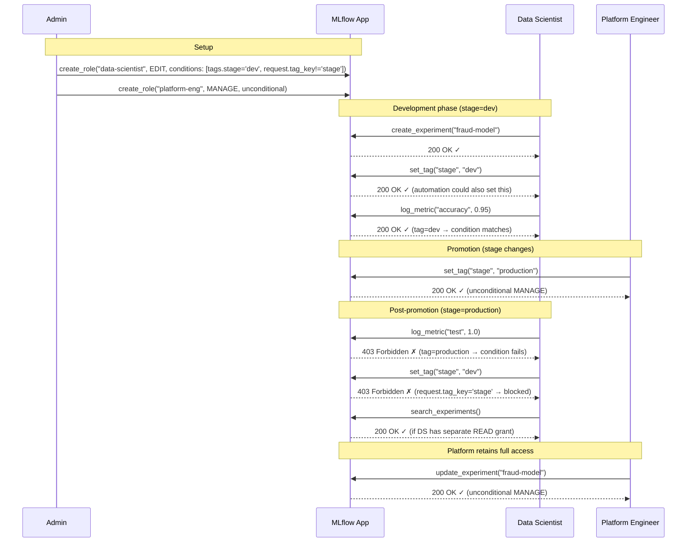
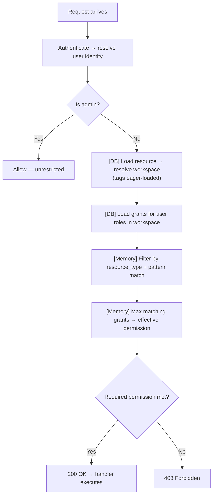
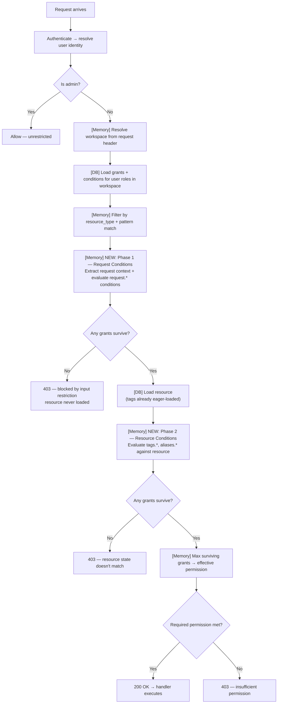

start_date: 2026-08-18
mlflow_issue: https://github.com/mlflow/mlflow/issues/24742
rfc_pr:

# Summary

MLflow RBAC grants access based on resource type and identity — but not based on
resource state. Once a user has EDIT on experiments in a workspace, they can
modify any experiment regardless of its lifecycle stage, sensitivity, or ownership.
There is no way to express "this user can edit dev experiments but not production
ones".

This RFC proposes condition-based access control: grants can optionally specify
conditions that must be satisfied for the grant to take effect. Conditions can match
against existing resource attributes (tags, aliases), enabling dynamic permission
boundaries within a workspace. When a resource's attributes change (e.g., tagged
for production), access automatically adjusts without admin intervention.

# Basic example

A data science team and a platform engineering team share a workspace. Data
scientists freely iterate on experiments and models during development. Once a
model is promoted to production, only the platform team should be able to modify
it — but the model stays in the same workspace, preserving lineage.

```python
# Admin setup: two roles with different conditional access
ds_role = client.create_role(name="data-scientist", workspace="ml-team")
client.add_role_permission(
    role_id=ds_role.id,
    resource_type="experiment",
    resource_pattern="*",
    permission="EDIT",
    condition="tags.stage = 'dev' AND request.tag_key != 'stage'"
)

platform_role = client.create_role(name="platform-eng", workspace="ml-team")
client.add_role_permission(
    role_id=platform_role.id,
    resource_type="experiment",
    resource_pattern="*",
    permission="MANAGE"  # unconditional — full access regardless of stage
)
```

**Lifecycle:**



```python
# 1. DS creates experiment, tags it dev — has full EDIT access
mlflow.set_experiment_tag(exp_id, "stage", "dev")
with mlflow.start_run(experiment_id=exp_id):
    mlflow.log_metric("accuracy", 0.95)  # ✓ allowed (stage=dev matches condition)

# 2. Model is ready — platform promotes it
mlflow.set_experiment_tag(exp_id, "stage", "production")  # platform does this

# 3. DS tries to modify — blocked (stage=production doesn't match their condition)
mlflow.log_metric("test", 1.0)  # ✗ 403 Forbidden

# 4. DS tries to revert the tag — blocked (request.tag_key != 'stage' fails)
mlflow.set_experiment_tag(exp_id, "stage", "dev")  # ✗ 403 Forbidden

# 5. Platform team retains full access (unconditional grant)
mlflow.set_experiment_tag(exp_id, "owner", "platform-team")  # ✓ allowed
```

The resource never moved. Lineage is intact. Access changed dynamically based on
the tag value.

# Motivation

MLflow RBAC grants match resources by exact ID or wildcard (`*`). There is no
way to express "grant access to resources matching a condition." This forces
admins into coarse-grained choices:

1. **Dev/prod boundary within a team:** A data science team works in a single
   workspace. During experimentation, models and experiments are freely editable
   by the team. Once a model is promoted to production (tagged `stage=production`),
   it should no longer be modifiable by the dev team — only the platform team
   should be able to alter production-tagged resources. Since the model originated
   in the same workspace, there is no current way to enforce this conditional
   permission boundary without moving the resource to a different workspace.
   Moving resources between workspaces is not viable: (a) sub-resources (runs,
   traces, logged models) inherit workspace from their parent experiment — you
   can't move individual resources independently; (b) the origin experiment
   constitutes lineage — re-parenting severs the experimental history; (c)
   workspace name uniqueness constraints create collision risk on move. Today,
   the only options are: give everyone EDIT and rely on convention, create
   separate workspaces and copy artifacts between them (breaking lineage), or
   enumerate specific resource IDs in grants (doesn't scale, breaks as new
   resources are created).

2. **Alias/promotion protection:** Only designated users should be able to set
   the `@champion` alias on a registered model. Today, anyone with EDIT on the
   registered model can set any alias.

3. **Restricting mutation inputs:** A data scientist needs EDIT to log runs and
   update model descriptions, but should not be able to set certain tag keys
   (e.g., `stage`, `approved`) or aliases (e.g., `@champion`, `@production`) that
   have operational significance. Today, EDIT grants unrestricted access to all
   tag and alias operations — there is no way to say "can edit the resource but
   cannot set this specific value." A deployment script that pulls models by the
   `@champion` alias would pick up any model a DS promoted, even if no review
   process was followed.

Conditions solve these by making grants dynamic — permissions follow the resource's
attributes without per-resource admin intervention, and without moving resources.
Request conditions additionally restrict *what values* a user can set, preventing
unauthorized promotion or classification.

### Out of scope

- **Artifact-layer (S3) protection.** MLflow RBAC controls the metadata layer
  (MLflow API). Protecting the underlying artifact storage (S3 objects) requires
  complementary IAM policies. This proposal does not address S3-layer access.
- **Owner-based conditions** (e.g., "users can only modify resources they
  created"). This requires tracking resource ownership, which is a separate
  feature. The condition framework could support it in the future.

# Detailed design

## Condition model

Conditions are filter expressions attached to role permission grants. They come
in two types, evaluated at different phases of the request lifecycle:

- **Resource conditions** — checked against the resource's current attributes
  (tags, aliases). Controls *which resources* a grant applies to.
- **Request conditions** — checked against the incoming request payload (input
  values). Controls *what mutations* a grant's holder can perform.

### Condition shape

A condition is a filter expression string following the format:

```
<entity>.<key> <operator> <value>
```

Example conditions:
```
"tags.stage = 'dev'"
"request.tag_key != 'stage'"
"aliases.champion EXISTS"
"tags.stage IN ('dev', 'staging')"
```

### AND vs OR semantics

Conditions within a **single grant** compose with **AND** — all must be satisfied
for the grant to activate:

```python
# This grant requires BOTH conditions to be true (AND):
client.add_role_permission(role_id=5, resource_type="experiment",
    resource_pattern="*", permission="EDIT",
    condition="tags.stage = 'dev' AND request.tag_key != 'stage'")
```

Conditions across **different grants** are inherently **OR** — if any grant's
conditions are fully satisfied, that grant participates in the max:

```python
# These two grants give OR behavior:
# Grant A: EDIT if stage=dev
client.add_role_permission(role_id=5, ..., permission="EDIT",
    condition="tags.stage = 'dev'")
# Grant B: EDIT if stage=staging
client.add_role_permission(role_id=5, ..., permission="EDIT",
    condition="tags.stage = 'staging'")

# Effective: EDIT if stage=dev OR stage=staging
# (equivalent to: condition="tags.stage IN ('dev', 'staging')" on a single grant)
```

### Condition limits

A maximum of **5 conditions** per grant. This prevents overly complex condition
sets that are hard to reason about and debug. If more complex logic is needed,
admins should split across multiple grants (which compose with OR).

### Grants without conditions

Grants without conditions behave exactly as today — unconditional. They always
participate in the max regardless of resource state or request content. A single
unconditional grant will always override conditional grants of the same or lower
permission level.

### Condition syntax

Conditions reuse MLflow's existing search filter syntax:

```
<entity>.<key> <operator> <value>
```

**Resource condition entities:**

| Entity | Description | Example |
|--------|-------------|---------|
| `tags` | Resource tags (key-value pairs) | `tags.stage = 'dev'` |
| `aliases` | Model aliases (registered_model only) | `aliases.champion EXISTS` |

**Request condition entities:**

| Entity | Description | Example |
|--------|-------------|---------|
| `request` | Incoming request payload fields | `request.tag_key != 'stage'` |

**Supported operators:**

| Operator | Meaning | Example |
|----------|---------|---------|
| `=` | Equals | `tags.stage = 'dev'` |
| `!=` | Not equals | `request.tag_key != 'stage'` |
| `EXISTS` | Key/field is present | `tags.reviewed EXISTS` |
| `NOT EXISTS` | Key/field is absent | `tags.stage NOT EXISTS` |
| `IN` | Value in set | `tags.stage IN ('dev', 'staging')` |
| `NOT IN` | Value not in set | `request.alias NOT IN ('champion', 'production')` |

### Two-phase evaluation

Conditions are evaluated in two phases, enabling early rejection before the
resource is loaded:

**Today's authorization flow:**



**Proposed flow with conditions:**



```python
def resolve_permission(user_id, resource_type, resource_id, workspace, request, resource):
    """Resolve effective permission with two-phase condition evaluation.

    Args:
        request: The incoming request (for request conditions).
        resource: The resource object (already loaded for workspace resolution,
                  tags eager-loaded).
    """
    # Step 1: Load all candidate grants with conditions
    grants = store.get_grants_with_conditions(user_id, resource_type, resource_id, workspace)

    # Step 2: Phase 1 — evaluate request conditions (no resource needed)
    request_context = _extract_request_context(request)
    after_request_filter = [
        g for g in grants
        if _request_conditions_match(g.conditions, request_context)
    ]
    if not after_request_filter:
        return NO_PERMISSIONS  # Early exit — blocked by input restriction

    # Step 3: Phase 2 — evaluate resource conditions
    after_resource_filter = [
        g for g in after_request_filter
        if _resource_conditions_match(g.conditions, resource)
    ]

    # Step 4: Max-wins
    return max((g.permission for g in after_resource_filter), default=NO_PERMISSIONS)
```

### Request context extraction

Each operation exposes its mutable input fields for request condition evaluation.
Operations without mutable inputs (search, get, delete) have no request context —
request conditions are vacuously true for them.

```python
# Per-operation request context extractors
REQUEST_CONTEXT_EXTRACTORS = {
    SetExperimentTag: lambda req: {"tag_key": req.json["key"], "tag_value": req.json["value"]},
    SetRegisteredModelAlias: lambda req: {"alias": req.json["alias"], "version": req.json["version"]},
    SetRegisteredModelTag: lambda req: {"tag_key": req.json["key"], "tag_value": req.json["value"]},
    SetModelVersionTag: lambda req: {"tag_key": req.json["key"], "tag_value": req.json["value"]},
    SetTag: lambda req: {"tag_key": req.json["key"], "tag_value": req.json["value"]},
    SetTraceTag: lambda req: {"tag_key": req.json["key"], "tag_value": req.json["value"]},
    # Read/search/delete operations: no request context (None)
    GetExperiment: None,
    SearchExperiments: None,
    DeleteExperiment: None,
    # ...
}

def _extract_request_context(request) -> dict | None:
    extractor = REQUEST_CONTEXT_EXTRACTORS.get(request.operation)
    if extractor is None:
        return None
    return extractor(request)
```

### Extendable evaluation

Condition evaluation is delegated to a registry of evaluator functions, keyed by
entity type. New condition types can be added in the future by registering an
evaluator — no changes to the resolution engine or schema required.

```python
CONDITION_EVALUATORS: dict[str, Callable] = {}

def register_condition_evaluator(entity: str, evaluator: Callable):
    CONDITION_EVALUATORS[entity] = evaluator

# Built-in evaluators:

def _evaluate_tag_condition(condition, resource) -> bool:
    tags = {t.key: t.value for t in resource.tags}
    return _compare(tags.get(condition.key), condition.operator, condition.value)

def _evaluate_alias_condition(condition, resource) -> bool:
    aliases = getattr(resource, "aliases", {})
    return _compare(aliases.get(condition.key), condition.operator, condition.value)

def _evaluate_request_condition(condition, request_context) -> bool:
    if request_context is None:
        return True  # No request context for this operation — condition doesn't apply
    value = request_context.get(condition.key)
    if value is None:
        return True  # Field not in this request — condition doesn't apply
    return _compare(value, condition.operator, condition.value)

def _compare(actual, operator, expected) -> bool:
    if operator == "=": return actual == expected
    elif operator == "!=": return actual != expected
    elif operator == "EXISTS": return actual is not None
    elif operator == "NOT EXISTS": return actual is None
    elif operator == "IN": return actual in expected
    elif operator == "NOT IN": return actual not in expected
    return False

register_condition_evaluator("tags", _evaluate_tag_condition)
register_condition_evaluator("aliases", _evaluate_alias_condition)
register_condition_evaluator("request", _evaluate_request_condition)
```

### Condition routing

The resolver separates conditions by entity type for two-phase evaluation:

```python
def _request_conditions_match(conditions, request_context) -> bool:
    """Evaluate only request.* conditions."""
    request_conds = [c for c in conditions if c.entity == "request"]
    if not request_conds:
        return True  # No request conditions on this grant
    return all(evaluate_condition(c, request_context) for c in request_conds)

def _resource_conditions_match(conditions, resource) -> bool:
    """Evaluate only resource-state conditions (tags.*, aliases.*)."""
    resource_conds = [c for c in conditions if c.entity != "request"]
    if not resource_conds:
        return True  # No resource conditions on this grant
    return all(evaluate_condition(c, resource) for c in resource_conds)
```

### Search filtering

Search filtering uses the same in-memory condition matching. Search results
already include tags in their response objects, so no extra queries are needed.
Only resource conditions apply to search (request conditions are for mutations).

```python
def filter_search_results(user_id, resource_type, results, workspace, grants):
    """Filter search results based on user's effective permissions."""

    # Fast path: if user has any unconditional wildcard READ+ grant, return all
    has_unconditional_wildcard = any(
        g.resource_pattern == "*" and g.permission >= READ and not g.conditions
        for g in grants
        if g.resource_type == resource_type
    )
    if has_unconditional_wildcard:
        return results  # Short-circuit — no per-result evaluation needed

    # Slow path: evaluate per-result (only when all grants are conditional)
    filtered = []
    for result in results:
        effective = [g for g in grants
                     if g.resource_type == resource_type
                     and (g.resource_pattern == "*" or g.resource_pattern == result.id)
                     and _resource_conditions_match(g.conditions, result)]
        if effective and max(g.permission for g in effective) >= READ:
            filtered.append(result)
    return filtered
```

The fast path ensures no performance regression for the common case (unconditional
wildcard grants). The slow path only triggers when all grants are conditional,
and uses tags already present on the search result objects — no extra DB queries.

## API change

`add_role_permission` gains an optional `condition` parameter — a single AND-ed
filter string using MLflow's existing search filter syntax:

```python
store.add_role_permission(
    role_id=5,
    resource_type="experiment",
    resource_pattern="*",
    permission="EDIT",
    condition="tags.stage = 'dev' AND request.tag_key != 'stage'"
)
```

At creation time, the condition string is:
1. Parsed using the same parser as search `filter_string`
2. Validated (entities must be registered, operators must be supported, entity
   must be compatible with resource type)
3. Split into individual clauses and stored as rows in `role_permission_conditions`
4. Rejected with `INVALID_PARAMETER_VALUE` if malformed or exceeds 5 AND clauses

The response returns the condition as the original filter string:

```json
{
    "role_permission": {
        "id": 5,
        "role_id": 2,
        "resource_type": "experiment",
        "resource_pattern": "*",
        "permission": "EDIT",
        "condition": "tags.stage = 'dev' AND request.tag_key != 'stage'"
    }
}
```

A grant without a condition (or `condition: null`) is unconditional — today's
behavior.

## Schema change

```sql
CREATE TABLE role_permission_conditions (
    id INTEGER PRIMARY KEY AUTOINCREMENT,
    role_permission_id INTEGER NOT NULL REFERENCES role_permissions(id) ON DELETE CASCADE,
    entity VARCHAR(50) NOT NULL,      -- "tags", "aliases", "request"
    key VARCHAR(255) NOT NULL,        -- tag key, alias name, request field
    operator VARCHAR(10) NOT NULL,    -- "=", "!=", "EXISTS", "NOT EXISTS", "IN", "NOT IN"
    value VARCHAR(512)                -- NULL for EXISTS/NOT EXISTS
);

CREATE INDEX idx_rpc_permission_id ON role_permission_conditions(role_permission_id);
CREATE INDEX idx_rpc_entity_key ON role_permission_conditions(entity, key);
```

This is additive — existing `role_permissions` rows have no condition rows
(unconditional, today's behavior). No data migration required.

Multiple rows for the same `role_permission_id` compose with AND semantics — all
conditions must be satisfied for the grant to take effect.

**Example:**

```sql
-- Grant 5: EDIT on experiments where stage = 'dev' AND can't set stage tag
INSERT INTO role_permission_conditions
    (role_permission_id, entity, key, operator, value)
VALUES
    (5, 'tags', 'stage', '=', 'dev'),
    (5, 'request', 'tag_key', '!=', 'stage');
```

## Performance

### Time complexity

- **Grant loading:** O(R) where R = number of roles for the user (typically 1-5). Unchanged.
- **Condition evaluation per grant:** Each condition is O(1) (a dict lookup + comparison; `IN`/`NOT IN` operands are parsed into a set at load time, so membership is also O(1)). A grant has at most 5 conditions, so per-grant evaluation is bounded constant work.
- **Total per request:** O(G × C) where G = matching grants (typically 3-10), C = max 5. Worst case: 50 string comparisons.
- **Search filtering:** O(N × G × C) where N = result count. Fast path (unconditional wildcard grant exists) reduces to O(1).

### Protection against unbounded growth

Conditions could degrade performance if unconstrained:

| Risk | Mitigation |
|---|---|
| Too many conditions per grant | **Hard limit: 5 conditions per grant.** Enforced at creation time. Reject with `INVALID_PARAMETER_VALUE`. |
| Too many conditional grants per role | **Soft limit: 20 grants per role.** Warning at creation. This is an existing operational concern (not new to conditions). |
| Large tag sets on resources | Tags and aliases are already eager-loaded by the existing code path (both single resource access and search use `eager=True` subquery load). Condition evaluation reads from the in-memory object — no additional query possible. Tag count bounded by MLflow's per-resource limit (100). |
| Regex or complex matching | **Not supported.** Only `=`, `!=`, `EXISTS`, `NOT EXISTS`, `IN`, `NOT IN` — all O(1) per evaluation. No regex, no glob, no subquery. |
| Condition evaluation on every search result | **Fast path:** if any unconditional wildcard READ+ grant exists, skip all per-result evaluation. Only degrades when ALL grants are conditional. |

### DB impact

- **Grant query:** One additional LEFT JOIN on `role_permission_conditions` (indexed by `role_permission_id`). For grants without conditions, the join returns zero rows — no overhead.
- **No extra queries for tags.** Resource tags are already loaded during workspace resolution (`eager=True` subquery load).
- **No condition logic in SQL.** The DB returns grants + condition rows; all evaluation is in application code.

# Drawbacks and Design Rationale

## Relationship to the allow-only model

MLflow RBAC has no explicit deny — grants are additive, and the highest matching
permission wins. Conditions preserve this property cleanly: they specify what a
grant DOES match (positive matching only), never what it excludes.

```
Grant A: (experiment, *, EDIT, condition: tag_equals stage=dev)
Grant B: (experiment, *, READ, unconditional)

Resource tagged stage=dev:
  Grant A: condition met → EDIT
  Grant B: unconditional → READ
  Result: max(EDIT, READ) = EDIT

Resource tagged stage=production:
  Grant A: condition not met → excluded from evaluation
  Grant B: unconditional → READ
  Result: max(READ) = READ
```

**Key property preserved:** A condition can only narrow its own grant. It cannot
reduce permissions conferred by other grants. If a user has an unconditional EDIT
grant from any other role, no condition on any other grant can take that away.

By restricting to positive operators (`=`, `EXISTS`), this design
stays purely additive — each grant explicitly declares what it matches, with no
negative logic. This aligns with how Kubernetes RBAC works (resources, verbs,
namespaces — all positive matching) while adding attribute-awareness that K8s
delegates to admission controllers.

**Comparison to other systems:**

| System | RBAC | Attribute-based restriction | Deny mechanism |
|--------|------|---------------------------|---------------|
| Kubernetes | Roles + Bindings | Admission controllers (separate layer) | Admission controller rejects |
| IAM | Identity policies | Conditions on statements (incl. negation) | Explicit Deny overrides Allow |
| PostgreSQL | GRANT/REVOKE | Row-Level Security (separate layer) | RLS filters rows |
| **MLflow (proposed)** | Roles + Grants | Conditions on grants (positive only) | None — max-wins preserved |

- **Additional grant loading.** Grants must now be loaded with their conditions
  (LEFT JOIN on `role_permission_conditions`). Mitigated: this is a small join —
  most grants have zero or one condition row, and the total candidate set is
  bounded by the number of roles a user has (typically 1-5).

- **Circular tag protection.** A user who can EDIT a resource could potentially
  set the condition tag to make their grant match. Mitigated: condition tags
  should be set by automation/platform roles at creation time, and promotion
  (tag changes) should be done by workspace MANAGE holders.

- **Condition complexity.** Admins must understand how conditions interact with
  the permission resolution (highest-wins). A single unconditional EDIT grant
  overrides all conditional restrictions on the same resource type. Admins must
  ensure restricted roles have only conditional grants.

- **Metadata-layer only.** Conditions protect MLflow API access but not the
  underlying S3 artifacts. A user with direct S3 access (via IAM) can bypass
  MLflow RBAC entirely. This is not new — it's true of all MLflow RBAC — but
  conditions may create a false sense of full protection.

# Alternatives

### A. Workspace isolation (move resources between workspaces)

Use workspaces as the permission boundary — reassign a resource's workspace when
it transitions from dev to production.

**Rejected because:**
- Sub-resources (runs, traces, logged models) don't have a workspace column —
  they resolve workspace via parent experiment. Moving an experiment implicitly
  moves all children, but there's no independent sub-resource mobility.
- Lineage is tied to the origin experiment — a run's experiment context records
  what it was part of (other runs, model versions derived from those runs).
  Re-parenting a resource to a different experiment in another workspace severs
  that lineage.
- Name uniqueness constraint (`UniqueConstraint("workspace", "name")`) means
  moving an experiment can collide with an existing name in the target workspace.
- Workspace overhead — each lifecycle boundary requires a separate workspace with
  its own role setup, and resources must be duplicated or moved to cross it.

### B. Resource groups (stage-based access tiers)

Add a "resource group" dimension to grants — resources belong to a group (e.g.,
`dev`, `production`), and grants specify which group they apply to. Promotion
changes the group, instantly changing who can access the resource.

**Explored and rejected because:**
- A resource belonging to a single group is equivalent to a lifecycle stage —
  too narrow for cases where access depends on multiple attributes simultaneously.
- Multiple groups per resource introduces AND/OR ambiguity: does matching ANY
  group grant access (defeats restriction) or ALL groups (confusing to admin)?
- Requires a new API for group assignment (`set_resource_group`) and a new
  schema column, when resources already have a flexible attribute mechanism (tags).
- Group assignment itself needs authorization (who can promote?) — creates a
  chicken-and-egg problem where the promoting role needs access to the resource
  before it's in their group.
- Ultimately, resource groups are a special case of conditions restricted to a
  single attribute. Conditions are strictly more flexible while reusing existing
  resource metadata.

### C. Separate policy layer (admission-controller style)

Add a separate authorization layer that runs after RBAC, inspecting resource
attributes to accept/reject requests. Analogous to Kubernetes admission
controllers (OPA/Gatekeeper) or PostgreSQL Row-Level Security.

**Explored and rejected because:**
- "RBAC allows, policy denies" is effectively an explicit deny mechanism — it
  contradicts MLflow's allow-only model at the architectural level even if RBAC
  itself remains unchanged.
- Two authorization systems to understand and configure — admin must reason about
  both RBAC grants AND policy rules, increasing cognitive load.
- Policy rules that contradict RBAC grants are confusing: "I have EDIT... why
  can't I edit this?" Conditions on grants keep the explanation co-located with
  the permission.
- For MLflow's scale (small number of roles and grants per workspace), a separate
  policy engine is over-engineered.

### D. Per-resource-ID grants only

Enumerate specific resource IDs in grants without conditions.

**Rejected because:**
- Doesn't scale — hundreds of experiments require hundreds of grants
- Breaks as new resources are created (admin must update grants)
- No dynamic behavior — permissions don't follow resource attributes

### Why conditions on grants won

Conditions are the chosen approach because they:
1. **Reuse existing resource attributes (tags)** — no new resource schema, no new
   assignment APIs, no migration needed.
2. **Are flexible** — can express lifecycle stages, classifications, team
   ownership, or any other tag-based boundary without locking into one model.
3. **Dynamic without admin intervention** — changing a tag instantly changes
   access. No grant updates needed when a resource transitions.
4. **Preserve the allow-only model** — positive-only operators (`=`, `EXISTS`)
   keep grants purely additive. No negative logic, no deny.
5. **Minimal DB overhead** — conditions are loaded alongside grants via a single
   LEFT JOIN (no separate query). Resource tags and aliases are already loaded by
   the existing workspace resolution step (eager loading), so condition evaluation
   adds no resource queries — it is purely in-memory comparison against data
   already available.
6. **Co-located with grants** — the condition is ON the permission, so an admin
   reading a role's grants immediately sees both what it allows and under what
   circumstances.

# Adoption strategy

**This is not a breaking change.** Grants without condition rows behave exactly
as today — unconditional. The `condition` parameter defaults to null (no rows
created in `role_permission_conditions`).

**Adoption path:**

1. Upgrade to the version shipping this change (no behavior change)
2. Identify resources that need protection (e.g., production experiments)
3. Ensure those resources are tagged appropriately (e.g., `stage=production`)
4. Replace unconditional grants with conditional ones on restricted roles:
   ```python
   # Before: DS has unconditional EDIT
   add_role_permission(ds_role, "experiment", "*", "EDIT")

   # After: DS has EDIT only on dev-tagged experiments
   delete_role_permission(ds_role, "experiment", "*", "EDIT")
   add_role_permission(ds_role, "experiment", "*", "EDIT",
       condition="tags.stage = 'dev' AND request.tag_key != 'stage'")
   ```
5. Verify access is as expected

**Reverting:** Delete conditional grants and recreate unconditional ones. No
destructive schema rollback needed — the `role_permission_conditions` table with
no rows is inert (grants without condition rows behave unconditionally).

# Open questions

1. **Should platform admin be able to configure the conditions-per-grant limit?**
   The default is 5. Should this be a workspace-level or server-level setting
   that admins can adjust, or should it remain a fixed system limit?

2. **How to add test coverage for resource types with missing request and resource
   evaluators?** When a new resource type or operation is added without a
   corresponding request context extractor or condition evaluator, conditions
   referencing that entity will silently pass (vacuously true). How do we detect
   and prevent this gap — CI lint, fail-closed for unregistered entities, or
   mandatory evaluator registration per resource type?
