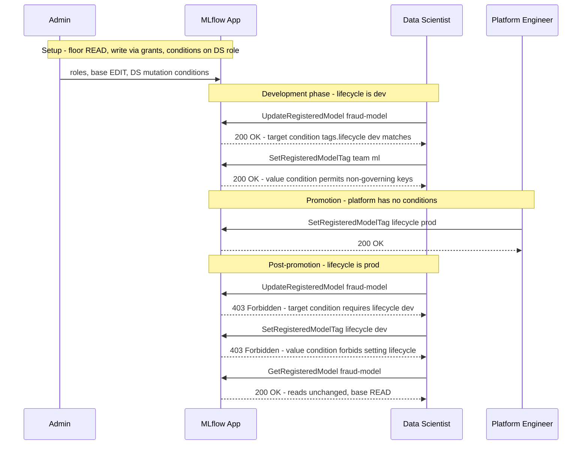
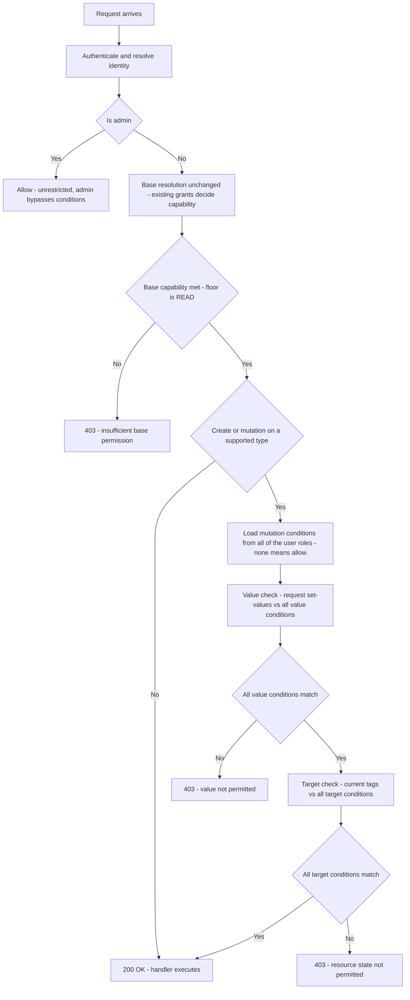
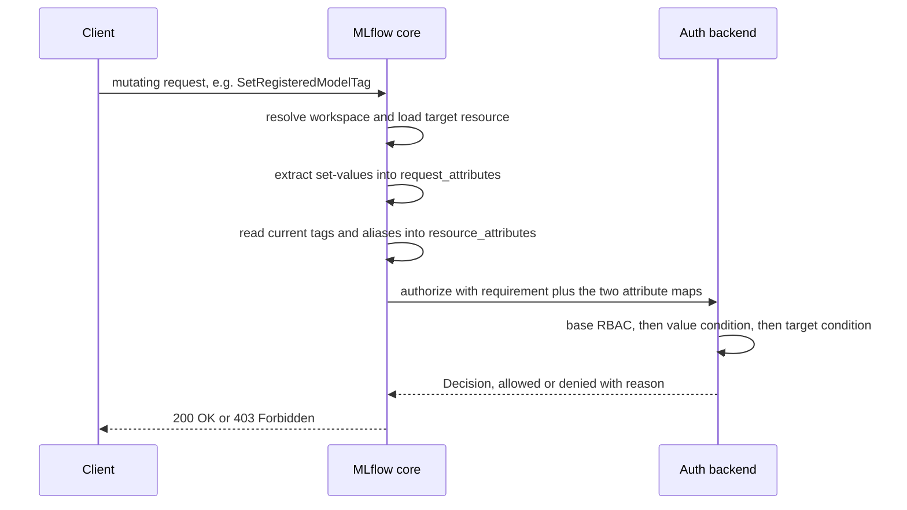

start_date: 2026-08-18
mlflow_issue: https://github.com/mlflow/mlflow/issues/24742
rfc_pr:

# Summary

MLflow RBAC grants access based on resource type and identity. It does not consider
resource state or the values a request tries to set. Once a user has EDIT on registered
models in a workspace, they can modify any registered model regardless of its lifecycle
state, and can set any tag or alias on it. There is no way to express "this user can edit
dev models but not production ones" or "only the platform team may set the `@champion`
alias."

This RFC proposes **mutation conditions**: two optional, per-`(role, resource_type)` filters
that layer on top of the role's existing grants and gate **create/mutation** operations
(never reads):

- A **value mutation condition** constrains *what values* a role may set, meaning the tag
  or alias in the request.
- A **target mutation condition** constrains *which existing resources* a role may mutate,
  by their current tags or aliases.

Each condition is a compact set of AND-ed clauses, authorable in MLflow's existing filter
grammar. A mutation condition
only ever *further-restricts* an operation the role's base grant already allows, and never
confers access. The guiding principle is that **grants add and conditions subtract**: base
grants combine across roles to decide what a role can do, and conditions combine across roles
to restrict it. When a resource's tags change (for example when it is promoted to
production), access adjusts automatically without admin intervention, and the resource never
moves, so lineage is preserved.

# Basic example

A data science team and a platform team share a workspace. Data scientists iterate freely
on dev models. Once a model is promoted to production, only the platform team may modify
it, while the model stays in the same workspace.

```python
# Base roles: keep the floor at READ so write always arrives via a grant.
ds_role       = client.create_role(name="data-scientist", workspace="ml-team")
platform_role = client.create_role(name="platform-eng",   workspace="ml-team")

client.add_role_permission(ds_role.id,       "registered_model", "*", "EDIT")
client.add_role_permission(platform_role.id, "registered_model", "*", "EDIT")

# One call adds both conditions for (ds_role, registered_model):
#  - target condition: may mutate only resources currently tagged lifecycle=dev
#  - value condition:  may not set the governing lifecycle tag, nor the champion alias
client.add_mutation_condition(
    role_id=ds_role.id,
    resource_type="registered_model",
    target_condition="tags.lifecycle = 'dev'",
    value_condition="tag_key != 'lifecycle' AND alias != 'champion'",
)
# Platform role: no mutation conditions, so it is unconstrained and may promote and edit prod.
```

**Lifecycle:**



The resource never moved. Lineage is intact. Write access changed dynamically based on the
tag value, and the DS cannot set the governing tag to unlock itself.

# Motivation

MLflow RBAC grants match resources by exact ID or wildcard (`*`). There is no way to express
"grant access to resources matching a condition" or "restrict the values this operation may
set," which forces admins into coarse choices. The following use cases are not supported
today and would be enabled by this proposal. Each is shown with the concrete mutation
condition that expresses it (see *Detailed design*). All gate **create/mutation** operations
only, and reads are unchanged (see *Out of scope*).

**1. Dev/prod boundary within a team.** A data science team works in a single workspace.
During experimentation, resources are freely editable. Once work is promoted to production,
it should no longer be modifiable by the dev team, only the platform team. Since the resource
originated in the same workspace, the only current way to enforce this is to move it to
another workspace, which is not trivial. Moving a resource breaks lineage because of
cross-workspace references. A sub-resource such as a run, trace, or logged model resolves its
workspace through its parent experiment, so moving it changes its parent experiment and
severs the experimental history that parent records.
- **Target condition:** `(ds-role, registered_model, target_condition="tags.lifecycle='dev'")`
- **Result:** DS may mutate a resource only while it is tagged `lifecycle=dev`. When the tag
  flips to `prod`, the target condition stops matching and write access evaporates
  automatically, with no admin action and no move. Read stays, so prod remains visible.

**2. Alias/promotion protection.** Only designated users should be able to set
production-ready-indicating aliases (for example `champion` or `production`) on a registered
model. Today, anyone with EDIT can set any alias. A deployment script that pulls models by
such an alias would pick up any model a DS promoted, even with no review.
- **Value condition (DS):** `(ds-role, registered_model, value_condition="alias NOT IN ('champion', 'production')")`
- **Result:** DS may set any alias except the protected ones. The platform role has no value
  condition, so it may. This gates the value being set.

**3. Restricting mutation inputs.** A data scientist needs EDIT to update descriptions and
set benign tags, but should not be able to set operationally significant tag keys (for
example `lifecycle` or `approved`). Today, EDIT grants unrestricted access to all tag and
alias operations.
- **Value condition:** `(ds-role, registered_model, value_condition="tag_key != 'lifecycle'")`
- **Result:** all tag writes are allowed except the protected key, at both create and update.
  This is the self-unlock guard that makes the target condition in use case 1 real: without
  it, a dev user could simply clear or change the governing tag to escape the lock.

Mutation conditions solve these by making a *write operation* dynamic. The **target
condition** follows the resource's tags, and the **value condition** constrains the values a
request may set. Neither requires moving resources or per-resource admin work.

## Out of scope

- **Read-scoping / hiding resources on read.** If a user already has workspace access and could
  read a resource, this RFC does **not** hide it. Reads stay as today, and mutation conditions
  are evaluated only during **create/mutation** authorization; the word "mutation" in the name
  is deliberate, so conditions are never mistaken for read gates. Read conditions and search or
  list prefiltering need a queryable scope plus predicate pushdown into the store query, and are
  a follow-up.
- **Parent-resource conditions.** A condition reads `tags.*`/`aliases.*` only from the resource
  the operation directly targets, not its parent, so "lock all runs whose parent experiment is
  tagged `lifecycle=prod`" is **not expressible** in the initial implementation. It is feasible
  later, since core
  already resolves the parent for workspace and permission checks, and is a follow-up.
- **Per-operation target granularity.** The target condition applies uniformly to all mutating
  operations on a type. Distinguishing "editable while `dev`, deletable only while `prod`" would
  require per-operation target conditions; this is intentionally not supported, in favor of the
  simpler uniform model.
- **Fields beyond tags and aliases.** The initial implementation conditions only on tag and
  alias values (the value namespace `tag_key`/`tag_value`/`alias`, and the target namespace
  `tags.*`/`aliases.*`). The design is extendable to other request and resource fields, but
  those are out of scope for the initial implementation.
- **Owner-based conditions** ("only modify resources you created"). This requires ownership
  tracking and is a separate feature.

# Detailed design

## API changes

### Mutation conditions and their fields

A role's mutation conditions for a resource type are a value condition and a target
condition, each optional, represented as a single object:

```
MutationConditions {
    id:            string    # stable id, assigned on add; addresses this object in update/remove
    role_id:       int       # the role the conditions apply to
    resource_type: string    # e.g. "registered_model"

    # Gates WHAT VALUES may be set on a resource. A filter over the value namespace (tag_key,
    # tag_value, alias). Because it inspects the request rather than a resource, it applies to
    # create as well as mutation. null leaves all values allowed.
    value_condition:  string | null

    # Gates WHICH EXISTING RESOURCES may be mutated. A filter over the target namespace
    # (tags.<key>, aliases.<name>), read from the resource's current state. It applies to
    # mutation only, is vacuous on create, and never applies to reads. null leaves all
    # resources mutable.
    target_condition: string | null
}
```

Each condition is a single filter written in MLflow's existing search filter grammar: a set of
comparison clauses AND-ed together, for example `tags.lifecycle = 'dev'` or
`tag_key != 'lifecycle' AND alias != 'champion'`. A value being set, or a resource being
mutated, is permitted when it matches the filter. There is no separate allow and deny form:
`!=` and `NOT IN` express "must not be X" and "none of X, Y, Z" within one filter, so a second
condition is unnecessary.

There is at most **one** value condition and **one** target condition per `(role,
resource_type)`. Multiple conditions across roles are AND-ed together, meaning that all
conditions must be fulfilled or the request is denied.

Like grants, conditions are **scoped to a workspace through the role**. A role belongs to
exactly one workspace, so its conditions apply only when the user is acting in that workspace.
The condition carries no workspace of its own, exactly as a grant (`role_permission`) carries
none and inherits its workspace from the role.

### Admin Apis

Four operations manage conditions, mirroring the existing `add`/`update`/`remove`/`list`
role-permission API. `add` creates a `MutationConditions` object and returns it with an
assigned `id`; `update` and `remove` address an existing object by that `id`; `list` returns a
role's objects. Their request and response shapes:

```
add(role_id, resource_type, value_condition?, target_condition?) -> MutationConditions
    # Create the conditions for (role_id, resource_type) and return the object with its id.
    # Each condition is a filter string, parsed and validated on write. Rejected if this pair
    # already has an object (use update to change it).

update(id, value_condition?, target_condition?) -> MutationConditions
    # Modify an existing object by id, with partial-update semantics:
    #   - a filter string provided sets or replaces that condition
    #   - null clears that condition
    #   - omitted leaves that condition unchanged

remove(id) -> {}
    # Delete the MutationConditions object (both conditions) by id.

list(role_id) -> { mutation_conditions: MutationConditions[] }
    # Return every object on the role, each condition as its stored filter string.
```


### Limits and restrictions

- **Conditions combine with AND.** For an operation, base RBAC, the value condition, and the
  target condition must all pass; any one failing denies it. An absent or vacuous condition
  contributes nothing and passes. There is no precedence among the three.
- **Grants add, conditions subtract across roles.** A user's capability is the union of what
  their roles grant, exactly as today, but every applicable condition from every one of their
  roles must match. A restriction in one role therefore always applies and cannot be lifted by
  a permissive or absent condition in another. This is how a single condition provides absolute
  restriction without a separate deny mechanism. A condition applies whenever the user holds
  the role that defines it, independent of that role's grant level.
- **Non-monotonic across roles.** Adding a role that carries a condition can reduce what a user
  may do. This is inherent to any real restriction and matches the absolute-deny behavior of
  the merged sub-resource-permissions RFC's `NONE` level.
- **Contradictory conditions fail closed.** If one role restricts `tags.lifecycle = 'dev'` and
  another restricts `tags.lifecycle = 'prod'` on the same type, a user in both must satisfy
  both and can mutate neither. This is the safe direction for a restriction, but admins should
  be aware of it.
- **At most 5 clauses per condition** (value and target each).
- **At most one value condition and one target condition per `(role, resource_type)`.**
  Updating replaces the previous values.
- **No `OR` within a condition.** Clauses are AND-ed; a set of alternatives is expressed with
  `IN` or `NOT IN` values in a single clause.

## Changes to the auth call path

### Order of evaluation

For an operation by a user on a resource, the decision is the logical AND of the base grant
check, the value condition, and the target condition. The process is as follows:



The value condition is read from the operation itself, so it applies uniformly to a create
(authorized by the workspace create gate) and a mutation (authorized by the resource update
gate), layering on top of whatever grant authorized the operation independent of permission
level.

## Subset of resource types and their fields for initial launch

The initial launch supports `experiment`, `registered_model`, and their children that the
merged sub-resource-permissions RFC makes independently grantable. The target fields are the
same for every operation on a type (its `tags`, plus `aliases` for `registered_model`), so the
supported type determines the target vocabulary. Each operation contributes only its value
(settable) fields.

| Resource type | Target fields | Value-setting operations |
|---|---|---|
| `experiment` | `tags.*` | set-tag, create. Other mutations (update, delete, restore, delete-tag) carry no value fields. |
| `registered_model` | `tags.*`, `aliases.*` | set-tag, set-alias, create. Other mutations (update, rename, delete, delete-tag, delete-alias) carry no value fields. |
| `run` | `tags.*` | set-tag, create. Other mutations (update, delete, restore, delete-tag) carry no value fields. |
| `trace` | `tags.*` | set-tag. Other mutations (delete, delete-tag) carry no value fields. |
| `logged_model` | `tags.*` | set-tags (batch), create. Other mutations (delete-tag) carry no value fields. |
| `registered_model_version` | `tags.*` | set-tag, create. Other mutations (update, delete, delete-tag) carry no value fields. |

Notes:
- `assessment` is out of scope. Assessments have no tags, only a metadata map, so the
  tags/aliases vocabulary does not apply.
- A batch set-tags operation sets multiple tags in one call, so the value condition is
  evaluated against each tag, and if any tag fails the operation is denied.

## Adaptability to Pluggable Auth (RFC 8)

Conditions fit RFC 8's single decision entry point, `authorize(query) -> Decision`, which
returns one decision. The value and target checks are stages inside that one call, not
separate calls.

**What is wired to the backend.** The condition inputs ride two additive, default-empty fields
on RFC 8's existing `AuthorizationRequirement`. The entry-point signature does not change, and
no new call is added:

```
AuthorizationRequirement {
    resource_type          # existing
    resource_id            # existing
    action                 # existing
    workspace              # existing
    request_attributes     # ADDED: normalized map of the attempted set-values (tag_key/tag_value/alias)
    resource_attributes    # ADDED: the target resource's current tags and aliases
}

authorize(subject, requirement) -> Decision   # unchanged signature; one call, one decision
```

Because both fields default to empty, existing callers and backends are unaffected: a backend
that ignores them behaves as unconditional RBAC.

**Interaction when conditions are evaluated:**



## Database schema changes

Mutation conditions are stored in one additive table keyed on `(role_id, resource_type)`,
mirroring the existing `SqlRolePermission` scoping (workspace inherited from the role, a
uniqueness constraint, a `role_id` index, and cascade-delete with the role). Each condition is
stored as the filter string exactly as authored:

```sql
CREATE TABLE type_conditions (
    id INTEGER PRIMARY KEY AUTOINCREMENT,
    role_id INTEGER NOT NULL REFERENCES roles(id) ON DELETE CASCADE,
    resource_type VARCHAR(255) NOT NULL,
    value_condition  TEXT,   -- filter string as authored (NULL = unconstrained)
    target_condition TEXT,   -- filter string as authored (NULL = unconstrained)
    CONSTRAINT unique_role_resource_type UNIQUE (role_id, resource_type)
);

CREATE INDEX idx_type_conditions_role_id ON type_conditions(role_id);
```

The filter string is validated on add or update and parsed and evaluated in memory at auth time
against `request_attributes` or `resource_attributes`, and the table is additive, so existing
deployments start with no rows and every operation is default-allow.

Whether to additionally persist the parsed, decomposed representation, to avoid re-parsing the
filter on the request path, is an optimization left open (see Open questions).

# Drawbacks

- **Non-monotonic across roles.** Because conditions combine with AND, adding a role that
  carries a condition can *reduce* what a user may do, and a permissive role cannot lift a
  restriction imposed by another. Contradictory conditions on the same type across two of a
  user's roles fail closed, leaving no mutation that satisfies both. This is intentional and
  matches the merged `NONE` and is the safe direction for a restriction, but a restriction lives
  on every role that carries it and accumulates, which can surprise admins who expect roles to
  only add access.
- **No system-enforced global invariant.** A user with no condition on a type is unconstrained
  there. Restricting a user requires placing a condition on a role they hold, so a guaranteed
  "nobody may ever set X" rule is a built-in hard check in the handler rather than a condition.
- **Type-level authoring, operation-level enforcement.** A condition is authored once per
  resource type, but it is enforced across every distinct operation that creates or edits that
  type, and each operation exposes the governed fields differently. The backend must therefore
  classify and gate each create or mutation operation individually according to how it sets or
  edits the resource, and coverage is only as complete as that per-operation mapping.
- **No restriction on reads.** Conditions gate create and mutation only. They cannot restrict
  reads in the current design, so a user who holds read access to a resource sees all of its
  fields regardless of any condition. Hiding a field or resource requires the base grant, not a
  condition.

# Alternatives

### A. Attach conditions to the existing grant (capability-keyed)

Extend the existing grant with condition clauses keyed by capability (update, delete, and so
on), rather than modeling a condition as its own object.

**Rejected because** a grant's job is to confer a level (READ, USE, EDIT, MANAGE) on a resource
type and pattern, answering what a role can do, while a condition carries no level and only
narrows, answering under what conditions. That difference makes the separation necessary rather
than cosmetic:

- The restriction is level-independent: "may not set `lifecycle`" or "may only mutate `dev`"
  holds no matter which write capability the operation checks, so it is a property of the role's
  relationship to the type, not of any one grant.
- Attaching it to a grant would tie it to that grant's level, and since a role can hold several
  grants on the same type with the highest applicable one winning, it would be ambiguous which
  grant's condition applies.
- Create is gated at the workspace level, so a create-time value restriction has no
  resource-type grant to hang off.

Keying the condition on `(role, resource_type)`, independent of level, removes the ambiguity and
covers create. This contrasts cleanly with the merged sub-resource-permissions RFC's `NONE`,
which is a grant because it is a level (absolute-deny), whereas mutation conditions are not
levels and instead layer over whatever level the grants conferred.

### B. Single operation-keyed condition object

Model one object keyed on the operation (for example update-registered-model) carrying request
and resource filters.

**Rejected because** the admin surface should be type-level, matching how grants are authored.
Operation-keying leaks operation names into the admin model and multiplies objects, one per
operation. Operation-level detail is kept internal, in the field mapping, not user-facing. The
two type-level conditions capture the same power with a smaller, more familiar surface.

### C. Separate allow and deny filters, or a structured allow/deny value map

Give each condition both an allow filter and a deny filter, or encode the value condition as an
allow/deny map of key to permitted values.

**Rejected because** `!=` and `NOT IN` already express exclusion within a single condition, and
cross-role AND already provides absolute restriction, so a separate deny channel adds a second
combining rule with no added power. A single condition is simpler to author and explain. A
structured value map remains a possible future authoring convenience over the same evaluation.

### D. Separate policy layer (admission-controller style)

A separate authorization engine after RBAC.

**Rejected because** it means two systems to reason about and is over-engineered for MLflow's
scale. Mutation conditions keep the restriction co-located with the role and reuse the existing
filter grammar.

### E. Workspace isolation / resource groups / per-ID grants

Move resources between workspaces on promotion, or add a resource-group dimension, or enumerate
IDs.

**Rejected because** workspace moves break lineage and hit name-uniqueness collisions, and
sub-resources have no independent workspace mobility. Resource groups are a special case of a
target condition on one attribute. Per-ID grants do not scale and are not dynamic. Conditions
reuse existing tags and aliases, are dynamic since a tag change flips access with no admin
action, and are co-located with the role.

# Adoption strategy

**This is not a breaking change.** Deployments with no mutation conditions behave exactly as
today. Every operation is default-allow at its base level.

**Adoption path:**

1. Upgrade, with no behavior change.
2. Keep restricted roles' base floor at READ, and hand out write via base grants deliberately.
3. Tag resources appropriately, for example `lifecycle=prod`.
4. Add mutation conditions on restricted roles:
   ```python
   client.add_mutation_condition(
       role_id=ds_role.id, resource_type="registered_model",
       target_condition="tags.lifecycle = 'dev'",
       value_condition="tag_key != 'lifecycle'",   # self-unlock guard
   )
   ```
5. Leave the promoting role without a value condition on the governing tag.
6. Verify access.

**Reverting.** Remove the conditions. There is no destructive rollback, and a deployment with
no mutation conditions behaves as today.

# Open questions

1. **Storing the decomposed representation for optimization.** Conditions are stored as the
   filter string and parsed at request time. Whether to additionally persist the parsed clause
   representation (for example as JSON), or cache it in memory, to avoid re-parsing on the auth
   path is an optimization to decide from measured cost. It changes only storage and internal
   evaluation, not the API contract, which stays the filter string.
