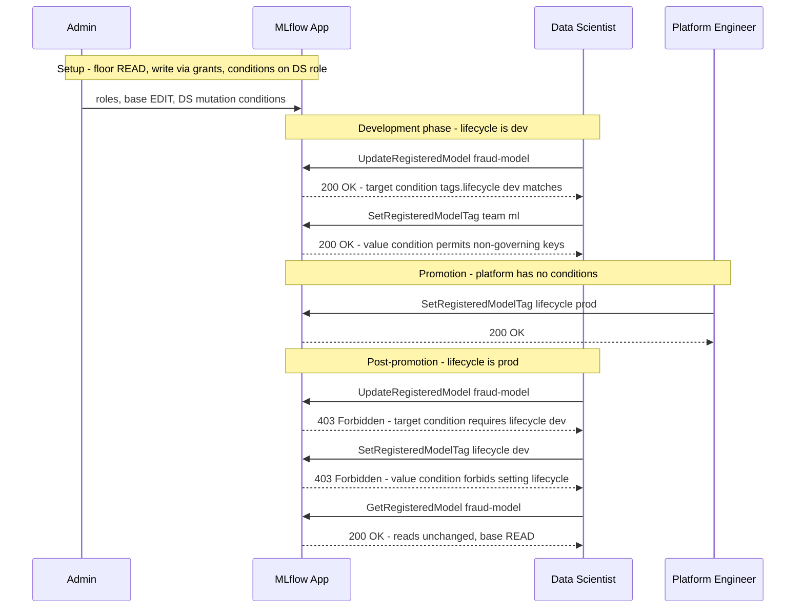
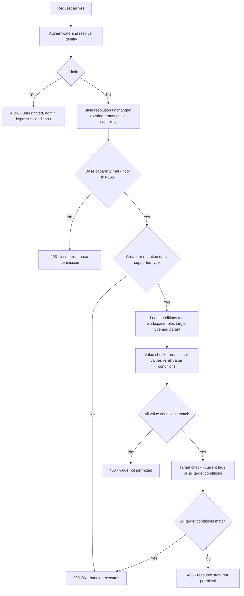
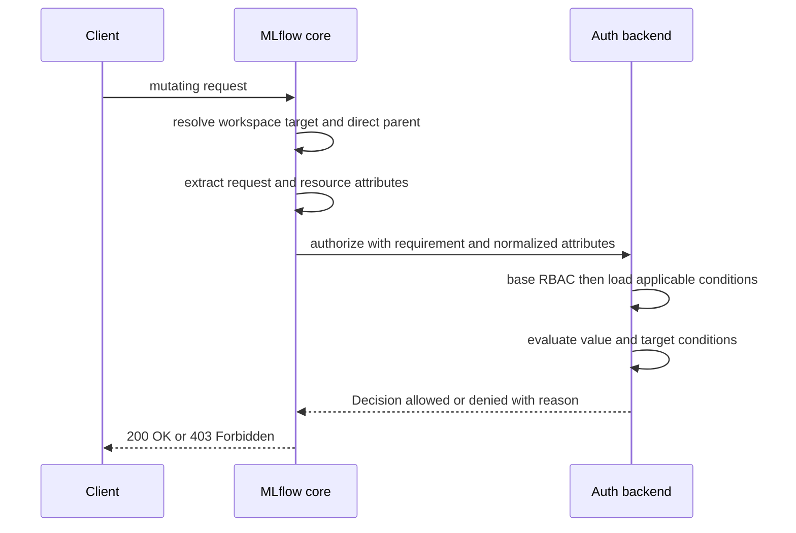

start_date: 2026-08-18
mlflow_issue: https://github.com/mlflow/mlflow/issues/24742
rfc_pr:

# Summary

MLflow RBAC grants access based on resource type and identity. It does not consider
resource state or the values a request tries to set. Once a user has EDIT on registered
models in a workspace, they can modify any registered model regardless of its lifecycle
state, and can set any tag or alias on it. There is no way to express "this user can edit
dev models but not production ones" or "only the platform team may set the `@champion`
alias."

This RFC proposes **mutation conditions**: up to 100 role-owned condition objects per
`(role, resource_type)`. Each object optionally carries a value condition and a target
condition and is scoped to the role's workspace and target resource type. With no parent
scope, it applies to every target of that type in the workspace. With an exact direct-parent
type and ID, it applies only to matching children of that parent. Conditions gate
**create/mutation** operations, never reads:

- A **value mutation condition** constrains *what values* a role may set, meaning the tag
  or alias in the request.
- A **target mutation condition** constrains *which existing resources* a role may mutate,
  by their current tags or aliases.

Each condition is an AND-ed filter in MLflow's existing filter grammar. A mutation condition
only ever *further-restricts* an operation the role's base grant already allows, and never
confers access. The guiding principle is that **grants add and conditions subtract**: base
grants combine across roles to decide what a role can do, and every applicable condition
combines across roles to restrict it. When a resource's tags change (for example when it is
promoted to production), access adjusts automatically without admin intervention, and the
resource never moves, so lineage is preserved.

# Basic example

A data science team and a platform team share a workspace. Data scientists iterate freely
on dev models. Once a model is promoted to production, only the platform team may modify
it, while the model stays in the same workspace.

```python
# Base roles: keep the floor at READ so write always arrives via a grant.
ds_role       = client.create_role(name="data-scientist", workspace="ml-team")
platform_role = client.create_role(name="platform-eng",   workspace="ml-team")

client.add_role_permission(ds_role.id,       "registered_model", "*", "EDIT")
client.add_role_permission(platform_role.id, "registered_model", "*", "EDIT")

# One call adds both conditions for (ds_role, registered_model):
#  - target condition: may mutate only resources currently tagged lifecycle=dev
#  - value condition:  may not set the governing lifecycle tag, nor the champion alias
client.add_mutation_condition(
    role_id=ds_role.id,
    resource_type="registered_model",
    target_condition="tags.lifecycle = 'dev'",
    value_condition="tag_key != 'lifecycle' AND alias != 'champion'",
)
# Platform role: no mutation conditions, so it is unconstrained and may promote and edit prod.
```

**Lifecycle:**


```mermaid
sequenceDiagram
    participant Admin
    participant MLflow as MLflow App
    participant DS as Data Scientist
    participant Platform as Platform Engineer

    Note over Admin,MLflow: Setup - floor READ, write via grants, conditions on DS role
    Admin->>MLflow: roles, base EDIT, DS mutation conditions

    Note over DS,MLflow: Development phase - lifecycle is dev
    DS->>MLflow: UpdateRegisteredModel fraud-model
    MLflow-->>DS: 200 OK - target condition tags.lifecycle dev matches
    DS->>MLflow: SetRegisteredModelTag team ml
    MLflow-->>DS: 200 OK - value condition permits non-governing keys

    Note over Platform,MLflow: Promotion - platform has no conditions
    Platform->>MLflow: SetRegisteredModelTag lifecycle prod
    MLflow-->>Platform: 200 OK

    Note over DS,MLflow: Post-promotion - lifecycle is prod
    DS->>MLflow: UpdateRegisteredModel fraud-model
    MLflow-->>DS: 403 Forbidden - target condition requires lifecycle dev
    DS->>MLflow: SetRegisteredModelTag lifecycle dev
    MLflow-->>DS: 403 Forbidden - value condition forbids setting lifecycle
    DS->>MLflow: GetRegisteredModel fraud-model
    MLflow-->>DS: 200 OK - reads unchanged, base READ
```

The resource never moved. Lineage is intact. Write access changed dynamically based on the
tag value, and the DS cannot set the governing tag to unlock itself.

# Motivation

MLflow RBAC grants match resources by exact ID or wildcard (`*`). There is no way to express
"grant access to resources matching a condition" or "restrict the values this operation may
set," which forces admins into coarse choices. The following use cases are not supported
today and would be enabled by this proposal. Each is shown with the concrete mutation
condition that expresses it (see *Detailed design*). All gate **create/mutation** operations
only, and reads are unchanged (see *Out of scope*).

**1. Dev/prod boundary within a team.** A data science team works in a single workspace.
During experimentation, resources are freely editable. Once work is promoted to production,
it should no longer be modifiable by the dev team, only the platform team. Since the resource
originated in the same workspace, the only current way to enforce this is to move it to
another workspace, which is not trivial. Moving a resource breaks lineage because of
cross-workspace references. A sub-resource such as a run, trace, or logged model resolves its
workspace through its parent experiment, so moving it changes its parent experiment and
severs the experimental history that parent records.
- **Target condition:** `(ds-role, registered_model, target_condition="tags.lifecycle='dev'")`
- **Result:** DS may mutate a resource only while it is tagged `lifecycle=dev`. When the tag
  flips to `prod`, the target condition stops matching and write access evaporates
  automatically, with no admin action and no move. Read stays, so prod remains visible.

**2. Alias/promotion protection.** Only designated users should be able to set
production-ready-indicating aliases (for example `champion` or `production`) on a registered
model. Today, anyone with EDIT can set any alias. A deployment script that pulls models by
such an alias would pick up any model a DS promoted, even with no review.
- **Value condition (DS):** `(ds-role, registered_model, value_condition="alias NOT IN ('champion', 'production')")`
- **Result:** DS may set any alias except the protected ones. The platform role has no value
  condition, so it may. This gates the value being set.

**3. Restricting mutation inputs.** A data scientist needs EDIT to update descriptions and
set benign tags, but should not be able to set operationally significant tag keys (for
example `lifecycle` or `approved`). Today, EDIT grants unrestricted access to all tag and
alias operations.
- **Value condition:** `(ds-role, registered_model, value_condition="tag_key != 'lifecycle'")`
- **Result:** all tag writes are allowed except the protected key, at both create and update.
  This protects the target condition in use case 1: without it, a dev user could simply change
  the governing tag to escape the lock.

Mutation conditions solve these by making a *write operation* dynamic. The **target
condition** follows the resource's tags, and the **value condition** constrains the values a
request may set. Neither requires moving resources or per-resource admin work.

## Out of scope

- **Read-scoping / hiding resources on read.** If a user already has workspace access and could
  read a resource, this RFC does **not** hide it. Reads stay as today, and mutation conditions
  are evaluated only during **create/mutation** authorization. Read conditions and search or
  list prefiltering need a queryable scope plus predicate pushdown into the store query.
- **Parent-attribute predicates.** A parent scope selects a child by its exact direct-parent
  type and ID. It does not read mutable attributes from the parent, so "lock all runs whose
  parent experiment is tagged `lifecycle=prod`" is not expressible in the initial
  implementation.
- **Per-operation target granularity.** The target condition applies uniformly to all mutating
  operations on a type. Distinguishing "editable while `dev`, deletable only while `prod`" would
  require per-operation target conditions; this is intentionally not supported in favor of the
  simpler uniform model.
- **Fields beyond tags and aliases.** The initial implementation conditions only on tag and
  alias values (the value namespace `tag_key`/`tag_value`/`alias`, and the target namespace
  `tags.*`/`aliases.*`). The design is extendable to other request and resource fields.
- **Assessment-owned conditions.** Assessments have no tag or alias vocabulary of their own.
  Assessment mutations are authorized against their trace, so a trace condition can gate them,
  but a condition on an assessment's metadata or feedback values is out of scope.
- **Owner-based conditions** ("only modify resources you created"). This requires ownership
  tracking and is a separate feature.

# Detailed design

## API changes

### Mutation conditions and their fields

A role may have up to 100 mutation-condition objects for each target resource type. Each
object has a stable ID, optional value and target filters, and an optional exact direct-parent
scope:

```
MutationConditions {
    id:                   string    # stable id, assigned on add; addresses update/remove
    role_id:              int       # the role the conditions apply to
    resource_type:        string    # authorization target, e.g. "registered_model_version"

    # Optional direct-parent selector. Both fields are null for workspace/type scope; both are
    # set for parent scope. The pair must be a supported direct-parent relationship for the
    # target type, e.g. registered_model_version under registered_model/fraud-model.
    parent_resource_type: string | null
    parent_resource_id:   string | null

    # Gates WHAT VALUES may be set. A filter over tag_key, tag_value, and alias. It applies to
    # create as well as mutation. null leaves request values unconstrained.
    value_condition:      string | null

    # Gates WHICH EXISTING RESOURCES may be mutated. A filter over tags.<key> and
    # aliases.<name>, read from the target's current state. It is vacuous on create and never
    # applies to reads. null leaves target resources unconstrained.
    target_condition:     string | null
}
```

A condition without a parent scope applies to every target of its `resource_type` in the role's
workspace. A condition with a parent scope applies only when the validator resolves the target's
exact direct parent to that type and ID. Conditions do not inherit across resource types: a
workspace/type-scoped `run` condition does not apply to traces or logged models.

Each non-null condition is a single filter in MLflow's existing search filter grammar: a set of
comparison clauses AND-ed together, for example `tags.lifecycle = 'dev'` or
`tag_key != 'lifecycle' AND alias != 'champion'`. A value being set, or a resource being
mutated, is permitted when it matches every clause. There is no separate allow and deny form:
`!=` and `NOT IN` express exclusion within one filter.

The optional parent scope filters which condition objects are applicable before they combine.
Every applicable condition object across every role held by the user must pass. Thus, conditions
scoped to different parents do not conflict for a single child, while unscoped conditions apply
to every parent. Like grants, conditions are scoped to a workspace through the role; the
condition has no workspace column of its own.

### Admin Apis

Four operations manage conditions, mirroring the existing `add`/`update`/`remove`/`list`
role-permission API. `add` creates a `MutationConditions` object and returns it with an
assigned `id`; `update` and `remove` address an existing object by that `id`; `list` returns a
role's objects. Their request and response shapes:

```
add(role_id, resource_type, parent_resource_type?, parent_resource_id?,
    value_condition?, target_condition?) -> MutationConditions
    # Creates one object. The parent fields are both omitted/null for workspace/type scope or
    # both set for exact direct-parent scope. Rejects an unsupported parent relationship, an
    # invalid filter, both filters null, or a role/type that already has 100 objects.

update(id, parent_resource_type?, parent_resource_id?, value_condition?, target_condition?)
    -> MutationConditions
    # Partial update by id:
    #   - an omitted field is unchanged;
    #   - a filter string replaces that filter and null clears it;
    #   - the parent pair is replaced together by an exact pair or two nulls;
    #   - when both filters are null after the update, the object is removed.

remove(id) -> {}
    # Deletes one MutationConditions object.

list(role_id) -> { mutation_conditions: MutationConditions[] }
    # Returns every condition object on the role, including its scope and stored filters.
```

The default auth backend implements these operations. A pluggable backend that does not support
conditions returns a feature-not-supported response rather than accepting a rule it will not
evaluate.

### Limits and restrictions

- **Conditions combine with AND.** For an operation, base RBAC, every applicable value
  condition, and every applicable target condition must pass; any one failing denies it.
  An absent or vacuous condition contributes nothing and passes.
- **Scope selects before combination.** A parent-scoped condition is considered only for a child
  whose resolved direct parent matches its scope. An unscoped condition applies to every parent
  of the target type in the role's workspace.
- **Grants add, conditions subtract across roles.** A user's capability is the union of what
  their roles grant, exactly as today, but every applicable condition from every held role must
  match. A restriction in one role cannot be lifted by a permissive or absent condition in
  another, independent of that role's grant level.
- **Non-monotonic across roles.** Adding a role that carries a condition can reduce what a user
  may do. This is inherent to a restriction and matches the absolute-deny behavior of the merged
  sub-resource-permissions RFC's `NONE` level.
- **Contradictory conditions fail closed.** If applicable conditions require
  `tags.lifecycle = 'dev'` and `tags.lifecycle = 'prod'`, the user can mutate neither.
- **At most 100 condition objects per `(role, resource_type)`.** This bound includes both
  workspace/type-scoped and parent-scoped objects.
- **At most 5 clauses per filter** (value and target each).
- **No `OR` within a filter.** This preserves reuse of MLflow's AND-only parser and matcher;
  `IN` and `NOT IN` express same-field alternatives. General OR would require a separate
  parser/evaluator and special absent-field semantics for value conditions.

## Changes to the auth call path

### Order of evaluation

For an operation by a user on a resource, the decision is the logical AND of the base grant
check, the value condition, and the target condition. The process is as follows:


```mermaid
flowchart TD
    REQ[Request arrives] --> AUTHN[Authenticate and resolve identity]
    AUTHN --> ADMIN{Is admin}
    ADMIN -->|Yes| ALLOW[Allow - unrestricted, admin bypasses conditions]
    ADMIN -->|No| BASE["Base resolution unchanged - existing grants decide capability"]
    BASE --> BASE_CHECK{Base capability met - floor is READ}
    BASE_CHECK -->|No| DENY0[403 - insufficient base permission]
    BASE_CHECK -->|Yes| MUTATING{Create or mutation on a supported type}
    MUTATING -->|No| HANDLER[200 OK - handler executes]
    MUTATING -->|Yes| LOADC[Load conditions for workspace roles target type and parent]
    LOADC --> VALUE[Value check - request set-values vs all value conditions]
    VALUE --> VOK{All value conditions match}
    VOK -->|No| DENYV[403 - value not permitted]
    VOK -->|Yes| TARGET[Target check - current tags vs all target conditions]
    TARGET --> TOK{All target conditions match}
    TOK -->|Yes| HANDLER
    TOK -->|No| DENYT[403 - resource state not permitted]
```

The value condition is read from the operation itself, so it applies uniformly to a create
(authorized by the workspace create gate) and a mutation (authorized by the resource update
gate), layering on top of whatever grant authorized the operation independent of permission
level.

## Subset of resource types and their fields for initial launch

The condition framework is resource-type generic, but the initial release wires only the types
and operations below. A target condition reads the target's tags (plus aliases for model and
prompt parents); value conditions read only the request fields listed for that type. Direct
parent scope is supported only for the listed child-to-parent relationships.

| Resource type | Direct parent for scoped conditions | Target fields | Value-setting operations |
|---|---|---|---|
| `experiment` | none | `tags.*` | set-tag, create. Other mutations carry no value fields. |
| `registered_model` | none | `tags.*`, `aliases.*` | set-tag, set-alias, create. Other mutations carry no value fields. |
| `prompt` | none | `tags.*`, `aliases.*` | set-tag, set-alias, create. Other mutations carry no value fields. |
| `run` | `experiment` | `tags.*` | set-tag, create. Other mutations carry no value fields. |
| `trace` | `experiment` | `tags.*` | set-tag. Other mutations carry no value fields. |
| `logged_model` | `experiment` | `tags.*` | set-tags (batch), create. Other mutations carry no value fields. |
| `registered_model_version` | `registered_model` | `tags.*` | set-tag, create. Other mutations carry no value fields. |
| `prompt_version` | `prompt` | `tags.*` | set-tag, create. Other mutations carry no value fields. |

Notes:
- A target condition never restricts create because no target state exists yet. A value condition
  can restrict request values on create, including tags supplied at creation.
- A batch set-tags operation evaluates the value condition against each tag; if any tag fails,
  the operation is denied.
- Assessment create, update, and delete are authorized against the trace. A trace target
  condition can therefore gate assessment mutations, for example preventing an assessment from
  being added to a trace tagged `finalized=true`.
- Target conditions inspect the pre-mutation target state. If a target currently matches
  `tags.lifecycle = 'dev'`, deleting that tag can be authorized; subsequent mutations no longer
  match the condition. A value condition protects a governed key only for operations that expose
  that key as a request value.

## Adaptability to Pluggable Auth (RFC 8)

Conditions fit RFC 8's single decision entry point, `authorize(query) -> Decision`, which
returns one decision. Value and target checks are stages inside that call, after the base grant
check. Core resolves the workspace, target, and direct parent as it already does for grants;
it passes normalized inputs to the backend but does not expose raw request bodies.

**What is wired to the backend.** The condition inputs ride additive, default-empty fields on
RFC 8's existing `AuthorizationRequirement`. The entry-point signature does not change:

```
AuthorizationRequirement {
    resource_type          # existing authorization target type
    resource_id            # existing authorization target ID
    action                 # existing
    workspace              # existing
    parent_resource_type   # ADDED: resolved direct parent type, if any
    parent_resource_id     # ADDED: resolved direct parent ID, if any
    request_attributes     # ADDED: normalized attempted set-values
    resource_attributes    # ADDED: target current tags and aliases
}

authorize(subject, requirement) -> Decision
```

A backend that supports conditions owns their storage, lookup, and evaluation. Core passes the
workspace/type/parent scope and normalized attributes; the backend loads only conditions on
roles held by the user in that workspace whose target type and optional parent scope apply. A
backend that does not implement the feature rejects condition management requests as unsupported
and may continue to make unconditional RBAC decisions for ordinary authorization requests.

Conditions are parsed and validated on write, then cached as parsed clauses by the default
backend for request-path evaluation. The stored and API representation remains the authored
filter string.

**Interaction when conditions are evaluated:**


```mermaid
sequenceDiagram
    participant Client
    participant Core as MLflow core
    participant Backend as Auth backend

    Client->>Core: mutating request
    Core->>Core: resolve workspace target and direct parent
    Core->>Core: extract request and resource attributes
    Core->>Backend: authorize with requirement and normalized attributes
    Backend->>Backend: base RBAC then load applicable conditions
    Backend->>Backend: evaluate value and target conditions
    Backend-->>Core: Decision allowed or denied with reason
    Core-->>Client: 200 OK or 403 Forbidden
```

## MLflow UI

Mutation conditions surface as part of a role's configuration rather than as a separate policy
system.

- **Display on roles.** A role detail view lists all of its condition objects alongside grants,
  grouped by target resource type and then by workspace/type scope or exact parent scope. It
  shows the value and target filter strings directly; an absent filter renders as none.
- **Create and edit.** An administrator with manage permission on the role can add, update, or
  remove conditions through the management API. The UI uses text fields in the same filter
  grammar as MLflow search and selects a supported exact parent when the target type is a child.
- **Model and prompt entry points.** A registered-model or prompt detail view can create a child
  version condition scoped to the model or prompt currently being viewed, without requiring the
  administrator to manually enter its parent ID.
- **Validation and errors.** The UI surfaces invalid-filter, unsupported-backend, invalid-parent,
  and 100-condition-limit errors. For a denied request, it can show the safe denial reason
  returned by the authorization decision, such as an unmatched `production` alias.
- **Read-only fallback.** A user who can view but not manage a role sees its conditions
  read-only, consistent with grants.

## Database schema changes

The default backend stores one row per condition object. Workspace is inherited from the role,
not duplicated in this table. The lookup starts with roles held by the user in the resolved
workspace, then matches target type and either no parent scope or the exact resolved parent.

```sql
CREATE TABLE mutation_conditions (
    id INTEGER PRIMARY KEY AUTOINCREMENT,
    role_id INTEGER NOT NULL REFERENCES roles(id) ON DELETE CASCADE,
    resource_type VARCHAR(255) NOT NULL,
    condition_slot SMALLINT NOT NULL,
    parent_resource_type VARCHAR(255),
    parent_resource_id VARCHAR(255),
    value_condition TEXT,
    target_condition TEXT,

    CHECK (condition_slot BETWEEN 1 AND 100),
    CHECK (
        (parent_resource_type IS NULL AND parent_resource_id IS NULL)
        OR
        (parent_resource_type IS NOT NULL AND parent_resource_id IS NOT NULL)
    ),
    CONSTRAINT unique_role_type_slot
        UNIQUE (role_id, resource_type, condition_slot)
);

CREATE INDEX idx_mutation_conditions_lookup
    ON mutation_conditions (
        role_id,
        resource_type,
        parent_resource_type,
        parent_resource_id
    );
```

The slot constraint provides a race-safe 100-condition bound without a count-then-insert race.
The lookup index retrieves only conditions for the current user's workspace roles, target type,
and scope; no query loads conditions from other users or workspaces. Filters are validated on
add or update and stored as authored strings. The default backend caches their parsed clauses for
request-path evaluation, while `list` returns the stored strings directly. The table is additive,
so deployments with no rows retain current default-allow behavior.

# Drawbacks

- **Non-monotonic across roles.** Because conditions combine with AND, adding a role that
  carries a condition can *reduce* what a user may do, and a permissive role cannot lift a
  restriction imposed by another. Contradictory conditions on the same type across two of a
  user's roles fail closed, leaving no mutation that satisfies both. This is intentional and
  matches the merged `NONE` and is the safe direction for a restriction, but a restriction lives
  on every role that carries it and accumulates, which can surprise admins who expect roles to
  only add access.
- **No system-enforced global invariant.** A user with no condition on a type is unconstrained
  there. Restricting a user requires placing a condition on a role they hold, so a guaranteed
  "nobody may ever set X" rule is a built-in hard check in the handler rather than a condition.
- **Type-level authoring, operation-level enforcement.** A condition is authored for a target
  resource type and optional parent scope, but it is enforced across every distinct operation
  that creates or edits that type. Each operation exposes the governed fields and direct parent
  differently, so the backend must classify and gate every covered operation individually.
- **No restriction on reads.** Conditions gate create and mutation only. They cannot restrict
  reads in the current design, so a user who holds read access to a resource sees all of its
  fields regardless of any condition. Hiding a field or resource requires the base grant, not a
  condition.

# Alternatives

### A. Attach conditions to the existing grant (capability-keyed)

Extend the existing grant with condition clauses keyed by capability (update, delete, and so
on), rather than modeling a condition as its own object.

**Rejected because** a grant's job is to confer a level (READ, USE, EDIT, MANAGE) on a resource
type and pattern, answering what a role can do, while a condition carries no level and only
narrows, answering under what conditions. That difference makes the separation necessary rather
than cosmetic:

- The restriction is level-independent: "may not set `lifecycle`" or "may only mutate `dev`"
  holds no matter which write capability the operation checks, so it is a property of the role's
  relationship to the type, not of any one grant.
- Attaching it to a grant would tie it to that grant's level, and since a role can hold several
  grants on the same type with the highest applicable one winning, it would be ambiguous which
  grant's condition applies.
- Create is gated at the workspace level, so a create-time value restriction has no
  resource-type grant to hang off.

Keying the condition on `(role, resource_type)` with optional direct-parent scope, independent
of level, removes the ambiguity and covers create. This contrasts cleanly with the merged
sub-resource-permissions RFC's `NONE`, which is a grant because it is a level (absolute-deny),
whereas mutation conditions are not levels and instead layer over whatever level the grants
conferred.

### B. Single operation-keyed condition object

Model one object keyed on the operation (for example update-registered-model) carrying request
and resource filters.

**Rejected because** the admin surface should be type-level, matching how grants are authored.
Operation-keying leaks operation names into the admin model and multiplies objects, one per
operation. The type-level condition objects capture the same power with a smaller, more familiar
surface; operation-level detail is kept internal in the field and parent mappings.

### C. Separate allow and deny filters, or a structured allow/deny value map

Give each condition both an allow filter and a deny filter, or encode the value condition as an
allow/deny map of key to permitted values.

**Rejected because** `!=` and `NOT IN` already express exclusion within a single condition, and
cross-role AND already provides absolute restriction, so a separate deny channel adds a second
combining rule with no added power. A single condition is simpler to author and explain. A
structured value map remains a possible future authoring convenience over the same evaluation.

### D. Separate policy layer (admission-controller style)

A separate authorization engine after RBAC.

**Rejected because** it means two systems to reason about and is over-engineered for MLflow's
scale. Mutation conditions keep the restriction co-located with the role and reuse the existing
filter grammar.

### E. Workspace isolation / resource groups / per-ID grants

Move resources between workspaces on promotion, or add a resource-group dimension, or enumerate
IDs.

**Rejected because** workspace moves break lineage and hit name-uniqueness collisions, and
sub-resources have no independent workspace mobility. Resource groups are a special case of a
target condition on one attribute. Per-ID grants do not scale and are not dynamic. Conditions
reuse existing tags and aliases, are dynamic since a tag change flips access with no admin
action, and are co-located with the role.

# Adoption strategy

**This is not a breaking change.** Deployments with no mutation conditions behave exactly as
today. Every operation is default-allow at its base level.

**Adoption path:**

1. Upgrade, with no behavior change.
2. Keep restricted roles' base floor at READ, and hand out write via base grants deliberately.
3. Tag resources appropriately, for example `lifecycle=prod`.
4. Add mutation conditions on restricted roles:
   ```python
   client.add_mutation_condition(
       role_id=ds_role.id, resource_type="registered_model",
       target_condition="tags.lifecycle = 'dev'",
       value_condition="tag_key != 'lifecycle'",
   )
   ```
5. Leave the promoting role without a value condition on the governing tag.
6. Verify access.

**Reverting.** Remove the conditions. There is no destructive rollback, and a deployment with
no mutation conditions behaves as today.
