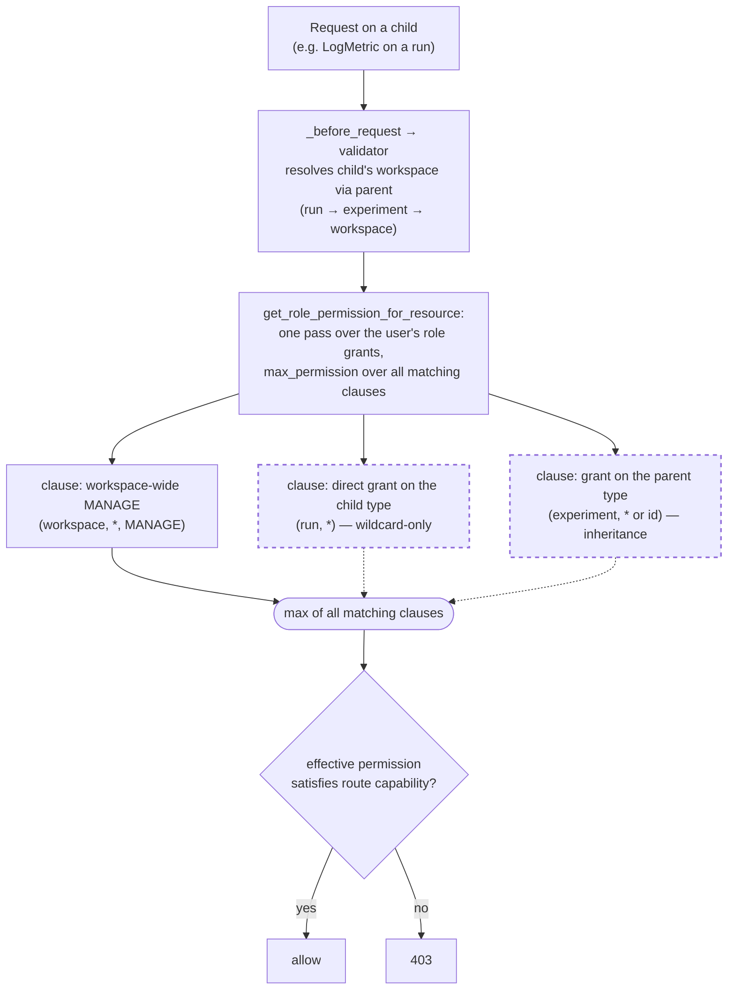

start_date:   2026-08-06
mlflow_issue: https://github.com/mlflow/mlflow/issues/11496
rfc_pr:

# Summary

MLflow's RBAC model recognizes a fixed set of top-level resource types
(`experiment`, `registered_model`, `prompt`, `scorer`, `mcp_server`,
`gateway_*`, `workspace`). Resources that are children of a permissionable
parent (e.g., runs and assessments under experiments, versions under registered
models) are **not** independently permissionable — every operation on them
resolves to the parent's permission level.

This RFC makes a curated set of child resource types **independently grantable**,
using a single, uniform resolution rule: a child's effective permission is the
**most-permissive** of its inherited parent permission and any direct grant on
the child.

```
effective(child) = max(inherited_parent_permission, direct_child_grant)
```

- **No grant on the child** → the child inherits its parent's permission exactly
  as today. This is fully backward compatible: existing deployments behave
  identically with no configuration change.
- **A grant on the child** → the child is *raised* to that level (escalation).

This is the same monotonic, allow-only fold MLflow already uses when combining
workspace-wide and resource-specific grants.

# Basic example

Granting a child type raises it above its parent; not granting it leaves it
inheriting from the parent.

```python
# Baseline (unchanged from today): EDIT on experiment flows to all children.
client.add_role_permission(ds_role.id, "experiment", "*", "EDIT")
# → runs, traces, assessments all resolve to EDIT via inheritance.

# Validation-boundary evaluator: read everything, additionally WRITE assessments.
client.add_role_permission(evaluator_role.id, "experiment", "*", "READ")
client.add_role_permission(evaluator_role.id, "assessment", "*", "EDIT")
# → experiment/run/trace stay READ (inherited); assessment raised to EDIT.

# Run-logging service account (#11496): read the experiment, log runs — without
# gaining experiment-management (rename/delete) rights.
client.add_role_permission(pipeline_role.id, "experiment", "*", "READ")
client.add_role_permission(pipeline_role.id, "run", "*", "EDIT")
# → experiment stays READ (cannot rename/delete); runs raised to EDIT.
```

Effective permissions:

| User | experiment | run | trace | assessment |
|------|-----------|-----|-------|------------|
| data-scientist | EDIT | EDIT (inherited) | EDIT (inherited) | EDIT (inherited) |
| evaluator | READ | READ (inherited) | READ (inherited) | **EDIT** (raised) |
| pipeline | READ | **EDIT** (raised) | READ (inherited) | READ (inherited) |

## Motivation

RFC 0005 established workspace-scoped roles with permission grants on resource
types. Its `VALID_RESOURCE_TYPES` set covers only top-level resources —
sub-experiment resources (runs, traces, assessments, logged models) and registry
versions are not recognized, and their validators resolve to the parent's
permission level. Below are some use cases where this level of granularity is insufficient.

### Use cases
**1. Run logging without experiment management (#11496)**

Users need to log **runs** (e.g. to log models for registration) but must not
create, rename, delete, or otherwise **manage experiments** — only admins manage
experiments. Today run permissions inherit from the experiment, so the only way to
grant run-logging is to grant experiment `EDIT`, which also permits renaming and
tagging the experiment.

- **Example user:** a data scientist or pipeline role that logs runs into
  admin-created experiments.
- **Policy:** `(experiment, *, READ)` + `(run, *, EDIT)`
- **Result:** can discover/read experiments and create/log runs; cannot rename,
  delete, or manage experiments.

The experiment grant is `READ`, not lower: a user must be able to read an
experiment to discover and target it (`GetExperiment` / `SearchExperiments` require
experiment `can_read`), and must be a workspace member (workspace `USE`). Run
`EDIT` then supplies the create/log capability on runs. Experiment *creation* is a
separate workspace-level gate (USE/MANAGE), not experiment EDIT, and is unchanged
by this RFC.

**2. Assessment write access (validation boundary)**

A production app runs training/evaluation via a service role; end users only view
results and submit **feedback/assessments** through the UI. They must not modify or
delete runs, traces, models, or aliases. Today `CreateAssessment` requires
experiment `can_update` (EDIT), which also permits modifying runs and traces.

- **Example user:** a human evaluator who annotates results with assessments.
- **Policy:** `(experiment, *, READ)` + `(assessment, *, EDIT)`
- **Result:** can view everything and create/update assessments; cannot modify
  runs, traces, or experiments.

**3. Model-version logging without registry management**

Data scientists push new model versions; the platform team owns the registry
namespace (model names, descriptions, aliases). Today `CreateModelVersion`
requires the parent `registered_model`'s update capability, so enabling version
creation also permits managing the model entry.

- **Example user:** a data scientist who registers new versions of existing models.
- **Policy:** `(registered_model, *, READ)` + `(model_version, *, EDIT)`
- **Result:** can create/update model versions; cannot rename, delete, or
  re-alias the registered model.

Making `model_version` a first-class grantable type also sets up a future
capability this RFC does **not** include: condition-based access control on
versions — e.g. protecting versions that carry a given alias (`champion`,
`production`) or tag. That is deferred to the condition-based access-control RFC;
this RFC grants on the `model_version` type at wildcard grain only.

### Out of scope

- **Condition-based (attribute/tag) access control.** This RFC grants on resource
  *types* at wildcard grain; scoping a grant by attribute — e.g. model versions
  with a given alias (`champion`, `production`) or tag, traces for a given agent —
  is deferred to the condition-based access-control RFC. Making these types
  grantable here is what those future conditions attach to.
- **Request-level (pre-request) condition push-down for the new child types.**
  Efficient conditional filtering — injecting the caller's authorized predicate
  into the query before it hits the store (see mlflow/mlflow#24964) — is not added
  for `run`/`trace`/`assessment`/`model_version` here. This RFC stays at wildcard
  grain precisely so search filtering needs no push-down (a single
  wildcard-can-read check per type); any future per-attribute or per-id conditional
  search for these types depends on that push-down mechanism and is deferred with
  the condition-based access-control work.
- **Per-individual-resource grants for high-cardinality children.** Grants on
  `run`/`trace`/`assessment` are supported at **wildcard** grain
  (`(trace, *, LEVEL)`) only; per-ID grants (`(trace, <trace_id>, LEVEL)`) are out
  of scope. The blocker is **search**: with per-ID grants, a `SearchTraces` result
  must be filtered to the caller's authorized ids, which today means post-response
  filtering — scan a page, drop unauthorized rows, re-fetch to refill — pathological
  for high-cardinality children. Efficient filtering needs the authorized predicate
  pushed into the store query before it runs; that pre-request push-down is the
  subject of [mlflow/mlflow#24964](https://github.com/mlflow/mlflow/issues/24964)
  (no merged PR yet). Wildcard grain sidesteps this entirely (one boolean per type),
  so per-ID grants are deferred until that mechanism lands.
- **Grants scoped to a collection defined by an attribute value** (e.g. a chatbot
  **session** — the traces sharing a session id). Session is **not a first-class
  field**: it is a trace **tag** — a key/value row in the `trace_tags` table with
  key `mlflow.trace.session` — not a column on `trace_info`, and there is no session
  table or API. So a session is not a DB resource this RFC's resource-type grants
  can attach to; it is an attribute predicate over traces. Such tag/attribute-
  predicate grants belong to the condition-based access-control RFC (which must
  support *additive* conditions for the escalation direction — raising one session
  above a read-only parent — to work). Same reasoning for any attribute-defined
  collection (per-agent, per-experiment).
- **Scoping child access to a parent boundary.** A child grant is workspace-wide
  (`(assessment, *)` matches every assessment in the workspace, across all
  experiments) or — in future — per-instance (per-id). There is no per-parent grain,
  so "assessment EDIT on the assessments *of one experiment*" (or of one agent)
  cannot be expressed as a single grant. This is deferred to the condition-based
  access-control RFC; making the child type grantable here is what such a
  parent-boundary (or attribute) condition attaches to.
- **Fine-grained auth for non-DB-indexed resources** (e.g. individual spans
  within a trace) — stored in blob/artifact storage, not independently queryable.
- **Tooling to ensure future contributions keep the auth route map complete.**
  This RFC adds and re-points entries in the validator map, but does not add a
  build/test-time check that every new or renamed route is wired to a validator.
  Guaranteeing coverage as the codebase evolves is a separate concern (and the
  fail-open/fail-closed default for an unmapped route is being handled upstream in
  [mlflow/mlflow#25308](https://github.com/mlflow/mlflow/pull/25308)).

## Detailed design
The design has two aspects, each a top-level section below:

1. **[Granting permissions](#granting-permissions)** — making the new resource types
   grantable and defining what a *valid* grant on them is, so an operator can only
   express permissions the model supports (which types and their metadata, and which
   `(resource_type, pattern, level)` grants are accepted or rejected).
2. **[Enforcing permissions](#enforcing-permissions)** — mapping an incoming request
   to a permission validator and running it to allow or deny (the entry point and
   validator map, the permission fold (parent resolution and route re-pointing),
   and search filtering).

### Granting permissions

#### Grantable resource types
**Proposed methodology.** A child type is made independently grantable when we have
identified customer use cases in which the child needs escalated permissions
relative to its parent and to the other children under that parent. The max model
fits this precisely: it is monotonic and allow-only, so a child grant *raises* that
child above its inherited level. Children with no such use case keep inheriting from
their parent, which keeps the grant surface small. This is the inclusion criterion
for this RFC and future additions.

Two scoping principles bound the candidate set. First, this RFC targets only routes
that **already have resource-scoped authorization** — routes gated by authentication
alone (e.g. the generic job endpoints) or with no gate are outside the model, since
there is no parent permission to inherit from or escalate against. Second, as a
forward principle, new permissionable resources should be **DB-hosted, independently
queryable entities**: a grant matches against a stored `(resource_type, pattern)` and
search filtering requires the store to resolve the resource, so a type that is not
DB-indexed cannot participate in this model.

The set was derived by enumerating **both** ways `_before_request` dispatches a
validator, which exist because MLflow's routes come in two shapes:

1. **Exact-match map** (`BEFORE_REQUEST_VALIDATORS`) — a dict keyed by exact
   `(path, method)`, generated automatically from the proto service definitions.
   This covers routes with a **fixed path** (`/api/2.0/mlflow/runs/create`), where
   an O(1) dict lookup suffices.
2. **Regex/prefix dispatch** — for routes the exact map cannot key: those with a
   **path parameter** (e.g. `/mlflow/traces/<id>/tags`, logged-model and webhook
   routes), matched by regex in separate maps, and endpoints **not registered as
   proto routes at all** (the MCP server via `_get_mcp_server_validator`,
   artifact-proxy paths, `/v1/traces`), matched by `path.startswith(...)`.

For each route, across both mechanisms, we identified whether its permission
resolves to a **different** resource type than the resource acted on (i.e. it
inherits from a parent). Scanning both — not just the proto map — is what surfaces
`mcp_server`/`mcp_server_version`, which live only in the regex/prefix path and a
proto-map-only scan misses.

##### The model with sub-resources added

The **top-level** grantable types are unchanged by this RFC — they are what is
grantable today (`VALID_RESOURCE_TYPES`, plus `prompt`, which is grant-namespaced
separately). For completeness, the full set and whether each has a sub-resource
this RFC touches:

_Verified against MLflow 3.15.1 source._

| Top-level type | Sub-resource(s) in scope? |
|----------------|---------------------------|
| `workspace` | — (the root scope; parents everything) |
| `experiment` | `run`, `trace`, `assessment`, `logged_model`, `review_queue` (and `label_schema`, `prompt_optimization_job`, excluded) |
| `registered_model` | `model_version` |
| `prompt` | `prompt_version` |
| `scorer` | `scorer_version` (excluded) |
| `mcp_server` | `mcp_server_version` (excluded) |
| `gateway_endpoint` | `gateway_endpoint_binding` (excluded) |
| `gateway_model_definition` | — |
| `gateway_secret` | — |

The table below then details every **sub-resource** and whether it becomes
independently grantable. The two tables together are the whole grantable model once
this RFC lands; sub-resources marked **Yes** are what it adds. All grants are
per-workspace.

| Parent | Sub-resource | Grantable? | [Grain](#search-filtering) | Escalation use case | Addable later? |
|--------|--------------|------------|-------|---------------------|----------------|
| `experiment` | `run` | **Yes** | wildcard | log runs without experiment management | in scope |
| `experiment` | `trace` | **Yes** | wildcard | trace-level escalation alongside runs/assessments | in scope |
| `experiment` | `assessment` (via trace) | **Yes** | wildcard | write feedback/assessments while everything else stays READ | in scope |
| `experiment` | `logged_model` | **Yes** | wildcard | log models without experiment management (parallels runs) | in scope |
| `experiment` | `review_queue` | **Yes** | wildcard | operate a review/labeling queue (add/remove items) without experiment EDIT | in scope |
| `experiment` | `label_schema` | No | — | none today — authored by whoever manages the experiment | Yes |
| `experiment` | `prompt_optimization_job` | No | — | dormant entity — exists in the data model but has no active SDK/UI surface (candidate for removal), so no persona needs it | Yes |
| `registered_model` | `model_version` | **Yes** | wildcard | push versions without registry management (use case 3) | in scope |
| `prompt` | `prompt_version` | **Yes** | wildcard | push prompt versions without managing the prompt entry (mirrors `model_version`) | in scope |
| `scorer` | `scorer_version` | No | — | none today — versions are immutable/append-only (no alias, tag, or mutable field to protect) | Yes |
| `mcp_server` | `mcp_server_version` | No | — | none today — inherits; parallels `model_version` if a use case arises | Yes |
| `gateway_endpoint` | `gateway_endpoint_binding` | No | — | gated on the `gateway_endpoint` alone today (the endpoint controls create/delete/list of its bindings); the binding is a two-sided link (endpoint + consumer), and requiring both sides' permissions would change existing behavior — out of scope | No |

Notes:
- **Grain is wildcard-only in this RFC.** Every grantable child is at `*` grain;
  id-level grain (`(trace, <id>, …)`) will be added once request-level search-filter
  push-down is in place (see [Search filtering](#search-filtering)).

#### Grant validation
When an operator **adds or updates a permission grant** (`grant_user_permission` /
the role-permission APIs), the input must be validated so only permissions the
model supports can be expressed.

Two of the three checks are **already enforced today** and need no change — the new
types simply flow through them:

- **The auth model must explicitly declare the resource type:** `_validate_resource_type`
  rejects any type not in `VALID_RESOURCE_TYPES` (which now includes the new children).
- **The permission level must be valid:** `get_permission` rejects anything that is
  not `READ`/`USE`/`EDIT`/`MANAGE`.

The **one new rule** is pattern validation, which does not exist today —
`resource_pattern` is currently passed to the store unchecked:

- **The pattern must be a kind the type declares:** `resource_pattern` must match
  one of `TYPE[resource_type].patterns` — so a concrete-id child grant
  (`(run, <run_id>, …)`) is rejected while `(run, *, …)` and a parent's
  `(experiment, "*" | id, …)` are accepted, enforcing the wildcard-only grain at the
  source rather than in the fold.

Rejections surface as a validation error on the grant API naming the offending
field, so the operator gets an explicit reason rather than a silently-ineffective
grant. The valid grants are therefore `(child_type, "*", LEVEL)` for any grantable
child, or the existing `(parent_type, "*" | id, LEVEL)` for a parent — anything else
is refused up front.

### Enforcing permissions

An incoming request is mapped to a validator, which resolves the target's effective
permission and allows or denies. The subsections below cover the entry point and
validator map, the permission fold that answers the check (including how a child
resolves its parent and how its routes re-point onto the child), and search-result
filtering.

The overall flow (dashed = added by this RFC):



The subsections below walk each box: the entry point + validator map, the fold and
its clauses, and how the child's parent (and workspace) are resolved.

#### Entry point and validator interface

**Today** every gated request passes through the Flask `_before_request` hook, which
looks up a validator in a route → callable map and denies if it returns false. **We
reuse that entry point and map.** **For sub-resources we only add/re-point entries**
in the map (a route now names the child validator) — no new dispatch mechanism.

The full call chain for a gated request:

```
_before_request(request)                     # Flask entry hook (auth, admin bypass)
  └─ _find_validator(request)                # proto class → validator, via BEFORE_REQUEST_HANDLERS
       (+ LOGGED_MODEL_/WEBHOOK_ maps; e.g. CreateRun: validate_can_update_run)
     └─ validator()                          # e.g. validate_can_update_run — the capability gate
          └─ _get_permission_from_run_id()   # the existing per-child resolver (custom logic)
               └─ get_role_permission_for_resource(user, resource_type, resource_id, workspace,
                                                    child_type, child_id)   # max over grants
          → .can_update / .can_read / …       # validator checks the resulting Permission
  → allow, or make_forbidden_response()       # 403 on failure
```

- **`_find_validator`** maps the request's proto class to a validator (the map this
  RFC re-points; `mcp_server`/artifact routes use path-based dispatch instead).
- **the validator** (`validate_can_*`) is the per-route capability gate — it calls a
  resolver and checks the resulting `Permission`'s `can_*` flag.
- **the resolver** (`_get_permission_from_*`, unchanged custom logic) resolves the
  parent + workspace and now also passes the child to the fold. Detailed in
  [Proposed changes to the permission fold](#proposed-changes-to-the-permission-fold).
- **`get_role_permission_for_resource`** is the grant fold — max over the parent and
  child clauses. Detailed in [The permission fold](#the-permission-fold).

Whether a route with no validator is allowed or denied (fail-open vs. fail-closed)
is a platform-level concern being addressed upstream in
[mlflow/mlflow#25308](https://github.com/mlflow/mlflow/pull/25308) and is orthogonal
to this RFC — the routes this RFC touches are all explicitly mapped.

#### The permission fold today

**Today** the validators call `get_role_permission_for_resource(...)`, a single
most-permissive fold: it loads the user's roles in the workspace and, in one pass,
`max_permission`s in every grant matching the queried resource — the workspace-wide
MANAGE grant, plus any grant on the queried `resource_type` at pattern `*` or the
resource id. A resource type is a bare string constant in a `frozenset` (no per-type
object), and inheritance is handled one level up: a child route (e.g.
`_get_permission_from_run_id`) resolves its parent and queries with the *parent's*
type (`resource_type="experiment"`), so a run's permission is whatever the experiment
fold returns. The real method, lightly elided:

```python
# permissions.py (today)
RESOURCE_TYPE_EXPERIMENT       = "experiment"
RESOURCE_TYPE_REGISTERED_MODEL = "registered_model"
RESOURCE_TYPE_PROMPT           = "prompt"
RESOURCE_TYPE_SCORER           = "scorer"
RESOURCE_TYPE_WORKSPACE        = "workspace"
# ... gateway_*, mcp_server
VALID_RESOURCE_TYPES = frozenset({RESOURCE_TYPE_EXPERIMENT, RESOURCE_TYPE_REGISTERED_MODEL, ...})

# SqlAlchemyStore.get_role_permission_for_resource (today) — uses the type strings directly
def get_role_permission_for_resource(self, user_id, resource_type, resource_id, workspace):
    with self.ManagedSessionMaker() as session:
        roles = ...                                      # load user's roles in `workspace`
        if not roles:
            return None
        best = None
        for role in roles:
            for rp in role.permissions:
                # workspace-admin fold
                if rp.resource_type == RESOURCE_TYPE_WORKSPACE and rp.resource_pattern == "*":
                    if resource_type == RESOURCE_TYPE_WORKSPACE or rp.permission == MANAGE.name:
                        best = max_permission(best, rp.permission)
                    continue
                # resource-type-specific fold — matches only the queried type, wildcard or its id
                if rp.resource_type == resource_type and rp.resource_pattern in ("*", resource_id):
                    best = max_permission(best, rp.permission)
        return get_permission(best) if best is not None else None
```

#### Proposed changes to the permission fold

**What we implement:** the resolvers already resolve a child's parent today (e.g.
`_get_permission_from_run_id` loads the run and gets its `experiment_id`), so the
parent/child pairing is known *at the resolver*. We keep every resolver's custom
logic intact and change only what it passes to the fold: the resolver still passes
the parent `(resource_type, resource_key)` it computes today, and **additionally**
passes the child `(child_type, child_id)`. The fold then folds in grants matching
either. The only per-type metadata the fold needs is the **patterns** each type may
be matched at — so `TYPE` is a flat `{name → patterns}` map (no hierarchy, no
resolution callables; the hierarchy stays implicit in the resolver, where it already
lives):

```python
class PatternKind(Enum):
    WILDCARD = auto()   # "*" — matches any resource of the type
    ID = auto()         # an exact resource id
    # REGEX = auto()    # future: a pattern matched against the id (not in this RFC)

WILDCARD_AND_ID = frozenset({PatternKind.WILDCARD, PatternKind.ID})  # parent grain (today's behavior)
WILDCARD_ONLY = frozenset({PatternKind.WILDCARD})                    # child grain (per-id deferred)

# name → allowed pattern kinds. Not serialized — grant rows still store the type string;
# TYPE is a static in-process table (like get_permission for permission levels).
TYPE = {
    "workspace":        WILDCARD_AND_ID,
    "experiment":       WILDCARD_AND_ID,
    "registered_model": WILDCARD_AND_ID,
    "prompt":           WILDCARD_AND_ID,
    "run":              WILDCARD_ONLY,
    "trace":            WILDCARD_ONLY,
    "assessment":       WILDCARD_ONLY,
    "logged_model":     WILDCARD_ONLY,
    "model_version":    WILDCARD_ONLY,
    # ... prompt_version, review_queue → WILDCARD_ONLY
}
# VALID_RESOURCE_TYPES is replaced with a check to TYPE.keys() — the set is derived, not maintained separately.

def matches(rp, patterns, resource_id):        # patterns: frozenset[PatternKind] → O(1) membership
    if PatternKind.WILDCARD in patterns and rp.resource_pattern == "*":
        return True
    if PatternKind.ID in patterns and rp.resource_pattern == resource_id:
        return True
    # (PatternKind.REGEX would be handled here in future — re.fullmatch(rp.resource_pattern, resource_id))
    return False

# SqlAlchemyStore.get_role_permission_for_resource — the caller passes the resource it
# resolved (parent, exactly as today) plus, for a sub-resource, the child (child_type,
# child_id). The fold looks up only the PATTERNS for each type from TYPE and maxes grants
# matching either. Signature gains two optional args; existing callers are unaffected.
def get_role_permission_for_resource(self, user_id, resource_type, resource_id, workspace,
                                     child_type=None, child_id=None):   # (NEW) optional child clause
    with self.ManagedSessionMaker() as session:
        roles = ...                                      # (unchanged) load user's roles in `workspace`
        if not roles:
            return None
        best = None
        for role in roles:
            for rp in role.permissions:
                # (unchanged) workspace-admin fold
                if rp.resource_type == RESOURCE_TYPE_WORKSPACE and rp.resource_pattern == "*":
                    if resource_type == RESOURCE_TYPE_WORKSPACE or rp.permission == MANAGE.name:
                        best = max_permission(best, rp.permission)
                    continue
                # self/parent clause — the resource the caller resolved (today's behavior)
                if rp.resource_type == resource_type and matches(rp, TYPE[resource_type], resource_id):
                    best = max_permission(best, rp.permission)
                # (NEW) child clause — only when the caller supplied one
                elif child_type and rp.resource_type == child_type \
                        and matches(rp, TYPE[child_type], child_id):
                    best = max_permission(best, rp.permission)
        return get_permission(best) if best is not None else None
```

Re-pointing a route means naming a **child** validator in `BEFORE_REQUEST_HANDLERS`
where it named the parent's, and giving that validator's resolver the child clause.
For `CreateRun`:

```python
# BEFORE_REQUEST_HANDLERS
- CreateRun: validate_can_update_experiment    # gated on the parent experiment
+ CreateRun: validate_can_update_run           # gated on the run (child) and parent experiment

# the validator (same one-line shape as every validate_can_*)
+ def validate_can_update_run():
+     return _get_permission_from_run_id().can_update

# the resolver — today's parent/workspace logic UNCHANGED; only the child clause is added
  def _get_permission_from_run_id():
      run = get_run(run_id); experiment_id = run.info.experiment_id
      return _get_role_permission_or_default(_role_permission_for(
          resource_type="experiment", resource_key=experiment_id,   # parent — as today
          workspace_lookup_id=experiment_id, workspace_fetcher=get_experiment,
+         child_type="run", child_id=run_id,                        # (NEW) the child clause
      ))
```

Below table summarrizes this for all APIs supported today:

| Route | Gate today (3.15.1) | Gate added under this RFC |
|-------|---------------------|---------------------|
| `CreateRun`, `LogMetric`, `LogBatch`, `SetTag`, `UpdateRun` | experiment `can_update` | `run` `can_update` |
| `StartTrace`, `SetTraceTag` | experiment `can_update` | `trace` `can_update` |
| `CreateAssessment`, `UpdateAssessment`, `DeleteAssessment` | trace→experiment `can_update` | `assessment` `can_update` |
| `CreateLoggedModel` | experiment `can_update` | `logged_model` `can_update` |
| `CreateModelVersion` | registered_model update | `model_version` `can_update` |
| `CreateModelVersion` (prompt) | prompt update | `prompt_version` `can_update` |
| `CreateReviewQueue`, `AddItemsToReviewQueue`, `RemoveItemsFromReviewQueue` | experiment `can_update` (mixed) | `review_queue` `can_update` |

#### Search filtering

Result-set filtering must scope to the caller's authorized set **without**
over-fetching. This RFC supports wildcard-grain child grants, so the read predicate
is a single check per resource type:

- `(child, *, READ+)` → the caller can read all children of that type in the
  workspace (one boolean, as `filter_search_experiments` uses `wildcard_can_read`
  today).
- No child grant → inherited from the parent (today's behavior).

Per-ID child grants are **not** supported precisely because they cannot be filtered
efficiently: post-response filtering requires scanning/​over-fetching to fill a
page, which is pathological for high-cardinality children like traces. The scalable
path is request-level (pre-request) predicate push-down (see mlflow/mlflow#24964),
which injects the caller's authorized set into the store query so the search never
over-fetches. **Id-level grain will be added for these child types once that
search-filter push-down is in place**; until then the grain is wildcard-only. This
RFC does not depend on the push-down because wildcard grain already routes through
the cheap `wildcard_can_read` path above.

#### Performance

- **No child grant (the common/back-compat case):** the fold does one extra
  in-memory comparison — the new parent clause is evaluated against the role
  permission rows that are **already loaded** for the workspace (the fold iterates
  them regardless). It is an added `max_permission` operand in the existing loop,
  not a new DB query.
- **Child grant present:** same cost — the child grant is among the same
  already-loaded rows. Resolution stays one pass over the in-memory rows, not
  additional round-trips.

#### UI impact

The MLflow UI is a REST client of the same server: its data calls go through
`/ajax-api/2.0/...`, which the auth layer registers validators for **identically**
to `/api/2.0/...`. There is no separate UI authorization surface — only `/static`,
`/favicon.ico`, and `/health` are unprotected. So UI **search, create, edit, and
delete are already covered** by the base API surface this RFC modifies; no
UI-specific enforcement is added. The consequences are UX, not authorization:

- **Search / list views** reflect the wildcard read predicate automatically — a
  user with `(run, *, READ)` sees runs in list responses; one relying on inherited
  experiment READ sees the same as today. No client change required.
- **Create / edit / delete controls** will succeed or return 403 based on the
  re-pointed child gate. A user who previously could log runs *only* because they
  held experiment EDIT is unaffected (that grant still inherits and satisfies the
  child capability); a user newly granted `(run, *, EDIT)` can now use those
  controls without experiment EDIT. The UI does not need to know which grant
  satisfied the check.
- **Parent discovery still requires parent READ.** A child grant raises only the
  child, never the parent (grants never flow upward). So a user with just
  `(run, *, EDIT)` does **not** thereby see the experiment the run lives in —
  listing/opening experiments gates on `(experiment, …)` READ, a different resource
  type the run grant never matches. To navigate to a run in the UI a user needs
  experiment READ as well, which is why the run-logging use case pairs them:
  `(experiment, *, READ)` + `(run, *, EDIT)`. This matches today's behavior — child
  access has never implied parent visibility.
- **Optional (not required):** the UI could gray out controls the caller lacks
  capability for, but MLflow's UI does not do capability-driven control hiding
  today, so this RFC does not add it — a 403 on action is the existing pattern and
  remains correct.

## Drawbacks

- **More grants per role when escalation is used.** A role that needs child-level
  access must add a child grant per type. Mitigated: unused child types simply
  inherit; only roles that need escalation add grants.

# Alternatives

### A. Two-mode flag (`simplified` / `fine_grained`)

A global config flag selects between "children always inherit" and "children are
independently permissioned." **Rejected:** it is all-or-nothing (raised in review
as the primary objection), maintains two resolution regimes behind a branch, and
requires a mode-transition story (pre-creating grants before flipping). The `max`
model needs no flag — inheritance is simply `max` with no child grant present.

### B. Downward-override / most-specific-wins

A child grant *replaces* the inherited parent permission, so it can raise **or**
lower a child (e.g. "EDIT the experiment but restrict traces to READ"), including a
configurable `NONE`/deny action raised in review — e.g. `(experiment, *, READ)` +
`(assessment, *, EDIT)` + `(run, *, NONE)` + `(logged_model, *, NONE)` to let an
evaluator write assessments while *hiding* runs and models.
**Rejected — this does not fit MLflow's authorization model.** MLflow RBAC is
allow-only and monotonic: every grant combination folds with `max_permission`
(workspace-wide and resource-specific grants alike), and there is no explicit
deny anywhere in the model. A `NONE`/deny action is downward-override by another
name — `max("READ", "NONE")` cannot lower the inherited READ, so honoring it would
require abandoning the `max` fold for a most-specific-wins rule with explicit deny.
That would introduce a non-monotonic rule that behaves differently from the rest of
the system — adding a grant could *reduce* a user's access, which is surprising and
inconsistent with how every other grant works. We are electing not to support
lowering a child below its parent. Note the *escalation* half of the evaluator case
is already served additively (`(experiment, READ)` + `(assessment, EDIT)` → view all,
write assessments); the only thing `NONE` adds is *hiding* sibling children, a deny
capability with no current demand on record — every requirement is an escalation. If
a genuine restriction use case ever arises, it should be an explicit, opt-in
resolution mode with its own precedence rules, not a change to this model.

### C. Per-grant `inherit` flag

Add `inherit=True|False` to each grant. **Rejected:** ambiguous when two grants on
the same resource type disagree, and it relocates rather than removes the
two-behavior complexity — every validator still branches on inherit-or-not.

### D. Capability-split or action-based permissions

Split `EDIT` into `EDIT_RUNS`/`EDIT_TRACES`, or grant per-action. **Rejected:**
breaks the scalar permission hierarchy `max_permission` depends on, and
contradicts RFC 0005's level-based design. N² explosion in admin UX.

# Adoption strategy

**Not a breaking change.** With no child grants configured, every child inherits
from its parent exactly as today — no configuration and no behavior change on
upgrade.

Operators who want child-level escalation:
1. Upgrade (no behavior change).
2. Add wildcard child grants where a role needs more access to a child than its
   parent grant gives (e.g. `(assessment, *, EDIT)` for evaluators,
   `(run, *, EDIT)` for logging service accounts).
3. Optionally downgrade the parent grant now that the child is granted directly
   (e.g. experiment `EDIT` → `READ` once `(run, *, EDIT)` covers logging).

There is no mode to flip and nothing to revert: removing a child grant returns
that child to pure inheritance.

# Open questions

_None at this time; will be added as they come up during review._
