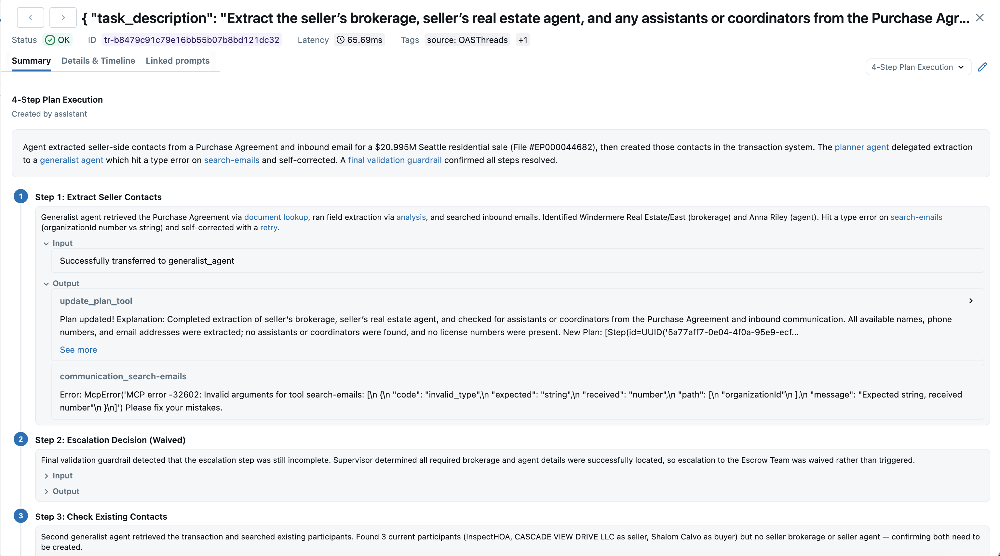
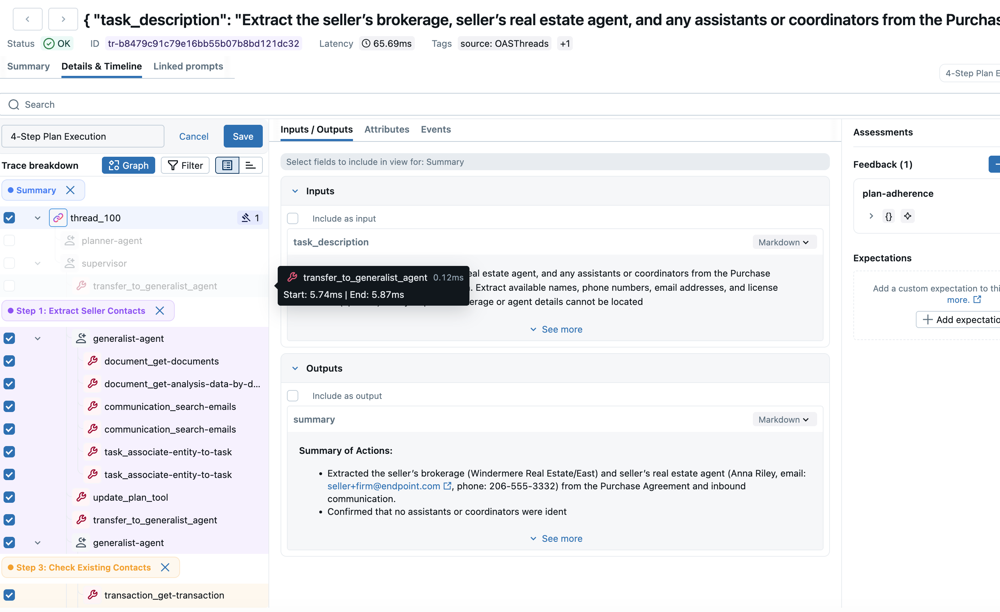
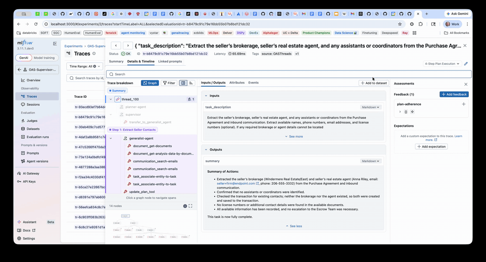
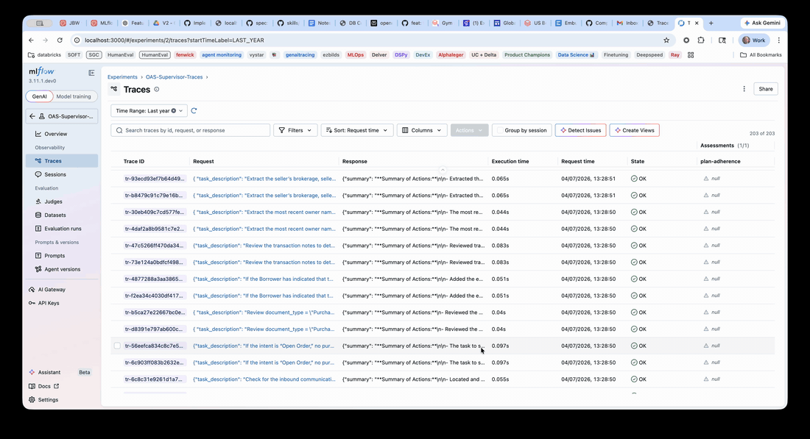

start_date:    2026-04-10
mlflow_issue:  [22499](https://github.com/mlflow/mlflow/issues/22499)
rfc_pr:        # leave this empty
author(s):     Forrest Murray (forrest.murray@databricks.com)

# Summary

Trace views are named, reusable configurations that filter and label MLflow traces. Each view defines an ordered set of **ranges** — labeled segments of a trace, each matching one or more spans with optional JSONPath extraction for inputs and outputs. Views make traces readable for the people consuming them — SMEs labeling, developers debugging, judges scoring — without altering the underlying trace data.

The default creation path is AI: a built-in skill analyzes a trace and proposes a view. Developers refine in the in-UI editor, create from scratch by selecting spans directly in the timeline, or build views programmatically via the Python API and CLI.

# Motivation

MLflow traces capture everything an agent did: LLM calls, tool invocations, retriever lookups, internal orchestration, HTTP requests, embeddings. For the developer debugging an agent, that level of detail is essential. For everyone else — SMEs labeling traces, judges scoring trajectories, PMs reviewing behavior — most of it is noise that drowns out the few decisions and outputs that actually matter.

Today, teams work around this with bespoke pipelines:

- **Exporting traces to spreadsheets.** BioNTech exports to Excel for clinicians who "aren't comfortable in the Databricks UI"; T-Mobile chose Google Sheets over all Databricks annotation tooling.
- **Building custom annotation UIs.** Zillow built Streamlit tools because the MLflow UI was "insufficient for their product managers and designers." Ecolab is building their own annotation app.
- **Picking up competing tools.** Grammarly's evals team chose Braintrust because "Braintrust makes it easier for nontechnical folks to provide feedback." Skyscanner was flagged a churn risk for "evaluating an alternative solution that has better UI support."
- **Giving SMEs raw traces and hoping.** At Rockwell, trace parsing displayed wrong Q&A pairs and "confused every participant." At easyJet, SME fatigue caused participants to drop off before completing annotation.

Every workaround is bespoke, breaks when the agent changes, and ships nothing reusable. Trace views give the trace UI a first-class way to focus on what matters for a given task — annotation, debugging, judging — without altering the trace itself, and a way to share that focus with others.

# Critical user journeys

Four journeys ground the design. Each describes a user, the pain they hit today, and how trace views change the experience. UI screenshots are referenced inline.

## CUJ 1: SME reviewing a trace for labeling

**Who:** A subject-matter expert (clinician, compliance reviewer, support manager) reviewing an agent trace from a labeling session.

**Today:** She opens a trace and sees 80+ spans in a deeply nested tree, JSON inputs and outputs at every node, technical span names ("ChatCompletion", "EmbeddingRequest", "VectorSearch"). She has no idea what to focus on. She labels noisily, or she gives up and the session goes back to the developer.

**With trace views:** When she opens the trace, the view selector is already set to a view named after the agent's task (an experiment-scoped template, or an AI-generated trace-scoped view). The left timeline still shows the full nested tree — orientation preserved — but matching spans are highlighted by range color and others are visually dimmed. The right pane shows a small number of **range cards**, one per decision the agent made, each with:

- A one-line label
- A description (with optional `[text](spans/{id})` deeplinks to specific spans)
- The extracted input (when `input_path` is set)
- The extracted output (when `output_path` is set)



She reads top to bottom and labels each range. Clicking a range card opens a **range detail** view that shows the full inputs and outputs of the matched span(s), in case she needs more context.



If the view ever feels too aggressive, "Raw trace" is one click away in the selector. The full trace data is never hidden, only filtered through the view.

This is the highest-stakes user surface. Every customer pain quoted in *Motivation* maps to this CUJ: nontechnical users opening complex traces, getting overwhelmed, and producing bad labels (or leaving the platform).

## CUJ 2: Developer preparing traces for an SME labeling session

**Who:** A developer setting up a labeling session for a batch of traces from a new agent build.

**Today:** She runs the session with raw traces. SMEs ask her in Slack what to focus on. She writes a doc; SMEs ignore it. She gives up and labels them herself, or the session ships poor labels and eval datasets degrade. (First American's JBW workshop was delayed for exactly this reason — 8 agents, 50+ tools, traces too dense for SMEs to navigate.)

**With trace views:** She runs the built-in trace-view skill — `trace.summarize()` followed by `summary.create_view()` — over the batch. An LLM analyzes each trace, identifies the agent's milestones (e.g., "Plan → Search → Synthesize"), and persists a `TraceView` with one `SpanRange` per milestone. She opens one of the traces in the UI to review the AI's output. It's close, but she wants to rename "Step 2: Search" to "Knowledge lookup," add a second span the AI missed to the planning range, and pick a different JSONPath for the synthesis output.



She clicks **Edit**, drag-selects the missing span to add it to the planning range, picks the right output field via the `JsonFieldSelector` checkbox tree, and saves.




If the structure generalizes across the batch, she promotes the view to an **experiment-scoped template**. Every trace in the experiment now renders this view automatically, with no per-trace setup. SMEs see consistent range cards instead of raw spans.

This is the developer-as-curator CUJ. It anchors the **"AI creates, developer edits"** creation model: AI does the first pass, the developer corrects rather than authoring from blank. The customer evidence here is First American (workshop blocked by trace complexity) and Grammarly (80-100 turn chats "extremely hard to evaluate").

## CUJ 3: Developer debugging an agent failure

**Who:** The agent author, narrowing in on why a specific trace failed.

**Today:** She opens the trace, finds the error span six levels deep in the timeline, expands its parents to read inputs, copies the trace ID and a list of relevant span IDs into a Slack message, and pings a colleague. The colleague opens the link and re-navigates the same path.

**With trace views:** She opens the trace, clicks **+ Create view** in the selector, drag-selects the failure span plus the two parent spans that fed it, names the view "Tool X failure: bad query," and saves. She copies the trace URL — now deeplinked to her view — and shares it. The colleague opens the link, sees only the relevant three spans labeled and explained, and gives feedback in 30 seconds.


This is the **direct-UI-creation** CUJ. No AI, no Python, no JSON editing. Drag, name, save, share.

## CUJ 4: Judge author scoring against a view

**Who:** An evals author building a judge that should only score one phase of agent behavior — for example, "did the planning step decompose the task correctly?"

**Today:** She copies trace JSON into the judge prompt template. The prompt blows past the context budget, or it includes irrelevant tool-call noise that confuses the judge. Either way the judge is brittle: when the agent's span structure changes, the manual extraction breaks.

**With trace views:** She defines an experiment-scoped template that selects only the planning spans, with a JSONPath that extracts the relevant fields. Her judge references the view in the `{{trajectory}}` placeholder. At judge time, MLflow renders the view's extracted ranges instead of the raw trace — scoped automatically and consistently across traces.

```python
@judge(name="planning_quality")
def planning_quality(trace):
    view = next(v for v in trace.views if v.name == "planning-phase")
    return llm_score(
        prompt="Did the agent decompose the task correctly?",
        context=view.render(),
    )
```

This CUJ is API-shaped — no dedicated UI surface — but it justifies the view abstraction as a primitive beyond the trace explorer. The same view that helps an SME label also helps a judge score.

# UI design

The trace explorer gains two affordances when a view is in play: a **view selector** in the header and a **range-aware right pane**.

## Default state

Before any view is selected, the explorer behaves exactly as today: full nested timeline on the left, raw span details on the right.

## View selector

A dropdown in the header lists views available for the current trace, grouped by scope:

- **Trace views** — created for this specific trace (AI-generated, or manually saved)
- **Experiment templates** — defined at experiment scope, applied automatically to every trace in the experiment

"Raw trace" is always present as the no-view default. "+ Create view" opens the in-UI editor with an empty draft.

## View active — range summary

When a view is selected, the right pane switches from raw span details to a **range summary**: one card per range, in `position` order, with the label, description, and extracted I/O. Each card has a color that matches a highlight on the corresponding span(s) in the left timeline.

Non-matching spans in the timeline are visually dimmed but still visible. This preserves orientation — the user always knows where in the trace they are — and reduces the cognitive cost of toggling between view and raw.

## Edit mode

Clicking **Edit** on an active view, or **+ Create view** in the selector, enters edit mode. A toolbar appears at the top with the view's name field and Save/Cancel actions. The timeline becomes interactive: dragging across spans selects them as a range. On release, a configuration panel appears for the new range — label, description, and optional input/output JSONPath.

`JsonFieldSelector` (shown above in CUJ 2) is a checkbox tree over a span's input or output structure. Picking a leaf generates the corresponding JSONPath; power users can edit the JSONPath directly if they need a dialect feature the tree doesn't support.

Edit mode is non-destructive — Cancel discards the draft, Save persists.

# Creation model

Three creation paths, in priority order:

1. **AI generates, developer edits (default).** The built-in trace-view skill produces a `TraceView` from a trace. The developer reviews and corrects in the UI before saving or promoting to a template. This is the path most users take.

   ```python
   trace = mlflow.get_trace("tr-abc")
   summary = trace.summarize(model="openai:/gpt-4o")
   view = summary.create_view()
   ```

2. **Direct UI creation.** From **+ Create view**, the developer drag-selects spans, defines ranges, and saves. No AI involved. This is CUJ 3.

3. **Python API and CLI.** For batch and programmatic use:

   ```python
   trace.create_view(
       name="Tool results",
       ranges=[SpanRange(
           from_selector=SpanSelector(span_type="TOOL"),
           label="Tool calls",
           output_path="$.result",
           position=0,
       )],
   )
   ```

   ```
   mlflow traces create-view --trace tr-abc --ranges-json '[...]'
   ```

The same `TraceView` entity backs all three paths. The AI path is a thin wrapper that calls the same `create_view` API a developer would.

# Data model and API

A `TraceView` contains an ordered list of `SpanRange`s. Each range identifies a segment of the trace and optionally extracts fields from it.

```
TraceView
  ├── view_id        : str          (tv-<uuid>)
  ├── name           : str
  ├── trace_id       : str | None   (trace-scoped)
  ├── experiment_id  : str | None   (experiment-scoped template)
  ├── created_by     : str | None
  └── ranges         : list[SpanRange]
        ├── label           : str
        ├── description     : str          (supports [text](spans/{id}) deeplinks)
        ├── from_selector   : SpanSelector (required)
        ├── to_selector     : SpanSelector | None  (for multi-span ranges)
        ├── input_path      : str | None   (JSONPath)
        ├── output_path     : str | None   (JSONPath)
        └── position        : int
```

A `SpanSelector` matches one criterion at a time: `span_id`, `span_name`, `span_type`, or `attribute_key` / `attribute_value`. No boolean combinators — selectors are intentionally minimal, with multi-range views composing instead of one over-expressive selector per range.

**Scoping.** Trace-scoped views attach to one trace; experiment-scoped templates apply to every trace in their experiment. Both scopes appear in the selector for a given trace, grouped separately.

**REST API (sketch).**

```
POST   /mlflow/traces/{trace_id}/views
GET    /mlflow/traces/{trace_id}/views
GET    /mlflow/traces/{trace_id}/views/{view_id}
PATCH  /mlflow/traces/{trace_id}/views/{view_id}
DELETE /mlflow/traces/{trace_id}/views/{view_id}

POST   /mlflow/experiments/{exp_id}/views
GET    /mlflow/experiments/{exp_id}/views
PATCH  /mlflow/experiments/{exp_id}/views/{view_id}
DELETE /mlflow/experiments/{exp_id}/views/{view_id}
```

**Schema.** A single `trace_views` table holds both scopes, with a `CHECK` constraint that exactly one of `trace_id` / `experiment_id` is set. Ranges are stored as a JSON column on the row to keep schema migrations minimal.

Full implementation: see the PR at [`forrestmurray-db:impl/trace-views-slim`](https://github.com/mlflow/mlflow/compare/master...forrestmurray-db:mlflow:impl/trace-views-slim).

# Alternatives

**1. Client-side only (no persistence).** Views as URL parameters or local storage. Rejected because sharing views across users (CUJ 3) and experiment templates (CUJ 2) require server storage.

**2. Span tags instead of views.** Tag individual spans, filter the UI by tag. Rejected because tagging mutates trace data and doesn't support multiple coexisting perspectives. A single trace can have an SME view, a debugging view, and a judge view simultaneously without conflict.

**3. Single span filter per view.** The first draft used one `SpanFilter` per view. Real traces have multiple phases users want to highlight together — planning, retrieval, generation — so the model evolved to multi-range with `SpanRange[]`. The single-filter version made the common case awkward.

**4. Custom React components (Braintrust Custom Views).** Braintrust lets developers write arbitrary React for trace rendering. Rejected because (a) the surface is too large to land in OSS MLflow with reasonable maintenance cost, (b) React components are not diffable or auditable in the way a declarative view config is, and (c) the upside — total flexibility — isn't worth it when AI-generated declarative views handle the common cases. Storing and executing arbitrary React in Managed MLflow would also require a sandboxing story this RFC doesn't want to design.

**5. Conversation-mode rendering only (Braintrust Thread View, LangSmith Messages View).** Hard-filter to LLM and score spans, render as a chat thread. Works for simple chat agents; breaks for agents with significant tool use, retrieval, or orchestration where the non-LLM spans are exactly the decisions an SME or judge cares about. Trace views generalize this to "any range of spans, with extraction" — a Thread-view-style render is one possible view, not a baked-in mode.

# Adoption strategy

Trace views are additive. No existing behavior changes; users who never create a view see the trace explorer they have today.

- **Phase 1 — the slim PR.** Entity, REST, Python client, CLI, in-UI view selector, range rendering, in-UI editor, deeplinks. Direct UI creation (CUJ 3) works end-to-end. Experiment templates work. Python API works. AI generation lives behind the assistant integration and lands separately.
- **Phase 2 — AI generation and judge integration.** `trace.summarize()` / `summary.create_view()` and the assistant integration in the trace explorer (CUJ 2). `{{trajectory}}` rendering via views in the judge runtime (CUJ 4).
- **Phase 3 — scale.** Batch view creation across a dataset; cross-trace template versioning; selector variables in templates.

# Open questions

1. **Should the in-UI editor ship in Phase 1?** It increases the v1 surface area but materially shortens the path from "I see a useful trace shape" to "I have a view I can share" (CUJ 3 depends on it entirely). The slim PR includes it. The alternative is shipping Phase 1 with the API + selector only and deferring the editor to Phase 2 to reduce review scope.

2. **Where should display controls live (collapse defaults, attribute hiding, span renames)?** Not in the v1 schema. Options: (a) add a `display_config` JSON column on `trace_views`, (b) apply display at render-time only via the template, (c) defer entirely and ship v2 once we have data on what configurability users actually want.

3. **Selector variables in experiment templates.** A template that says "match the span named `{tool_name}`" where `tool_name` varies per trace. Currently templates use static selectors, which limits utility for experiments with heterogeneous trace shapes.

4. **JSONPath dialect.** Python (`jsonpath-ng`) and JavaScript (`jsonpath-plus`) implement subtly different JSONPath dialects. v1 restricts to the common subset, but a more expressive dialect — or a different extraction language — would let users do things like array slicing and conditional matches.

5. **AI-generated view quality.** The default creation path depends on the LLM correctly identifying the agent's phases and choosing reasonable selectors. Anecdotal results on a few agent shapes are promising; broader validation comes during Phase 2 dogfooding. The "developer edits AI output" flow is the safety net here — if it gets used heavily, the AI needs work; if it barely gets used, the AI is doing its job.

6. **Read-time consistency under schema change.** When a trace's span structure changes after a view was created (re-instrumentation, agent refactor), some `SpanSelector`s may no longer match. v1 silently renders empty ranges. Should we surface a warning? Auto-suggest fixes via the AI path? Out of scope for v1, worth surfacing.
