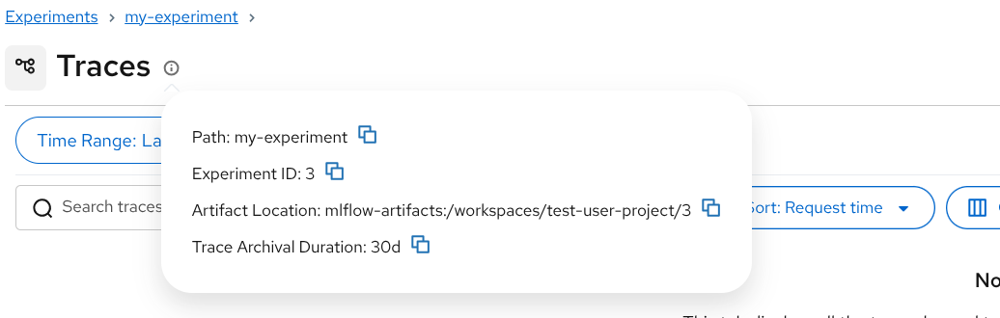

## MLflow OSS Design Template: Trace Data Archival from DB to Artifact Storage

| Author(s)                      | Edson Tirelli, Matt Prahl |
| :----------------------------- | :------------------------ |
| **Date Last Modified**         | 2026-04-23                |
| **AI Assistant(s)**            | Claude Code, Cursor       |

## Intro

MLflow Tracing currently stores all span data (the full JSON content of each span) in the tracking database alongside trace metadata. While this approach supports real-time ingestion and SQL-based search, it becomes a significant cost and performance concern at scale—span content can be very large (up to 4 GB per span in MySQL) and dominates database storage. This proposal introduces the ability for the server to archive span data from the database into an archival repository, retaining lightweight metadata in the DB for search while moving bulk span content to cheaper, scalable object stores. The design also introduces configurable retention policies so admins can automatically manage trace lifecycle based on age.

## Feature Request Information

**GitHub Issue:** [mlflow/mlflow#20574](https://github.com/mlflow/mlflow/issues/20574) — _\[FR\] Support archiving spans into artifact from DB for cost optimization_

When trace volume is large, storing complete span data in the tracking database (PostgreSQL, MySQL, SQLite) becomes expensive. The database must handle:

- **Storage costs:** The `spans.content` column (TEXT/LONGTEXT) stores full OTel span JSON, which can be orders of magnitude larger than the metadata columns.
- **Write amplification:** Each span creates a row with potentially large content, stressing DB write throughput.
- **Backup overhead:** Database backups grow linearly with span content, increasing operational burden.

Users need the ability to offload span content to a cheaper archival repository (e.g. S3, GCS, Azure Blob, local filesystem; optionally the same storage as artifacts) while retaining searchable metadata in the database.

## Requirements

- The feature **must** allow users to configure a separate archival repository location for trace span data
  - This configuration **must** be available as both a `mlflow server` CLI option and environment variable
  - This configuration **can** be set globally, but **must** respect per-workspace overrides (stored in the `workspaces` table; see schema changes below)
- The feature **must** support archiving span content from the DB to the archival repository based on configurable retention policies
  - Retention policies **must** be set globally; they **may** be overridden per workspace or per experiment
  - The effective retention for a given experiment **must** be resolved from server, workspace, and experiment settings
  - If an experiment retention is shorter than the broader-scope retention, the shorter experiment value **must** always be honored
  - If an experiment retention is longer than the broader-scope retention, the server **must** expose an environment-variable allowlist of experiment IDs whose longer retention values may be honored
  - Experiments not present in that allowlist **must** use the broader-scope retention instead of their longer experiment-level value
  - Per-experiment retention **may** be stored as an experiment tag `mlflow.trace.archivalRetention` with a defined schema where the `value` field uses the duration grammar `<int><unit>`, with `<unit>` one of `m`, `h`, or `d` (e.g. `{"type": "duration", "value": "30d"}`)
  - The archival process **must** support a time-based policy expressed as an age duration or cutoff timestamp (for example, archive traces older than `30d` or `12h`)
  - The archival process **must** run automatically as a periodic server-side job using the existing MLflow job mechanisms
  - The archival scheduler interval **must** be configurable by the admin and **should** default to a reasonable fixed interval such as every 5 minutes
  - The server **must** provide a configuration switch to disable the trace archival scheduler on a given MLflow instance
  - The feature **must** support an experiment tag `mlflow.trace.archiveNow` whose value is a JSON object; the object may include an optional `older_than` field using the same duration grammar, and it causes the experiment to be archived on the next scheduler pass ahead of ordinary policy-based archival work
  - Because this uses normal experiment-tag mutation semantics, any user who can edit experiment tags may set it; this is acceptable because it archives span content without deleting trace records, archived traces remain retrievable, and trace metadata stays searchable
  - When MLflow's Prometheus exporter is enabled, the archival scheduler **should** publish high-level archival metrics through the existing `/metrics` endpoint
  - The archival scheduler **should** emit a summary log message for each pass (for example, archived X traces in Y minutes)
  - The feature **must** mark malformed traces as not archivable, surface that state to users via trace metadata, and exclude those traces from automatic retries until manual intervention clears the failure marker
  - The feature **must** prevent concurrent DB-backed span writes from racing with archival in a way that leaves a trace in a mixed state. If a race occurs, the system **must** resolve it so that either the write wins and archival retries or abandons finalization for that pass, or archival wins and the competing write is rejected or rolled back
- The feature **must** store archived span data in OTLP-compatible protobuf format (`TracesData` message)
- The feature **must** maintain backward compatibility
  - Retrieving an archived trace **must** transparently fetch span data from the archival repository
  - Search/filter on trace metadata **must** continue to work for archived traces
  - The `search_traces` and `get_trace` APIs **must** be unaffected from the caller's perspective
- The feature **must** support the following repository backends (S3, GCS, Azure, local; similar to the supported integrations for artifact storage)
- The feature **should** record the storage location of span data in trace metadata so retrieval is transparent

### Out of Scope

- **Span-level attribute search on archived traces (JSON attributes):** Once span content is moved to the archival repository, SQL-based filtering that depends on the raw span payload in `spans.content` (e.g., `span.attributes.*`) will not be supported for archived traces. Column-backed span filters that use indexed span metadata (e.g., `span.type`, `span.status`, `span.duration_ns`) will continue to work as long as span rows and these columns are retained in the DB. Trace-level metadata search (timestamp, state, tags, trace metrics) will continue to work.
- **Restoring archived traces to the database:** Re-ingesting archived span data from the archival repository back into the tracking database is deferred to a future phase. See [Future Enhancements: Trace Restore](#trace-restore-from-archive-to-database) for the planned approach.

## Proposal Sketch

### Why

MLflow's tracing adoption is growing rapidly, especially in GenAI/LLM observability workflows. A single LLM application can generate thousands of traces per day, each containing multiple spans with large input/output payloads. Storing all of this data in a relational database is:

1. **Expensive:** Managed database storage (RDS, Cloud SQL, Azure SQL) costs significantly more per GB than object storage (S3, GCS, Azure Blob).
2. **Operationally burdensome:** Large databases require more frequent backups, more careful capacity planning, and more expensive instance types.
3. **Unnecessary for historical data:** Users typically need real-time search only for recent traces. Older traces are accessed infrequently and primarily for debugging or auditing.

### What Problem Does This Solve

This proposal directly addresses the cost and performance gap between "hot" (recent, actively searched) and "cold" (historical, rarely accessed) trace data. By introducing a tiered storage model—database for hot data, archival repository for cold data—users can dramatically reduce database costs while retaining full trace history.

### Alternatives and Workarounds

1. **Manual database cleanup:** Users can run `mlflow gc` or `DELETE` queries to remove old traces, but this permanently loses data.
2. **External ETL pipelines:** Users can build custom scripts to export traces to Parquet/JSON and delete from DB, but this is error-prone and not integrated with MLflow's retrieval APIs.
3. **Database partitioning:** Some databases support table partitioning by time, which can help with performance but doesn't reduce storage costs or move data to cheaper storage.

### Breadth of Need

This serves a broad need. Any user running MLflow Tracing at moderate-to-large scale (>1000 traces/day) will benefit from cost-optimized storage. The feature aligns with MLflow's existing pattern of separating metadata storage (backend store) from bulk data storage (archival repository; may share backend with artifact store), already established for run artifacts.

### Example Configuration

#### CLI: Configure Archival Repository

```bash
# Start server with a dedicated archival repository
mlflow server \
  --backend-store-uri postgresql://localhost/mlflow \
  --artifacts-destination s3://mlflow-artifacts/ \
  --trace-archival-location s3://mlflow-traces/ \
  ...
```

#### CLI: Configure Experiment Retention

```bash
# Set archival retention when creating an experiment
mlflow experiments create \
  --experiment-name exp-fast \
  --trace-archival-retention 30d

# Update archival retention on an existing experiment
mlflow experiments update \
  --experiment-id 42 \
  --trace-archival-retention 12h

# Mark an experiment for priority archival on the next scheduler pass
mlflow experiments update \
  --experiment-id 42 \
  --trace-archive-now

# Mark only traces older than 1 day in an experiment for priority archival
mlflow experiments update \
  --experiment-id 42 \
  --trace-archive-now-older-than 1d
```

#### Policy Resolution Example

Retention durations use the grammar `<int><unit>`, where `unit` is one of `m`, `h`, or `d`. Examples include `30d`, `7d`, and `12h`. The same representation should be used consistently across server, workspace, and experiment retention settings.

Assume the server default retention is `30d`, workspace `team-a` overrides to `14d`, and experiment `exp-fast` sets `7d`. That experiment archives at `7d`.

If experiment `exp-long` sets `90d`, the effective retention depends on whether its experiment ID is present in the server's `MLFLOW_TRACE_ARCHIVAL_LONG_RETENTION_ALLOWLIST` environment variable:

- If `exp-long` is allowlisted, it archives at `90d`
- If `exp-long` is not allowlisted, the broader-scope retention is enforced and it archives at `14d`

| Broader scope | Experiment | Allowlisted? | Effective retention |
| :------------ | :--------- | :----------- | :------------------ |
| `30d`         | unset      | n/a          | `30d`               |
| `30d`         | `7d`       | n/a          | `7d`                |
| `30d`         | `90d`      | yes          | `90d`               |
| `30d`         | `90d`      | no           | `30d`               |

If a user with permission to edit experiment tags sets `mlflow.trace.archiveNow = {}` on an experiment, that experiment is processed on the next scheduler pass before ordinary retention-based archival work. If the user instead sets `mlflow.trace.archiveNow = {"older_than": "1d"}`, the emergency pass only targets traces in that experiment older than the requested threshold. The tag is cleared after the server successfully processes that emergency archival pass. If the pass fails, the tag remains so the next scheduler pass can retry it.

#### UI: Surface Resolved Retention

Because retention inheritance is implicit, the server should compute the resolved trace archival retention for each experiment and surface it through the get and list experiments APIs. The experiment UI should display that resolved value so users can see which retention is actually in effect, even when the final answer comes from server or workspace configuration rather than from an experiment tag.

The experiment info popover shown below is a reasonable place to surface a field such as `Resolved trace archival retention: 14d`.



## Decision Matrix

| Proposals                                                | Storage Efficiency | Search Capability                | Backward Compat. | Implementation Effort | Standards Compliance |
| :------------------------------------------------------- | :----------------- | :------------------------------- | :--------------- | :-------------------- | :------------------- |
| **Option 1: Tiered storage with OTLP protobuf archival** | Medium to High     | High (trace + column-based span) | Yes              | Moderate              | High (OTLP standard) |
| Option 2: Database partitioning + cold table             | Low                | High (SQL on cold table)         | Yes              | High                  | Low (custom format)  |

- **Storage Efficiency:** How much does the approach reduce database storage costs?
- **Search Capability:** Can users still search/filter on trace metadata after archival?
- **Backward Compat.:** Do existing APIs continue to work without changes?
- **Standards Compliance:** Does the storage format follow an existing standard (OTel, OTLP)?

## Decision details

### Option 1 (Recommended): Tiered Storage with OTLP Protobuf Archival

We propose a tiered storage model: trace span content is stored in the database for a configurable retention window, then archived to the archival repository in OTLP protobuf format. Trace metadata remains in the database permanently; retrieval and retention policies apply as described below. The archival repository layout, OTLP protobuf format for span data, and transparent retrieval via `get_trace` / `search_traces` are all part of this design.

The key insight is that the `spans.content` column dominates database storage, while the metadata columns (`trace_info`, `trace_tags`, `trace_request_metadata`, `trace_metrics`, `span_metrics`) are compact and valuable for search. By archiving only the span content, we achieve maximum storage savings with minimal impact on functionality.

#### Storage Format: OTLP Protobuf (`TracesData`)

The [OpenTelemetry specification](https://github.com/open-telemetry/opentelemetry-proto/blob/main/opentelemetry/proto/trace/v1/trace.proto) defines a `TracesData` message explicitly designed for persistent storage:

> _"TracesData represents the traces data that can be stored in a persistent storage, OR can be embedded by other protocols that transfer OTLP traces data but do not implement the OTLP protocol."_

MLflow already bundles the OTel protobuf definitions at `mlflow/protos/opentelemetry/proto/trace/v1/trace.proto` and has full serialization support via `Span.to_otel_proto()` and `Span.from_otel_proto()`. Using `TracesData` as the archival format:

- **Leverages existing code:** MLflow already converts between internal span representation and OTel proto.
- **Follows the standard:** `TracesData` is the OTel-recommended message for persistent storage, distinct from the wire protocol's `ExportTraceServiceRequest`.
- **Efficient encoding:** Protobuf binary encoding is ~3–10x more compact than equivalent JSON, with faster serialization/deserialization.
- **Interoperable:** Archived traces can be read or exported by any OTel-compatible tool.

**File layout in archival repository:**

```
<archive-root>/
└── <experiment_id>/
    └── traces/
        └── <trace_id>/
            └── artifacts/
                └── traces.pb          # TracesData protobuf binary
```

Each `traces.pb` file contains a single `TracesData` message with all spans for that trace. This enables efficient per-trace retrieval.

**Current OSS behavior:** In the current open-source version of MLflow, traces are always written to the database. The server persists the trace record and span content in the tracking store (e.g. `SqlAlchemyStore`); span location is `TRACKING_STORE` and full trace/span data is stored in the DB.

**Existing trace artifact upload path (V3 / artifact-backed traces):** When a trace is created (e.g. via the MLflow V3 exporter in `mlflow/tracing/export/mlflow_v3.py` or the inference-table exporter), the server creates the trace record in the tracking store and sets a tag `MLFLOW_ARTIFACT_LOCATION` on the trace with the URI where trace artifacts should be stored. That URI is the experiment's artifact location plus `/traces/<trace_id>/artifacts/` (see `SqlAlchemyStore._get_trace_artifact_location_tag`). The **client** then uploads the full trace payload as a single JSON file named `traces.json` to that URI using the artifact repository (`ArtifactRepository.upload_trace_data` in `mlflow/store/artifact/artifact_repo.py`). The client uses `get_artifact_uri_for_trace(trace_info)` from `mlflow/tracing/utils/artifact_utils.py` to resolve the URI from the trace's tags and performs the upload; when not in proxy mode, the client therefore needs credentials for the artifact store. When the UI or API needs full trace data, the same URI is used to download `traces.json` and parse it. The same trace artifact root is also used for trace attachments (`attachments/<attachment_id>`). This path is used when the server marks the trace's span location as `ARTIFACT_REPO` (via the `mlflow.trace.spansLocation` tag), so span content is read from the artifact store rather than the DB. This mechanism exists in OSS today and coexists with DB-backed span storage (e.g. spans written via `log_spans`).

**Relationship to the proposed archival:** Today there are already two trace storage paths in OSS: (1) DB-backed spans written via `log_spans` (span content in the `spans` table), and (2) artifact-backed `traces.json` payloads uploaded by V3-style exporters to the artifact repository. The proposed archival mechanism is a third, separate path: it stores span content in OTLP protobuf format at a configurable archival repository (`--trace-archival-location`), which may or may not be the same as the artifact store. The proposed `traces.pb` archival is for offloading span content from the DB for traces that were initially written there via the DB-backed path. These three mechanisms can coexist.

#### Database Schema Changes

**Use the existing `SpansLocation` tag.** MLflow already stores where span data lives via the tag `TraceTagKey.SPANS_LOCATION` = `"mlflow.trace.spansLocation"` (see `mlflow/tracing/constant.py`). The enum `SpansLocation(str, Enum)` currently has `TRACKING_STORE` and `ARTIFACT_REPO`. Extend it with one new value for archival:

- **`TRACKING_STORE`** (existing): Span content is in the `spans` table (current behavior). Traces remain in this state until successfully archived to the archival repository (or artifact repo).
- **`ARCHIVE_REPO`** (new): Span content has been archived to the archival repository. The `spans.content` column is cleared for archived traces; span metadata rows are retained for index-based filtering. Retrieval loads span data from the archival repository.
- **`ARTIFACT_REPO`** (existing): Retained for existing behavior (e.g. V3 API traces whose spans are stored in the artifact store). Distinct from `ARCHIVE_REPO` for the proposed OTLP archival repository.

**Use a per-trace DB-backed payload generation.** This coordination is needed because archival is no longer just a single final state flip. The server must first select the trace and snapshot its current DB-backed payload generation, then read the DB-backed spans it intends to archive, then upload `traces.pb`, and only then decide whether it may finalize. Each successful DB-backed write that changes the DB-backed trace payload must atomically advance this generation so archival finalization can detect whether the payload changed after it was selected. A DB-backed write must only succeed while the trace still remains DB-backed.

Add a `db_payload_generation` column on `trace_info` (or an equivalent per-trace generation field) for this purpose, logically defaulting to `0`. This generation is MLflow-internal coordination state for DB-backed traces and is not part of the archived OTLP `TracesData` payload. It tracks the generation of the DB-backed span payload, and any DB-backed trace state derived from `log_spans()` writes, while the trace is in `TRACKING_STORE`; unrelated metadata changes and archival's own `SpansLocation` transition do not need to advance it.

```python
def upgrade():
    with op.batch_alter_table("trace_info", schema=None) as batch_op:
        batch_op.add_column(
            sa.Column("db_payload_generation", sa.Integer(), nullable=False, server_default="0")
        )


def downgrade():
    with op.batch_alter_table("trace_info", schema=None) as batch_op:
        batch_op.drop_column("db_payload_generation")
```

Traces therefore stay durably in `TRACKING_STORE` until archival completes. On success, the server sets `SpansLocation=ARCHIVE_REPO`; if the generation has advanced or another retryable conflict occurs, the server abandons finalization for that pass, cleans up any unreferenced uploaded payload, and leaves the trace in `TRACKING_STORE` for retry.

Archived traces should use a **separate trace tag** such as `mlflow.trace.archiveLocation` to record the archival repository URI for `traces.pb`. The existing `mlflow.artifactLocation` tag must continue to point at the trace's ordinary artifact root so that existing artifact-backed traces and trace attachments keep working unchanged. The `mlflow.trace.spansLocation` tag then identifies which location to use for span payload retrieval: `ARTIFACT_REPO` uses `mlflow.artifactLocation`, while `ARCHIVE_REPO` uses `mlflow.trace.archiveLocation`. Implementations may stage the archive URI while archival is in progress, but it becomes authoritative for payload retrieval only once `mlflow.trace.spansLocation=ARCHIVE_REPO`. The **effective archival repository root** for a given trace is the workspace's `trace_archival_location` when set, otherwise the server's global `--trace-archival-location` (or default artifact root).

**Workspaces table: per-workspace archival repository and retention overrides.** Add a column to the `workspaces` table to store an optional trace archival location (server-side configuration) for each workspace. When set, it overrides the server's global archival repository for that workspace (for both archival write and retrieval). This supports multi-tenant deployments where different workspaces use different trace storage locations.

Add a second nullable workspace-level field for the workspace retention override (for example `trace_archival_retention`). When unset, the workspace inherits the server-level retention. The workspace retention field should use the same retention representation as the experiment-level retention tag `mlflow.trace.archivalRetention`.

```sql
ALTER TABLE workspaces
ADD COLUMN trace_archival_location TEXT NULL;

ALTER TABLE workspaces
ADD COLUMN trace_archival_retention TEXT NULL;
```

- **Semantics:** `trace_archival_location` overrides the server archival repository root for that workspace; otherwise the server-level location is used.
- **Retention:** `trace_archival_retention` overrides the server retention for experiments in that workspace; otherwise the server retention is used.
- **Existing workspaces:** Existing rows may remain NULL for both fields, in which case they inherit server defaults and require no backfill.

**NOTE:** archived trace URL resolution follows the same semantics as for artifact location on workspaces. When `--trace-archival-location` is unset, the default archival root is the server's effective artifact storage location; the default workspace path is `<archive-root>/workspaces/<workspace name>`.

Configuring the per-workspace archival repository and retention overrides will require adding **`trace_archival_location`** and **`trace_archival_retention`** parameters (or equivalent names) in:

- **Python API:** `mlflow.create_workspace()` and `mlflow.update_workspace()` (and the corresponding `MlflowClient` methods) must accept optional `trace_archival_location` and `trace_archival_retention` arguments; when provided, they are persisted to the workspace record. Add fields to the Workspaces base class as well.
- **REST API:** The CreateWorkspace and UpdateWorkspace request messages (and responses) must include optional `trace_archival_location` and `trace_archival_retention` fields so that clients can set or clear the workspace-level archival repository URI and retention when creating or updating a workspace.
- **UI:** The create-workspace and edit-workspace flows must include fields for the optional trace archival location and trace archival retention so that admins can configure them when creating or updating a workspace.
- **Experiment APIs:** The get and list experiments APIs must include a resolved trace archival retention value computed on the server from the server, workspace, and experiment settings.
- **UI (experiments):** The experiment details UI should display the resolved trace archival retention value returned by the server so inherited policy is visible to users.

#### Archival Process

Archival is a server-owned periodic job, not a client-triggered workflow. A Huey task runs on an admin-configurable interval, with a reasonable default such as every 5 minutes, and performs archival using the server's own configured backend store, archival repository, and policy settings.

At the start of each scheduler pass:

1. **Resolve the workspaces to inspect:** If workspaces are enabled, collect the configured workspaces and randomize their order for the pass to improve fairness across workspaces.
2. **Process emergency archival first:** Check each workspace for experiments marked with the experiment tag `mlflow.trace.archiveNow` and process those experiments before ordinary retention-based work. When the tag value is `{}` or otherwise omits `older_than`, all traces in `TRACKING_STORE` for that experiment are eligible. When the tag value includes `older_than`, only traces older than that threshold are eligible.
3. **Resolve the effective retention policy:** For each experiment considered for normal archival, resolve retention from server, workspace, and experiment settings using the inheritance rules described above.
4. **Select traces to archive:** Query `trace_info` for traces older than the effective threshold whose `mlflow.trace.spansLocation` tag is `TRACKING_STORE` (or missing, treated as `TRACKING_STORE`).
5. **Snapshot each trace for archival:** Before reading the DB-backed spans to archive, verify the trace is still actionable and snapshot its current DB-backed payload generation from `db_payload_generation`, defaulting to `0`. If the trace is no longer actionable, skip it.
6. **Export span content for the snapped generation:** Read all DB-backed spans for the selected trace, convert them to `TracesData` protobuf, and write to the archival repository. The archival repository root used for the write is the workspace's `trace_archival_location` (if set) for that trace's experiment/workspace, else the server's global trace archival location.
7. **Finalize archival via an atomic conditional transition:** In one committed transaction or equivalent atomic compare-and-set / serialized critical section, publish the archived payload as authoritative, clear DB-backed span content, set `mlflow.trace.archiveLocation`, and update the trace's span-location state to `SpansLocation.ARCHIVE_REPO` only if the trace is still DB-backed and its current `db_payload_generation` still matches the snapped generation. If that conditional transition does not succeed, abandon finalization for that pass, clean up any unreferenced uploaded payload, and leave the trace in `TRACKING_STORE` for retry.
8. **Clear the emergency tag:** If the archival was triggered by `archive now` and the emergency archival pass completes successfully, clear the tag so it behaves as a one-shot failsafe.

Concurrent DB-backed writes and archival must not leave a trace in a mixed state. Successful DB-backed writes that change the DB-backed span payload, or DB-backed trace state derived from those spans, must commit those changes and the `db_payload_generation` advance in the same transaction (or equivalent atomic write batch), and they must fail or roll back if the trace is no longer DB-backed at commit time. Archival's own `SpansLocation` and archive-location updates do not need to advance `db_payload_generation`. If a race occurs, the system must resolve it so that either the write commits first and archival later detects the generation or state change and retries or abandons finalization for that pass, or archival finalization commits first and the competing DB-backed write fails because the trace is no longer DB-backed.

**Crash recovery:** Traces remain durably in `TRACKING_STORE` until step 7 completes. If the process crashes after step 5 but before step 7, the next archival pass may select the same trace again, snapshot its then-current `db_payload_generation`, re-export the payload (overwriting the file), and then attempt step 7 again. Re-running on traces already in `ARCHIVE_REPO` is a no-op (they are not candidates). On retryable failure paths, the trace simply remains in `TRACKING_STORE` for a later pass to retry. If an emergency-tagged experiment does not complete successfully, the tag should remain so a later scheduler pass retries the emergency archival, unless the only remaining non-archived traces are terminal failures marked with `mlflow.trace.archivalFailure`.

**Malformed traces / terminal archival failures:** Some traces may fail archival because their stored span content cannot be converted into valid `TracesData` (for example malformed JSON or invalid span structure). These traces are not archivable. When this happens, the scheduler must leave the trace in `TRACKING_STORE`, set `mlflow.trace.archivalFailure=MALFORMED_TRACE`, and exclude that trace from automatic retries until manual intervention clears that failure field. If an emergency archival pass encounters only terminal failures after exhausting all archivable traces, the server should clear `mlflow.trace.archiveNow` because no further automatic progress is possible. This gives users visibility through normal trace APIs and UI rather than only through server logs.

**Scheduler overlap:** The periodic archival task should follow MLflow's existing lock-based periodic job pattern. If a previous archival pass is still running when the next scheduled invocation fires, the new invocation is skipped rather than starting a concurrent scheduler pass.

The archival is performed in batches to avoid locking the database for extended periods, and implementations may use bounded concurrency within a pass if needed.

**Multi-replica deployments:** When running multiple MLflow replicas, operators should not enable the archival scheduler on every replica unless they have Huey locks through a shared Redis or other coordination system. The server should expose a configuration switch (for example an environment variable) to disable the trace archival scheduler on instances that should not run it.

**Operational visibility:** When MLflow's Prometheus exporter is enabled, the scheduler should publish high-level archival metrics through the existing `/metrics` endpoint. The scheduler should also emit a summary log message for each pass, for example that it archived X traces in Y minutes, so operators can quickly understand progress without querying metrics first.

#### Retrieval Changes

Retrieval of archived trace data uses a **handler-based dispatch** pattern. The tracking store (`SqlAlchemyStore`) attempts to load spans from the database; when the trace's `SpansLocation` tag indicates the spans are not in the DB (e.g. `ARCHIVE_REPO`), the store raises an `MlflowTracingException`. The server handler catches this and dispatches to the appropriate loader based on the `SpansLocation` tag value. A shared `load_archived_spans()` function in `mlflow/tracing/archive_repo.py` resolves the artifact URI from the store and downloads the `traces.pb` file from the archival repository.

The `AbstractStore` provides a `get_archival_repository_artifact_uri(trace_info)` method that concrete stores implement to resolve the archival repository URI for a given trace. The dispatch logic lives in the server handler layer rather than the store, keeping the store layer focused on DB operations and archival primitives.

```python
# Server handler (mlflow/server/handlers.py) — retrieval dispatch:
trace_data = _fetch_trace_data_from_store(store, request_id)
if trace_data is None:
    trace_info = store.get_trace_info(request_id)
    spans_location = trace_info.tags.get(TraceTagKey.SPANS_LOCATION)
    if spans_location == SpansLocation.ARCHIVE_REPO.value:
        spans = load_archived_spans(store, trace_info)
        trace_data = TraceData(spans=spans).to_dict()
    if trace_data is None:
        trace_data = _get_trace_artifact_repo(trace_info).download_trace_data()


# Archival repository loader (mlflow/tracing/archive_repo.py):
def load_archived_spans(store, trace_info: TraceInfo) -> list[Span]:
    uri = store.get_archival_repository_artifact_uri(trace_info)
    artifact_repo = get_artifact_repository(uri)
    return artifact_repo.download_trace_data_pb()
```

**Impact on `search_traces`:** Today, `search_traces` supports both trace-level filters (timestamp, state, tags, metrics) and span-level filters (`span.name`, `span.type`, `span.status`, `span.duration_ns`, `span.attributes.*`, etc.). Span-level filters fall into two categories:

- **Column-based span filters** such as `span.name`, `span.type`, `span.status`, and `span.duration_ns` filter against dedicated columns on the `spans` table. Because archival retains span rows and these metadata columns while only clearing/moving `spans.content`, these filters continue to work for archived traces.
- **JSON-based span filters** such as `span.attributes.*` rely on data stored inside the `spans.content` JSON blob. After archival, `spans.content` is no longer populated in the DB for archived traces, so these filters no longer match archived traces.

The implementation must handle this gracefully:

- When a query contains **only trace-level filters**, archived traces are included in results as usual.
- When a query contains **only column-based span-level filters**, archived traces are still included in results, since the relevant span metadata remains in the DB.
- When a query contains **any JSON-based span-level filters** (e.g. `span.attributes.*`), archived traces (where `mlflow.trace.spansLocation` = `ARCHIVE_REPO`) are effectively excluded from results, because the SQL predicates referencing `spans.content` cannot match for those traces.

For `batch_get_traces`, the implementation should partition trace IDs by `SpansLocation` tag value: batch-read DB spans for `TRACKING_STORE` traces, and fetch from the archival repository (potentially in parallel) for `ARCHIVE_REPO` traces.

#### Server Configuration

**New CLI option:**

```
--trace-archival-location URI             Destination URI for the archival repository (trace span data).
                              If not specified, traces use the server's effective artifact storage location
                              (for example --artifacts-destination when configured).
                              Can be overridden per workspace via workspaces.trace_archival_location.
                              Supports the same repository backends as artifacts (S3, GCS, Azure, etc.)
                              Env var: MLFLOW_TRACE_ARCHIVAL_LOCATION
```

The server also owns the default archival retention and the allowlist used when an experiment requests a longer retention than the broader-scope policy. The exact option names do not need to be fixed in this RFC, but the design requires:

- a server-level default retention
- a server-level scheduler interval
- a server-level switch to enable or disable the trace archival scheduler on that instance
- a server-level environment-variable allowlist of experiment IDs whose longer retention values may exceed broader-scope retention
- by default the allowlist is empty, so broader-scope retention is enforced
- a workspace-level retention override
- an experiment-level retention override

Using an environment variable keeps phase 1 simple, but it means changing the allowlist requires a server restart. A follow-up can move this exemption into an experiment-scoped database column that only admins may set.

Although archival execution is server-owned, the CLI should still expose experiment-level retention configuration under `mlflow experiments`. Specifically, `mlflow experiments create` and `mlflow experiments update` should accept `--trace-archival-retention <duration>`, where `<duration>` follows the `<int><unit>` grammar described above. In addition, `mlflow experiments update` should accept `--trace-archive-now` as a convenience flag that sets `mlflow.trace.archiveNow={}` on the experiment, and `--trace-archive-now-older-than <duration>` as a convenience flag that sets `mlflow.trace.archiveNow` to a JSON object with an `older_than` field. These flags do not execute archival directly; they only mark the experiment for priority processing on the next scheduler pass.

**New environment variables:**

| Variable                         | Description                                                                                                                               | Default                           |
| :------------------------------- | :---------------------------------------------------------------------------------------------------------------------------------------- | :-------------------------------- |
| `MLFLOW_TRACE_ARCHIVAL_LOCATION` | Global destination URI for the archival repository (trace span storage). Overridable per workspace via `workspaces.trace_archival_location`. | Same as the server's effective artifact storage location |
| `MLFLOW_ENABLE_TRACE_ARCHIVAL_SCHEDULER` | Enables the trace archival scheduler on the current MLflow instance. Useful in multi-replica deployments so only selected replicas run the scheduler. | `true` |
| `MLFLOW_TRACE_ARCHIVAL_LONG_RETENTION_ALLOWLIST` | Comma-separated experiment IDs whose longer-than-broader `mlflow.trace.archivalRetention` values may be honored. Changing this value requires a server restart in phase 1. | empty |

#### Strengths

- Maximizes cost savings by moving the largest data (span content) to cheap object storage while retaining compact, searchable metadata in the DB
- Follows the OTel `TracesData` standard for archival format, ensuring interoperability
- Fully backward compatible—existing APIs work transparently
- Leverages existing MLflow patterns (archival repository / artifact store abstraction, server-owned Huey jobs, trace tag metadata)
- Protobuf binary format is 3–10x more compact than JSON, with fast serialization
- Idempotent archival process with clear state tracking (`SpansLocation` tag)
- Time-based retention policy with straightforward semantics
- Global policies with optional workspace overrides align with multi-tenant usage

#### Risks

- **Increased retrieval latency for archived traces:** Fetching span data from object storage (S3, GCS) adds latency compared to a DB read. This is acceptable for infrequent historical access but should be documented.
- **Reduced span-level search on archived traces:** Column-backed span filters may continue to work because span metadata stays in the DB, but JSON-based filters that depend on `spans.content` (for example `span.attributes.*`) no longer work for archived traces. This trade-off is inherent to the tiered storage model.
- **Archival repository availability:** If the archival repository is unavailable, archived traces cannot be retrieved. This is the same availability model as run artifacts today.
- **No direct DB size control:** Time-based archival does not directly cap database size. If trace volume or size per trace varies significantly, a time-based policy might leave more or less data in the DB than expected. A size-based policy is planned as a future enhancement (see [Future Enhancements: Size-based Archival Policy](#size-based-archival-policy)).
- **Scheduler lag or skipped passes:** If archival work routinely takes longer than the scheduler interval, later passes are skipped by the lock-based scheduler pattern. This keeps behavior simple, but may delay non-emergency archival under sustained load.

#### Trace Deletion and Archived File Cleanup

When traces are permanently deleted (via `mlflow traces delete` or `_delete_traces`), the implementation must also clean up archived span files in the archival repository. For traces whose `mlflow.trace.spansLocation` tag is `ARCHIVE_REPO`, the corresponding `<archive-root>/<experiment_id>/traces/<trace_id>/artifacts/traces.pb` file must be deleted using the URI stored in `mlflow.trace.archiveLocation`. The trace's regular artifact root (`mlflow.artifactLocation`) remains responsible for attachments and any existing `traces.json` payloads. Failure to delete the archived file should be best-effort: if the repository is unavailable, the DB records should still be deleted (the orphaned file is harmless and can be cleaned up later by a separate sweep).

### Option 2: Database Partitioning + Cold Table

This approach keeps all data in the database but uses table partitioning (PostgreSQL/MySQL) to separate hot and cold trace data. Old partitions can be moved to cheaper storage tiers within the database (e.g., PostgreSQL tablespaces on cheaper disks).

#### Strengths

- Full SQL search capability on both hot and cold data
- No external dependency on archival repository for traces
- Database-native approach; familiar to DBAs

#### Risks

- **Database-specific:** Partitioning syntax and capabilities vary across PostgreSQL, MySQL, and SQLite. SQLite doesn't support partitioning at all.
- **Limited cost savings:** Data stays in the database; savings come from cheaper disk tiers, not from moving to object storage. Managed database services (RDS, Cloud SQL) often don't expose storage tier controls.
- **Operational complexity:** Partition management, maintenance windows, and monitoring add operational burden.
- **No standard format:** Data remains in database-specific format, not interoperable with OTel tools.
- **No retention policies:** Would need separate implementation for time-based management.

---

## Appendix A: OTLP File Format Reference

The [OpenTelemetry Protocol File Exporter specification](https://opentelemetry.io/docs/specs/otel/protocol/file-exporter/) defines one serialization format for persistent file storage:

1. **OTLP JSON Lines (`.jsonl`):** One `TracesData` JSON object per line. Human-readable but larger. This is the only format covered by the OTel File Exporter spec.

Additionally, the [OTLP wire protocol specification](https://opentelemetry.io/docs/specs/otlp/) defines binary protobuf encoding for the same `TracesData` message (used in gRPC and HTTP transports). While there is no OTel spec for a binary protobuf _file_ format, the `TracesData` protobuf message is explicitly designed for persistent storage (per the proto comments). This proposal uses binary protobuf as the primary archival format for storage efficiency, leveraging MLflow's existing full support for OTel protobuf serialization:

2. **OTLP Protobuf binary (`.pb`):** Binary-encoded `TracesData` message. Compact and fast. Not an OTel file spec, but uses the standard `TracesData` message.

For this proposal, protobuf binary is the only supported archival format (maximizes storage savings). JSON Lines support could be added as a future enhancement for debugging or export use cases.

The `TracesData` protobuf message (from [`opentelemetry-proto`](https://github.com/open-telemetry/opentelemetry-proto)) is:

```protobuf
message TracesData {
  repeated ResourceSpans resource_spans = 1;
}

message ResourceSpans {
  Resource resource = 1;
  repeated ScopeSpans scope_spans = 2;
  string schema_url = 3;
}

message ScopeSpans {
  InstrumentationScope scope = 1;
  repeated Span spans = 2;
  string schema_url = 3;
}
```

MLflow already bundles these proto definitions at `mlflow/protos/opentelemetry/proto/trace/v1/trace.proto` and has full conversion support via `Span.to_otel_proto()` / `Span.from_otel_proto()`.

## Appendix B: Comparison of Storage Formats

| Format                         | Size (relative) | Serialization Speed | Human Readable | OTel Standard            | MLflow Support                     |
| :----------------------------- | :-------------- | :------------------ | :------------- | :----------------------- | :--------------------------------- |
| JSON (current `spans.content`) | 1.0x (baseline) | Moderate            | Yes            | Partial                  | Full                               |
| OTLP Protobuf binary           | ~0.15–0.3x      | Fast                | No             | Yes (`TracesData`)       | Full (existing proto + conversion) |
| OTLP JSON Lines                | ~0.9–1.1x       | Moderate            | Yes            | Yes (file exporter spec) | Straightforward to add             |

Protobuf binary offers the best combination of size reduction, speed, standards compliance, and existing MLflow support.

**Future enhancement: compression.** Applying gzip or zstd compression on top of protobuf binary could yield an additional 2–5x reduction for repetitive trace data (e.g., repeated attribute keys, similar payloads). MLflow's OTLP endpoint already supports gzip/deflate decompression (`mlflow/tracing/utils/otlp.py`), and most artifact store backends (S3, GCS) support server-side compression. This could be added as a configuration option in a future iteration.

## Appendix C: Impact on Existing MLflow Components

| Component            | Impact   | Changes Required                                                                                                                                                                                                                                                                                                        |
| :------------------- | :------- | :---------------------------------------------------------------------------------------------------------------------------------------------------------------------------------------------------------------------------------------------------------------------------------------------------------------------- |
| `SqlAlchemyStore`    | Moderate | Add `SpansLocation` tag awareness to `get_trace`, `batch_get_traces`; add `_get_archival_repository_uri`, `_load_spans_from_archival_repository`; add archival methods; add and maintain a per-trace DB-backed payload generation field used to coordinate `archive_traces` finalization with DB-backed writes; when selecting candidates, resolve effective retention from server, workspace, and experiment policy (see Archival Process). |
| `FileStore`          | None     | Not supported for archival (archival requires `SqlAlchemyStore`); no changes needed                                                                                                                                                                                                                                     |
| `AbstractStore`      | Moderate | Add archival primitives used by the server-owned scheduler (`collect_archive_candidates`, `read_trace_for_archive`, `mark_trace_archived`, `find_archived_trace_uris`, `get_archival_repository_artifact_uri`)                                                                                                         |
| Server jobs / Huey   | Moderate | Add a periodic archival task that resolves policy, prioritizes emergency `archive now` work, randomizes workspace order when workspaces are enabled, and skips overlapping runs via the existing lock-based scheduler pattern                                                                                              |
| `mlflow server` CLI  | Low      | Add `--trace-archival-location` and server-owned archival policy configuration                                                                                                                                                                                                                                          |
| REST API handlers    | Low      | No new client-triggered archival endpoint is required, but existing retrieval handlers gain dispatch logic for archived traces                                                                                                                                                                                           |
| Proto definitions    | Low      | Extend `SpansLocation` enum (`ARCHIVE_REPO`) and expose the new `mlflow.trace.archiveLocation` tag alongside `mlflow.trace.spansLocation` in `TraceInfoV3`                                                                                                                                                             |
| DB migrations        | Low      | Alembic migration: add `trace_info.db_payload_generation` (INTEGER, logically defaulting to `0`) for archival/write coordination, and add `trace_archival_location` (TEXT, nullable) and `trace_archival_retention` (TEXT, nullable) on `workspaces` for per-workspace archival repository and retention overrides. |
| `search_traces`      | Low      | Trace-level and column-backed span filters continue to work from retained DB metadata; JSON-based span filters naturally exclude archived traces once `spans.content` is cleared                                                                                                                                         |
| Python client        | Low      | `get_trace` / `search_traces` APIs unchanged; no new archival trigger API required                                                                                                                                                                                                                                       |
| Experiment APIs      | Low      | Add a resolved trace archival retention field to get and list experiment responses so clients and UI can display the effective policy                                                                                                                                                                                 |
| Workspace Python API | Low      | Add optional `trace_archival_location` and `trace_archival_retention` parameters to `mlflow.create_workspace()` and `mlflow.update_workspace()` (and `MlflowClient` equivalents) for per-workspace archival repository and retention overrides.                                                                      |
| Workspace REST API   | Low      | Add optional `trace_archival_location` and `trace_archival_retention` fields to CreateWorkspace and UpdateWorkspace request/response messages and handlers.                                                                                                                                                            |
| Workspace-aware SQL store | Low | Preserve the same version-based archival/write coordination semantics for workspace-scoped traces while keeping workspace-scoped synchronization and mutation paths consistent with workspace boundaries.                                                                                                               |
| UI (workspaces)      | Low      | Add optional "Trace archival location" and "Trace archival retention" fields to create-workspace and edit-workspace flows, analogous to existing workspace-level storage configuration.                                                                                                                                 |
| UI                   | Low      | Experiment info should surface the resolved trace archival retention, and trace views should expose terminal archival failure metadata for malformed traces                                                                                                                                                             |

---

## Future Enhancements

### Size-based Archival Policy

Phase 1 supports only time-based archival. A future enhancement could add a size-based server policy that archives traces when total span content in the DB exceeds a configurable cap.

**Schema change:** Add a `content_size` column (`BIGINT`, default 0) on the `spans` table to store the byte length of `content` at write time, so size-based archival can use `SUM(content_size)` instead of `SUM(LENGTH(content))` for efficiency. An Alembic migration would add the column and backfill existing rows.

```sql
ALTER TABLE spans
ADD COLUMN content_size BIGINT NOT NULL DEFAULT 0;
```

**Selection logic:** Compute total span content size per workspace or experiment, determine how much to reduce, then select the oldest traces (ordered by `timestamp_ms` ascending) until the reduction target is met.

**Key considerations:**

- **Resource cost:** Computing and ranking trace sizes requires aggregation across the `spans` table (`SUM(content_size)` grouped by trace, joined with `trace_info`). This is heavier than time-based selection (indexed filter on `timestamp_ms`), so it should only be run as a scheduled or manual batch job.
- **Backfill required:** Existing rows will have `content_size = 0` until backfilled (e.g. batched `UPDATE spans SET content_size = LENGTH(content) WHERE content_size = 0 AND content != ''`). Until backfilled, size estimates will be inaccurate.
- **Semantic clarity:** "Max DB size" can be misinterpreted as total database size rather than span content size. Documentation should clarify it refers to the sum of `spans.content` byte lengths.
- **Combinable with time-based:** Both policies can be used together (e.g. archive traces older than 30 days OR when total size exceeds 10 GB).

---

### Admin-Managed Longer Retention Exemptions

Phase 1 uses `MLFLOW_TRACE_ARCHIVAL_LONG_RETENTION_ALLOWLIST`, a server environment variable containing experiment IDs whose longer-than-broader retention values may be honored. This keeps implementation simple, but it requires a server restart whenever the exemption list changes and does not provide per-experiment auditability.

A future enhancement can replace this with an experiment-scoped database column that records whether the experiment is allowed to exceed broader-scope retention. Only admins should be allowed to set or clear that field through the API and UI.

---

### Trace Restore (from Archive to Database)

A future enhancement would allow users to restore archived traces back into the database, re-enabling full span-level search (including JSON-based `span.attributes.*` filters) for those traces. This is the inverse of the archival operation and a safe way to undo archival operations.

**CLI:**

```bash
# Restore a single archived trace back to the database
mlflow traces restore --trace-id abc123

# Restore all archived traces in an experiment
mlflow traces restore --experiment-id 42

# Restore archived traces newer than a cutoff (e.g., re-ingest last 7 days of archived data)
mlflow traces restore --newer-than 7d

# Workspace-scoped restore
mlflow traces restore --workspace my-workspace --trace-id abc123
```

**Python API:**

```python
# Programmatic restore via TracingClient / MlflowClient
client = mlflow.tracking.MlflowClient()
count = client.restore_traces(trace_id="abc123")
count = client.restore_traces(experiment_id="42", newer_than_days=7)
```

**REST endpoint:** `POST /mlflow/traces/restore-traces` — mirrors the same trace-selection and workspace-scoping structure described for archival policy configuration above.

**Restore process:**

1. **Select traces to restore:** Query `trace_info` for traces whose `mlflow.trace.spansLocation` tag is `ARCHIVE_REPO`, filtered by the provided criteria (`trace_id`, `experiment_id`, `newer_than`).
2. **Download span content:** For each trace, download the `traces.pb` file from the archival repository, deserialize the `TracesData` protobuf into spans.
3. **Write spans to DB and set tag:** Insert/update `spans.content` in the database, then set the trace tag `mlflow.trace.spansLocation` = `SpansLocation.TRACKING_STORE`.
4. **Optionally delete the archived file:** A `--cleanup` flag could remove the `traces.pb` file from the archival repository after a successful restore, or it could be retained as a backup.

**Crash recovery:** If the process crashes after step 2 but before step 3, the trace remains `ARCHIVE_REPO` and will be selected again on the next run. The restore re-downloads and re-writes, then completes step 3. The process is crash-safe and idempotent.

**Key considerations:**

- **Database capacity:** Restoring large numbers of traces re-introduces span content into the DB, potentially undoing the storage savings from archival. Users should be aware of the DB size impact.
- **Partial restore:** Restoring individual traces by ID is the safest approach; bulk restore by experiment or time range should include a `--dry-run` option to preview the number of traces and estimated data size before committing.
- **Re-archival:** Restored traces return to `TRACKING_STORE` and become eligible for archival again under the normal retention policies.

---

### Repository Ingestion Mode (`repository`)

A future enhancement could introduce a second span storage mode alongside the current `database` (default) mode. In `repository` mode, span content would be written by the server directly to the archival repository at ingestion time; only trace-level metadata would be stored in the DB. No span content would be written to the database, so there would be no tiered archival step for these traces. This mode would be best for users who do not need span-level search and want maximum DB savings with minimal operational overhead.

**Configuration:** A new server-side environment variable `MLFLOW_TRACE_SPANS_STORAGE` (or CLI option `--trace-spans-storage`) would control the ingestion mode. Valid values: `database` (default, current behavior) and `repository`. The client must not be able to change or affect this configuration.

**Key characteristics of `repository` mode:**

- Span content is written to the archival repository using the same OTLP protobuf format and file layout as archival (`<archive-root>/<experiment_id>/traces/<trace_id>/artifacts/traces.pb`)
- The `mlflow.trace.spansLocation` tag is set to `ARCHIVE_REPO` at ingestion time (no intermediate `TRACKING_STORE` state), and the archive payload URI is recorded in `mlflow.trace.archiveLocation`
- Trace-level metadata (trace info, tags, request metadata, metrics) is still stored in the DB for search and filtering
- No span-level search is available (trace-level search only)
- Retention policies do not apply (there is no span content in the DB to archive)
- Retrieval transparently fetches span data from the archival repository, using the same `load_archived_spans` dispatch mechanism as archived traces
- For cases where the archival repository is unavailable at ingestion time, the server may temporarily write spans to the database until the connection is restored

**Strengths:**

- Zero span data in DB from the start — no archival job needed
- Single format (OTLP protobuf) and retrieval path shared with archival
- Maximum DB cost savings for deployments that don't need span-level search

**Risks:**

- No span-level search (trace-level only); mode is chosen at server startup and applies to all new traces
- Depends on archival repository availability at ingestion time
