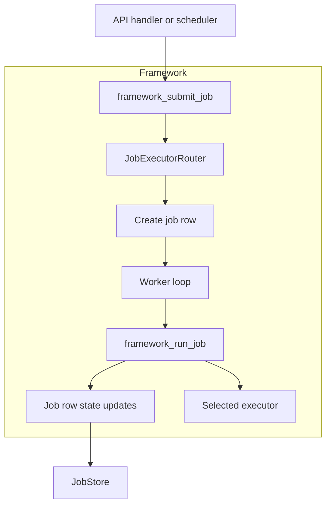
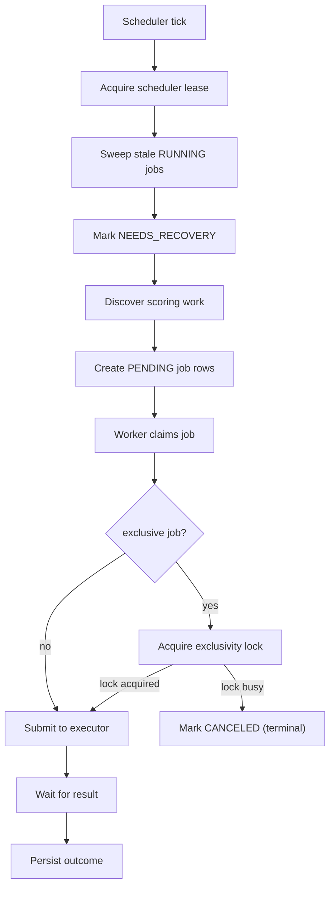

<!-- markdownlint-disable-file MD041 -->

| Author(s)              | [Matthew Prahl](https://github.com/mprahl), [Humair Khan](https://github.com/humairAK) |
| :--------------------- | :------------------------------------------------------------------------------------- |
| **Date Last Modified** | 2026-04-07                                                                             |

<!-- markdownlint-disable MD025 -->

# Summary: Job Execution Plugins to Enable Online Custom Scorers

MLflow's current job execution path is centered on Huey. That works for a local
execution model, but it couples scheduling, worker management, locking, and
backend behavior into one abstraction. Job functions also currently mix
discovery, checkpoint management, and scoring, which makes the execution
contract harder to reason about and makes new backends harder to introduce
safely.

This RFC proposes a job executor plugin architecture that separates concerns
into three layers: the `@job` decorator declares job metadata, the
`AbstractJobExecutor` interface defines the backend contract, and an
MLflow-owned framework handles routing, lifecycle, locking, retries, scheduling,
and recovery. Huey will no longer be the core abstraction. Instead, core MLflow
will ship with a lightweight `LocalJobExecutor`, while remote executors
such as Docker and Kubernetes will be defined in a follow-up RFC against the
same framework.

The framework also changes how work is distributed across deployments. A single
scheduler leader is responsible for discovery, but queued jobs are claimed by
workers running in each MLflow server instance, so job execution can scale
horizontally with the number of MLflow replicas.

This is also an intentional step toward allowing custom scorers to run securely
in OSS MLflow. It does not itself introduce isolated execution backends, but it
puts the refactored framework in place and defines the plugin and framework
boundaries that those secure backends depend on. Support for securely running custom
scorers in OSS MLflow is only complete once the remote executor
implementations from the follow-up RFC are added.

## Motivation

The current MLflow job system is tightly coupled to Huey. Huey provides the
queue, the worker model, the periodic task machinery, and part of the locking
story. As long as there is only one backend shape, that coupling is manageable.
Once MLflow needs both a lightweight built-in path and isolated backends, Huey
becomes a leaky abstraction. The framework still needs to own job routing,
recovery, retries, and backend-specific policy, which means the abstraction
boundary no longer lines up with the responsibilities that MLflow actually
needs.

The current scheduler and job boundary is also too wide. Online scoring jobs
currently discover traces or sessions, read checkpoints, perform scoring, and
persist the next checkpoint inside the job body. That makes the job execution
path responsible for server-owned state transitions and makes correctness depend
on the behavior of the selected backend. A backend change should not change how
checkpoints advance or how exclusive locking behaves.

The current execution path is also tightly coupled to local execution
assumptions and effectively assumes a single MLflow server instance owns job
execution. Job code can interact with MLflow through a mix of direct store
access and server APIs, which makes the execution contract harder to reason
about and prevents remote executors from plugging into one consistent,
authenticated interface.

Custom scorers make the security problem explicit. Declarative scorers such as
LLM-as-judge can run without executing arbitrary user code on the server. Custom
scorers created with the `@scorer` decorator reconstruct Python source via
`exec()` during deserialization. That should not be treated as equivalent to the
existing local path, where job code runs on the MLflow server host in the same
local trust boundary and can use direct store access rather than an isolated
remote runtime. Core MLflow still needs a zero-dependency execution mode, but
isolated execution needs to be modeled as a first-class backend capability
rather than bolted onto Huey.

### Goals

1. The plugin interface will be small enough that Docker, Kubernetes, and
   third-party executors can implement it without reimplementing MLflow job
   semantics.
2. The framework will own status transitions, retries, exclusive locking,
   scheduler coordination, and backend routing.
3. Core MLflow will continue to support scheduled jobs without requiring
   external infrastructure, using a built-in executor instead of Huey.
4. Jobs that need or are configured for stronger isolation, such as custom
   scorers in deployments that choose an isolated execution path, can be routed
   to a different backend than declarative jobs.
5. The design will define the remote execution contract in the core framework so
   a follow-up RFC can introduce Docker and Kubernetes without changing the core
   abstractions.

### Out of scope

1. This RFC does not fully specify Docker or Kubernetes backend behavior. Those
   backends are covered in a follow-up Remote Executors RFC.
2. This RFC does not define a guardrail execution framework for the MLflow AI
   Gateway. The executor isolation primitives should be reusable there, but the
   guardrail framework definition is out of scope because guardrails are
   latency-sensitive and likely need a long-running worker or daemon model
   rather than the batch lifecycle described here.
3. This RFC does not attempt to sandbox arbitrary Python safely inside the
   built-in local executor. In OSS MLflow, the secure path for custom scorers
   therefore depends on remote executor implementations that provide an
   isolation boundary, even though admins may explicitly opt into less isolated
   execution on the default backend.

## Detailed design

### Architecture

The new design separates job execution into three layers:

1. The `@job` decorator remains the place where a job declares framework-visible
   metadata such as `name`, `max_workers`, `transient_error_classes`,
   `python_env` (typed as `_PythonEnv | None` in the executor interface), and
   `exclusive`. This design extends that metadata with `resource_requests` and
   `resource_limits`.
2. `AbstractJobExecutor` defines the backend contract. A backend submits work,
   waits for completion, cancels work, and reconnects to unfinished work during
   recovery.
3. The framework owns everything else: request validation, backend selection,
   job row creation, status transitions, retries, locking, scheduler
   coordination, and recovery loops.

Throughout this RFC, a **replica** means an additional MLflow server instance
running with the same configuration and the same backing tracking database and
shared job storage as its peers. This is different from multiple uvicorn
workers inside a single MLflow server process.



This split is the central change in the RFC. Executors become intentionally
small. The framework becomes the only component that understands the full MLflow
job lifecycle.

The core types are also simplified around that split:

- `JobExecutorConfig` contains generic settings such as retry backoff, maximum
  retries, and default timeout. It is configured once per executor instance in
  an MLflow deployment rather than per submitted job. Its `completed_job_ttl` is
  the framework retention window for terminal job rows; the exact cleanup
  mechanism is an implementation detail outside this RFC.
- `JobResult` becomes the result object returned by `wait_for_job`, including
  terminal `status`, `result`, optional `error_message`, and
  `is_transient_error`. At the API layer, `result` remains the success payload
  and `error_message` remains the failure payload. The persistence layer may
  normalize either one into a single stored terminal payload field. This
  follows the current MLflow implementation, where job entities expose
  `error_message` without persisting a separate database column for it.
- `JobProgress` is a small Python dataclass for typed best-effort progress
  payloads and shared proto conversion helpers.
- `JobExecutionContext` bundles execution metadata that the framework passes to
  the selected backend. This includes the job ID, the tracking URI the job
  should use, optional workspace information, and remote-execution auth fields
  introduced here as part of the framework contract and consumed by backend
  implementations in the follow-up RFC.
- Install-related settings passed to executors should reuse MLflow's existing
  `_PythonEnv` shape rather than introducing a separate parallel configuration
  object. If pip index configuration or similar settings need to be modeled,
  they should be added by extending `_PythonEnv` rather than by defining a new
  executor-specific config type. For executors in this RFC, the `python` field
  in `_PythonEnv` is ignored for now: each deployment pins to
  one baseline Python version and uses `_PythonEnv` primarily for extra package
  installation. Support for multiple Python versions per deployment can be added
  later if there is a strong need.

The framework-level enums used by the interface are intentionally small:

- `JobStatus`: `PENDING`, `RUNNING`, `NEEDS_RECOVERY`, `SUCCEEDED`, `FAILED`,
  `TIMEOUT`, `CANCELED`

### Proposed Python interface

A key approval boundary in this RFC is the Python interface shape for executor
plugins. The intent is to keep it small and stable:

```python
from abc import ABC, abstractmethod
from dataclasses import dataclass
from typing import Any, Literal

from mlflow.utils.environment import _PythonEnv


@dataclass
class JobExecutorConfig:
    retry_base_delay: float = 1.0
    retry_max_delay: float = 60.0
    max_retries: int = 3
    default_timeout: float = 3600.0
    job_lease_ttl: float = 60.0
    completed_job_ttl: float = 86400.0


@dataclass
class JobResult:
    status: JobStatus  # executors return only terminal statuses from wait_for_job()
    result: str | None = None  # success payload for SUCCEEDED jobs
    error_message: str | None = None  # failure payload/message for FAILED or TIMEOUT jobs
    is_transient_error: bool = False


@dataclass
class JobProgress:
    phase: str | None = None
    completed: int | None = None
    total: int | None = None
    unit: str | None = None


@dataclass
class JobExecutionContext:
    job_id: str
    tracking_uri: str
    gateway_uri: str | None = None  # optional MLflow AI Gateway base URI reachable from the job runtime; defaults to tracking_uri when unset
    token: str | None = None  # used by remote executors
    workspace: str | None = None


@dataclass
class JobRecoveryResult:
    job_id: str
    action: Literal["reattach", "requeue", "fail"]
    error_message: str | None = None


class AbstractJobExecutor(ABC):
    def __init__(self, config: JobExecutorConfig): ...

    def start_executor(self) -> None: ...

    def stop_executor(self) -> None: ...  # called during MLflow server shutdown for graceful cleanup

    @abstractmethod
    def submit_job(
        self,
        job_id: str,
        job_name: str,
        fn_fullname: str,
        params: dict[str, Any],
        context: JobExecutionContext,
        python_env: _PythonEnv | None = None,
        timeout: float | None = None,
    ) -> None: ...

    @abstractmethod
    def wait_for_job(self, job_id: str) -> JobResult: ...  # remote executors may need a short grace period after backend exit before reading the final persisted result

    @abstractmethod
    def cancel_job(self, job_id: str) -> None: ...

    @abstractmethod
    def recover_jobs(self, unfinished_job_ids: list[str]) -> list[JobRecoveryResult]: ...

    @property
    def remote_execution(self) -> bool: ...  # defaults to False and enables the remote execution contract defined below

    def check_requirements(self) -> None: ...  # optional fail-fast validation run during startup
```

The key design choice is that this interface does not expose job-store
mutation methods. Executors submit work, observe completion, cancel work, and
report recovery outcomes. The framework continues to own job-state transitions,
retries, locking, and recovery orchestration.

`wait_for_job()` should only return terminal outcomes: `SUCCEEDED`, `FAILED`,
`TIMEOUT`, or `CANCELED`. `NEEDS_RECOVERY` remains a framework-level state and is
never returned by an executor. `recover_jobs(...)` is keyed by MLflow job ID
rather than by opaque framework-supplied backend metadata. If a backend needs
extra information to reattach, it should derive or look up that information from
the job ID and its own backend state rather than requiring the scheduler to
synthesize executor-specific recovery payloads.

### Routing and backend selection

Backend selection is performed per submitted job, not once globally for the
server. A new `JobExecutorRouter` loads the installed executor entrypoints,
resolves the configured backend names, and then selects between those configured
backends for each submission.

The initial routing model is intentionally small:

- `requires_custom_scorers`: derived from inspection of submitted scorer
  payloads. Route to `MLFLOW_JOB_CUSTOM_SCORER_EXECUTOR_BACKEND` when
  configured, otherwise use the default backend. If custom scorers are not
  admin-enabled, reject submission.
- `requires_local_execution`: derived from job implementations that still rely
  on non-Gateway model access paths. Anything that does not use the MLflow AI
  Gateway for its model access must route only to a backend whose
  `remote_execution` is `False`.

The router is configured by these framework-level settings:

- `MLFLOW_JOB_DEFAULT_EXECUTOR_BACKEND`, which defaults to `local`
- `MLFLOW_JOB_CUSTOM_SCORER_EXECUTOR_BACKEND`, which is optional and controls
  where custom scorers run
- `MLFLOW_SERVER_ENABLE_CUSTOM_SCORERS`, which defaults to `false`

Any number of executor entrypoints may be installed in the environment, but the
supported routing model is intentionally smaller: one required active backend
selected by `MLFLOW_JOB_DEFAULT_EXECUTOR_BACKEND`, and at most one additional
active backend selected by `MLFLOW_JOB_CUSTOM_SCORER_EXECUTOR_BACKEND`. If the
custom-scorer override is unset, the deployment uses a single active backend. If
it is set to the same backend name as the default, the deployment still has only
one distinct active backend.

The selected backend name is persisted on the job row as `executor_backend`.
Retries, cancellation, and recovery use that stored backend instead of
re-running routing logic. This keeps backend selection stable for the life of
the job.

Custom scorers are gated by explicit admin opt-in rather than executor
capability discovery. If a submitted job contains custom scorer code and
`MLFLOW_SERVER_ENABLE_CUSTOM_SCORERS` is not enabled, submission is rejected. If
custom scorers are enabled, they run on
`MLFLOW_JOB_CUSTOM_SCORER_EXECUTOR_BACKEND` when that override is set;
otherwise, they run on the default backend selected by
`MLFLOW_JOB_DEFAULT_EXECUTOR_BACKEND`. This keeps the executor interface small
and makes the security-sensitive opt-in explicit. When admins leave custom
scorers on the default backend, they are explicitly accepting that backend's
trust boundary. When they configure
`MLFLOW_JOB_CUSTOM_SCORER_EXECUTOR_BACKEND`, MLflow can route custom scorers to
a different backend, such as an isolated remote executor.

`remote_execution` answers whether the job runs through the local direct-store
path or through the remote executor contract. Direct (non-Gateway) model usage
is only compatible with local execution. One-off scorer invocation can still
execute direct provider-backed judges on the local path today, but if
`MLFLOW_JOB_DEFAULT_EXECUTOR_BACKEND` is set to a remote executor backend then
MLflow should disable or reject direct-usage paths rather than attempting to
route them remotely.

### Data model

The core framework requires a small amount of additional persistent state:

<!-- markdownlint-disable MD060 -->
| Location           | Field or table                            | Purpose                                                                         |
| ------------------ | ----------------------------------------- | ------------------------------------------------------------------------------- |
| `jobs`             | `executor_backend`                        | Persisted backend selection for retry, cancellation, and recovery               |
| `jobs`             | `lease_expires_at`                        | Short-lived lease for `RUNNING` jobs so stale work can enter recovery           |
| `jobs`             | `status_message`, progress fields         | Optional latest progress metadata for operators and UI                          |
| `job_locks`        | `lock_key`, `job_id`, `acquired_at`       | Exclusive job locking across replicas; `lock_key` is framework-computed per type |
| `scheduler_leases` | `lease_key`, `acquired_at`, `ttl_seconds` | Single-leader scheduler lease for discovery                                     |
<!-- markdownlint-enable MD060 -->

The table above summarizes the shared framework tables and job-row fields.
For optional progress reporting, the added fields are `status_message`,
`progress_payload`, and `progress_updated_at`. Additional auth-specific job-row
state for remote execution is defined later in this RFC as part of the remote
executor contract. Higher-level APIs may still expose semantic fields such as
`error_message`, but those do not imply separately persisted terminal columns.
This matches the current MLflow persistence model, where `jobs.result` is
stored but `error_message` is exposed through entity and API layers rather than
as its own database field.

The framework state machine also introduces a non-terminal `NEEDS_RECOVERY`
status for jobs whose backend work may still exist but whose current monitoring
loop can no longer be trusted. That state is used to coordinate recovery without
needing per-replica owner fields on the job row.

### Store interface changes

The framework relies on one explicit store-level API for terminal result
reporting and one optional API for in-flight progress reporting:

```python
def report_job_result(
    self,
    job_id: str,
    status: JobStatus,
    result: str | None = None,
    error_message: str | None = None,
    is_transient_error: bool = False,
) -> None: ...
```

This method is the single source of truth for persisted job outcomes when a job
reports its result back to MLflow. Remote executors reach it through the
framework result-reporting endpoint defined later in this RFC. The built-in
local executor may instead return a `JobResult` directly to the framework
without persisting it first. The API keeps `result` and `error_message` as
separate semantic fields, but the store implementation persists only one
canonical terminal payload. The intended invariant is:

- `SUCCEEDED`: `result` is set and `error_message` is unset
- `FAILED` / `TIMEOUT`: `error_message` is set and `result` is unset

The persistence layer then normalizes whichever terminal payload is set into
the single stored `jobs.result` field. This is not a new storage shape proposed
in this RFC; it follows the current MLflow implementation, which already
stores terminal payload in `jobs.result` and exposes `error_message` at the
entity/API layer.

```python
def report_job_progress(
    self,
    job_id: str,
    message: str | None = None,
    progress: JobProgress | None = None,
) -> None: ...
```

This API is optional and exists only for jobs that want to surface best-effort
progress while they are still `RUNNING`. It does not change the framework-owned
lifecycle state, retry behavior, or terminal outcome. Progress updates replace
the latest stored progress metadata rather than appending history. When the
framework records a terminal outcome, it clears any stored progress metadata for
that job.

This design also replaces the old bundled `retry_or_fail_job(...)` behavior.
Retry classification still comes from the job result, but the retry decision is
now made by the framework: it decides whether to call `retry_job(...)` or
`fail_job(...)` after it inspects `JobResult.is_transient_error` and the
configured retry budget.

### Framework submission and lifecycle

The framework path replaces Huey's role as the lifecycle owner.

`framework_submit_job(fn, params, timeout)` performs these steps:

1. Validate the job function and the submitted params.
2. Compute execution requirements and select `executor_backend` through
   `JobExecutorRouter`.
3. Create the job row in `PENDING`, storing `executor_backend`.
4. Instead of spawning a new background thread for each submitted job, each
   replica runs long-lived worker capacity that claims queued jobs and invokes
   `framework_run_job(job_id)`. Claiming is capacity-aware by job type: a
   worker only claims jobs for types whose local `max_workers` budget still has
   free capacity, so one busy job type cannot monopolize execution slots for
   another. The exact implementation may use a shared worker loop or separate
   per-job-type loops; that is an implementation detail outside this RFC.

`framework_run_job(job_id)` is the single lifecycle loop for all backends:

1. Resolve the executor from `job.executor_backend` and build
   `JobExecutionContext`.
2. If the selected executor has `remote_execution = True`, generate the scoped
   token, persist its hash on the job row, and attach the plaintext token to
   `JobExecutionContext`. This document defines that as a framework
   responsibility; the follow-up RFC then shows how Docker and Kubernetes use
   that contract.
3. If the job is `exclusive`, compute the lock key and try to acquire the job's
   exclusivity lock before any backend work is submitted. This is distinct from
   the earlier job row claim: the job row claim gives one replica ownership of
   the queued job, while the exclusivity lock protects the higher-level key,
   such as one experiment's scoring work. If the exclusivity lock cannot be
   acquired, mark the claimed job `CANCELED` and exit without launching backend
   work. That cancellation is terminal for that job row and is not retried; if
   the underlying scheduled work still exists, a later scheduler discovery cycle
   creates a fresh `PENDING` job row.
4. Call `executor.submit_job(...)`.
5. While the job remains `RUNNING`, renew its short-lived job lease so the
   scheduler can distinguish healthy monitored work from stale work whose
   monitoring loop has disappeared.
6. Block on `executor.wait_for_job(job_id)`.
7. Apply the returned `JobResult` and clear any stored progress metadata:
   - `SUCCEEDED` transitions the job to finished and persists any checkpoint
     passed in `params`
   - transient `FAILED` results re-enter `PENDING` and become eligible for
     another worker claim if retries remain
   - permanent `FAILED` results transition to failed
   - `TIMEOUT` transitions to timed out
   - `CANCELED` is treated as a no-op because the terminal state was already set
     by the canceller. `CANCELED` jobs are never retried by the retry loop.
8. Release the exclusive lock if the job held one.

Cancellation follows the same framework-controlled ordering for all backends. The
framework first sets the job row to `CANCELED`, which immediately invalidates
any token-backed access for remote execution, clears any stored progress
metadata, and then calls
`executor.cancel_job(job_id)` to stop the backend work. `wait_for_job()`
unblocks as a consequence of the backend work terminating, and the framework
treats the eventual return as a no-op because the terminal state is already
recorded.

This loop is also what makes multi-replica recovery safe. Worker ownership is
determined by the job row claim, and terminal transitions are performed with
conditional updates such as `UPDATE ... WHERE status = 'RUNNING'`, so duplicate
workers cannot produce duplicate final state transitions.

Retries use the same pattern. The framework performs a conditional
`retry_job(...)` transition from `RUNNING` back to `PENDING`, increments
`retry_count`, and clears the previous attempt's terminal `result` payload.
Once returned to `PENDING`, the job can be claimed again by any eligible replica
through a new job row claim. This keeps transient-failure retry safe under
multi-replica recovery.

In this model, worker ownership is implicit in the job row claim. A job that
remains `RUNNING` without timely job lease renewal, or that exceeds 115% of its
hard timeout, becomes a recovery candidate rather than being assumed healthy
indefinitely. The extra 15% grace window gives the backend and framework a short
period to record the final state after the nominal timeout boundary before
recovery logic intervenes.

Checkpoint persistence is part of that same success path. Here, a checkpoint is
the persisted marker for how far online scoring has progressed for a given
experiment, so the next scheduler cycle knows where to resume trace or session
discovery. The design assumes that marking a job successful and persisting the
next checkpoint happen together as one framework concern rather than as
separate backend operations. This keeps checkpoint advancement out of
backend-specific correctness logic.

### Locking and scheduler coordination

Huey's locking and periodic task features are replaced by framework-managed
database coordination.

This section uses four coordination terms:

- **Job row claim**: the worker's conditional `PENDING -> RUNNING` transition
  that gives one MLflow instance ownership of a queued job row
- **Exclusivity lock**: the higher-level lock stored in `job_locks`, for a
  framework-computed key such as an experiment ID or workspace
- **Job lease**: the short-lived `RUNNING`-job lease tracked by
  `lease_expires_at`, used to detect stale monitored work
- **Scheduler lease**: the single-leader discovery lease stored in
  `scheduler_leases`

`JobLockManager` replaces Huey's lock helper and keeps the existing lock key
computation model. Lock acquisition is an atomic conditional insert into the new
`job_locks` table. This ensures that exclusivity works correctly across
multiple MLflow server replicas rather than only within one process. For
example, `run_online_trace_scorer_job` and
`run_online_session_scorer_job` use exclusivity keyed by experiment ID so two
replicas cannot advance the same experiment's online-scoring checkpoint
concurrently.

In the claim-based design, a worker acquires the exclusivity lock only after it
wins the job row claim and before it submits backend work. If the exclusivity
lock is already held, acquisition succeeds only when the holding job is already
terminal or when the lock is stale based on the holding job's timeout plus the
same 15% grace window used by stale-job recovery. If the lock cannot be
acquired, the claimed job is marked `CANCELED` without launching backend work.
That canceled row is not retried; later scheduler rediscovery is responsible for
creating a fresh job row if the work still needs to run.
Lock release happens after the framework execution loop reaches terminal state.
The scheduler does not clear exclusivity locks directly; stale lock cleanup
remains part of `JobLockManager.acquire()` so there is only one place that
decides whether a lock is still valid.

This also handles crash windows safely. If a framework execution loop crashes
after marking a job terminal but before deleting the lock row, a later
acquisition attempt treats that lock as stale because it points to a terminal
job. Lock rows are not cleared during server startup, since that would be unsafe
during a rolling restart where another replica may still be protecting active
work. Recovery instead inspects unfinished jobs by persisted backend so work can
either be reattached or returned to `PENDING`, while stale lock cleanup remains
part of normal acquisition.

The scheduler is similarly moved into the framework. `JobScheduler` becomes a
simple background thread that wakes up every minute, skips overlapping cycles
in-process, and uses the new `scheduler_leases` table to acquire the scheduler
lease for discovery work. The scheduler-lease holder is responsible for finding
new work and creating `PENDING` job rows. Every replica then runs its own worker
loop that can win job row claims from the shared queue and execute them. This
preserves horizontal execution scale for backends such as local and Docker
even though discovery itself is single-leader. `MLFLOW_DISABLE_SCHEDULER=true`
remains the escape hatch for API-only replicas.

This design intentionally separates discovery from execution. The scheduler
lease prevents redundant discovery work, while the jobs table acts as the shared
queue that all replicas can pull from via job row claims. The scheduler-lease
holder also performs a lightweight maintenance sweep on each cycle.

That sweep evaluates `RUNNING` jobs for stale recovery. A job becomes a recovery
candidate when its job lease expires or when it exceeds 115% of its hard
timeout. The scheduler-lease holder then conditionally transitions the job from
`RUNNING` to `NEEDS_RECOVERY`. `PENDING` jobs remain in the shared queue and do
not require backend-specific recovery.

Once a job is in `NEEDS_RECOVERY`, the framework consults `executor_backend` and
calls that backend's `recover_jobs(...)`. The backend returns one
`JobRecoveryResult` per job, indicating whether the framework should reattach to
existing backend work, reset the job to `PENDING`, or fail it. A `reattach`
result transitions `NEEDS_RECOVERY -> RUNNING`; a `requeue` result transitions
`NEEDS_RECOVERY -> PENDING`; a `fail` result transitions
`NEEDS_RECOVERY -> FAILED`. Backends should only return `requeue` after they
have confirmed the previous backend workload is no longer running. If a restart
happens after the server configuration has changed such that the persisted
backend is no longer available or no longer valid for recovery, the framework
should mark that unfinished job as failed rather than silently rerouting it to a
different backend.

Workspace handling also remains in the framework. On each scheduler cycle, the
leader iterates all workspaces using the same workspace-aware discovery pattern
MLflow already uses for online scoring. If workspaces are disabled, the
scheduler runs once without workspace context. If they are enabled, each
discovered job row carries its workspace in `JobExecutionContext.workspace`,
while executors themselves remain workspace-unaware.

For multi-replica deployments, this RFC assumes a transactional tracking
database such as PostgreSQL, MySQL, or MSSQL. SQLite is acceptable for
single-process local use, but it is not a safe foundation for multi-replica
lease and lock coordination.

This keeps the user experience close to today's core MLflow behavior. Users
still get built-in periodic scheduling without deploying an external queue or
orchestrator. The underlying implementation changes from Huey-specific mechanics
to MLflow-owned coordination.



### Built-in executor and the Huey refactor

The built-in executor is `LocalJobExecutor`. It is the default backend for
core MLflow and is intended to be zero-dependency.

Its responsibilities are intentionally narrow:

- `submit_job()` spawns a subprocess that runs the existing job entry point
- the subprocess uses the deployment's baseline Python version rather than
  provisioning a per-job Python version from `_PythonEnv.python`
- `wait_for_job()` blocks on process exit and translates the outcome into
  `JobResult`
- `cancel_job()` terminates the subprocess
- `recover_jobs()` cannot reconnect to old local processes after restart; stale
  subprocess jobs are instead returned to `PENDING` so another worker can claim
  them

Per-job-type concurrency is still respected through `max_workers`, but the
control point moves from Huey's worker pool to framework-managed semaphores keyed
by job type. This is also the intended fairness boundary: one hot job type
should not consume slots reserved for another. The RFC does not require a
literal one-loop-per-job-type design as long as the claim logic remains
capacity-aware by job type.

This refactor removes Huey as a required internal dependency for the job
system. Huey consumer entry points, queue dispatch logic, and the periodic task
consumer are replaced by framework-managed threads and the
`LocalJobExecutor`. The behavioral goal is not to change the user-facing
scheduling model. Architecturally, the goal is to stop treating Huey as the
abstraction that defines what a job backend is.

### Scheduler and job boundary refactor

This RFC also narrows the responsibilities of job functions. Online scoring
jobs should execute work, not discover it.

The scheduler becomes responsible for:

| Responsibility                                               | New owner           |
| ------------------------------------------------------------ | ------------------- |
| Reading the current checkpoint                               | Scheduler           |
| Discovering traces or sessions to score                      | Scheduler           |
| Sampling scoring targets                                     | Scheduler           |
| Passing scoring targets and next checkpoint info in `params` | Scheduler           |
| Persisting the next checkpoint after successful completion   | `framework_run_job` |

This change keeps checkpoint advancement inside the same lock scope that
protects discovery and submission. It also means retries operate on a stable
input set instead of rediscovering a potentially different set of traces or
sessions.

Each scheduled job row represents a bounded batch of trace IDs or session IDs
chosen by the scheduler, not an unbounded "everything since the last checkpoint"
work item. The scheduler should cap the amount of work placed into one job so
execution time stays bounded, retries remain stable, and no single queued job
monopolizes worker capacity.

The scheduler and job refactor is intentionally atomic. Shipping the new
scheduler behavior without the new job params, or vice versa, would break online
scoring.

### Remote executor contract

This RFC fully defines the framework contract for remote executors. The
follow-up Remote Executors RFC should only need to describe how Docker and
Kubernetes implement that contract.

For the core local path, the subprocess continues to interact with the tracking
store directly through the database URI. For a remote path, the framework owns
a scoped auth and result reporting contract instead. Remote backends consume
that contract; they do not invent their own auth or reporting model.

For remote executors, `JobExecutionContext.tracking_uri` is populated from the
operator-facing `MLFLOW_JOB_TRACKING_URI` setting so the remote workload can
reach the MLflow server. `gateway_uri`, when present, is populated from
`MLFLOW_JOB_GATEWAY_URI` and provides the base URI the job runtime should use
for MLflow AI Gateway traffic. When `MLFLOW_JOB_GATEWAY_URI` is unset, the
tracking server URI is the default Gateway entrypoint for remote jobs.

#### Token lifecycle

The token lifecycle is:

1. The framework computes `scoped_permissions` from the job submission.
2. The job row is created with the persisted executor backend and the permission
   payload. For now, `scoped_permissions` remains an untyped dict on the Python
   side and can be promoted to a dedicated dataclass later once the
   remote-execution permission model stabilizes.
3. The framework generates an opaque token with `secrets.token_urlsafe(32)`.
4. The SHA-256 hash of the token is persisted on the job row. The plaintext
   token is never stored in the database.
5. The plaintext token is passed to the selected executor in
   `JobExecutionContext.token`.
6. The executor injects that token into the remote runtime environment.
7. When the job reaches a terminal state, the token hash and scoped permissions
   are cleared from the job row.

Recovery does not generate a fresh token for an already-running remote job. If
the server restarts while remote work is still running, the framework reconnects
to that backend work and the token already present in the remote environment
remains valid until the job reaches terminal state. If a remote backend instead
reports that a job should be requeued, it must first ensure the previous backend
workload is no longer running, because the requeued attempt will receive a fresh
token when it is claimed again.

Token verification happens on the MLflow server by hashing the presented token
and comparing it with the stored hash for the specified `job_id`. The comparison
should use `hmac.compare_digest`, and requests are rejected once the token hash
has been cleared as part of terminalization.

#### Permission model and LLM access

Each job token is granted only the permissions needed for the job that owns it:

- `EDIT` on the target experiment
- `USE` on the specific Gateway endpoints referenced by scorer configuration
- `READ` on any prompts referenced by scorer configuration or declared through
  `@scorer(required_resources=...)`
- implicit access to report results for that specific `job_id`

Remote executors do not receive provider API keys in the job environment. All
remote LLM access must go through the MLflow AI Gateway, and the framework
validates that scorer model URIs use the `gateway:/...` form before submission.
This is one of the core security benefits of the remote model. The remote
backend gets a scoped token, not broad provider credentials.

To prevent privilege escalation, MLflow should also validate at scorer creation
or update time that the caller already holds the permissions implied by that
scorer's stored configuration, such as experiment `EDIT` and any referenced
Gateway endpoint `USE` permissions. For custom scorers, this validation should
also include any resources declared explicitly on the scorer, such as prompts or
Gateway endpoints listed in `@scorer(required_resources=...)`. A user should not
be able to register or activate an online scorer that would later run with
broader access than that user had when creating it.

#### Permission extraction

The framework computes `scoped_permissions` from submitted job params before
remote work is launched. That extraction must not require fully deserializing
the scorer or invoking `exec()`. The intended model is a shallow parse of
serialized scorer payloads to discover referenced `gateway:/endpoint-name`
URIs.

For custom scorers, this shallow parse may not be sufficient because arbitrary
Python can reference MLflow-managed resources dynamically. To support those
cases without expanding the job token to the caller's full permissions, the
`@scorer` decorator may declare additional required resources explicitly:

```python
from dataclasses import dataclass
from typing import Literal


@dataclass(frozen=True)
class RequiredResource:
    type: Literal["gateway_endpoint", "prompt"]
    identifier: str


@scorer(
    required_resources=(
        RequiredResource(type="gateway_endpoint", identifier="endpoint-1"),
        RequiredResource(type="gateway_endpoint", identifier="endpoint-2"),
        RequiredResource(type="prompt", identifier="prompts://tool-grounded/1"),
    ),
)
def tool_grounded(outputs, trace):
    client = OpenAI(base_url="<gateway-url>")
    tool_spans = trace.search_traces(span_type="TOOL")
    judge_prompt = mlflow.genai.load_prompt("prompts://tool-grounded/1")
    text = judge_prompt.format(output=outputs, tools=tool_spans)
    response = client.responses.create(text)
    return parse_result(response)
```

For remote execution, the framework should union inferred dependencies with
declared `required_resources` rather than treating the declaration as an
override. This keeps least-privilege behavior while allowing custom scorers to
declare resources that are not reliably inferable from serialized source. The
resource schema is intentionally extensible, but this RFC only requires support
for `gateway_endpoint` and `prompt`.

The per-job-type extraction rules are:

- `run_online_trace_scorer_job` and `run_online_session_scorer_job`: read
  `experiment_id` from params, extract gateway endpoints from each scorer in
  `params.online_scorers`, and union those inferred dependencies with any
  scorer-declared `required_resources`
- `invoke_scorer_job`: read `experiment_id` from params and extract the gateway
  endpoint from `params.serialized_scorer`, then union it with any
  scorer-declared `required_resources`
- `optimize_prompts_job`: read experiment and resolved gateway dependencies from
  the submission state produced by the prompt-optimization refactor described
  below

If a remote-bound job references a non-gateway model URI, or needs protected
resources that are neither inferable nor declared through
`required_resources`, submission is rejected before a token is generated.

#### API server enforcement

Job-token auth is enforced by middleware in front of the MLflow API handlers.
When the request carries `X-MLflow-Job-Id` and `X-MLflow-Job-Token`, the server
looks up that job row, verifies the token hash, checks that the job is still
non-terminal, and evaluates the requested resource against `scoped_permissions`.

Job-token auth replaces normal user auth for that request; it is not layered on
top. In the queue-and-claim model, remote jobs should already be `RUNNING`
before backend work is launched, so token-authenticated requests are expected
from `RUNNING` jobs. `NEEDS_RECOVERY` should also be treated as an allowed
non-terminal state because the remote workload may still exist while the
framework is deciding whether to reattach, requeue, or fail it.

The intended endpoint-to-permission mapping is:

| Request pattern                                                                      | Resource type    | Required permission      |
| ------------------------------------------------------------------------------------ | ---------------- | ------------------------ |
| `GET /mlflow/traces/*`, `POST /mlflow/traces/search`, `POST /mlflow/traces/batchGet` | experiment       | `EDIT`                   |
| `POST /mlflow/assessments`                                                           | experiment       | `EDIT`                   |
| `POST /api/3.0/jobs/{job_id}/result`                                                 | job              | implicit for that job ID |
| `POST /gateway/*`                                                                    | gateway endpoint | `USE`                    |
| Prompt read endpoints                                                                | prompt           | `READ`                   |
| Any other endpoint                                                                   | none             | reject                   |

#### UI considerations

When `MLFLOW_JOB_DEFAULT_EXECUTOR_BACKEND` is configured to use a remote
executor, the UI should reflect that direct (non-Gateway) model usage is not
available for job-backed flows. In that configuration, one-off judge execution
should be presented as Gateway-only, and direct-model options should be hidden
or disabled rather than letting the user submit requests that can only succeed
on a local executor.

The frontend should learn that state from a new field on the `server-info`
endpoint rather than inferring it locally. That field should explicitly indicate
whether direct (non-Gateway) model usage is supported for these flows.

The generic `/ajax-api/3.0/jobs/...` responses should also include
`error_message`, `status_message`, `progress_payload`, and
`progress_updated_at` so existing hooks and shared types can surface terminal
and progress metadata consistently.

If a job type uses optional progress reporting, the UI may also surface the
latest job `status_message` or structured `progress_payload`. The structured
payload should follow the `JobProgress` shape so shared UI can render common
progress indicators consistently. The exact UX for displaying in-progress job
progress is deferred from this RFC because it needs separate UX design.

#### Optional progress reporting

Long-running jobs may optionally report best-effort progress through a dedicated
framework endpoint while they are still running:

```json
{
  "message": "Processed 42 / 100 traces",
  "progress": {
    "phase": "scoring",
    "completed": 42,
    "total": 100,
    "unit": "traces"
  }
}
```

The endpoint is `POST /api/3.0/jobs/{job_id}/progress`. It is authenticated
with the same job ID and token headers as the result-reporting endpoint and is
a thin wrapper around `job_store.report_job_progress(...)`.

This endpoint is optional. Jobs that do not report progress continue to work
normally. Progress updates are best-effort, do not change `JobStatus`, and
overwrite the latest stored progress metadata rather than appending a full
history. When the framework records a terminal outcome, it clears
`status_message`, `progress_payload`, and `progress_updated_at` for that job.

#### Result reporting

Remote jobs report completion through a dedicated framework endpoint:

```json
{
  "status": "SUCCEEDED",
  "result": "{\"trace-a\": {\"assessments\": [...], \"failures\": []}}",
  "error_message": null,
  "is_transient_error": false
}
```

The endpoint is `POST /api/3.0/jobs/{job_id}/result`. It is authenticated with
the job ID and token headers and is a thin wrapper around
`job_store.report_job_result(...)`.

This endpoint keeps `result` and `error_message` as separate semantic fields at
the API layer: `SUCCEEDED` jobs report success data in `result`, while
`FAILED` and `TIMEOUT` jobs report the failure message or payload in
`error_message`. The persistence layer then normalizes whichever terminal
payload is set into the single stored `jobs.result` field, so the API shape
does not imply a second persisted terminal column. This mirrors the current
MLflow implementation rather than introducing a new divergence.

The job process attaches these headers automatically through
`JobTokenRequestHeaderProvider`:

```python
class JobTokenRequestHeaderProvider(RequestHeaderProvider):
    def in_context(self):
        return os.environ.get("MLFLOW_JOB_TOKEN") is not None

    def request_headers(self):
        return {
            "X-MLflow-Job-Id": os.environ["MLFLOW_JOB_ID"],
            "X-MLflow-Job-Token": os.environ["MLFLOW_JOB_TOKEN"],
        }
```

The remote job entry point is responsible for reporting its final result by
calling this endpoint before exiting. The local path may instead translate
process completion directly into `JobResult` without a callback because it
already runs inside the MLflow trust boundary.

Remote `wait_for_job()` remains backend-specific. The backend waits for its
workload to reach a terminal backend state, such as process exit, container
exit, or Kubernetes Job completion, and then reads the final job row. If a
result was reported, that persisted payload is returned as `JobResult`. If the
workload has already terminated but the job row still has no reported result,
that is not a separate result-reporting timeout. Instead, it means the remote
runtime exited without successfully calling the result-reporting endpoint, so
the executor classifies the backend failure and returns an
infrastructure-level failure instead.

#### Upgrade and migration notes

This upgrade should not try to preserve existing non-terminal Huey-managed jobs
across the database migration. The old design let the job runtime determine
which traces or sessions to process after the job had already started, while
this RFC moves that discovery boundary into the framework and persists bounded
work items up front. Because of that shift, the migrated framework cannot safely
infer which concrete scoring targets an old `PENDING` or `RUNNING` Huey job had
already pulled or partially processed.

The migration should therefore mark existing non-terminal jobs as `CANCELED`
rather than attempting state translation. After upgrade, the new scheduler
rediscovers work from the last persisted checkpoint and creates fresh `PENDING`
jobs under the new model. That may cause some
unfinished scoring work to be retried after upgrade, but it is safer than
guessing at the hidden in-flight state of the pre-refactor job model.

#### Security notes

- Remote executors assume TLS between the remote workload and the MLflow server
  because the job token is carried in an HTTP header.
- The MLflow server should avoid logging `X-MLflow-Job-Token` values in access
  logs. The job ID is not itself a secret, but the token is.

### Prompt optimization refactor

This RFC includes the high-level server-side refactor needed so
`optimize_prompts_job` can participate in the same remote-execution contract
without a breaking API change.

The high-level direction is:

1. Move prompt, scorer, optimizer, and dataset dependency resolution for
   `optimize_prompts_job` from the job body into submission-time server logic.
2. Require explicit model references for the remote path rather than relying on
   runtime defaults. If prompt optimization would otherwise fall back to a
   default model, remote submission should be rejected because the execution
   contract must not depend on runtime-only model selection.
3. Persist the resolved prompt-model, reflection-model, scorer, dataset, and
   experiment resources as part of the job submission state managed by the
   framework.
4. Require all remote-bound prompt-optimization model access to use
   `gateway:/...` URIs, and reject remote submission if any resolved dependency
   is not Gateway-backed.
5. Continue to allow the existing local executor path for users who rely on
   today's direct provider-call behavior.

This refactor lets the framework compute the required permissions for remote
prompt optimization before job execution while preserving the current local
behavior for existing non-Gateway users.

## Drawbacks

1. This proposal moves more logic into the core MLflow job framework. Huey
   previously hid some of that complexity. After this change, MLflow directly
   owns more lifecycle code, more coordination tables, and more recovery
   behavior.
2. The core design intentionally does not solve arbitrary Python isolation in
   the built-in executor. Users who need custom scorers in OSS will still need a
   remote backend, or they must explicitly accept the security risks of local
   execution.
3. Reviewers who want to evaluate the concrete Docker and Kubernetes
   implementation trade-offs will still need the follow-up Remote Executors RFC,
   even though this RFC now defines the shared framework contract they rely on.

# Alternatives

## Keep Huey as the central abstraction

The main benefit of keeping Huey central is that it would reduce the amount of
immediate refactoring. Huey already has queue semantics, worker execution,
periodic tasks, and locking hooks. It is already wired into the current job
system.

The downside is that Huey is no longer the right abstraction boundary for the
design MLflow needs. Per-job backend routing, backend-specific capability
checks, remote execution, and recovery semantics would still need to be modeled
by MLflow on top of Huey. That would leave MLflow with both a queue abstraction
and a framework abstraction that overlap but do not align. The result would be
more coupling, not less.

This alternative was not chosen because the proposal is fundamentally about
moving lifecycle ownership into MLflow.

## Use Huey for queueing and locking only

Another possible design is a hybrid approach where MLflow keeps scheduler
leadership, discovery, retries, persisted job state, and stale-work recovery,
but delegates the shared queue and normal exclusivity locking to Huey. In this
model, MLflow would still own the scheduler lease and use it to perform
leader-elected discovery and stale-lock cleanup, while `SqlHuey` could provide
shared dispatch on PostgreSQL and MySQL/MariaDB deployments and `lock_task()`
could provide exclusive locking. `LocalJobExecutor` could remain the
built-in executor, with Huey acting only as the dispatch layer in front of it.

The main benefit of this alternative is that it avoids introducing a custom
MLflow queue and general-purpose lock table. In the main design, the "queue" is
the `jobs` table plus conditional `PENDING -> RUNNING` claims rather than a
separate queue service. This hybrid approach would replace that dispatch layer
with Huey's own SQL-backed queue tables. That would reduce the amount of
framework-owned coordination code and reuse queueing and lock primitives that
already exist in the current system. It also creates a potential middle ground
between the current Huey-centric implementation and a fully MLflow-owned queue.

One further middle ground would be to keep Huey's task and consumer model but
implement a custom Huey `BaseStorage` backed by MLflow's own database stack.
That could avoid relying on stock `SqlHuey` and its peewee integration while
still reusing Huey's worker framework. The tradeoff is that storage is where
most of the hard correctness problems live in this design: durable
multi-replica dequeue, exclusivity locking, stale-lock cleanup, and recovery
semantics. If MLflow still needs to implement custom storage behavior for those
guarantees, the simplification benefit over a fully MLflow-owned queue narrows
substantially.

The downsides are mostly around supportability and semantics. `SqlHuey` is a
contrib module inside the Huey repository rather than a separately maintained
third-party package, but it is still less documented and less clearly positioned
as a first-class backend than `RedisHuey` or `SqliteHuey`. It also uses peewee
for its SQL layer, which would introduce a second ORM dependency alongside
MLflow's SQLAlchemy store and introduce queue / lock tables managed by Huey
rather than by MLflow itself. It also leaves a gap for MSSQL support unless the
necessary behavior is contributed upstream to `SqlHuey`, which is outside
MLflow's direct control and would make MSSQL a weaker deployment target for the
job system. Even on supported SQL backends, Huey locks do not provide lease
semantics or owner metadata, so MLflow would still need extra logic to detect
and safely clean up stale locks. That means the hybrid design reduces some
framework-owned infrastructure, but it does not eliminate the need for
MLflow-specific scheduler and recovery logic.

## Allow custom scorers on the built-in local executor

The benefit of this option is obvious: it would preserve the simplest possible
user experience and avoid the need for container infrastructure.

The downside is the trust boundary. Custom scorers created with the `@scorer`
decorator reconstruct Python source via `exec()` during deserialization. That
should not run in the same trust boundary as the MLflow server host while being
presented as a lightweight default mode. This RFC therefore keeps custom
scorers disabled by default and requires an explicit admin opt-in before they
can run on any backend. Admins who enable them on the default backend are
knowingly accepting that trust boundary, while admins who want stronger
isolation can route them to a separate backend.

This alternative was not chosen as the default behavior because it weakens the
security model in exactly the path where MLflow needs a clearer boundary.

# Adoption strategy

The intended rollout is:

1. Land the core framework, router, lock manager, scheduler, and
   `LocalJobExecutor`.
2. Keep `local` as the built-in default for
   `MLFLOW_JOB_DEFAULT_EXECUTOR_BACKEND`.
3. Leave `MLFLOW_SERVER_ENABLE_CUSTOM_SCORERS` disabled by default and
   `MLFLOW_JOB_CUSTOM_SCORER_EXECUTOR_BACKEND` unset by default so the current
   OSS restriction on custom scorers remains in place until an admin explicitly
   opts in. If an admin enables custom scorers without configuring the override
   backend, custom scorers run on the default backend and the admin is accepting
   that backend's trust boundary.
4. Land the Remote Executors RFC after the core abstractions are approved, or
   review it in parallel if it helps make the core contract clearer.

This change is not intended to require users to change how they schedule jobs in
core MLflow. The internal mechanism changes from Huey to framework-managed
worker loops and subprocesses, but the lightweight built-in experience remains
the same.

Multi-replica deployments continue to depend on a transactional tracking
database for correct lock and lease coordination. No new external control plane
is introduced by the core design.

# Open questions

1. Should we adopt the hybrid Huey approach or remove Huey as a dependency?
