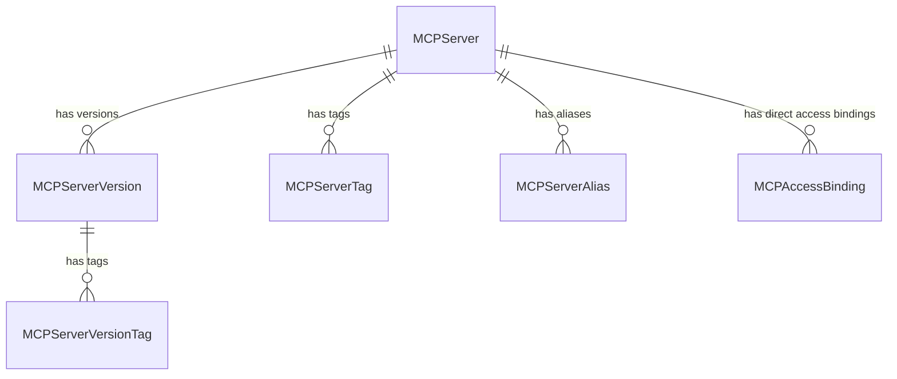
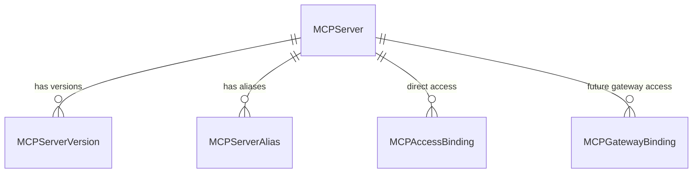
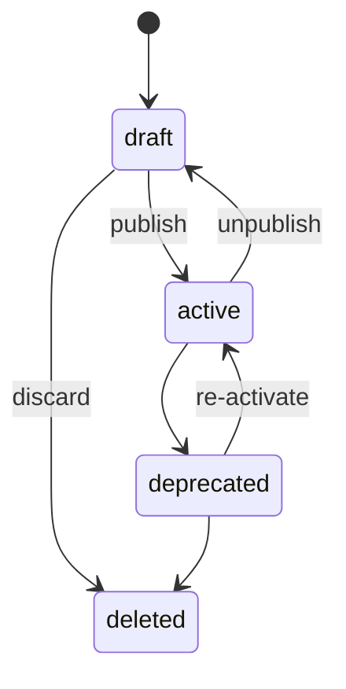
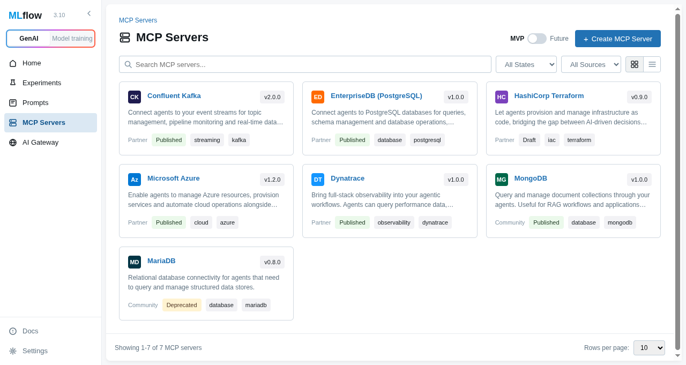
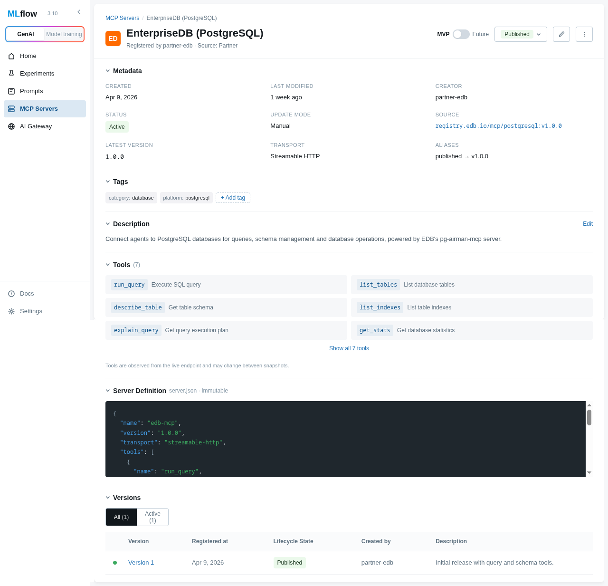

# RFC 0004: MCP Registry

| start_date   | 2026-04-20 |
| :----------- | :--------- |
| mlflow_issue | https://github.com/mlflow/mlflow/issues/22625 |
| rfc_pr       | |

| Author(s)              | [Jon Burdo](https://github.com/jonburdo), [Dan Kuc](https://github.com/dkuc), [Matthew Prahl](https://github.com/mprahl) |
| :--------------------- | :-- |
| **Date Last Modified** | 2026-05-04 |
| **AI Assistant(s)**    | Claude Code, GPT 5.4 |

**Table of contents**

- [Summary](#summary)
- [Basic example](#basic-example)
- [Motivation](#motivation)
  - [The problem](#the-problem)
  - [Registry vs. Gateway](#registry-vs-gateway)
  - [Use cases](#use-cases)
  - [User journeys](#user-journeys)
    - [Additional Phase 1 flows](#additional-phase-1-flows)
  - [Out of scope](#out-of-scope)
- [MCP registry spec alignment](#mcp-registry-spec-alignment)
- [Detailed design](#detailed-design)
  - [Entities and data model](#entities-and-data-model)
  - [Status lifecycle](#status-lifecycle)
  - [Database schema](#database-schema)
  - [Abstract store interface](#abstract-store-interface)
  - [REST API](#rest-api)
  - [Python SDK](#python-sdk)
  - [server_json validation](#server_json-validation)
  - [UI](#ui)
  - [Trace linking](#trace-linking)
  - [Impact on existing MLflow components](#impact-on-existing-mlflow-components)
- [Drawbacks](#drawbacks)
- [Alternatives](#alternatives)
- [Adoption strategy](#adoption-strategy)
- [Open questions](#open-questions)

# Summary

Add an MCP Registry to MLflow — a governed, versioned registry for [Model Context Protocol](https://modelcontextprotocol.io/) (MCP) server definitions. The registry stores metadata-first records aligned with the [upstream MCP registry specification](https://registry.modelcontextprotocol.io/docs), but differs from an MCP gateway: it is the system of record for canonical server definitions, version history, aliases, governance, and approved direct-access bindings, rather than the live traffic layer that mediates MCP requests. The design is intended to integrate cleanly with a future MCP gateway in MLflow AI Gateway, while remaining useful on its own as a governed registry. This is intended to complement, not replace, the public GitHub-hosted MCP registry.

MLflow MCP should feel like one product. The registry is the governed source of truth, and a future MLflow MCP Gateway should build on the same server identities, versions, and aliases rather than introducing a separate MCP catalog. Gateway-managed deployment records can be layered on top later, but the catalog remains the registry. In the UX, this naturally yields two complementary listings over the same governed data: a registry listing of all governed MCP servers, and an access-binding listing of approved direct endpoints currently surfaced in a workspace.

MLflow stores the publisher-declared `server_json["version"]` as the canonical version of a server definition. It does not introduce a second MLflow-specific version. Approved direct connectivity, when present, is represented by separate `MCPAccessBinding` records rather than mutable runtime metadata on the version itself.

# Basic example

## Register an MCP server and create a version

```python
import mlflow

# Register an MCP server from a server.json payload.
# name and version are extracted from server_json.
# The parent MCPServer is auto-created if it doesn't exist.
version = mlflow.genai.register_mcp_server(
    server_json={
        "name": "io.github.anthropic/brave-search",
        "title": "Brave Search",
        "description": "MCP server for Brave Search API integration",
        "version": "1.0.0",
        "packages": [
            {
                "registryType": "npm",
                "registryBaseUrl": "https://registry.npmjs.org",
                "identifier": "@anthropic/server-brave-search",
                "version": "1.0.0",
                "transport": {"type": "stdio"},
                "environmentVariables": [
                    {
                        "name": "BRAVE_API_KEY",
                        "description": "Brave Search API Key",
                        "isRequired": True,
                        "isSecret": True,
                    }
                ],
            }
        ],
    },
)
# version.status == "draft" (default — not yet visible to downstream consumers)
# version.version == "1.0.0" (extracted from server_json)
# version.name == "io.github.anthropic/brave-search" (extracted from server_json)

# Publish the version to make it discoverable
mlflow.genai.update_mcp_server_version(
    name="io.github.anthropic/brave-search",
    version="1.0.0",
    status="active",
)

# Set an alias for stable resolution
mlflow.genai.set_mcp_server_alias(
    name="io.github.anthropic/brave-search",
    alias="production",
    version="1.0.0",
)
```

## Discover and consume MCP servers

```python
# Search for active MCP servers (status is derived from the resolved latest version)
servers = mlflow.genai.search_mcp_servers(
    filter_string="status = 'active'",
)

# Get a specific version
version = mlflow.genai.get_mcp_server_version(
    name="io.github.anthropic/brave-search",
    version="1.0.0",
)
# version.server_json contains the full upstream MCP payload

# Resolve by alias
version = mlflow.genai.get_mcp_server_version_by_alias(
    name="io.github.anthropic/brave-search",
    alias="production",
)
```

## Associate approved direct access

```python
# Record an approved direct access path for the production alias.
binding = mlflow.genai.create_mcp_access_binding(
    name="io.github.anthropic/brave-search",
    alias="production",
    endpoint_url="https://mcp.acme.internal/brave-search",
)

# binding.endpoint_url == "https://mcp.acme.internal/brave-search"
```

## Motivation

### The problem

As MCP adoption grows, organizations accumulate MCP server definitions across teams and environments. Today, MLflow has no way to govern them. There is no single place to:

- Record which MCP servers exist and what state they are in
- Version MCP server definitions as they evolve
- Control which MCP servers are available to specific users, teams, or agents
- Associate traces with governed MCP server versions for rollback analysis, fixes, and lightweight auditing when runtimes participate in MLflow-aware tracing
- Provide downstream systems (catalogs, gateways, agent frameworks) with a governed source of truth

### Registry vs. Gateway

The MCP Registry and an MCP Gateway are related but distinct capabilities:

- **MCP Registry**: the control-plane system of record for governed MCP assets. It stores canonical `server_json`, version history, aliases, tags, lifecycle state, and direct access binding records that describe approved non-gateway connection paths.
- **MCP Gateway**: a runtime data-plane service that receives live client traffic and mediates connectivity, authentication, routing, policy enforcement, and request-time observability. In MLflow, a future gateway should consume registry identities and version/alias resolution, while owning its own runtime deployment records and policies.

This RFC defines the registry layer first. It does **not** yet design the MLflow MCP Gateway runtime, extend the existing AI Gateway into an MCP Gateway, or define MCP proxy semantics. Instead, it establishes the governed MCP server identities, aliases, and direct-access records that a future gateway would resolve against, so gateway configuration is derived from the registry rather than becoming a second source of truth.

### Use cases

1. **Governed registration**: Platform administrators register MCP server definitions (both internally developed packages and hosted remote endpoints) as governed, versioned assets with stable identity
2. **Lifecycle management**: MCP server versions move through statuses (draft → active → deprecated → deleted) to control downstream surfacing
3. **Discovery and resolution**: MLflow-aware clients and runtimes discover active MCP servers and resolve them by name + version or alias
4. **Direct connectivity association**: Operators can record approved direct connection paths as first-class binding records, bridging the gap between "what is governed" and "what is live"
5. **Version history**: Multiple versions of an MCP server coexist with independent lifecycle states, supporting deprecation without erasing history
6. **After-the-fact governance**: MCP servers already running in a hosted environment can have registry records and direct-access bindings created after the fact, associating existing deployments with governed assets without requiring redeployment

### User journeys

Journey 1 and the additional Phase 1 flows below are fully in scope for Phase 1. Journey 2 shows the intended future MLflow MCP Gateway integration that this registry design is meant to enable.

#### Journey 1: Governed registry with direct MCP access

1. An admin registers an MCP server definition in MLflow from a canonical `server.json` payload (stored by MLflow as `server_json`), such as a public NPM-backed server or an internally hosted remote server.
2. A new MCP server entry appears in the registry listing with its version history and metadata, even before it has any approved access path.
3. The admin optionally sets aliases such as `dev`, `staging`, and `production`, and records approved direct-access bindings for any remote endpoints that users are allowed to call directly.
4. The workspace can also show a separate access-binding listing that surfaces the approved direct endpoints currently available in that workspace.
5. The admin grants appropriate permissions through MLflow's permission model.
6. End users can browse either the registry listing to see all governed MCP servers, or the access-binding listing to see the approved direct endpoints currently surfaced in the workspace. From the registry listing, they can inspect the canonical `server_json` definition for local/package-based consumption. From the access-binding listing, they can select a direct endpoint and follow it back to the governed server, version, or alias it resolves to.
7. When a new version is available, the admin registers the new `server.json`, optionally updates aliases or direct access bindings to point at it, and can optionally deprecate the older version without deleting history.
8. When MLflow-aware tracing is enabled and the MCP server or runtime participates in that tracing flow, traces can be associated with the governed MCP server version for debugging, rollback and fix analysis, and lightweight auditing.

#### Additional Phase 1 flows

**Alias-based promotion without changing clients**

1. An admin registers versions `v1` and `v2` of the same `MCPServer`, allowing both to remain available at the same time for legacy and new clients.
2. The admin creates an access binding that targets an alias such as `production` rather than pinning the binding to a raw version string.
3. Clients continue resolving the same alias while the admin moves the alias from `v1` to `v2`, without changing the binding or client configuration.

**Agent discovers directly usable MCP servers**

1. An agent or application searches for governed MCP servers that currently have approved direct-access paths.
2. The returned server records include access binding summaries so the agent can choose an approved direct endpoint without making a second discovery call.
3. The agent then chooses either local/package-based consumption from `server_json` or a remote direct endpoint from the attached access bindings, depending on the runtime it supports.

#### Journey 2: Governed registry with future gateway deployment

1. An admin registers an MCP server definition in MLflow and sees it appear in the same registry listing and version history used in Journey 1.
2. As a future integration, the admin uses a `Deploy` action or API to publish that governed server through MLflow MCP Gateway.
3. That deploy flow creates or updates a gateway-owned runtime record (for example, an `MCPGatewayBinding`) that targets the chosen governed version or alias, while keeping the registry as the system of record for identity and lifecycle.
4. Once gateway access is active, the same governed MCP server can be surfaced through availability-oriented discovery without introducing a separate gateway catalog. The gateway contributes another access path, but discovery still points back to the same governed server identity in the registry.
5. The admin grants appropriate permissions through MLflow's permission model.
6. End users discover the server through the same registry listing and any derived availability filtering, then connect through MLflow MCP Gateway using MLflow-managed access. The gateway resolves the request to the governed MCP server version or alias recorded in the registry.
7. For version updates, if the gateway-owned deployment record targets an alias, the admin can move that alias so gateway traffic follows the governed pointer without updating the gateway record or forcing every client to adopt a new raw version string.
8. Older versions can be deprecated in the registry by the admin, and future gateway/runtime behavior can surface that deprecation signal to users consistently.

### Out of scope

- **Runtime execution and orchestration** — The registry may store direct access binding records, but it does not provision, host, scale, or manage MCP runtimes
- **End-user connectivity, proxying, or usage control enforcement** — Consumers can still connect directly to an MCP endpoint unless a future MLflow gateway or proxy mediates access; centralized MLflow-credential-based access through a gateway is future work
- **MCP Gateway runtime and deployment UX** — This RFC does not define the MLflow MCP Gateway runtime, including request routing, protocol mediation, authentication behavior, usage control, runtime APIs, deploy UX, or gateway-managed binding entities
- **Upstream MCP registry API compatibility layer** — A separate router implementing the upstream `GET /v0.1/servers` API shape is deferred to [Phase 2](#adoption-strategy); this RFC defines MLflow-native APIs

## MCP registry spec alignment

This design aligns with the [upstream MCP registry specification](https://registry.modelcontextprotocol.io/docs) where possible. The spec references in this RFC are based on registry repo [v1.6.0](https://github.com/modelcontextprotocol/registry/releases/tag/v1.6.0) (2026-04-15) and the [server.json schema draft (2025-09-29)](https://json-schema.app/view/%23?url=https%3A%2F%2Fstatic.modelcontextprotocol.io%2Fschemas%2F2025-09-29%2Fserver.schema.json).

**What we adopt directly:**
- The `server.json` (ServerJSON) payload format as the canonical MCP server definition
- The `_meta` namespacing convention for extension metadata
- The concept of server versions with status lifecycle

**What we adapt to MLflow conventions:**
- **API prefix**: MLflow-native REST API (`/ajax-api/3.0/mlflow/mcp-servers/`) rather than the upstream `/v0.1/servers` prefix, because MLflow APIs integrate with MLflow's authentication, workspace, and permission infrastructure
- **URL structure**: RESTful nested paths (matching both upstream MCP and newer MLflow AI asset registry APIs) rather than the older flat action-suffix paths used in the model registry
- **Pagination**: Page-token-based (MLflow convention) rather than cursor-based (upstream convention)
- **Filtering**: SQL-like `filter_string` (MLflow convention) rather than individual query parameters (upstream convention)
- **Version management**: Publisher-supplied version strings (matching upstream) rather than auto-incremented integers
- **Extra features**: Tags, aliases, and workspace scoping extend beyond the upstream spec to match MLflow conventions

**Future compatibility ([Phase 2](#adoption-strategy))**: The upstream MCP Registry spec (v0.1, API frozen October 2025) defines an open API standard that any registry can implement. MLflow could add a thin FastAPI compatibility router that implements the upstream API shape, proxying to the same store layer:

- **Endpoint mapping**: all 8 upstream endpoints map closely to the MLflow-native API shape. The main nuance is upstream version update: the upstream spec includes an optional in-place version update endpoint, but the official MCP registry does not implement it. In MLflow, canonical publisher-managed `server_json` changes are represented by registering a new version, while mutable MLflow-specific fields remain editable through MLflow-native update APIs.
- **Response translation**: wrap MLflow entities in the upstream `{servers: [{server, _meta}]}` envelope, with MLflow-specific metadata (tags, aliases, workspace) in a custom `_meta` namespace (e.g., `org.mlflow`)
- **Status mapping**: MLflow extends the upstream status values (`active`/`deprecated`/`deleted`) with an additional `draft` state for staging versions before publication. The upstream spec does not define a draft state, so the Phase 2 compatibility router will need to decide how to handle it — for example, filtering `draft` versions from read responses and auto-publishing versions created through the upstream write API, or exposing `draft` as a non-standard extension. The exact mapping is deferred to Phase 2 design. MLflow's `deleted` is a soft delete — records are preserved for history
- **Pagination**: cursor ↔ page_token translation
- **Workspace**: MLflow's existing middleware already extracts `X-MLFLOW-WORKSPACE` from incoming request headers, so external clients pass the workspace header alongside standard Bearer auth — no protocol changes needed

This would allow any tool built against the upstream spec (IDE plugins, agent frameworks, AI coding assistants) to discover MLflow-registered MCP servers without MLflow-specific integration. The translation layer is purely a presentation concern (~50 lines per endpoint) with no impact on the native API or store.

## Detailed design

### Entities and data model

The MCP server registry introduces the following entities:



Access bindings are attached to a parent `MCPServer` and target either a specific version or an alias on that server.

A future gateway-managed entity such as `MCPGatewayBinding` would follow the same parent/target pattern, but is omitted from the Phase 1 entity diagram because its gateway-specific fields and lifecycle are intentionally out of scope for this RFC.

#### MCPServer

The logical governed asset, scoped to a workspace.

```python
from dataclasses import dataclass, field
from enum import StrEnum


@dataclass
class MCPServer:
    name: str  # extracted from server_json; reverse-DNS format (e.g., "io.github.user/server"); PK within workspace
    display_name: str | None = None  # mutable human-readable label; falls back to server_json["title"], then name
    description: str | None = None
    workspace: str | None = None  # resolved via resolve_entity_workspace_name()
    status: MCPStatus | None = None  # read-only; derived from the resolved latest version's status
    tags: dict[str, str] = field(default_factory=dict)
    aliases: dict[str, str] = field(default_factory=dict)  # read-only; populated from mcp_server_aliases table, e.g. {"production": "1.2.0"}
    access_bindings: list["MCPAccessBinding"] = field(default_factory=list)  # read-only
    latest_version: str | None = None  # optional explicit version string to resolve as "latest"
    created_by: str | None = None
    last_updated_by: str | None = None
    creation_timestamp: int | None = None
    last_updated_timestamp: int | None = None
```

**Name identity**: `name` is extracted from `server_json["name"]` and follows the upstream spec's reverse-DNS format (e.g., `io.github.user/brave-search`). This format prevents name collisions by construction — the namespace portion identifies the publisher. The `name` is immutable and serves as the primary key within a workspace. For display purposes, `display_name` is a mutable user-supplied label on `MCPServer`. UIs resolve display names as: `display_name` (if set) → `server_json["title"]` (if present) → `name`.

**Audit field population**: `created_by` and `last_updated_by` are populated from the authenticated MLflow user when authentication is enabled. In unauthenticated installs, these fields remain empty.

**Latest resolution**: MLflow treats `latest` as a reserved system pointer rather than a normal alias. Unlike Model Registry, which uses MLflow-controlled increasing version numbers, MCP server versions are publisher-supplied strings from `server_json["version"]`, so MLflow cannot rely on version identity alone to define a universal `latest`. `MCPServer.latest_version` can explicitly pin which version resolves as `@latest`. If it is unset, MLflow falls back to the most recently created non-`draft` version. Draft versions are ignored when calculating `latest`, so staging a draft does not change downstream `@latest` resolution or the derived server status. If no non-`draft` version exists yet, the server has no resolved latest version.

#### MCPServerVersion

A versioned record containing an immutable MCP payload and mutable MLflow-managed metadata.

```python
class MCPStatus(StrEnum):
    DRAFT = "draft"  # registered but not yet ready for downstream consumption
    ACTIVE = "active"
    DEPRECATED = "deprecated"
    DELETED = "deleted"  # soft delete — retained internally for history, excluded from normal get/search/list APIs


@dataclass
class MCPServerVersion:
    name: str  # parent MCPServer name
    version: str  # extracted from server_json["version"]; semver recommended
    server_json: dict  # immutable upstream MCP ServerJSON payload
    display_name: str | None = None  # mutable human-readable label
    status: MCPStatus = MCPStatus.DRAFT
    aliases: list[str] = field(default_factory=list)  # read-only; alias names from parent mcp_server_aliases rows currently pointing at this version
    tags: dict[str, str] = field(default_factory=dict)
    source: str | None = None  # provenance URI (e.g., git repository URL)
    workspace: str | None = None
    created_by: str | None = None
    last_updated_by: str | None = None
    creation_timestamp: int | None = None
    last_updated_timestamp: int | None = None
```

**Immutability contract**: `name`, `version`, and `server_json` are immutable after creation. To change the canonical publisher-managed MCP payload, register a new version rather than mutating an existing one in place. This is an intentional MLflow choice even though the upstream API spec defines an optional version-update endpoint. Mutable MLflow-managed fields (`status`, `tags`) can still be updated independently. Approved direct connectivity is modeled separately via `MCPAccessBinding`.

Retaining older versions enables:

- **Trace provenance**: show exactly which `server_json` was in effect when a trace ran
- **Deprecation signaling**: consumers see a deprecated version and know to migrate
- **Audit / compliance**: know which tool definitions were available to agents at a given point in time

**Version uniqueness**: The combination of `(name, version)` is unique within a workspace. This means each version string can only be registered once per server.

**Version string conventions**: The version string is extracted from `server_json["version"]`. Semantic versioning is recommended but not enforced — any non-empty string is accepted.

**Alias storage model**: Following MLflow's existing registered model design, alias rows are stored parent-scoped on `MCPServer` as alias → version mappings, while version entities also expose `MCPServerVersion.aliases` for the alias names currently targeting that version. This means users can inspect aliases directly on a version even though aliases are stored in a top-level table. The alias name `latest` is reserved and not stored in `mcp_server_aliases`.

**Typed payload**: The `server_json` field uses `dict` in the entity and store layers for simplicity. At the API layer, the `CreateMCPServerVersionRequest` uses a `ServerJSONPayload` Pydantic model (with `extra="allow"`) that validates the payload on ingestion and extracts typed fields. See [server_json validation](#server_json-validation).

#### MCPAccessBinding

A direct access binding is the separate record that says a governed MCP server version or alias can be reached through an approved non-gateway endpoint. An `MCPServerVersion` is the governed metadata record for a server definition; by itself, it does not mean there is an approved direct endpoint available in the workspace. `MCPAccessBinding` is what makes that governed server show up in direct-access discovery. The registry is intentionally runtime-agnostic: MLflow-aware clients or runtimes may resolve a registered MCP server through MLflow and then either use the canonical `server_json` payload directly (for example, for local `packages[]` consumption) or follow an approved direct access binding. When the canonical server definition changes, publishers register a new version. When only direct connectivity changes, operators create or update access bindings without creating a new version.

```python
@dataclass
class MCPAccessBinding:
    binding_id: int  # stable MLflow-managed binding identifier
    name: str  # parent MCPServer name
    endpoint_url: str  # required approved direct endpoint
    version: str | None = None  # exactly one of version / alias must be set
    alias: str | None = None
    workspace: str | None = None
    created_by: str | None = None
    last_updated_by: str | None = None
    creation_timestamp: int | None = None
    last_updated_timestamp: int | None = None
```

```python
# Future example, intentionally out of scope for this RFC:
@dataclass
class MCPGatewayBinding(MCPAccessBinding):
    # gateway-specific fields intentionally omitted
    pass
```

**Binding target**: An access binding points to either a concrete `version` or an `alias`, but never both. A binding that follows an alias is useful for operational flows such as "production" where the live endpoint should track a stable governance pointer rather than a pinned version string.

**Why a separate entity**: Direct connectivity changes independently from the canonical MCP definition. Modeling approved direct access as a separate binding avoids mutating version records when an endpoint moves, when an alias changes, or when multiple approved direct entrypoints exist for the same governed server. It is valid for multiple versions of the same `MCPServer` to be available at once, for example to support both `v1` and `v2` clients during a migration, and the model does not prevent multiple approved direct endpoints from targeting the same governed version when needed.

**Binding lifecycle**: An access binding exists only while the direct access path should be surfaced. When a direct endpoint is no longer approved, the binding is deleted.

**Future gateway relationship**: A future MLflow MCP Gateway may introduce its own gateway-managed deployment entity (for example, `MCPGatewayBinding`) that resolves against the same governed `name` + `version` or alias model in the registry. The conceptual subclass example above is illustrative only: it shows that the gateway would reuse the same parent/target resolution pattern while adding gateway-specific fields and lifecycle that remain intentionally out of scope for this RFC. This RFC only defines direct access bindings.

#### Future gateway path (informative)

The intended future evolution path is:

1. The registry remains the source of truth for governed server identity and resolution through `MCPServer`, `MCPServerVersion`, and `MCPServerAlias`. In Phase 1, it also owns the direct-access `MCPAccessBinding` records.
2. A future MLflow MCP Gateway introduces a gateway-owned deployment entity such as `MCPGatewayBinding` that points to the same governed server and resolves through either a concrete `version` or an `alias`.
3. Discovery remains unified: the registry listing continues to show governed MCP servers, while availability-oriented discovery can surface either direct-access bindings or future gateway-managed access paths without creating a second MCP catalog.
4. Version rollouts continue to use governed aliases. If a gateway-owned deployment record targets an alias, moving that alias updates the resolved governed version without requiring the gateway deployment record itself to change.
5. Trace linking continues to resolve through governed identity: gateway request -> gateway-managed binding -> governed alias or version -> `{workspace, name, version}`.



#### server_json and the upstream MCP specification

The `server_json` field stores the canonical MCP server definition following the upstream [server.json specification](https://registry.modelcontextprotocol.io/docs#/schemas/ServerJSON). This payload is passed through from the publisher and stored as-is.

Below is a subset of the fields that the upstream spec defines:

- **`name`**, **`version`**, **`description`**, **`title`**: Identity and descriptive metadata
- **`packages[]`**: Installable package configurations (npm, pypi, oci, nuget, mcpb) with transport type, environment variables, and arguments
- **`remotes[]`**: Remote endpoint configurations (streamable-http, sse) with headers and URL templating
- **`repository`**: Source repository reference
- **`websiteUrl`**: Documentation URL
- **`_meta`**: Extension metadata with reverse-DNS namespacing

MLflow preserves the full `server_json` payload as provided by the publisher, and MLflow-aware clients can read and parse that full payload directly. Publisher-declared `remotes[]` remain part of the preserved upstream metadata, but they are not the MLflow source of truth for approved direct enterprise connectivity.

**Source of truth for direct access**: `MCPAccessBinding` is the MLflow-governed source of truth for approved direct endpoints that MLflow should surface to users. For convenience, registration helpers may optionally create bindings from declared `remotes[]`, but once created the binding is the governed record MLflow uses for approved direct connectivity. When `create_access_bindings_from_remotes=True`, the helper creates one direct-access binding per declared `remotes[]` entry, targets the newly created version, and uses the literal `url` value from the upstream payload.

MLflow-managed fields such as `status` are stored as first-class MLflow fields on `MCPServerVersion`, **not** inside `server_json`. Direct access bindings are stored in `MCPAccessBinding`, not embedded into `server_json`. In API responses, version-level MLflow-managed fields are projected into a namespaced `_meta` block for interoperability:

```json
{
  "name": "io.github.anthropic/brave-search",
  "version": "1.0.0",
  "server_json": {
    "name": "io.github.anthropic/brave-search",
    "version": "1.0.0",
    "packages": [...]
  },
  "_meta": {
    "org.mlflow.registry": {
      "mlflow-managed": {
        "status": "active"
      }
    }
  }
}
```

#### MCPServerAlias and MCPServerTag

```python
@dataclass(frozen=True)
class MCPServerAlias:
    name: str      # parent MCPServer name
    alias: str     # e.g., "production", "staging"
    version: str   # version string this alias points to

@dataclass(frozen=True)
class MCPServerTag:
    key: str
    value: str
```

Aliases provide stable version pointers. For example, setting alias `"production"` to version `"1.2.0"` allows consumers to resolve `get_mcp_server_version_by_alias("my-server", "production")` without tracking specific version strings. `MCPServer` exposes the full alias → version map, and version entities expose the subset of alias names that currently target that version.

Aliases are most useful when more than one version may intentionally be live at once. Common patterns include `dev` / `staging` / `production` promotion, parallel deployment of old and new versions during a breaking change, legacy `v1` and `v2` compatibility under the same governed server identity, and local workflows where users intentionally choose among multiple versions. Because access bindings can target aliases, operators can move a stable environment pointer without changing the governed server identity or forcing every client to track a raw version string.

#### Future entity: MCPObservedTool (deferred)

A future enhancement may introduce `MCPObservedTool` and `MCPObservedToolSnapshot` entities to cache tool metadata observed from live MCP endpoints. These would store tool names, descriptions, and input schemas discovered by probing running servers — separate from the canonical `server_json` payload. This is out of scope for the initial implementation but the data model is designed to accommodate it.

### Status lifecycle

#### Per-version status

Each `MCPServerVersion` has an independent status controlling downstream surfacing:



| State | Meaning | Downstream surfacing |
|---|---|---|
| `draft` | Registered but not yet ready for downstream consumption | Not surfaced — invisible to catalogs, gateways, consumers |
| `active` | Ready for downstream use | Surfaced to catalogs, gateways, consumers |
| `deprecated` | Still functional but no longer recommended | Surfaced with deprecation signal |
| `deleted` | Soft-deleted — record preserved for history, no longer active | Not surfaced |

**Allowed transitions**: The API enforces valid transitions. Attempting an invalid transition returns an error with `INVALID_PARAMETER_VALUE`.

| From | To |
|---|---|
| `draft` | `active`, `deleted` |
| `active` | `draft`, `deprecated` |
| `deprecated` | `active`, `deleted` |

`draft` lets teams stage MCP server versions — validating metadata, setting aliases, and configuring access bindings — before making them discoverable. Transitioning from `draft` to `active` is an explicit publish action. A draft can also be discarded directly (`draft` → `deleted`) without ever being published. `active` can return to `draft` (unpublish) when a version was published prematurely or needs rework. Draft versions do not affect latest resolution or derived server status.

`deprecated` can return to `active` (re-activate) to handle cases where a deprecation was premature or a planned replacement is not yet ready. `deleted` is terminal.

#### Server-level status (derived)

`MCPServer.status` is read-only, derived from the resolved latest version's `status`. This avoids maintaining two independent lifecycles and aligns with upstream, which only has version-level status. The server's status gives a quick summary for UI filtering without requiring clients to inspect individual versions.

### Database schema

Six tables, created via a single Alembic migration. All tables are workspace-scoped following MLflow's existing workspace-scoped resource patterns.

#### `mcp_servers` — one row per logical MCP server

| Column | Type | Notes |
|--------|------|-------|
| `workspace` | `String(63)` | PK, default `'default'` |
| `name` | `String(256)` | PK |
| `display_name` | `String(256)` | mutable human-readable label |
| `description` | `String(5000)` | |
| `latest_version` | `String(256)` | optional explicit version string to resolve as `latest` |
| `created_by` | `String(256)` | |
| `last_updated_by` | `String(256)` | |
| `creation_timestamp` | `BigInteger` | millis since epoch |
| `last_updated_timestamp` | `BigInteger` | millis since epoch |

#### `mcp_server_versions` — one row per version

| Column | Type | Notes |
|--------|------|-------|
| `workspace` | `String(63)` | PK, FK → mcp_servers |
| `name` | `String(256)` | PK, FK → mcp_servers |
| `version` | `String(256)` | PK, publisher-supplied |
| `server_json` | `JSON` | immutable canonical MCP payload |
| `display_name` | `String(256)` | mutable human-readable label |
| `status` | `String(20)` | default `'draft'` |
| `source` | `String(512)` | provenance URI |
| `created_by` | `String(256)` | |
| `last_updated_by` | `String(256)` | |
| `creation_timestamp` | `BigInteger` | millis since epoch |
| `last_updated_timestamp` | `BigInteger` | millis since epoch |

FK: `(workspace, name)` → `mcp_servers`, CASCADE delete.

#### `mcp_server_tags` — server-level key-value metadata

| Column | Type | Notes |
|--------|------|-------|
| `workspace` | `String(63)` | PK, FK → mcp_servers |
| `name` | `String(256)` | PK, FK → mcp_servers |
| `key` | `String(256)` | PK |
| `value` | `Text` | |

#### `mcp_server_version_tags` — version-level key-value metadata

| Column | Type | Notes |
|--------|------|-------|
| `workspace` | `String(63)` | PK, FK → mcp_server_versions |
| `name` | `String(256)` | PK, FK → mcp_server_versions |
| `version` | `String(256)` | PK, FK → mcp_server_versions |
| `key` | `String(256)` | PK |
| `value` | `Text` | |

#### `mcp_server_aliases` — stable version pointers

| Column | Type | Notes |
|--------|------|-------|
| `workspace` | `String(63)` | PK, FK → mcp_servers |
| `name` | `String(256)` | PK, FK → mcp_servers |
| `alias` | `String(256)` | PK |
| `version` | `String(256)` | target version string |

FK: `(workspace, name)` → `mcp_servers`, CASCADE delete/update.

This matches MLflow's registered model alias pattern: aliases are stored in a parent-scoped table, and the target version is validated when aliases are set and projected back onto version entities when they are read.

#### `mcp_access_bindings` — approved direct connection paths

| Column | Type | Notes |
|--------|------|-------|
| `workspace` | `String(63)` | PK component |
| `binding_id` | `BigInteger` | PK, auto-incrementing binding ID |
| `name` | `String(256)` | FK → mcp_servers |
| `version` | `String(256)` | nullable; exactly one of `version` / `alias` must be set |
| `alias` | `String(256)` | nullable |
| `endpoint_url` | `String(2048)` | direct endpoint URL |
| `created_by` | `String(256)` | |
| `last_updated_by` | `String(256)` | |
| `creation_timestamp` | `BigInteger` | millis since epoch |
| `last_updated_timestamp` | `BigInteger` | millis since epoch |

FK: `(workspace, name)` → `mcp_servers`, CASCADE delete.

**Validation**: Application-level validation enforces that exactly one of `version` / `alias` is set. For `version` bindings, the version must exist on the parent server. For `alias` bindings, the alias must exist on the parent server. `endpoint_url` is required. A future MLflow MCP Gateway may define and manage its own gateway-side binding/deployment entity against the same governed server identities.

**Indexes**:

- `ix_mcp_access_bindings_name` on `(workspace, name)`
- `ix_mcp_access_bindings_version` on `(workspace, name, version)`
- `ix_mcp_access_bindings_alias` on `(workspace, name, alias)`

**JSON columns**: `server_json` uses SQLAlchemy's `JSON` type (with `mssql.JSON` for SQL Server), following the pattern established by MLflow's evaluation dataset records and span dimension attributes. This maps to native `JSON` on PostgreSQL and MySQL (with database-level validation on write), and to `NVARCHAR(MAX)` / `TEXT` on MSSQL and SQLite.

**Workspace handling**: All tables are workspace-scoped. Server-scoped tables use `(workspace, name)` as their leading identity components, while access binding tables use `(workspace, binding_id)`. Single-tenant deployments use the `'default'` workspace.

**Binding IDs**: `binding_id` is an integer-style MLflow-managed identifier, similar in spirit to experiment IDs. It gives access bindings a stable, concise resource key without overloading mutable fields such as `version`, `alias`, or `endpoint_url` as part of the binding's identity. The nested API paths retain `name` for parent-resource scoping, authorization, and URL consistency even though `binding_id` is the stable binding identifier. Because binding IDs are scoped to a workspace rather than allocated globally across all workspaces, `(workspace, binding_id)` remains the natural primary and foreign-key identity.

**Timestamps**: Set at the application layer via `get_current_time_millis()`, not via DDL defaults.

### Abstract store interface

The store interface is implemented as a mixin class (`MCPServerRegistryMixin`) that the tracking store's `AbstractStore` inherits from. This follows the same pattern used by `GatewayStoreMixin` — MCP server registry code lives in its own files while composing into the tracking store hierarchy via multiple inheritance.

```
mlflow/store/tracking/mcp_server_registry/
├── abstract_mixin.py          # MCPServerRegistryMixin — abstract interface
├── sqlalchemy_mixin.py        # SqlAlchemyMCPServerRegistryMixin
└── rest_mixin.py              # RestMCPServerRegistryMixin
```

All methods operate within the caller's workspace scope.

```python
class MCPServerRegistryMixin:
    # Methods raise NotImplementedError rather than using @abstractmethod,
    # following the GatewayStoreMixin pattern. This allows stores that don't
    # support MCP servers (e.g., FileStore) to work without stubbing every method.

    # --- MCPServer operations ---

    def create_mcp_server(self, name: str, description: str | None = None) -> MCPServer:
        raise NotImplementedError(self.__class__.__name__)

    def get_mcp_server(self, name: str) -> MCPServer:
        raise NotImplementedError(self.__class__.__name__)

    def search_mcp_servers(
        self,
        filter_string: str | None = None,
        max_results: int = 100,
        order_by: list[str] | None = None,
        page_token: str | None = None,
    ) -> PagedList[MCPServer]:
        raise NotImplementedError(self.__class__.__name__)

    def update_mcp_server(
        self,
        name: str,
        description: str | None = None,
        display_name: str | None = None,
        latest_version: str | None = None,
    ) -> MCPServer:
        raise NotImplementedError(self.__class__.__name__)

    def delete_mcp_server(self, name: str) -> None:
        raise NotImplementedError(self.__class__.__name__)

    # --- MCPServerVersion operations ---

    def create_mcp_server_version(
        self,
        server_json: dict,
        display_name: str | None = None,
        source: str | None = None,
        status: MCPStatus | None = None,  # defaults to DRAFT
    ) -> MCPServerVersion:
        raise NotImplementedError(self.__class__.__name__)

    def get_mcp_server_version(self, name: str, version: str) -> MCPServerVersion:
        raise NotImplementedError(self.__class__.__name__)

    def get_mcp_server_version_by_alias(self, name: str, alias: str) -> MCPServerVersion:
        raise NotImplementedError(self.__class__.__name__)

    def get_latest_mcp_server_version(self, name: str) -> MCPServerVersion:
        raise NotImplementedError(self.__class__.__name__)

    def search_mcp_server_versions(
        self,
        name: str,
        filter_string: str | None = None,
        max_results: int = 100,
        order_by: list[str] | None = None,
        page_token: str | None = None,
    ) -> PagedList[MCPServerVersion]:
        raise NotImplementedError(self.__class__.__name__)

    def update_mcp_server_version(
        self,
        name: str,
        version: str,
        display_name: str | None = None,
        status: MCPStatus | None = None,
    ) -> MCPServerVersion:
        raise NotImplementedError(self.__class__.__name__)

    def delete_mcp_server_version(self, name: str, version: str) -> None:
        raise NotImplementedError(self.__class__.__name__)

    # --- MCPAccessBinding operations ---

    def create_mcp_access_binding(
        self,
        name: str,
        endpoint_url: str,
        version: str | None = None,
        alias: str | None = None,
    ) -> MCPAccessBinding:
        raise NotImplementedError(self.__class__.__name__)

    def get_mcp_access_binding(self, name: str, binding_id: int) -> MCPAccessBinding:
        raise NotImplementedError(self.__class__.__name__)

    def search_mcp_access_bindings(
        self,
        name: str | None = None,
        filter_string: str | None = None,
        max_results: int = 100,
        order_by: list[str] | None = None,
        page_token: str | None = None,
    ) -> PagedList[MCPAccessBinding]:
        raise NotImplementedError(self.__class__.__name__)

    def update_mcp_access_binding(
        self,
        name: str,
        binding_id: int,
        version: str | None = None,
        alias: str | None = None,
        endpoint_url: str | None = None,
    ) -> MCPAccessBinding:
        raise NotImplementedError(self.__class__.__name__)

    def delete_mcp_access_binding(self, name: str, binding_id: int) -> None:
        raise NotImplementedError(self.__class__.__name__)

    # --- Tag operations (key/value style, not tag-object style) ---

    def set_mcp_server_tag(self, name: str, key: str, value: str) -> None:
        raise NotImplementedError(self.__class__.__name__)

    def delete_mcp_server_tag(self, name: str, key: str) -> None:
        raise NotImplementedError(self.__class__.__name__)

    def set_mcp_server_version_tag(self, name: str, version: str, key: str, value: str) -> None:
        raise NotImplementedError(self.__class__.__name__)

    def delete_mcp_server_version_tag(self, name: str, version: str, key: str) -> None:
        raise NotImplementedError(self.__class__.__name__)

    # --- Alias operations ---

    def set_mcp_server_alias(self, name: str, alias: str, version: str) -> None:
        raise NotImplementedError(self.__class__.__name__)

    def delete_mcp_server_alias(self, name: str, alias: str) -> None:
        raise NotImplementedError(self.__class__.__name__)
```

**User-facing vs. store layer**: Following the general shape of MLflow model registry, the Python SDK exposes explicit create/get/search/update/delete operations for the core entities. On top of that, it also provides `register_mcp_server(...)` and `register_mcp_server_from_url(...)` as convenience helpers for the common "ingest a canonical `server.json` and create or update the parent server as needed" workflow. Internally, these helpers call the same underlying `create_mcp_server()` / `create_mcp_server_version()` flow. The URL helper is client-side and fetches the canonical `server.json` over HTTPS before calling the same registration path.

**Name and version extraction**: `create_mcp_server_version` extracts both `name` and `version` from `server_json` at the store layer. In the native REST API, version creation is nested under `/{name}/versions`; `server_json["name"]` must match the path parameter, and the matching parent `MCPServer` is looked up or auto-created if needed. If either `name` or `version` is missing from `server_json`, creation fails with a validation error. New versions default to `draft` status.

**Status transition enforcement**: `update_mcp_server_version` validates that status transitions follow the allowed paths (draft→active, draft→deleted, active→draft, active→deprecated, deprecated→active, deprecated→deleted). `deleted` is terminal. New versions default to `draft`; transitioning to `active` is an explicit publish action, and any later status change is likewise an explicit admin action rather than automatic MLflow behavior.

**Latest version**: `get_latest_mcp_server_version` first checks `MCPServer.latest_version`. If that field is set, it resolves directly to that version. Otherwise, it returns the most recently created non-`draft` version. The alias name `latest` is reserved: `set_mcp_server_alias(..., alias="latest", ...)` is rejected, while `get_mcp_server_version_by_alias(..., alias="latest")` is treated as a convenience alias for `get_latest_mcp_server_version(...)`.

### REST API

The REST API is implemented as a FastAPI router mounted at `/ajax-api/3.0/mlflow/mcp-servers/`, using RESTful nested resource paths. This follows the same approach used in newer MLflow AI asset registry APIs rather than the older flat action-suffix style used in the model registry.

#### Endpoints

All paths below are relative to the router prefix `/ajax-api/3.0/mlflow/mcp-servers`.

| Method | Path | Description |
|---|---|---|
| `POST` | `/` | Create an MCP server |
| `GET` | `/` | List/search MCP servers |
| `GET` | `/{name}` | Get MCP server by name |
| `PATCH` | `/{name}` | Update server fields |
| `DELETE` | `/{name}` | Delete MCP server (cascades to versions) |
| `POST` | `/{name}/versions` | Create a server version (`server_json["name"]` must match the path; `version` extracted from `server_json`) |
| `GET` | `/{name}/versions` | List/search versions of a server |
| `GET` | `/{name}/versions/{version}` | Get a specific version |
| `PATCH` | `/{name}/versions/{version}` | Update version (status, display name) |
| `DELETE` | `/{name}/versions/{version}` | Delete a version |
| `POST` | `/{name}/bindings` | Create a direct access binding |
| `GET` | `/bindings` | List/search access bindings across the workspace |
| `GET` | `/{name}/bindings` | List/search access bindings for a specific server |
| `GET` | `/{name}/bindings/{binding_id}` | Get an access binding |
| `PATCH` | `/{name}/bindings/{binding_id}` | Update an access binding |
| `DELETE` | `/{name}/bindings/{binding_id}` | Delete an access binding |
| `POST` | `/{name}/tags` | Set a server-level tag |
| `DELETE` | `/{name}/tags/{key}` | Delete a server-level tag |
| `POST` | `/{name}/versions/{version}/tags` | Set a version-level tag |
| `DELETE` | `/{name}/versions/{version}/tags/{key}` | Delete a version-level tag |
| `POST` | `/{name}/aliases` | Set an alias |
| `GET` | `/{name}/aliases/{alias}` | Resolve alias to version; reserved `latest` resolves through latest-version logic |
| `DELETE` | `/{name}/aliases/{alias}` | Delete an alias |

Resource identifiers (`name`, `version`, `alias`, `binding_id`, `key`) are path parameters, not query parameters. This makes URLs self-describing and enables standard HTTP caching.

Because the router exposes both a static workspace-level `GET /bindings` route and a parameterized `GET /{name}/...` namespace, the static `/bindings` route must be registered before the `/{name}` routes so the literal string `bindings` is not interpreted as a server name.

#### Request and response models

Request models contain only the mutable fields — resource identifiers come from path parameters:

```python
from pydantic import BaseModel, Field


class CreateMCPServerRequest(BaseModel):
    name: str
    description: str | None = None


class UpdateMCPServerRequest(BaseModel):
    display_name: str | None = None
    description: str | None = None
    latest_version: str | None = None


class CreateMCPServerVersionRequest(BaseModel):
    server_json: ServerJSONPayload
    display_name: str | None = None
    status: str = "draft"
    source: str | None = None


class UpdateMCPServerVersionRequest(BaseModel):
    display_name: str | None = None
    status: str | None = None


class CreateMCPAccessBindingRequest(BaseModel):
    version: str | None = None
    alias: str | None = None
    endpoint_url: str


class UpdateMCPAccessBindingRequest(BaseModel):
    version: str | None = None
    alias: str | None = None
    endpoint_url: str | None = None


class AliasResponse(BaseModel):
    alias: str
    version: str


class MCPAccessBindingSummaryResponse(BaseModel):
    binding_id: int
    endpoint_url: str
    version: str | None = None
    alias: str | None = None


class MCPServerResponse(BaseModel):
    name: str
    display_name: str | None = None
    description: str | None = None
    status: str | None = None  # derived from the resolved latest version's status
    access_bindings: list[MCPAccessBindingSummaryResponse] = Field(default_factory=list)
    latest_version: str | None = None
    aliases: list[AliasResponse] = Field(default_factory=list)
    tags: dict[str, str] = Field(default_factory=dict)
    created_by: str | None = None
    last_updated_by: str | None = None
    creation_timestamp: int | None = None
    last_updated_timestamp: int | None = None


class MCPServerVersionResponse(BaseModel):
    name: str
    version: str
    server_json: dict
    display_name: str | None = None
    status: str = "draft"
    aliases: list[str] = Field(default_factory=list)
    tags: dict[str, str] = Field(default_factory=dict)
    source: str | None = None
    created_by: str | None = None
    last_updated_by: str | None = None
    creation_timestamp: int | None = None
    last_updated_timestamp: int | None = None


class MCPAccessBindingResponse(BaseModel):
    binding_id: int
    name: str
    endpoint_url: str
    version: str | None = None
    alias: str | None = None
    created_by: str | None = None
    last_updated_by: str | None = None
    creation_timestamp: int | None = None
    last_updated_timestamp: int | None = None


class SetAliasRequest(BaseModel):
    alias: str
    version: str


class SetTagRequest(BaseModel):
    key: str
    value: str
```

`MCPServer.aliases` is modeled as a `dict[str, str]` in the entity layer for convenience, while REST responses expose aliases as `list[AliasResponse]` to keep the payload shape explicit and consistent with other response models.

#### Pagination

Search endpoints use page-token-based pagination following existing MLflow conventions:

```
GET /ajax-api/3.0/mlflow/mcp-servers/?filter_string=status%20%3D%20%27active%27&max_results=10
```

Response:

```json
{
  "mcp_servers": [...],
  "next_page_token": "..."
}
```

#### Filter expressions

The `filter_string` parameter supports expressions following existing MLflow filter syntax. Search endpoints support the subset of fields relevant to that resource type (server, version, or access binding):

- `name = 'io.github.anthropic/brave-search'`
- `name LIKE '%search%'`
- `status = 'active'`
- `status IN ('active', 'deprecated')`
- `has_access_bindings = true` (server-level only; return only governed servers that currently have at least one approved direct-access binding and in the future, gateway acces bindings)
- `tags.team = 'platform'`

`search_mcp_servers()` is the catalog-discovery API across governed MCP servers and always returns attached access binding summaries on each `MCPServer` result. `search_mcp_access_bindings()` lists approved direct-access bindings across the workspace, and `search_mcp_access_bindings(name=...)` narrows that same API to a specific governed server. The `has_access_bindings = true` filter is available for callers that only want directly usable MCP servers.

### Python SDK

The Python SDK exposes a user-facing `mlflow.genai` API that keeps the registry flows concise while still surfacing the main operations explicitly. Similar CLI commands will be added for the same operations, but this RFC does not spell out a separate CLI surface in detail.

```python
import mlflow

def register_mcp_server(
    *,
    server_json: dict,
    display_name: str | None = None,
    source: str | None = None,
    status: str = "draft",
    create_access_bindings_from_remotes: bool = False,
) -> MCPServerVersion: ...

def register_mcp_server_from_url(
    *,
    url: str,
    display_name: str | None = None,
    source: str | None = None,
    status: str = "draft",
    create_access_bindings_from_remotes: bool = False,
) -> MCPServerVersion: ...

def create_mcp_server(
    *,
    name: str,
    description: str | None = None,
) -> MCPServer: ...

def get_mcp_server(*, name: str) -> MCPServer: ...

def search_mcp_servers(
    *,
    filter_string: str | None = None,
    max_results: int = 100,
    order_by: list[str] | None = None,
    page_token: str | None = None,
) -> PagedList[MCPServer]: ...

def update_mcp_server(
    *,
    name: str,
    display_name: str | None = None,
    description: str | None = None,
    latest_version: str | None = None,
) -> MCPServer: ...

def delete_mcp_server(*, name: str) -> None: ...

def create_mcp_server_version(
    *,
    server_json: dict,
    display_name: str | None = None,
    source: str | None = None,
    status: str = "active",
    create_access_bindings_from_remotes: bool = False,
) -> MCPServerVersion: ...

def get_mcp_server_version(*, name: str, version: str) -> MCPServerVersion: ...

def get_mcp_server_version_by_alias(*, name: str, alias: str) -> MCPServerVersion: ...

def get_latest_mcp_server_version(*, name: str) -> MCPServerVersion: ...

def search_mcp_server_versions(
    *,
    name: str,
    filter_string: str | None = None,
    max_results: int = 100,
    order_by: list[str] | None = None,
    page_token: str | None = None,
) -> PagedList[MCPServerVersion]: ...

def update_mcp_server_version(
    *,
    name: str,
    version: str,
    display_name: str | None = None,
    status: str | None = None,
) -> MCPServerVersion: ...

def delete_mcp_server_version(*, name: str, version: str) -> None: ...

def create_mcp_access_binding(
    *,
    name: str,
    endpoint_url: str,
    version: str | None = None,
    alias: str | None = None,
) -> MCPAccessBinding: ...

def get_mcp_access_binding(*, name: str, binding_id: int) -> MCPAccessBinding: ...

def search_mcp_access_bindings(
    *,
    name: str | None = None,
    filter_string: str | None = None,
    max_results: int = 100,
    order_by: list[str] | None = None,
    page_token: str | None = None,
) -> PagedList[MCPAccessBinding]: ...

def update_mcp_access_binding(
    *,
    name: str,
    binding_id: int,
    endpoint_url: str | None = None,
    version: str | None = None,
    alias: str | None = None,
) -> MCPAccessBinding: ...

def delete_mcp_access_binding(*, name: str, binding_id: int) -> None: ...

def set_mcp_server_tag(*, name: str, key: str, value: str) -> None: ...

def delete_mcp_server_tag(*, name: str, key: str) -> None: ...

def set_mcp_server_version_tag(*, name: str, version: str, key: str, value: str) -> None: ...

def delete_mcp_server_version_tag(*, name: str, version: str, key: str) -> None: ...

def set_mcp_server_alias(*, name: str, alias: str, version: str) -> None: ...

def delete_mcp_server_alias(*, name: str, alias: str) -> None: ...

# Example usage:
version = mlflow.genai.register_mcp_server(server_json={...})
version = mlflow.genai.register_mcp_server_from_url(
    url="https://example.com/server.json",
    create_access_bindings_from_remotes=True,
)
servers = mlflow.genai.search_mcp_servers(filter_string="has_access_bindings = true")
bindings = mlflow.genai.search_mcp_access_bindings()
```

### server_json validation

The `server_json` field in `CreateMCPServerVersionRequest` uses a typed Pydantic model (`ServerJSONPayload`) mirroring the upstream [server.json schema](https://static.modelcontextprotocol.io/schemas/2025-09-29/server.schema.json), with `extra="allow"` for forward compatibility. FastAPI validates the payload automatically at request time — no separate validation step needed.

**Required fields:**
- `name` (string) — extracted as the server identifier
- `version` (string) — extracted as the version identifier

**Typed fields (validated when present):**
- `title`, `description` (string)
- `packages[]` — entries typed with required fields (`registryType`, `identifier`, `transport`)
- `remotes[]` — entries typed with required fields (`type`, `url`)
- `repository`, `websiteUrl` (string)
- `_meta` (dict)

**Forward compatibility:** Unknown fields at any level are accepted and preserved (`extra="allow"`). The registry does not reject payloads containing fields not yet defined in the upstream spec.

### UI

The MCP Servers page lives under the GenAI workflow in the MLflow sidebar, alongside Experiments, Prompts, and AI Gateway.

> **Note:** The mockups below are for illustrative purposes only and do not fully align with the MLflow design system. The final implementation will follow MLflow's established design system and component library.
>
> The mockups below show the governed registry listing and detail view only. A separate access-binding listing is described in prose here, but does not yet have a dedicated mockup.



The MCP Servers page supports two closely related listings: a registry listing of governed MCP servers, and an access-binding listing of approved direct endpoints currently surfaced in the workspace. The registry listing uses a card-based layout consistent with other MLflow pages, showing each server's name, latest version, status, source, and tags. Users can filter by state and search by name or description. That same governed listing can also be filtered to show only servers that currently have approved direct-access bindings.

The access-binding listing lives in the same page and presents one row or card per approved direct endpoint. Each entry shows the endpoint URL, the governed MCP server it belongs to, and the target version or alias it resolves through. From this listing, users can navigate back to the governed server detail page to inspect the full `server_json`, tags, aliases, and version history behind that endpoint. This view is intended to answer "what direct MCP endpoints are available in this workspace right now?" without creating a second catalog separate from the governed registry.

A "Create MCP Server" button initiates registration. A grid/list toggle allows switching between card and table views.



The detail view shows the server's metadata, versions list, aliases, direct access bindings, and tags. Individual version pages display the `server_json` payload, aliases, status, and any access bindings targeting that version or one of its aliases. Access binding detail views show the target (`version` or `alias`) and approved endpoint information, and the access-binding listing links back to the governed server records they expose.

As a possible future UI integration, the registry detail view could expose a `Deploy` action that publishes a governed MCP server to MLflow MCP Gateway by creating or updating a gateway-owned deployment record against the same underlying version and alias model, so users experience registry and gateway as one workflow rather than two separate products.

### Trace linking

Each MCP server version may be associated with traces that used it. The source of truth is a trace-to-MCP-version association created when a runtime or server knows which registered `{workspace, name, version}` handled a request. This supports both trace-to-MCP and MCP-to-traces lookup.

Users can trace MCP usage without the registry as long as the client or runtime emits traces, but those traces may only capture raw endpoint details or ad hoc server names. The registry adds a governed canonical `{workspace, name, version}` identity so traces continue to roll up correctly when endpoints move or aliases change. That linkage also improves quality assessment workflows such as rollback and fix analysis, and supports lightweight auditing of which MCP definitions were in use.

If tracing context is propagated to the runtime (for example, over HTTP with `traceparent`), caller-side and runtime-side traces can be correlated. Otherwise, the runtime can still record its own trace and associate it with the MCP server version it used. Looking up an MCP server in the registry does not by itself create a trace association.

Access bindings describe direct access only; this RFC does not define trace-to-binding APIs or any gateway-managed binding entity. A future MLflow MCP Gateway could use its own gateway-managed deployment record (for example, `MCPGatewayBinding`) to determine which governed server version a request should resolve to, then record traces against that resolved `{workspace, name, version}`.

For after-the-fact association, or for runtimes that know the canonical `{workspace, name, version}` only after request handling begins, an explicit API is provided. As with the rest of the registry APIs, the association is created within the caller's workspace scope.

```python
client.link_mcp_server_versions_to_trace(
    trace_id="tr-abc123",
    mcp_servers=[mcp_server_version],
)
```

The GenAI UI includes an "MCP Servers" tab alongside the existing "Prompts" tab, showing linked MCP server entries for each trace. The trace detail view includes a linked MCP servers table with name, version, and navigation links to the MCP server detail page. MCP server version pages may also surface related traces using the same association data.

### Impact on existing MLflow components

| Component | Impact | Description |
|---|---|---|
| Database schema | **New tables** | 6 new tables via Alembic migration. No changes to existing tables |
| Tracking server | **New routes** | New FastAPI router mounted alongside existing routes |
| Python client | **Extends existing** | New MCP server functions in `mlflow.genai` (alongside existing scorers, etc.) |
| CLI | **New command group** | `mlflow mcp-servers` subcommands. No changes to existing CLI |
| Model registry | **None** | No changes to existing model registry |
| Other registries | **None** | No changes to existing registries (model registry, etc.) |
| Tracing | **Extends existing** | New trace-to-MCP-version associations and `link_mcp_server_versions_to_trace()` API; registry identities and aliases prepare future gateway-side trace resolution |
| UI | **New page + tab** | MCP Servers page under GenAI workflow; MCP Servers tab in trace explorer alongside Prompts tab |
| Authentication/RBAC | **Extends existing** | Adds `SqlMCPServerPermission` following the same per-resource permission pattern as `SqlRegisteredModelPermission` (workspace + name + user + permission level). FastAPI middleware validators enforce permissions on MCP server routes |

## Drawbacks

- **Upstream spec coupling**: Storing `server_json` as a pass-through payload means the registry must evolve with the upstream spec. The forward-compatibility approach (accept extra fields, validate minimally) mitigates this
- **Schema evolution**: The upstream server.json spec is currently at v0.1 and may change. The immutability contract (each version's `server_json` is frozen) means older versions are preserved even as the spec evolves

# Alternatives

## Implement the upstream MCP registry API directly

Build a registry implementing `GET /v0.1/servers` as the primary API. Rejected because:

- The upstream API doesn't integrate with MLflow's authentication, workspace, or permission model
- MLflow users expect MLflow-style APIs (filter strings, page tokens, `/ajax-api/` paths)
- The upstream API is designed for public registries, not governed enterprise registries — it lacks tags, aliases, and workspace scoping
- A compatibility layer can be added later as a separate router proxying to the same store, without constraining the native API design

# Adoption strategy

This is a new feature, not a breaking change. Adoption is incremental:

**Phase 1: Core registry**

- Entities, database schema, store implementation, REST API, Python SDK, CLI
- Access bindings for approved direct connection paths
- Trace linking: trace-to-MCP-version associations and `link_mcp_server_versions_to_trace()` API
- Users can register and version MCP server definitions
- Direct resolution via canonical `server_json` payloads or approved access bindings
- Existing MLflow functionality is unaffected

**Phase 2: Upstream spec compatibility and tool observation**

- Upstream MCP registry API compatibility layer — a separate FastAPI router implementing the upstream `GET /v0.1/servers` API shape, proxying to the same store. This makes MLflow's registry accessible to any tool built against the upstream spec (see [MCP registry spec alignment](#mcp-registry-spec-alignment))
- Tool observation and caching (`MCPObservedTool`) — cache tool metadata (names, descriptions, input schemas) observed from live MCP endpoints, enabling tool-level search and discovery without requiring publishers to declare tools upfront

**Phase 3: Integration and ecosystem**

- Catalog integration (read active MCPs for discovery surfacing)
- Gateway integration (read active MCP metadata and registry aliases for runtime mediation; build on the registry data model rather than a separate catalog)
- Gateway trace provenance (future MCP Gateway resolves gateway-managed deployment records to governed server versions during request handling)
- Shared base extraction if additional AI asset registries are introduced

Phase 3 is where deploy-to-gateway UX/API, centralized MLflow-authenticated access, gateway URL behavior for version vs. alias resolution, and runtime deprecation signaling would be defined.

Each phase is independently useful. Phase 1 delivers a complete, self-contained registry.

# Open questions

1. How should the Phase 2 upstream compatibility router handle MLflow's `draft` status? The upstream MCP registry spec only defines `active`, `deprecated`, and `deleted`. Options include filtering `draft` versions from read responses and auto-publishing versions created through the upstream write API, or exposing `draft` as a non-standard extension. Deferred to Phase 2 design.
