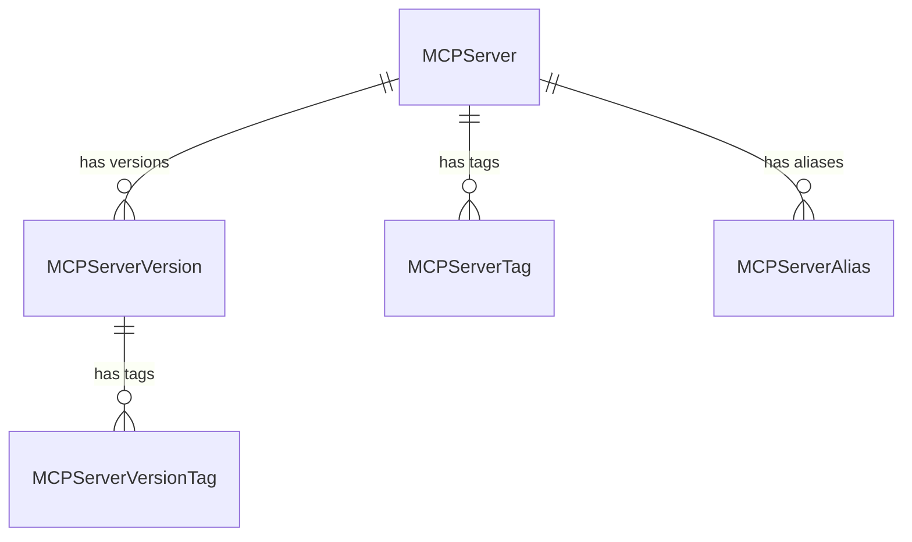
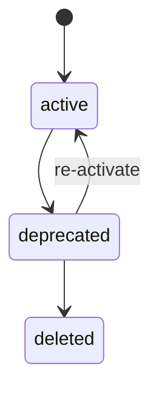

# RFC 0004: MCP Registry

| start_date   | 2026-04-20 |
| :----------- | :--------- |
| mlflow_issue | https://github.com/mlflow/mlflow/issues/22625 |
| rfc_pr       | |

| Author(s)              | [Jon Burdo](https://github.com/jonburdo), [Dan Kuc](https://github.com/dkuc), [Matthew Prahl](https://github.com/mprahl) |
| :--------------------- | :-- |
| **Date Last Modified** | 2026-04-23 |
| **AI Assistant(s)**    | Claude Code |

**Table of contents**

- [Summary](#summary)
- [Basic example](#basic-example)
- [Motivation](#motivation)
  - [Out of scope](#out-of-scope)
- [Detailed design](#detailed-design)
  - [Entities and data model](#entities-and-data-model)
  - [Status lifecycle](#status-lifecycle)
  - [Database schema](#database-schema)
  - [Abstract store interface](#abstract-store-interface)
  - [REST API](#rest-api)
  - [Python SDK](#python-sdk)
  - [CLI commands](#cli-commands)
  - [server_json validation](#server_json-validation)
  - [UI](#ui)
  - [Trace linking](#trace-linking)
  - [Impact on existing MLflow components](#impact-on-existing-mlflow-components)
- [MCP registry spec alignment](#mcp-registry-spec-alignment)
- [Drawbacks](#drawbacks)
- [Alternatives](#alternatives)
- [Adoption strategy](#adoption-strategy)
- [Open questions](#open-questions)

# Summary

Add an MCP Registry to MLflow — a governed, versioned registry for [Model Context Protocol](https://modelcontextprotocol.io/) (MCP) server definitions. The registry stores metadata-first records aligned with the [upstream MCP registry specification](https://registry.modelcontextprotocol.io/docs), providing stable identity, versioning, status lifecycle, and workspace-scoped visibility for MCP server assets. This enables platform administrators to govern which MCP servers are available for consumption and gives downstream components (catalogs, gateways, agent frameworks) a single source of truth for MCP server metadata.

# Basic example

## Register an MCP server and publish a version

```python
import mlflow

# Register an MCP server from a server.json payload.
# name and version are extracted from server_json.
# The parent MCPServer is auto-created if it doesn't exist.
version = mlflow.genai.register_mcp_server(
    server_json={
        "name": "io.github.anthropic/brave-search",
        "title": "Brave Search",
        "description": "MCP server for Brave Search API integration",
        "version": "1.0.0",
        "packages": [
            {
                "registryType": "npm",
                "registryBaseUrl": "https://registry.npmjs.org",
                "identifier": "@anthropic/server-brave-search",
                "version": "1.0.0",
                "transport": {"type": "stdio"},
                "environmentVariables": [
                    {
                        "name": "BRAVE_API_KEY",
                        "description": "Brave Search API Key",
                        "isRequired": True,
                        "isSecret": True,
                    }
                ],
            }
        ],
    },
)
# version.status == "active"
# version.version == "1.0.0" (extracted from server_json)
# version.name == "io.github.anthropic/brave-search" (extracted from server_json)

# Set an alias for stable resolution
mlflow.genai.set_mcp_server_alias(
    name="io.github.anthropic/brave-search",
    alias="production",
    version="1.0.0",
)
```

## Discover and consume MCP servers

```python
# Search for active MCP servers
servers = mlflow.genai.search_mcp_servers(
    filter_string="status = 'active'",
)

# Get a specific version
version = mlflow.genai.get_mcp_server_version(
    name="io.github.anthropic/brave-search",
    version="1.0.0",
)
# version.server_json contains the full upstream MCP payload

# Resolve by alias
version = mlflow.genai.get_mcp_server_version_by_alias(
    name="io.github.anthropic/brave-search",
    alias="production",
)
```

## CLI usage

```bash
# Register from a server.json file (name and version extracted from payload)
mlflow mcp-servers register --server-json-file server.json

# List active servers
mlflow mcp-servers search --filter "status = 'active'"

# Publish a version
mlflow mcp-servers update-version \
    --name io.github.anthropic/brave-search --version 1.0.0 \
    --status active
```

## Motivation

### The problem

As MCP adoption grows, organizations accumulate MCP server definitions across teams and environments. Today, MLflow has no way to govern them. There is no single place to:

- Record which MCP servers exist and what state they are in
- Version MCP server definitions as they evolve
- Control which MCP servers are eligible for consumption by AI engineers
- Trace which MCP servers are used by which agents or workflows
- Provide downstream systems (catalogs, gateways, agent frameworks) with a governed source of truth

### Use cases

1. **Governed registration**: Platform administrators register MCP server definitions (both internally developed packages and external remote endpoints) as governed, versioned assets with stable identity
2. **Lifecycle management**: MCP server versions move through statuses (active → deprecated → deleted) to control downstream surfacing
3. **Discovery and consumption**: AI engineers and downstream systems discover active MCP servers filtered by visibility scope, status, and metadata
4. **Deployment association**: Running MCP server instances can be associated with their governed registry records, bridging the gap between "what is governed" and "what is running"
5. **Version history**: Multiple versions of an MCP server coexist with independent lifecycle states, supporting deprecation without erasing history
6. **After-the-fact governance**: MCP servers already deployed (e.g., from a catalog without a prior registry entry) can have registry records created after the fact, associating existing deployments with governed assets without requiring redeployment

### Out of scope

- **Runtime hosting or deployment** — The registry stores metadata, not runtimes. Deployment is handled by external operators
- **Upstream MCP registry API compatibility layer** — A separate router implementing the upstream `GET /v0.1/servers` API shape is deferred to [Phase 2](#adoption-strategy); this RFC defines MLflow-native APIs

## MCP registry spec alignment

This design aligns with the [upstream MCP registry specification](https://registry.modelcontextprotocol.io/docs) where possible. The spec references in this RFC are based on registry repo [v1.6.0](https://github.com/modelcontextprotocol/registry/releases/tag/v1.6.0) (2026-04-15) and the [server.json schema draft (2025-09-29)](https://json-schema.app/view/%23?url=https%3A%2F%2Fstatic.modelcontextprotocol.io%2Fschemas%2F2025-09-29%2Fserver.schema.json).

**What we adopt directly:**
- The `server.json` (ServerJSON) payload format as the canonical MCP server definition
- The `_meta` namespacing convention for extension metadata
- The concept of server versions with status lifecycle

**What we adapt to MLflow conventions:**
- **API prefix**: MLflow-native REST API (`/ajax-api/3.0/mlflow/mcp-servers/`) rather than the upstream `/v0.1/servers` prefix, because MLflow APIs integrate with MLflow's authentication, workspace, and permission infrastructure
- **URL structure**: RESTful nested paths (matching both upstream MCP and newer MLflow AI asset registry APIs) rather than the older flat action-suffix paths used in the model registry
- **Pagination**: Page-token-based (MLflow convention) rather than cursor-based (upstream convention)
- **Filtering**: SQL-like `filter_string` (MLflow convention) rather than individual query parameters (upstream convention)
- **Version management**: Publisher-supplied version strings (matching upstream) rather than auto-incremented integers
- **Extra features**: Tags, aliases, and workspace scoping extend beyond the upstream spec to match MLflow conventions

**Future compatibility ([Phase 2](#adoption-strategy))**: The upstream MCP Registry spec (v0.1, API frozen October 2025) defines an open API standard that any registry can implement. MLflow could add a thin FastAPI compatibility router that implements the upstream API shape, proxying to the same store layer:

- **Endpoint mapping**: all 7 upstream endpoints (`GET /v0.1/servers`, `POST /v0.1/publish`, etc.) map directly to existing MLflow store methods — no store changes needed
- **Response translation**: wrap MLflow entities in the upstream `{servers: [{server, _meta}]}` envelope, with MLflow-specific metadata (tags, aliases, workspace) in a custom `_meta` namespace (e.g., `org.mlflow`)
- **Status mapping**: MLflow uses upstream status values (`active`/`deprecated`/`deleted`) directly. MLflow's `deleted` is a soft delete — records are preserved for history
- **Pagination**: cursor ↔ page_token translation
- **Workspace**: MLflow's existing middleware already extracts `X-MLFLOW-WORKSPACE` from incoming request headers, so external clients pass the workspace header alongside standard Bearer auth — no protocol changes needed

This would allow any tool built against the upstream spec (IDE plugins, agent frameworks, AI coding assistants) to discover MLflow-registered MCP servers without MLflow-specific integration. The translation layer is purely a presentation concern (~50 lines per endpoint) with no impact on the native API or store.

## Detailed design

### Entities and data model

The MCP server registry introduces the following entities:



#### MCPServer

The logical governed asset, scoped to a workspace.

```python
from dataclasses import dataclass, field
from enum import StrEnum


class MCPUpdateMode(StrEnum):
    MANUAL = "manual"
    SYSTEM_MANAGED = "system_managed"


@dataclass
class MCPServer:
    name: str  # extracted from server_json; reverse-DNS format (e.g., "io.github.user/server"); PK within workspace
    display_name: str | None = None  # mutable human-readable label; falls back to server_json["title"], then name
    description: str | None = None
    workspace: str | None = None  # resolved via resolve_entity_workspace_name()
    status: MCPStatus | None = None  # read-only; derived from latest version's status
    update_mode: MCPUpdateMode = MCPUpdateMode.MANUAL  # system_managed blocks manual edits until switched back to manual
    tags: dict[str, str] = field(default_factory=dict)
    aliases: dict[str, str] = field(default_factory=dict)  # read-only; populated from mcp_server_aliases table, e.g. {"production": "1.2.0"}
    latest_version_alias: str | None = None  # optional; alias name to resolve as "latest" (e.g., "production")
    last_registered_version: str | None = None  # read-only; most recently created version string (fallback when latest_version_alias is unset)
    is_deployed: bool = False  # read-only; derived at query time (True if any version has is_deployed=True)
    created_by: str | None = None
    last_updated_by: str | None = None
    creation_timestamp: int | None = None
    last_updated_timestamp: int | None = None
```

**Name identity**: `name` is extracted from `server_json["name"]` and follows the upstream spec's reverse-DNS format (e.g., `io.github.user/brave-search`). This format prevents name collisions by construction — the namespace portion identifies the publisher. The `name` is immutable and serves as the primary key within a workspace. For display purposes, `display_name` is a mutable user-supplied label on `MCPServer`. UIs resolve display names as: `display_name` (if set) → `server_json["title"]` (if present) → `name`.

#### MCPServerVersion

A versioned record containing an immutable MCP payload and mutable MLflow-managed metadata.

```python
class MCPStatus(StrEnum):
    ACTIVE = "active"
    DEPRECATED = "deprecated"
    DELETED = "deleted"  # soft delete — record preserved for history, not surfaced


@dataclass
class MCPServerVersion:
    name: str  # parent MCPServer name
    version: str  # extracted from server_json["version"]; semver recommended
    server_json: dict  # immutable upstream MCP ServerJSON payload
    display_name: str | None = None  # mutable human-readable label
    status: MCPStatus = MCPStatus.ACTIVE
    tags: dict[str, str] = field(default_factory=dict)
    source: str | None = None  # provenance URI (e.g., git repository URL)
    run_id: str | None = None  # optional MLflow run association
    runtime_metadata: dict[str, str] = field(default_factory=dict)  # opaque key-value pairs
    is_deployed: bool = False  # whether a known running instance exists
    workspace: str | None = None
    created_by: str | None = None
    last_updated_by: str | None = None
    creation_timestamp: int | None = None
    last_updated_timestamp: int | None = None
```

**Immutability contract**: `name`, `version`, and `server_json` are immutable after creation. To change the MCP payload, register a new version. Mutable fields (`status`, `runtime_metadata`, `is_deployed`, `tags`) can be updated independently.

**Runtime metadata**: `runtime_metadata` is an opaque `dict[str, str]` that MLflow stores but does not interpret. It exists as a convenience for enterprises to associate deployment information (e.g., endpoint URLs, cluster names, environment labels) with a registered version. MLflow should be unopinionated about which keys are used; organizations should standardize on their own conventions.

**Version uniqueness**: The combination of `(name, version)` is unique within a workspace. This means each version string can only be registered once per server.

**Version string conventions**: The version string is extracted from `server_json["version"]`. Semantic versioning is recommended but not enforced — any non-empty string is accepted. For external MCP servers where version tracking is declared rather than enforced, publishers may use `"latest"` as the version string. This allows registering external servers without requiring a specific version.

**Typed payload**: The `server_json` field uses `dict` in the entity and store layers for simplicity. At the API layer, the `CreateMCPServerVersionRequest` uses a `ServerJSONPayload` Pydantic model (with `extra="allow"`) that validates the payload on ingestion and extracts typed fields. See [server_json validation](#server_json-validation).

#### server_json and the upstream MCP specification

The `server_json` field stores the canonical MCP server definition following the upstream [server.json specification](https://registry.modelcontextprotocol.io/docs#/schemas/ServerJSON). This payload is passed through from the publisher and stored as-is.

The upstream spec defines:

- **`name`**, **`version`**, **`description`**, **`title`**: Identity and descriptive metadata
- **`packages[]`**: Installable package configurations (npm, pypi, oci, nuget, mcpb) with transport type, environment variables, and arguments
- **`remotes[]`**: Remote endpoint configurations (streamable-http, sse) with headers and URL templating
- **`repository`**: Source repository reference
- **`websiteUrl`**: Documentation URL
- **`_meta`**: Extension metadata with reverse-DNS namespacing

MLflow-managed fields (`status`, `runtime_metadata`, `is_deployed`) are stored as first-class MLflow fields on `MCPServerVersion`, **not** inside `server_json`. `update_mode` is a server-level field on `MCPServer`. In API responses, version-level MLflow-managed fields are projected into a namespaced `_meta` block for interoperability:

```json
{
  "name": "brave-search",
  "version": "1.0.0",
  "server_json": {
    "name": "brave-search",
    "version": "1.0.0",
    "packages": [...]
  },
  "_meta": {
    "org.mlflow.registry/mlflow-managed": {
      "status": "active",
      "is_deployed": true,
      "runtime_metadata": {"endpoint_url": "https://gateway.internal/mcp/brave-search"}
    }
  }
}
```


#### MCPServerAlias and MCPServerTag

```python
@dataclass(frozen=True)
class MCPServerAlias:
    name: str      # parent MCPServer name
    alias: str     # e.g., "production", "staging"
    version: str   # version string this alias points to

@dataclass(frozen=True)
class MCPServerTag:
    key: str
    value: str
```


Aliases provide stable version pointers. For example, setting alias `"production"` to version `"1.2.0"` allows consumers to resolve `get_mcp_server_version_by_alias("my-server", "production")` without tracking specific version strings.

#### Future entity: MCPObservedTool (deferred)

A future enhancement may introduce `MCPObservedTool` and `MCPObservedToolSnapshot` entities to cache tool metadata observed from live MCP endpoints. These would store tool names, descriptions, and input schemas discovered by probing running servers — separate from the canonical `server_json` payload. This is out of scope for the initial implementation but the data model is designed to accommodate it.

### Status lifecycle

#### Per-version status

Each `MCPServerVersion` has an independent status controlling downstream surfacing:



| State | Meaning | Downstream surfacing |
|---|---|---|
| `active` | Ready for downstream use | Surfaced to catalogs, gateways, consumers |
| `deprecated` | Still functional but no longer recommended | Surfaced with deprecation signal |
| `deleted` | Soft-deleted — record preserved for history, no longer active | Not surfaced |

**Allowed transitions**: The API enforces valid transitions. Attempting an invalid transition returns an error with `INVALID_PARAMETER_VALUE`.

| From | To |
|---|---|
| `active` | `deprecated` |
| `deprecated` | `active`, `deleted` |

`deprecated` can return to `active` (re-activate) to handle cases where a deprecation was premature or a planned replacement is not yet ready.

#### Server-level status (derived)

`MCPServer.status` is read-only, derived from the latest version's `status`. This avoids maintaining two independent lifecycles and aligns with upstream, which only has version-level status. The server's status gives a quick summary for UI filtering without requiring clients to inspect individual versions.

### Database schema

Five tables, created via a single Alembic migration. All tables are workspace-scoped following the model registry pattern. A reference Alembic migration is provided in [`alembic-migration.py`](alembic-migration.py).

#### `mcp_servers` — one row per logical MCP server

| Column | Type | Notes |
|--------|------|-------|
| `workspace` | `String(63)` | PK, default `'default'` |
| `name` | `String(256)` | PK |
| `display_name` | `String(256)` | mutable human-readable label |
| `description` | `String(5000)` | |
| `update_mode` | `String(20)` | default `'manual'` |
| `latest_version_alias` | `String(256)` | optional alias name to resolve as "latest" |
| `last_registered_version` | `String(256)` | most recently created version string |
| `created_by` | `String(256)` | |
| `last_updated_by` | `String(256)` | |
| `creation_timestamp` | `BigInteger` | millis since epoch |
| `last_updated_timestamp` | `BigInteger` | millis since epoch |

#### `mcp_server_versions` — one row per version

| Column | Type | Notes |
|--------|------|-------|
| `workspace` | `String(63)` | PK, FK → mcp_servers |
| `name` | `String(256)` | PK, FK → mcp_servers |
| `version` | `String(256)` | PK, publisher-supplied |
| `server_json` | `JSON` | immutable canonical MCP payload |
| `display_name` | `String(256)` | mutable human-readable label |
| `status` | `String(20)` | default `'active'` |
| `source` | `String(512)` | provenance URI |
| `run_id` | `String(32)` | optional MLflow run linkage |
| `runtime_metadata` | `JSON` | deployment refs (JSON-encoded dict) |
| `is_deployed` | `Boolean` | default `false` |
| `created_by` | `String(256)` | |
| `last_updated_by` | `String(256)` | |
| `creation_timestamp` | `BigInteger` | millis since epoch |
| `last_updated_timestamp` | `BigInteger` | millis since epoch |

FK: `(workspace, name)` → `mcp_servers`, CASCADE delete.

**Index**: `ix_mcp_server_versions_is_deployed` on `(workspace, name, is_deployed)` to support efficient derivation of `MCPServer.is_deployed` and filtering.

#### `mcp_server_tags` — server-level key-value metadata

| Column | Type | Notes |
|--------|------|-------|
| `workspace` | `String(63)` | PK, FK → mcp_servers |
| `name` | `String(256)` | PK, FK → mcp_servers |
| `key` | `String(256)` | PK |
| `value` | `Text` | |

#### `mcp_server_version_tags` — version-level key-value metadata

| Column | Type | Notes |
|--------|------|-------|
| `workspace` | `String(63)` | PK, FK → mcp_server_versions |
| `name` | `String(256)` | PK, FK → mcp_server_versions |
| `version` | `String(256)` | PK, FK → mcp_server_versions |
| `key` | `String(256)` | PK |
| `value` | `Text` | |

#### `mcp_server_aliases` — stable version pointers

| Column | Type | Notes |
|--------|------|-------|
| `workspace` | `String(63)` | PK, FK → mcp_servers |
| `name` | `String(256)` | PK, FK → mcp_servers |
| `alias` | `String(256)` | PK |
| `version` | `String(256)` | target version string |

**JSON columns**: `server_json` and `runtime_metadata` use SQLAlchemy's `JSON` type (with `mssql.JSON` for SQL Server), following the pattern established by MLflow's evaluation dataset records and span dimension attributes. This maps to native `JSON` on PostgreSQL and MySQL (with database-level validation on write), and to `NVARCHAR(MAX)` / `TEXT` on MSSQL and SQLite.

**Workspace handling**: All tables use `(workspace, name)` as the leading primary key components. Single-tenant deployments use the `'default'` workspace.

**Timestamps**: Set at the application layer via `get_current_time_millis()`, not via DDL defaults.

### Abstract store interface

The store interface is implemented as a mixin class (`MCPServerRegistryMixin`) that the model registry's `AbstractStore` inherits from. This follows the same pattern used by `GatewayStoreMixin` on the tracking store — MCP server registry code lives in its own files while composing into the existing store hierarchy via multiple inheritance.

```
mlflow/store/model_registry/mcp_server_registry/
├── abstract_mixin.py          # MCPServerRegistryMixin — abstract interface
├── sqlalchemy_mixin.py        # SqlAlchemyMCPServerRegistryMixin
└── rest_mixin.py              # RestMCPServerRegistryMixin
```

All methods operate within the caller's workspace scope.

```python
class MCPServerRegistryMixin:
    # Methods raise NotImplementedError rather than using @abstractmethod,
    # following the GatewayStoreMixin pattern. This allows stores that don't
    # support MCP servers (e.g., FileStore) to work without stubbing every method.

    # --- MCPServer operations ---

    def create_mcp_server(self, name: str, description: str | None = None) -> MCPServer:
        raise NotImplementedError(self.__class__.__name__)

    def get_mcp_server(self, name: str) -> MCPServer:
        raise NotImplementedError(self.__class__.__name__)

    def search_mcp_servers(
        self,
        filter_string: str | None = None,
        max_results: int = 100,
        order_by: list[str] | None = None,
        page_token: str | None = None,
    ) -> PagedList[MCPServer]:
        raise NotImplementedError(self.__class__.__name__)

    def update_mcp_server(
        self,
        name: str,
        description: str | None = None,
        display_name: str | None = None,
        update_mode: MCPUpdateMode | None = None,
        latest_version_alias: str | None = None,
    ) -> MCPServer:
        raise NotImplementedError(self.__class__.__name__)

    def delete_mcp_server(self, name: str) -> None:
        raise NotImplementedError(self.__class__.__name__)

    # --- MCPServerVersion operations ---

    def create_mcp_server_version(
        self,
        server_json: dict,
        display_name: str | None = None,
        source: str | None = None,
        run_id: str | None = None,
        status: MCPStatus | None = None,  # defaults to ACTIVE
        runtime_metadata: dict[str, str] | None = None,
        is_deployed: bool = False,
    ) -> MCPServerVersion:
        raise NotImplementedError(self.__class__.__name__)

    def get_mcp_server_version(self, name: str, version: str) -> MCPServerVersion:
        raise NotImplementedError(self.__class__.__name__)

    def get_mcp_server_version_by_alias(self, name: str, alias: str) -> MCPServerVersion:
        raise NotImplementedError(self.__class__.__name__)

    def get_latest_mcp_server_version(self, name: str) -> MCPServerVersion:
        raise NotImplementedError(self.__class__.__name__)

    def search_mcp_server_versions(
        self,
        name: str,
        filter_string: str | None = None,
        max_results: int = 100,
        order_by: list[str] | None = None,
        page_token: str | None = None,
    ) -> PagedList[MCPServerVersion]:
        raise NotImplementedError(self.__class__.__name__)

    def update_mcp_server_version(
        self,
        name: str,
        version: str,
        display_name: str | None = None,
        status: MCPStatus | None = None,
        runtime_metadata: dict[str, str] | None = None,
        is_deployed: bool | None = None,
    ) -> MCPServerVersion:
        raise NotImplementedError(self.__class__.__name__)

    def delete_mcp_server_version(self, name: str, version: str) -> None:
        raise NotImplementedError(self.__class__.__name__)

    # --- Tag operations (key/value style, not tag-object style) ---

    def set_mcp_server_tag(self, name: str, key: str, value: str) -> None:
        raise NotImplementedError(self.__class__.__name__)

    def delete_mcp_server_tag(self, name: str, key: str) -> None:
        raise NotImplementedError(self.__class__.__name__)

    def set_mcp_server_version_tag(self, name: str, version: str, key: str, value: str) -> None:
        raise NotImplementedError(self.__class__.__name__)

    def delete_mcp_server_version_tag(self, name: str, version: str, key: str) -> None:
        raise NotImplementedError(self.__class__.__name__)

    # --- Alias operations ---

    def set_mcp_server_alias(self, name: str, alias: str, version: str) -> None:
        raise NotImplementedError(self.__class__.__name__)

    def delete_mcp_server_alias(self, name: str, alias: str) -> None:
        raise NotImplementedError(self.__class__.__name__)
```

**User-facing vs. store layer**: The user-facing SDK exposes a single `register_mcp_server(server_json=...)` function that handles both server and version creation in one call — matching the single-function pattern used by other MLflow registries. Internally, this calls the store's separate `create_mcp_server()` and `create_mcp_server_version()` methods. The store layer keeps these as two methods because the store needs fine-grained control over each entity, but this is an implementation detail not exposed to users.

**Name and version extraction**: `create_mcp_server_version` extracts both `name` and `version` from `server_json` — neither is a separate parameter. If either field is missing from `server_json`, creation fails with a validation error. The extracted `name` is used to look up or auto-create the parent `MCPServer`. New versions default to `active` status.

**Status transition enforcement**: `update_mcp_server_version` validates that status transitions follow the allowed paths (active→deprecated, deprecated→active, deprecated→deleted).

**Update mode enforcement**: When a server's `update_mode` is `SYSTEM_MANAGED`, manual version creation and version updates are rejected — only system sync processes can modify versions. To make manual edits, the user must first switch `update_mode` back to `MANUAL` via `update_mcp_server`. In the UI, edit controls are hidden when a server is in system-managed mode; only the mode toggle is available.

**Latest version**: `get_latest_mcp_server_version` checks `MCPServer.latest_version_alias` first — if set, it resolves that alias to a version. If unset, it falls back to the version with the most recent `creation_timestamp`. This lets users explicitly control what "latest" means (e.g., pointing it at the latest *active* version) while preserving a sensible default.

### REST API

The REST API is implemented as a FastAPI router mounted at `/ajax-api/3.0/mlflow/mcp-servers/`, using RESTful nested resource paths. This follows the same approach used in newer MLflow AI asset registry APIs rather than the older flat action-suffix style used in the model registry.

#### Endpoints

All paths below are relative to the router prefix `/ajax-api/3.0/mlflow/mcp-servers`.

| Method | Path | Description |
|---|---|---|
| `POST` | `/` | Create an MCP server |
| `GET` | `/` | List/search MCP servers |
| `GET` | `/{name}` | Get MCP server by name |
| `PATCH` | `/{name}` | Update server fields |
| `DELETE` | `/{name}` | Delete MCP server (cascades to versions) |
| `POST` | `/versions` | Create a server version (`name` and `version` extracted from `server_json` body) |
| `GET` | `/{name}/versions` | List/search versions of a server |
| `GET` | `/{name}/versions/{version}` | Get a specific version |
| `PATCH` | `/{name}/versions/{version}` | Update version (status, metadata) |
| `DELETE` | `/{name}/versions/{version}` | Delete a version |
| `POST` | `/{name}/tags` | Set a server-level tag |
| `DELETE` | `/{name}/tags/{key}` | Delete a server-level tag |
| `POST` | `/{name}/versions/{version}/tags` | Set a version-level tag |
| `DELETE` | `/{name}/versions/{version}/tags/{key}` | Delete a version-level tag |
| `POST` | `/{name}/aliases` | Set an alias |
| `GET` | `/{name}/aliases/{alias}` | Resolve alias to version |
| `DELETE` | `/{name}/aliases/{alias}` | Delete an alias |

Resource identifiers (`name`, `version`, `alias`, `key`) are path parameters, not query parameters. This makes URLs self-describing and enables standard HTTP caching.

#### Request and response models

Request models contain only the mutable fields — resource identifiers come from path parameters:

```python
from pydantic import BaseModel


class CreateMCPServerRequest(BaseModel):
    name: str
    description: str | None = None


class UpdateMCPServerRequest(BaseModel):
    display_name: str | None = None
    description: str | None = None
    update_mode: str | None = None
    latest_version_alias: str | None = None


class CreateMCPServerVersionRequest(BaseModel):
    server_json: ServerJSONPayload
    display_name: str | None = None
    status: str = "active"
    source: str | None = None
    run_id: str | None = None
    runtime_metadata: dict[str, str] | None = None
    is_deployed: bool = False


class UpdateMCPServerVersionRequest(BaseModel):
    display_name: str | None = None
    status: str | None = None
    runtime_metadata: dict[str, str] | None = None
    is_deployed: bool | None = None


class AliasResponse(BaseModel):
    alias: str
    version: str


class MCPServerResponse(BaseModel):
    name: str
    description: str | None = None
    status: str | None = None  # derived from latest version's status
    update_mode: str = "manual"
    latest_version_alias: str | None = None
    last_registered_version: str | None = None
    is_deployed: bool = False  # derived at query time
    aliases: list[AliasResponse] = []
    tags: dict[str, str] = {}
    created_by: str | None = None
    last_updated_by: str | None = None
    creation_timestamp: int | None = None
    last_updated_timestamp: int | None = None


class MCPServerVersionResponse(BaseModel):
    name: str
    version: str
    server_json: dict
    display_name: str | None = None
    status: str = "active"
    tags: dict[str, str] = {}
    source: str | None = None
    run_id: str | None = None
    runtime_metadata: dict[str, str] = {}
    is_deployed: bool = False
    created_by: str | None = None
    last_updated_by: str | None = None
    creation_timestamp: int | None = None
    last_updated_timestamp: int | None = None


class SetAliasRequest(BaseModel):
    alias: str
    version: str


class SetTagRequest(BaseModel):
    key: str
    value: str
```

#### Pagination

Search endpoints use page-token-based pagination following existing MLflow conventions:

```
GET /ajax-api/3.0/mlflow/mcp-servers/?filter_string=status%20%3D%20%27active%27&max_results=10
```

Response:

```json
{
  "mcp_servers": [...],
  "next_page_token": "..."
}
```

#### Filter expressions

The `filter_string` parameter supports expressions following existing MLflow filter syntax:

- `name = 'brave-search'`
- `name LIKE '%search%'`
- `status = 'active'`
- `status IN ('active', 'deprecated')`
- `is_deployed = true` (server-level: derived from versions; version-level: direct field)
- `tags.team = 'platform'`

### Python SDK

The Python SDK exposes a single user-facing `register_mcp_server()` function in `mlflow.genai` that handles both server and version creation in one call. Internally, the store layer has separate `create_mcp_server()` and `create_mcp_server_version()` methods — this is an implementation detail not exposed to users.

```python
import mlflow

# Register (name and version extracted from server_json; parent MCPServer auto-created)
version = mlflow.genai.register_mcp_server(server_json={...})

# Search / get
servers = mlflow.genai.search_mcp_servers(filter_string="status = 'active'")
version = mlflow.genai.get_mcp_server_version(name="io.github.anthropic/brave-search", version="1.0.0")
version = mlflow.genai.get_mcp_server_version_by_alias(name="io.github.anthropic/brave-search", alias="production")

# Lifecycle
mlflow.genai.update_mcp_server_version(
    name="io.github.anthropic/brave-search", version="1.0.0", status="active",
)

# Server-level updates (display name, update mode)
mlflow.genai.update_mcp_server(
    name="io.github.anthropic/brave-search", display_name="Brave Search",
)

# Tags and aliases
mlflow.genai.set_mcp_server_tag(name="io.github.anthropic/brave-search", key="team", value="platform")
mlflow.genai.set_mcp_server_alias(name="io.github.anthropic/brave-search", alias="production", version="1.0.0")

# Delete
mlflow.genai.delete_mcp_server_version(name="io.github.anthropic/brave-search", version="1.0.0")
mlflow.genai.delete_mcp_server(name="io.github.anthropic/brave-search")
```

### CLI commands

| Command | Description |
|---|---|
| `mlflow mcp-servers register` | Register an MCP server from a server.json file or inline JSON (auto-creates parent server if needed) |
| `mlflow mcp-servers get` | Get an MCP server by name |
| `mlflow mcp-servers search` | Search MCP servers with filters |
| `mlflow mcp-servers update` | Update server description, display name, or update mode |
| `mlflow mcp-servers delete` | Delete an MCP server and all its versions |
| `mlflow mcp-servers get-version` | Get a specific version |
| `mlflow mcp-servers get-version-by-alias` | Resolve an alias to a version |
| `mlflow mcp-servers get-latest-version` | Get the most recent version |
| `mlflow mcp-servers search-versions` | List/search versions of a server |
| `mlflow mcp-servers update-version` | Update version status or runtime metadata |
| `mlflow mcp-servers delete-version` | Delete a specific version |
| `mlflow mcp-servers set-tag` | Set a server-level tag |
| `mlflow mcp-servers delete-tag` | Delete a server-level tag |
| `mlflow mcp-servers set-version-tag` | Set a version-level tag |
| `mlflow mcp-servers delete-version-tag` | Delete a version-level tag |
| `mlflow mcp-servers set-alias` | Set a version alias |
| `mlflow mcp-servers delete-alias` | Delete a version alias |

Example workflow:

```bash
# Register a server from a server.json file (parent MCPServer auto-created)
mlflow mcp-servers register --server-json-file ./server.json

# Publish and set an alias
mlflow mcp-servers update-version --name my-server --version 1.0.0 \
    --status active
mlflow mcp-servers set-alias --name my-server --alias production --version 1.0.0

# List active servers
mlflow mcp-servers search --filter "status = 'active'"

# Associate deployment metadata
mlflow mcp-servers update-version --name my-server --version 1.0.0 \
    --is-deployed true \
    --runtime-metadata '{"endpoint_url": "https://gateway/mcp/my-server"}'

# Deprecate an old version
mlflow mcp-servers update-version --name my-server --version 0.9.0 \
    --status deprecated
```

### server_json validation

The `server_json` field in `CreateMCPServerVersionRequest` uses a typed Pydantic model (`ServerJSONPayload`) mirroring the upstream [server.json schema](https://static.modelcontextprotocol.io/schemas/2025-09-29/server.schema.json), with `extra="allow"` for forward compatibility. FastAPI validates the payload automatically at request time — no separate validation step needed.

**Required fields:**
- `name` (string) — extracted as the server identifier
- `version` (string) — extracted as the version identifier

**Typed fields (validated when present):**
- `title`, `description` (string)
- `packages[]` — entries typed with required fields (`registryType`, `identifier`, `transport`)
- `remotes[]` — entries typed with required fields (`type`, `url`)
- `repository`, `websiteUrl` (string)
- `_meta` (dict)

**Forward compatibility:** Unknown fields at any level are accepted and preserved (`extra="allow"`). The registry does not reject payloads containing fields not yet defined in the upstream spec.

### UI

The MCP Servers page lives under the GenAI workflow in the MLflow sidebar, alongside Experiments, Prompts, and AI Gateway.

> **Note:** The mockups below are for illustrative purposes only and do not fully align with the MLflow design system. The final implementation will follow MLflow's established design system and component library.


The list view uses a card-based layout consistent with other MLflow pages, showing each server's name, latest version, status, source, and tags. Users can filter by state and search by name or description. A "Create MCP Server" button initiates registration. A grid/list toggle allows switching between card and table views.


The detail view shows the server's metadata, versions list, aliases, and tags. Individual version pages display the `server_json` payload, status, and runtime metadata.


### Trace linking

MCP server usage is linked to traces following the same pattern as prompt registry linking. When a registered MCP server is resolved within an active trace, the registry records the association so that traces carry a record of which MCP servers were involved.

**Tag and attribute**: Traces carry an `mlflow.linkedMcpServers` tag containing a JSON array of `{name, version}` entries — the same format as `mlflow.linkedPrompts`:

```json
[{"name": "io.github.user/brave-search", "version": "1.0.0"}]
```

This tag is stored at both levels:
- **Trace-level** (`TraceTagKey.LINKED_MCP_SERVERS`): aggregates all MCP servers used anywhere in the trace
- **Span-level** (`SpanAttributeKey.LINKED_MCP_SERVERS`): records which MCP server was resolved within a specific span

**Auto-linking**: When a registered MCP server is resolved within an active trace (e.g., via a `load_mcp_server()` or equivalent resolution function), the registry automatically:
1. Registers the `{name, version}` with `InMemoryTraceManager` (following the same pattern as prompt registry linking)
2. Updates the `mlflow.linkedMcpServers` trace tag
3. Sets the `mlflow.linkedMcpServers` attribute on the current active span

**Explicit linking**: For after-the-fact association (e.g., when MCP server resolution happens outside the traced function), an explicit API is provided:

```python
client.link_mcp_server_versions_to_trace(
    trace_id="tr-abc123",
    mcp_servers=[mcp_server_version],
)
```

**UI**: The GenAI UI includes an "MCP Servers" tab alongside the existing "Prompts" tab, showing linked MCP server entries for each trace. The trace detail view includes a linked MCP servers table with name, version, and navigation links to the MCP server detail page — following the same component pattern as `ModelTraceExplorerLinkedPromptsTable`.

### Impact on existing MLflow components

| Component | Impact | Description |
|---|---|---|
| Database schema | **New tables** | 5 new tables via Alembic migration. No changes to existing tables |
| Tracking server | **New routes** | New FastAPI router mounted alongside existing routes |
| Python client | **Extends existing** | New MCP server functions in `mlflow.genai` (alongside existing scorers, etc.) |
| CLI | **New command group** | `mlflow mcp-servers` subcommands. No changes to existing CLI |
| Model registry | **None** | No changes to existing model registry |
| Other registries | **None** | No changes to existing registries (model registry, etc.) |
| Tracing | **Extends existing** | New `mlflow.linkedMcpServers` tag/attribute following the `mlflow.linkedPrompts` pattern. New `link_mcp_server_versions_to_trace()` API |
| UI | **New page + tab** | MCP Servers page under GenAI workflow; MCP Servers tab in trace explorer alongside Prompts tab |
| Authentication/RBAC | **Extends existing** | Adds `SqlMCPServerPermission` following the same per-resource permission pattern as `SqlRegisteredModelPermission` (workspace + name + user + permission level). FastAPI middleware validators enforce permissions on MCP server routes |

## Drawbacks

- **Upstream spec coupling**: Storing `server_json` as a pass-through payload means the registry must evolve with the upstream spec. The forward-compatibility approach (accept extra fields, validate minimally) mitigates this
- **Schema evolution**: The upstream server.json spec is currently at v0.1 and may change. The immutability contract (each version's `server_json` is frozen) means older versions are preserved even as the spec evolves

# Alternatives

## Implement the upstream MCP registry API directly

Build a registry implementing `GET /v0.1/servers` as the primary API. Rejected because:
- The upstream API doesn't integrate with MLflow's authentication, workspace, or permission model
- MLflow users expect MLflow-style APIs (filter strings, page tokens, `/ajax-api/` paths)
- The upstream API is designed for public registries, not governed enterprise registries — it lacks tags, aliases, and workspace scoping
- A compatibility layer can be added later as a separate router proxying to the same store, without constraining the native API design

# Adoption strategy

This is a new feature, not a breaking change. Adoption is incremental:

**Phase 1: Core registry**
- Entities, database schema, store implementation, REST API, Python SDK, CLI
- Trace linking: `mlflow.linkedMcpServers` tag/attribute and explicit `link_mcp_server_versions_to_trace()` API, following the `mlflow.linkedPrompts` pattern
- Users can register, version, and publish MCP server definitions
- Existing MLflow functionality is unaffected

**Phase 2: Upstream spec compatibility and tool observation**
- Upstream MCP registry API compatibility layer — a separate FastAPI router implementing the upstream `GET /v0.1/servers` API shape, proxying to the same store. This makes MLflow's registry accessible to any tool built against the upstream spec (see [MCP registry spec alignment](#mcp-registry-spec-alignment))
- Tool observation and caching (`MCPObservedTool`) — cache tool metadata (names, descriptions, input schemas) observed from live MCP endpoints, enabling tool-level search and discovery without requiring publishers to declare tools upfront

**Phase 3: Integration and ecosystem**
- Catalog integration (read active MCPs for discovery surfacing)
- Gateway integration (read active MCP metadata for runtime mediation)
- Deployment association (lifecycle operators write runtime metadata)
- Shared base extraction if additional AI asset registries are introduced

Each phase is independently useful. Phase 1 delivers a complete, self-contained registry.

# Open questions

1. Should we add a `draft` status for versions that are registered but not yet ready for consumption? This would let teams stage MCP server versions before making them discoverable. The tradeoff is that the upstream MCP registry spec only defines `active`, `deprecated`, and `deleted` — adding `draft` would be an MLflow extension that the compatibility layer would need to hide from upstream clients.
