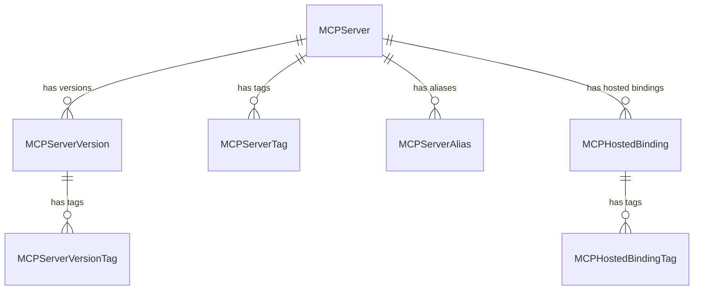
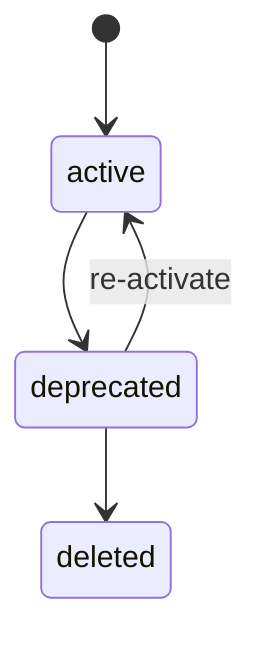

# RFC 0004: MCP Registry

| start_date   | 2026-04-20 |
| :----------- | :--------- |
| mlflow_issue | https://github.com/mlflow/mlflow/issues/22625 |
| rfc_pr       | |

| Author(s)              | [Jon Burdo](https://github.com/jonburdo), [Dan Kuc](https://github.com/dkuc), [Matthew Prahl](https://github.com/mprahl) |
| :--------------------- | :-- |
| **Date Last Modified** | 2026-04-27 |
| **AI Assistant(s)**    | Claude Code, GPT 5.4 |

**Table of contents**

- [Summary](#summary)
- [Basic example](#basic-example)
- [Motivation](#motivation)
  - [The problem](#the-problem)
  - [Registry vs. Gateway](#registry-vs-gateway)
  - [Use cases](#use-cases)
  - [Out of scope](#out-of-scope)
- [Detailed design](#detailed-design)
  - [Entities and data model](#entities-and-data-model)
  - [Status lifecycle](#status-lifecycle)
  - [Database schema](#database-schema)
  - [Abstract store interface](#abstract-store-interface)
  - [REST API](#rest-api)
  - [Python SDK](#python-sdk)
  - [server_json validation](#server_json-validation)
  - [UI](#ui)
  - [Trace linking](#trace-linking)
  - [Impact on existing MLflow components](#impact-on-existing-mlflow-components)
- [MCP registry spec alignment](#mcp-registry-spec-alignment)
- [Drawbacks](#drawbacks)
- [Alternatives](#alternatives)
- [Adoption strategy](#adoption-strategy)
- [Open questions](#open-questions)

# Summary

Add an MCP Registry to MLflow — a governed, versioned registry for [Model Context Protocol](https://modelcontextprotocol.io/) (MCP) server definitions. The registry stores metadata-first records aligned with the [upstream MCP registry specification](https://registry.modelcontextprotocol.io/docs), but differs from an MCP gateway: it is the system of record for canonical server definitions, version history, aliases, governance, and approved hosted bindings, rather than the live traffic layer that mediates MCP requests. The design is intended to integrate cleanly with a future MCP gateway in MLflow AI Gateway, while remaining useful on its own as a governed registry. This is intended to complement, not replace, the public GitHub-hosted MCP registry.

MLflow MCP should feel like one product. The registry is the governed source of truth, and a future MLflow MCP Gateway should build on the same server identities, versions, aliases, and hosted bindings rather than introducing a separate MCP catalog.

MLflow stores the publisher-declared `server_json["version"]` as the canonical version of a server definition. It does not introduce a second MLflow-specific version. Hosted connectivity, when present, is represented by separate `MCPHostedBinding` records rather than mutable runtime metadata on the version itself.

# Basic example

## Register an MCP server and create a version

```python
import mlflow

# Register an MCP server from a server.json payload.
# name and version are extracted from server_json.
# The parent MCPServer is auto-created if it doesn't exist.
version = mlflow.genai.register_mcp_server(
    server_json={
        "name": "io.github.anthropic/brave-search",
        "title": "Brave Search",
        "description": "MCP server for Brave Search API integration",
        "version": "1.0.0",
        "packages": [
            {
                "registryType": "npm",
                "registryBaseUrl": "https://registry.npmjs.org",
                "identifier": "@anthropic/server-brave-search",
                "version": "1.0.0",
                "transport": {"type": "stdio"},
                "environmentVariables": [
                    {
                        "name": "BRAVE_API_KEY",
                        "description": "Brave Search API Key",
                        "isRequired": True,
                        "isSecret": True,
                    }
                ],
            }
        ],
    },
)
# version.status == "active"
# version.version == "1.0.0" (extracted from server_json)
# version.name == "io.github.anthropic/brave-search" (extracted from server_json)

# Set an alias for stable resolution
mlflow.genai.set_mcp_server_alias(
    name="io.github.anthropic/brave-search",
    alias="production",
    version="1.0.0",
)
```

## Discover and consume MCP servers

```python
# Search for active MCP servers (status is derived from latest version)
servers = mlflow.genai.search_mcp_servers(
    filter_string="status = 'active'",
)

# Get a specific version
version = mlflow.genai.get_mcp_server_version(
    name="io.github.anthropic/brave-search",
    version="1.0.0",
)
# version.server_json contains the full upstream MCP payload

# Resolve by alias
version = mlflow.genai.get_mcp_server_version_by_alias(
    name="io.github.anthropic/brave-search",
    alias="production",
)
```

## Associate approved hosted connectivity

```python
# Record a remote hosted entrypoint for the production alias.
binding = mlflow.genai.create_mcp_hosted_binding(
    name="io.github.anthropic/brave-search",
    alias="production",
    binding_type="remote",
    endpoint_url="https://mcp.acme.internal/brave-search",
)

# binding.is_active == True
```

## Motivation

### The problem

As MCP adoption grows, organizations accumulate MCP server definitions across teams and environments. Today, MLflow has no way to govern them. There is no single place to:

- Record which MCP servers exist and what state they are in
- Version MCP server definitions as they evolve
- Control which MCP servers are available to specific users, teams, or agents
- Associate traces with governed MCP server versions for rollback analysis, fixes, and lightweight auditing when runtimes participate in MLflow-aware tracing
- Provide downstream systems (catalogs, gateways, agent frameworks) with a governed source of truth

### Registry vs. Gateway

The MCP Registry and an MCP Gateway are related but distinct capabilities:

- **MCP Registry**: the control-plane system of record for governed MCP assets. It stores canonical `server_json`, version history, aliases, tags, lifecycle state, and hosted binding records that describe approved live connection paths.
- **MCP Gateway**: a runtime data-plane service that receives live client traffic and mediates connectivity, authentication, routing, policy enforcement, and request-time observability. In MLflow, a future gateway should consume the runtime-relevant subset of registry data and add those runtime behaviors on top.

This RFC defines the registry layer first. It does **not** yet design the MLflow MCP Gateway runtime, extend the existing AI Gateway into an MCP Gateway, or define MCP proxy semantics. Instead, it establishes the governed MCP server identities, aliases, and hosted bindings that a future gateway would build on, so gateway configuration is derived from the registry rather than becoming a second source of truth.

### Use cases

1. **Governed registration**: Platform administrators register MCP server definitions (both internally developed packages and hosted remote endpoints) as governed, versioned assets with stable identity
2. **Lifecycle management**: MCP server versions move through statuses (active → deprecated → deleted) to control downstream surfacing
3. **Discovery and resolution**: MLflow-aware clients and runtimes discover active MCP servers and resolve them by name + version or alias
4. **Hosted connectivity association**: Operators can record approved hosted connection paths as first-class binding records, bridging the gap between "what is governed" and "what is live"
5. **Version history**: Multiple versions of an MCP server coexist with independent lifecycle states, supporting deprecation without erasing history
6. **After-the-fact governance**: MCP servers already running in a hosted environment can have registry records and bindings created after the fact, associating existing deployments with governed assets without requiring redeployment

These use cases support two complementary consumption modes. In the first, teams use MLflow as the governed MCP registry and connect directly to canonical `server_json` definitions or approved `remote` bindings. In the second, a future MLflow MCP Gateway would expose those same governed servers through a centralized MLflow entrypoint. A typical journey is to register an MCP server definition in MLflow, manage versions and aliases there, use direct connectivity in Phase 1, and later add gateway-backed deployment and access without introducing a separate catalog.

### Out of scope

- **Runtime execution and orchestration** — The registry may store hosted binding records, but it does not provision, host, scale, or manage MCP runtimes
- **End-user connectivity, proxying, or usage control enforcement** — Consumers can still connect directly to an MCP endpoint unless a future MLflow gateway or proxy mediates access; centralized MLflow-credential-based access through a gateway is future work
- **MCP Gateway runtime and deployment UX** — This RFC does not define the MLflow MCP Gateway runtime, including request routing, protocol mediation, authentication behavior, usage control, runtime APIs, or deploy UX
- **Upstream MCP registry API compatibility layer** — A separate router implementing the upstream `GET /v0.1/servers` API shape is deferred to [Phase 2](#adoption-strategy); this RFC defines MLflow-native APIs

## MCP registry spec alignment

This design aligns with the [upstream MCP registry specification](https://registry.modelcontextprotocol.io/docs) where possible. The spec references in this RFC are based on registry repo [v1.6.0](https://github.com/modelcontextprotocol/registry/releases/tag/v1.6.0) (2026-04-15) and the [server.json schema draft (2025-09-29)](https://json-schema.app/view/%23?url=https%3A%2F%2Fstatic.modelcontextprotocol.io%2Fschemas%2F2025-09-29%2Fserver.schema.json).

**What we adopt directly:**
- The `server.json` (ServerJSON) payload format as the canonical MCP server definition
- The `_meta` namespacing convention for extension metadata
- The concept of server versions with status lifecycle

**What we adapt to MLflow conventions:**
- **API prefix**: MLflow-native REST API (`/ajax-api/3.0/mlflow/mcp-servers/`) rather than the upstream `/v0.1/servers` prefix, because MLflow APIs integrate with MLflow's authentication, workspace, and permission infrastructure
- **URL structure**: RESTful nested paths (matching both upstream MCP and newer MLflow AI asset registry APIs) rather than the older flat action-suffix paths used in the model registry
- **Pagination**: Page-token-based (MLflow convention) rather than cursor-based (upstream convention)
- **Filtering**: SQL-like `filter_string` (MLflow convention) rather than individual query parameters (upstream convention)
- **Version management**: Publisher-supplied version strings (matching upstream) rather than auto-incremented integers
- **Extra features**: Tags, aliases, and workspace scoping extend beyond the upstream spec to match MLflow conventions

**Future compatibility ([Phase 2](#adoption-strategy))**: The upstream MCP Registry spec (v0.1, API frozen October 2025) defines an open API standard that any registry can implement. MLflow could add a thin FastAPI compatibility router that implements the upstream API shape, proxying to the same store layer:

- **Endpoint mapping**: all 7 upstream endpoints (`GET /v0.1/servers`, `POST /v0.1/publish`, etc.) map directly to existing MLflow store methods — no store changes needed
- **Response translation**: wrap MLflow entities in the upstream `{servers: [{server, _meta}]}` envelope, with MLflow-specific metadata (tags, aliases, workspace) in a custom `_meta` namespace (e.g., `org.mlflow`)
- **Status mapping**: MLflow uses upstream status values (`active`/`deprecated`/`deleted`) directly. MLflow's `deleted` is a soft delete — records are preserved for history
- **Pagination**: cursor ↔ page_token translation
- **Workspace**: MLflow's existing middleware already extracts `X-MLFLOW-WORKSPACE` from incoming request headers, so external clients pass the workspace header alongside standard Bearer auth — no protocol changes needed

This would allow any tool built against the upstream spec (IDE plugins, agent frameworks, AI coding assistants) to discover MLflow-registered MCP servers without MLflow-specific integration. The translation layer is purely a presentation concern (~50 lines per endpoint) with no impact on the native API or store.

## Detailed design

### Entities and data model

The MCP server registry introduces the following entities:



Hosted bindings are attached to a parent `MCPServer` and target either a specific version or an alias on that server.

#### MCPServer

The logical governed asset, scoped to a workspace.

```python
from dataclasses import dataclass, field
from enum import StrEnum


class MCPUpdateMode(StrEnum):
    MANUAL = "manual"
    SYSTEM_MANAGED = "system_managed"


@dataclass
class MCPServer:
    name: str  # extracted from server_json; reverse-DNS format (e.g., "io.github.user/server"); PK within workspace
    display_name: str | None = None  # mutable human-readable label; falls back to server_json["title"], then name
    description: str | None = None
    workspace: str | None = None  # resolved via resolve_entity_workspace_name()
    status: MCPStatus | None = None  # read-only; derived from latest version's status
    update_mode: MCPUpdateMode = MCPUpdateMode.MANUAL  # system_managed blocks manual edits until switched back to manual
    tags: dict[str, str] = field(default_factory=dict)
    aliases: dict[str, str] = field(default_factory=dict)  # read-only; populated from mcp_server_aliases table, e.g. {"production": "1.2.0"}
    latest_version_alias: str | None = None  # optional; alias name to resolve as "latest" (e.g., "production")
    last_registered_version: str | None = None  # read-only; most recently created version string (fallback when latest_version_alias is unset)
    is_deployed: bool = False  # read-only; derived at query time (True if any version has an active hosted binding)
    created_by: str | None = None
    last_updated_by: str | None = None
    creation_timestamp: int | None = None
    last_updated_timestamp: int | None = None
```

**Name identity**: `name` is extracted from `server_json["name"]` and follows the upstream spec's reverse-DNS format (e.g., `io.github.user/brave-search`). This format prevents name collisions by construction — the namespace portion identifies the publisher. The `name` is immutable and serves as the primary key within a workspace. For display purposes, `display_name` is a mutable user-supplied label on `MCPServer`. UIs resolve display names as: `display_name` (if set) → `server_json["title"]` (if present) → `name`.

#### MCPServerVersion

A versioned record containing an immutable MCP payload and mutable MLflow-managed metadata.

```python
class MCPStatus(StrEnum):
    ACTIVE = "active"
    DEPRECATED = "deprecated"
    DELETED = "deleted"  # soft delete — record preserved for history, not surfaced


@dataclass
class MCPServerVersion:
    name: str  # parent MCPServer name
    version: str  # extracted from server_json["version"]; semver recommended
    server_json: dict  # immutable upstream MCP ServerJSON payload
    display_name: str | None = None  # mutable human-readable label
    status: MCPStatus = MCPStatus.ACTIVE
    aliases: list[str] = field(default_factory=list)  # read-only; alias names from parent mcp_server_aliases rows currently pointing at this version
    tags: dict[str, str] = field(default_factory=dict)
    source: str | None = None  # provenance URI (e.g., git repository URL)
    is_deployed: bool = False  # read-only; derived at query time from active hosted bindings targeting this version, including alias-targeted bindings resolved to this version
    workspace: str | None = None
    created_by: str | None = None
    last_updated_by: str | None = None
    creation_timestamp: int | None = None
    last_updated_timestamp: int | None = None
```

**Immutability contract**: `name`, `version`, and `server_json` are immutable after creation. To change the MCP payload, register a new version. Mutable fields (`status`, `tags`) can be updated independently. Hosted connectivity is modeled separately via `MCPHostedBinding`.

Retaining older versions enables:

- **Trace provenance**: show exactly which `server_json` was in effect when a trace ran
- **Deprecation signaling**: consumers see a deprecated version and know to migrate
- **Audit / compliance**: know which tool definitions were available to agents at a given point in time

**Version uniqueness**: The combination of `(name, version)` is unique within a workspace. This means each version string can only be registered once per server.

**Version string conventions**: The version string is extracted from `server_json["version"]`. Semantic versioning is recommended but not enforced — any non-empty string is accepted. For external MCP servers where version tracking is declared rather than enforced, publishers may use `"latest"` as the version string. This allows registering external servers without requiring a specific version.

**Alias storage model**: Following MLflow's existing registered model design, alias rows are stored parent-scoped on `MCPServer` as alias → version mappings, while version entities also expose `MCPServerVersion.aliases` for the alias names currently targeting that version. This means users can inspect aliases directly on a version even though aliases are stored in a top-level table.

**Derived deployment state**: `MCPServerVersion.is_deployed` is derived at query time from active hosted bindings that resolve to the version. This includes both bindings that point directly to the version and bindings that point to an alias currently resolving to that version. If an alias moves, the derived `is_deployed` value moves with it.

**Typed payload**: The `server_json` field uses `dict` in the entity and store layers for simplicity. At the API layer, the `CreateMCPServerVersionRequest` uses a `ServerJSONPayload` Pydantic model (with `extra="allow"`) that validates the payload on ingestion and extracts typed fields. See [server_json validation](#server_json-validation).

#### MCPHostedBinding and MCPHostedBindingTag

A hosted binding describes an approved hosted connection path for a governed MCP server. The registry is intentionally runtime-agnostic: MLflow-aware clients or runtimes may resolve a registered MCP server through MLflow and then connect either using the canonical `server_json` payload directly (for example, for local `packages[]` consumption) or via an approved hosted binding. When the canonical server definition changes, publishers register a new version. When only hosted connectivity changes, operators create or update hosted bindings without creating a new version.

```python
class MCPHostedBindingType(StrEnum):
    REMOTE = "remote"
    # Future extension:
    # MLFLOW_GATEWAY = "mlflow_gateway"


@dataclass
class MCPHostedBinding:
    binding_id: int  # stable MLflow-managed binding identifier
    name: str  # parent MCPServer name
    version: str | None = None  # exactly one of version / alias must be set
    alias: str | None = None
    binding_type: MCPHostedBindingType = MCPHostedBindingType.REMOTE
    endpoint_url: str | None = None  # required for remote bindings
    # Future extension for mlflow_gateway bindings:
    # gateway_endpoint_name: str | None = None
    is_active: bool = True  # allows a binding to be disabled without deleting its record/history
    update_mode: MCPUpdateMode = MCPUpdateMode.MANUAL  # system_managed blocks manual edits until switched back to manual
    tags: dict[str, str] = field(default_factory=dict)
    workspace: str | None = None
    created_by: str | None = None
    last_updated_by: str | None = None
    creation_timestamp: int | None = None
    last_updated_timestamp: int | None = None


@dataclass(frozen=True)
class MCPHostedBindingTag:
    binding_id: int
    key: str
    value: str
```

**Binding target**: A hosted binding points to either a concrete `version` or an `alias`, but never both. A binding that follows an alias is useful for operational flows such as "production" where the live endpoint should track a stable governance pointer rather than a pinned version string.

**Binding types**:

- `remote`: a hosted MCP entrypoint reached directly rather than through MLflow Gateway. This may be internally deployed or vendor-provided. `endpoint_url` is required.
- Future extension: `mlflow_gateway` may be added later for integration with an MLflow MCP Gateway.

**Why a separate entity**: Hosted connectivity changes independently from the canonical MCP definition. Modeling connectivity as a separate binding avoids mutating version records when a hosted endpoint moves, when an alias changes, or when multiple hosted entrypoints exist for the same governed server.

**Binding immutability and re-targeting**: `binding_type` is immutable after creation. Re-targeting a binding from one version or alias to another is a supported update operation, but it also changes any derived `is_deployed` state on the affected versions.

**Binding update mode**: `MCPHostedBinding.update_mode` uses the same `manual` / `system_managed` semantics as `MCPServer.update_mode`. This allows external controllers such as gateways or sync processes to populate and maintain binding records without MLflow polling them. When a binding is `system_managed`, manual edits to its target and connectivity fields are rejected until it is switched back to `manual`.

#### server_json and the upstream MCP specification

The `server_json` field stores the canonical MCP server definition following the upstream [server.json specification](https://registry.modelcontextprotocol.io/docs#/schemas/ServerJSON). This payload is passed through from the publisher and stored as-is.

The upstream spec defines:

- **`name`**, **`version`**, **`description`**, **`title`**: Identity and descriptive metadata
- **`packages[]`**: Installable package configurations (npm, pypi, oci, nuget, mcpb) with transport type, environment variables, and arguments
- **`remotes[]`**: Remote endpoint configurations (streamable-http, sse) with headers and URL templating
- **`repository`**: Source repository reference
- **`websiteUrl`**: Documentation URL
- **`_meta`**: Extension metadata with reverse-DNS namespacing

MLflow-managed fields (`status`, derived `is_deployed`) are stored as first-class MLflow fields on `MCPServerVersion`, **not** inside `server_json`. Hosted bindings are stored in `MCPHostedBinding`, not embedded into `server_json`. `update_mode` is an MLflow-managed field on `MCPServer` and `MCPHostedBinding`. In API responses, version-level MLflow-managed fields are projected into a namespaced `_meta` block for interoperability:

```json
{
  "name": "io.github.anthropic/brave-search",
  "version": "1.0.0",
  "server_json": {
    "name": "io.github.anthropic/brave-search",
    "version": "1.0.0",
    "packages": [...]
  },
  "_meta": {
    "org.mlflow.registry": {
      "mlflow-managed": {
        "status": "active",
        "is_deployed": true
      }
    }
  }
}
```

#### MCPServerAlias and MCPServerTag

```python
@dataclass(frozen=True)
class MCPServerAlias:
    name: str      # parent MCPServer name
    alias: str     # e.g., "production", "staging"
    version: str   # version string this alias points to

@dataclass(frozen=True)
class MCPServerTag:
    key: str
    value: str
```

Aliases provide stable version pointers. For example, setting alias `"production"` to version `"1.2.0"` allows consumers to resolve `get_mcp_server_version_by_alias("my-server", "production")` without tracking specific version strings. `MCPServer` exposes the full alias → version map, and version entities expose the subset of alias names that currently target that version.

Aliases are most useful when more than one version may intentionally be live at once. Common patterns include `dev` / `staging` / `production` promotion, parallel deployment of old and new versions during a breaking change, and local workflows where users intentionally choose among multiple versions. Because hosted bindings can target aliases, operators can move a stable environment pointer without changing the governed server identity or forcing every client to track a raw version string.

#### Future entity: MCPObservedTool (deferred)

A future enhancement may introduce `MCPObservedTool` and `MCPObservedToolSnapshot` entities to cache tool metadata observed from live MCP endpoints. These would store tool names, descriptions, and input schemas discovered by probing running servers — separate from the canonical `server_json` payload. This is out of scope for the initial implementation but the data model is designed to accommodate it.

### Status lifecycle

#### Per-version status

Each `MCPServerVersion` has an independent status controlling downstream surfacing:



| State | Meaning | Downstream surfacing |
|---|---|---|
| `active` | Ready for downstream use | Surfaced to catalogs, gateways, consumers |
| `deprecated` | Still functional but no longer recommended | Surfaced with deprecation signal |
| `deleted` | Soft-deleted — record preserved for history, no longer active | Not surfaced |

**Allowed transitions**: The API enforces valid transitions. Attempting an invalid transition returns an error with `INVALID_PARAMETER_VALUE`.

| From | To |
|---|---|
| `active` | `deprecated` |
| `deprecated` | `active`, `deleted` |

`deprecated` can return to `active` (re-activate) to handle cases where a deprecation was premature or a planned replacement is not yet ready.

#### Server-level status (derived)

`MCPServer.status` is read-only, derived from the latest version's `status`. This avoids maintaining two independent lifecycles and aligns with upstream, which only has version-level status. The server's status gives a quick summary for UI filtering without requiring clients to inspect individual versions.

### Database schema

Seven tables, created via a single Alembic migration. All tables are workspace-scoped following the model registry pattern.

#### `mcp_servers` — one row per logical MCP server

| Column | Type | Notes |
|--------|------|-------|
| `workspace` | `String(63)` | PK, default `'default'` |
| `name` | `String(256)` | PK |
| `display_name` | `String(256)` | mutable human-readable label |
| `description` | `String(5000)` | |
| `update_mode` | `String(20)` | default `'manual'` |
| `latest_version_alias` | `String(256)` | optional alias name to resolve as "latest" |
| `last_registered_version` | `String(256)` | most recently created version string |
| `created_by` | `String(256)` | |
| `last_updated_by` | `String(256)` | |
| `creation_timestamp` | `BigInteger` | millis since epoch |
| `last_updated_timestamp` | `BigInteger` | millis since epoch |

#### `mcp_server_versions` — one row per version

| Column | Type | Notes |
|--------|------|-------|
| `workspace` | `String(63)` | PK, FK → mcp_servers |
| `name` | `String(256)` | PK, FK → mcp_servers |
| `version` | `String(256)` | PK, publisher-supplied |
| `server_json` | `JSON` | immutable canonical MCP payload |
| `display_name` | `String(256)` | mutable human-readable label |
| `status` | `String(20)` | default `'active'` |
| `source` | `String(512)` | provenance URI |
| `created_by` | `String(256)` | |
| `last_updated_by` | `String(256)` | |
| `creation_timestamp` | `BigInteger` | millis since epoch |
| `last_updated_timestamp` | `BigInteger` | millis since epoch |

FK: `(workspace, name)` → `mcp_servers`, CASCADE delete.

#### `mcp_server_tags` — server-level key-value metadata

| Column | Type | Notes |
|--------|------|-------|
| `workspace` | `String(63)` | PK, FK → mcp_servers |
| `name` | `String(256)` | PK, FK → mcp_servers |
| `key` | `String(256)` | PK |
| `value` | `Text` | |

#### `mcp_server_version_tags` — version-level key-value metadata

| Column | Type | Notes |
|--------|------|-------|
| `workspace` | `String(63)` | PK, FK → mcp_server_versions |
| `name` | `String(256)` | PK, FK → mcp_server_versions |
| `version` | `String(256)` | PK, FK → mcp_server_versions |
| `key` | `String(256)` | PK |
| `value` | `Text` | |

#### `mcp_server_aliases` — stable version pointers

| Column | Type | Notes |
|--------|------|-------|
| `workspace` | `String(63)` | PK, FK → mcp_servers |
| `name` | `String(256)` | PK, FK → mcp_servers |
| `alias` | `String(256)` | PK |
| `version` | `String(256)` | target version string |

FK: `(workspace, name)` → `mcp_servers`, CASCADE delete/update.

This matches MLflow's registered model alias pattern: aliases are stored in a parent-scoped table, and the target version is validated when aliases are set and projected back onto version entities when they are read.

#### `mcp_hosted_bindings` — approved hosted connection paths

| Column | Type | Notes |
|--------|------|-------|
| `workspace` | `String(63)` | PK component |
| `binding_id` | `BigInteger` | PK, auto-incrementing binding ID |
| `name` | `String(256)` | FK → mcp_servers |
| `version` | `String(256)` | nullable; exactly one of `version` / `alias` must be set |
| `alias` | `String(256)` | nullable |
| `binding_type` | `String(32)` | `remote` in Phase 1 |
| `endpoint_url` | `String(2048)` | nullable; required for `remote` |
| `is_active` | `Boolean` | default `true` |
| `update_mode` | `String(20)` | default `'manual'` |
| `created_by` | `String(256)` | |
| `last_updated_by` | `String(256)` | |
| `creation_timestamp` | `BigInteger` | millis since epoch |
| `last_updated_timestamp` | `BigInteger` | millis since epoch |

FK: `(workspace, name)` → `mcp_servers`, CASCADE delete.

**Validation**: Application-level validation enforces that exactly one of `version` / `alias` is set. For `version` bindings, the version must exist on the parent server. For `alias` bindings, the alias must exist on the parent server. `endpoint_url` is required for `remote`. A future MLflow MCP Gateway extension may add additional binding types and fields.

**Indexes**:

- `ix_mcp_hosted_bindings_name_active` on `(workspace, name, is_active)`
- `ix_mcp_hosted_bindings_version_active` on `(workspace, name, version, is_active)`
- `ix_mcp_hosted_bindings_alias_active` on `(workspace, name, alias, is_active)`

#### `mcp_hosted_binding_tags` — hosted binding key-value metadata

| Column | Type | Notes |
|--------|------|-------|
| `workspace` | `String(63)` | PK, FK → mcp_hosted_bindings |
| `binding_id` | `BigInteger` | PK, FK → mcp_hosted_bindings |
| `key` | `String(256)` | PK |
| `value` | `Text` | |

FK: `(workspace, binding_id)` → `mcp_hosted_bindings`, CASCADE delete.

**JSON columns**: `server_json` uses SQLAlchemy's `JSON` type (with `mssql.JSON` for SQL Server), following the pattern established by MLflow's evaluation dataset records and span dimension attributes. This maps to native `JSON` on PostgreSQL and MySQL (with database-level validation on write), and to `NVARCHAR(MAX)` / `TEXT` on MSSQL and SQLite.

**Workspace handling**: All tables are workspace-scoped. Server-scoped tables use `(workspace, name)` as their leading identity components, while hosted binding tables use `(workspace, binding_id)`. Single-tenant deployments use the `'default'` workspace.

**Binding IDs**: `binding_id` is an integer-style MLflow-managed identifier, similar in spirit to experiment IDs. It gives hosted bindings a stable, concise resource key without overloading mutable fields such as `version`, `alias`, or `endpoint_url` as part of the binding's identity. The nested API paths retain `name` for parent-resource scoping, authorization, and URL consistency even though `binding_id` is the stable binding identifier.

**Timestamps**: Set at the application layer via `get_current_time_millis()`, not via DDL defaults.

### Abstract store interface

The store interface is implemented as a mixin class (`MCPServerRegistryMixin`) that the model registry's `AbstractStore` inherits from. This follows the same pattern used by `GatewayStoreMixin` on the tracking store — MCP server registry code lives in its own files while composing into the existing store hierarchy via multiple inheritance.

```
mlflow/store/model_registry/mcp_server_registry/
├── abstract_mixin.py          # MCPServerRegistryMixin — abstract interface
├── sqlalchemy_mixin.py        # SqlAlchemyMCPServerRegistryMixin
└── rest_mixin.py              # RestMCPServerRegistryMixin
```

All methods operate within the caller's workspace scope.

```python
class MCPServerRegistryMixin:
    # Methods raise NotImplementedError rather than using @abstractmethod,
    # following the GatewayStoreMixin pattern. This allows stores that don't
    # support MCP servers (e.g., FileStore) to work without stubbing every method.

    # --- MCPServer operations ---

    def create_mcp_server(self, name: str, description: str | None = None) -> MCPServer:
        raise NotImplementedError(self.__class__.__name__)

    def get_mcp_server(self, name: str) -> MCPServer:
        raise NotImplementedError(self.__class__.__name__)

    def search_mcp_servers(
        self,
        filter_string: str | None = None,
        max_results: int = 100,
        order_by: list[str] | None = None,
        page_token: str | None = None,
    ) -> PagedList[MCPServer]:
        raise NotImplementedError(self.__class__.__name__)

    def update_mcp_server(
        self,
        name: str,
        description: str | None = None,
        display_name: str | None = None,
        update_mode: MCPUpdateMode | None = None,
        latest_version_alias: str | None = None,
    ) -> MCPServer:
        raise NotImplementedError(self.__class__.__name__)

    def delete_mcp_server(self, name: str) -> None:
        raise NotImplementedError(self.__class__.__name__)

    # --- MCPServerVersion operations ---

    def create_mcp_server_version(
        self,
        server_json: dict,
        display_name: str | None = None,
        source: str | None = None,
        status: MCPStatus | None = None,  # defaults to ACTIVE
    ) -> MCPServerVersion:
        raise NotImplementedError(self.__class__.__name__)

    def get_mcp_server_version(self, name: str, version: str) -> MCPServerVersion:
        raise NotImplementedError(self.__class__.__name__)

    def get_mcp_server_version_by_alias(self, name: str, alias: str) -> MCPServerVersion:
        raise NotImplementedError(self.__class__.__name__)

    def get_latest_mcp_server_version(self, name: str) -> MCPServerVersion:
        raise NotImplementedError(self.__class__.__name__)

    def search_mcp_server_versions(
        self,
        name: str,
        filter_string: str | None = None,
        max_results: int = 100,
        order_by: list[str] | None = None,
        page_token: str | None = None,
    ) -> PagedList[MCPServerVersion]:
        raise NotImplementedError(self.__class__.__name__)

    def update_mcp_server_version(
        self,
        name: str,
        version: str,
        display_name: str | None = None,
        status: MCPStatus | None = None,
    ) -> MCPServerVersion:
        raise NotImplementedError(self.__class__.__name__)

    def delete_mcp_server_version(self, name: str, version: str) -> None:
        raise NotImplementedError(self.__class__.__name__)

    # --- MCPHostedBinding operations ---

    def create_mcp_hosted_binding(
        self,
        name: str,
        binding_type: MCPHostedBindingType,
        version: str | None = None,
        alias: str | None = None,
        endpoint_url: str | None = None,
        # Future extension:
        # gateway_endpoint_name: str | None = None,
        is_active: bool = True,
        update_mode: MCPUpdateMode = MCPUpdateMode.MANUAL,
    ) -> MCPHostedBinding:
        raise NotImplementedError(self.__class__.__name__)

    def get_mcp_hosted_binding(self, name: str, binding_id: int) -> MCPHostedBinding:
        raise NotImplementedError(self.__class__.__name__)

    def search_mcp_hosted_bindings(
        self,
        name: str,
        filter_string: str | None = None,
        max_results: int = 100,
        order_by: list[str] | None = None,
        page_token: str | None = None,
    ) -> PagedList[MCPHostedBinding]:
        raise NotImplementedError(self.__class__.__name__)

    def update_mcp_hosted_binding(
        self,
        name: str,
        binding_id: int,
        version: str | None = None,
        alias: str | None = None,
        endpoint_url: str | None = None,
        # Future extension:
        # gateway_endpoint_name: str | None = None,
        is_active: bool | None = None,
        update_mode: MCPUpdateMode | None = None,
    ) -> MCPHostedBinding:
        raise NotImplementedError(self.__class__.__name__)

    def delete_mcp_hosted_binding(self, name: str, binding_id: int) -> None:
        raise NotImplementedError(self.__class__.__name__)

    # --- Tag operations (key/value style, not tag-object style) ---

    def set_mcp_server_tag(self, name: str, key: str, value: str) -> None:
        raise NotImplementedError(self.__class__.__name__)

    def delete_mcp_server_tag(self, name: str, key: str) -> None:
        raise NotImplementedError(self.__class__.__name__)

    def set_mcp_server_version_tag(self, name: str, version: str, key: str, value: str) -> None:
        raise NotImplementedError(self.__class__.__name__)

    def delete_mcp_server_version_tag(self, name: str, version: str, key: str) -> None:
        raise NotImplementedError(self.__class__.__name__)

    def set_mcp_hosted_binding_tag(self, name: str, binding_id: int, key: str, value: str) -> None:
        raise NotImplementedError(self.__class__.__name__)

    def delete_mcp_hosted_binding_tag(self, name: str, binding_id: int, key: str) -> None:
        raise NotImplementedError(self.__class__.__name__)

    # --- Alias operations ---

    def set_mcp_server_alias(self, name: str, alias: str, version: str) -> None:
        raise NotImplementedError(self.__class__.__name__)

    def delete_mcp_server_alias(self, name: str, alias: str) -> None:
        raise NotImplementedError(self.__class__.__name__)
```

**User-facing vs. store layer**: The user-facing SDK exposes a single `register_mcp_server(server_json=...)` function that handles both server and version creation in one call — matching the single-function pattern used by other MLflow registries. Internally, this calls the store's separate `create_mcp_server()` and `create_mcp_server_version()` methods. The store layer keeps these as two methods because the store needs fine-grained control over each entity, but this is an implementation detail not exposed to users.

**Name and version extraction**: `create_mcp_server_version` extracts both `name` and `version` from `server_json` — neither is a separate parameter. If either field is missing from `server_json`, creation fails with a validation error. The extracted `name` is used to look up or auto-create the parent `MCPServer`. New versions default to `active` status.

**Status transition enforcement**: `update_mcp_server_version` validates that status transitions follow the allowed paths (active→deprecated, deprecated→active, deprecated→deleted).

**Update mode enforcement**: When a server's `update_mode` is `SYSTEM_MANAGED`, manual version creation and version updates are rejected — only system sync processes can modify versions. To make manual edits, the user must first switch `update_mode` back to `MANUAL` via `update_mcp_server`. Likewise, when a hosted binding's `update_mode` is `SYSTEM_MANAGED`, manual updates to its target or connectivity fields are rejected until the binding is switched back to `MANUAL`. In the UI, edit controls are hidden when a server or binding is in system-managed mode; only the mode toggle is available.

**Latest version**: `get_latest_mcp_server_version` checks `MCPServer.latest_version_alias` first — if set, it resolves that alias to a version. If unset, it falls back to the version with the most recent `creation_timestamp`. This lets users explicitly control what "latest" means (e.g., pointing it at the latest *active* version) while preserving a sensible default.

### REST API

The REST API is implemented as a FastAPI router mounted at `/ajax-api/3.0/mlflow/mcp-servers/`, using RESTful nested resource paths. This follows the same approach used in newer MLflow AI asset registry APIs rather than the older flat action-suffix style used in the model registry.

#### Endpoints

All paths below are relative to the router prefix `/ajax-api/3.0/mlflow/mcp-servers`.

| Method | Path | Description |
|---|---|---|
| `POST` | `/` | Create an MCP server |
| `GET` | `/` | List/search MCP servers |
| `GET` | `/{name}` | Get MCP server by name |
| `PATCH` | `/{name}` | Update server fields |
| `DELETE` | `/{name}` | Delete MCP server (cascades to versions) |
| `POST` | `/versions` | Create a server version (`name` and `version` extracted from `server_json` body) |
| `GET` | `/{name}/versions` | List/search versions of a server |
| `GET` | `/{name}/versions/{version}` | Get a specific version |
| `PATCH` | `/{name}/versions/{version}` | Update version (status, display name) |
| `DELETE` | `/{name}/versions/{version}` | Delete a version |
| `POST` | `/{name}/bindings` | Create a hosted binding |
| `GET` | `/{name}/bindings` | List/search hosted bindings for a server |
| `GET` | `/{name}/bindings/{binding_id}` | Get a hosted binding |
| `PATCH` | `/{name}/bindings/{binding_id}` | Update a hosted binding |
| `DELETE` | `/{name}/bindings/{binding_id}` | Delete a hosted binding |
| `POST` | `/{name}/tags` | Set a server-level tag |
| `DELETE` | `/{name}/tags/{key}` | Delete a server-level tag |
| `POST` | `/{name}/versions/{version}/tags` | Set a version-level tag |
| `DELETE` | `/{name}/versions/{version}/tags/{key}` | Delete a version-level tag |
| `POST` | `/{name}/bindings/{binding_id}/tags` | Set a hosted binding tag |
| `DELETE` | `/{name}/bindings/{binding_id}/tags/{key}` | Delete a hosted binding tag |
| `POST` | `/{name}/aliases` | Set an alias |
| `GET` | `/{name}/aliases/{alias}` | Resolve alias to version |
| `DELETE` | `/{name}/aliases/{alias}` | Delete an alias |

Resource identifiers (`name`, `version`, `alias`, `binding_id`, `key`) are path parameters, not query parameters. This makes URLs self-describing and enables standard HTTP caching.

#### Request and response models

Request models contain only the mutable fields — resource identifiers come from path parameters:

```python
from pydantic import BaseModel, Field


class CreateMCPServerRequest(BaseModel):
    name: str
    description: str | None = None


class UpdateMCPServerRequest(BaseModel):
    display_name: str | None = None
    description: str | None = None
    update_mode: str | None = None
    latest_version_alias: str | None = None


class CreateMCPServerVersionRequest(BaseModel):
    server_json: ServerJSONPayload
    display_name: str | None = None
    status: str = "active"
    source: str | None = None


class UpdateMCPServerVersionRequest(BaseModel):
    display_name: str | None = None
    status: str | None = None


class CreateMCPHostedBindingRequest(BaseModel):
    version: str | None = None
    alias: str | None = None
    binding_type: str
    endpoint_url: str | None = None
    # Future extension:
    # gateway_endpoint_name: str | None = None
    is_active: bool = True
    update_mode: str = "manual"


class UpdateMCPHostedBindingRequest(BaseModel):
    version: str | None = None
    alias: str | None = None
    endpoint_url: str | None = None
    # Future extension:
    # gateway_endpoint_name: str | None = None
    is_active: bool | None = None
    update_mode: str | None = None


class AliasResponse(BaseModel):
    alias: str
    version: str


class MCPServerResponse(BaseModel):
    name: str
    display_name: str | None = None
    description: str | None = None
    status: str | None = None  # derived from latest version's status
    update_mode: str = "manual"
    latest_version_alias: str | None = None
    last_registered_version: str | None = None
    is_deployed: bool = False  # derived at query time from active hosted bindings
    aliases: list[AliasResponse] = Field(default_factory=list)
    tags: dict[str, str] = Field(default_factory=dict)
    created_by: str | None = None
    last_updated_by: str | None = None
    creation_timestamp: int | None = None
    last_updated_timestamp: int | None = None


class MCPServerVersionResponse(BaseModel):
    name: str
    version: str
    server_json: dict
    display_name: str | None = None
    status: str = "active"
    aliases: list[str] = Field(default_factory=list)
    tags: dict[str, str] = Field(default_factory=dict)
    source: str | None = None
    is_deployed: bool = False  # derived at query time from active hosted bindings
    created_by: str | None = None
    last_updated_by: str | None = None
    creation_timestamp: int | None = None
    last_updated_timestamp: int | None = None


class MCPHostedBindingResponse(BaseModel):
    binding_id: int
    name: str
    version: str | None = None
    alias: str | None = None
    binding_type: str
    endpoint_url: str | None = None
    # Future extension:
    # gateway_endpoint_name: str | None = None
    is_active: bool = True
    update_mode: str = "manual"
    tags: dict[str, str] = Field(default_factory=dict)
    created_by: str | None = None
    last_updated_by: str | None = None
    creation_timestamp: int | None = None
    last_updated_timestamp: int | None = None


class SetAliasRequest(BaseModel):
    alias: str
    version: str


class SetTagRequest(BaseModel):
    key: str
    value: str
```

`MCPServer.aliases` is modeled as a `dict[str, str]` in the entity layer for convenience, while REST responses expose aliases as `list[AliasResponse]` to keep the payload shape explicit and consistent with other response models.

#### Pagination

Search endpoints use page-token-based pagination following existing MLflow conventions:

```
GET /ajax-api/3.0/mlflow/mcp-servers/?filter_string=status%20%3D%20%27active%27&max_results=10
```

Response:

```json
{
  "mcp_servers": [...],
  "next_page_token": "..."
}
```

#### Filter expressions

The `filter_string` parameter supports expressions following existing MLflow filter syntax. Search endpoints support the subset of fields relevant to that resource type (server, version, or hosted binding):

- `name = 'io.github.anthropic/brave-search'`
- `name LIKE '%search%'`
- `status = 'active'`
- `status IN ('active', 'deprecated')`
- `is_deployed = true` (server-level and version-level: derived from active hosted bindings)
- `binding_type = 'remote'`
- `is_active = true`
- `tags.team = 'platform'`

### Python SDK

The Python SDK exposes a single user-facing `register_mcp_server()` function in `mlflow.genai` that handles both server and version creation in one call. Internally, the store layer has separate `create_mcp_server()` and `create_mcp_server_version()` methods — this is an implementation detail not exposed to users. Similar CLI commands will be added for the same operations, but this RFC does not spell out a separate CLI surface in detail.

```python
import mlflow

# Register (name and version extracted from server_json; parent MCPServer auto-created)
version = mlflow.genai.register_mcp_server(server_json={...})

# Search / get
servers = mlflow.genai.search_mcp_servers(filter_string="status = 'active'")
version = mlflow.genai.get_mcp_server_version(name="io.github.anthropic/brave-search", version="1.0.0")
version = mlflow.genai.get_mcp_server_version_by_alias(name="io.github.anthropic/brave-search", alias="production")

# Lifecycle
mlflow.genai.update_mcp_server_version(
    name="io.github.anthropic/brave-search", version="1.0.0", status="active",
)

# Hosted connectivity
binding = mlflow.genai.create_mcp_hosted_binding(
    name="io.github.anthropic/brave-search",
    alias="production",
    binding_type="remote",
    endpoint_url="https://mcp.acme.internal/brave-search",
)
bindings = mlflow.genai.search_mcp_hosted_bindings(name="io.github.anthropic/brave-search")

# Server-level updates (display name, update mode)
mlflow.genai.update_mcp_server(
    name="io.github.anthropic/brave-search", display_name="Brave Search",
)

# Tags and aliases
mlflow.genai.set_mcp_server_tag(name="io.github.anthropic/brave-search", key="team", value="platform")
mlflow.genai.set_mcp_server_alias(name="io.github.anthropic/brave-search", alias="production", version="1.0.0")

# Delete
mlflow.genai.delete_mcp_server_version(name="io.github.anthropic/brave-search", version="1.0.0")
mlflow.genai.delete_mcp_server(name="io.github.anthropic/brave-search")
```

### server_json validation

The `server_json` field in `CreateMCPServerVersionRequest` uses a typed Pydantic model (`ServerJSONPayload`) mirroring the upstream [server.json schema](https://static.modelcontextprotocol.io/schemas/2025-09-29/server.schema.json), with `extra="allow"` for forward compatibility. FastAPI validates the payload automatically at request time — no separate validation step needed.

**Required fields:**
- `name` (string) — extracted as the server identifier
- `version` (string) — extracted as the version identifier

**Typed fields (validated when present):**
- `title`, `description` (string)
- `packages[]` — entries typed with required fields (`registryType`, `identifier`, `transport`)
- `remotes[]` — entries typed with required fields (`type`, `url`)
- `repository`, `websiteUrl` (string)
- `_meta` (dict)

**Forward compatibility:** Unknown fields at any level are accepted and preserved (`extra="allow"`). The registry does not reject payloads containing fields not yet defined in the upstream spec.

### UI

The MCP Servers page lives under the GenAI workflow in the MLflow sidebar, alongside Experiments, Prompts, and AI Gateway.

> **Note:** The mockups below are for illustrative purposes only and do not fully align with the MLflow design system. The final implementation will follow MLflow's established design system and component library.


The list view uses a card-based layout consistent with other MLflow pages, showing each server's name, latest version, status, source, and tags. Users can filter by state and search by name or description. A "Create MCP Server" button initiates registration. A grid/list toggle allows switching between card and table views.


The detail view shows the server's metadata, versions list, aliases, hosted bindings, and tags. Individual version pages display the `server_json` payload, aliases, status, and any active hosted bindings targeting that version or one of its aliases. Hosted binding detail views show the connection type (`remote` or future `mlflow_gateway`), target (`version` or `alias`), endpoint information, and tags.

As a possible future UI integration, the registry detail view could expose a `Deploy` action that publishes a governed MCP server to MLflow MCP Gateway by creating or updating a hosted binding against the same underlying version and alias model, so users experience registry and gateway as one workflow rather than two separate products.

### Trace linking

Each MCP server version may be associated with traces that used it. The source of truth is a trace-to-MCP-version association created when a runtime or server knows which registered `{name, version}` handled a request. This supports both trace-to-MCP and MCP-to-traces lookup.

Users can trace MCP usage without the registry as long as the client or runtime emits traces, but those traces may only capture raw endpoint details or ad hoc server names. The registry adds a governed canonical `{name, version}` identity so traces continue to roll up correctly when endpoints move or aliases change. That linkage also improves quality assessment workflows such as rollback and fix analysis, and supports lightweight auditing of which MCP definitions were in use.

If tracing context is propagated to the runtime (for example, over HTTP with `traceparent`), caller-side and runtime-side traces can be correlated. Otherwise, the runtime can still record its own trace and associate it with the MCP server version it used. Looking up an MCP server in the registry does not by itself create a trace association.

Hosted bindings are designed to support future MCP Gateway integration, but this RFC does not define trace-to-binding APIs. A future MLflow MCP Gateway could use an `MCPHostedBinding` to determine which governed server version a request should resolve to, then record traces against that resolved `{name, version}`.

For after-the-fact association, or for runtimes that know the canonical `{name, version}` only after request handling begins, an explicit API is provided:

```python
client.link_mcp_server_versions_to_trace(
    trace_id="tr-abc123",
    mcp_servers=[mcp_server_version],
)
```

The GenAI UI includes an "MCP Servers" tab alongside the existing "Prompts" tab, showing linked MCP server entries for each trace. The trace detail view includes a linked MCP servers table with name, version, and navigation links to the MCP server detail page. MCP server version pages may also surface related traces using the same association data.

### Impact on existing MLflow components

| Component | Impact | Description |
|---|---|---|
| Database schema | **New tables** | 7 new tables via Alembic migration. No changes to existing tables |
| Tracking server | **New routes** | New FastAPI router mounted alongside existing routes |
| Python client | **Extends existing** | New MCP server functions in `mlflow.genai` (alongside existing scorers, etc.) |
| CLI | **New command group** | `mlflow mcp-servers` subcommands. No changes to existing CLI |
| Model registry | **None** | No changes to existing model registry |
| Other registries | **None** | No changes to existing registries (model registry, etc.) |
| Tracing | **Extends existing** | New trace-to-MCP-version associations and `link_mcp_server_versions_to_trace()` API; hosted bindings prepare future gateway-side trace resolution |
| UI | **New page + tab** | MCP Servers page under GenAI workflow; MCP Servers tab in trace explorer alongside Prompts tab |
| Authentication/RBAC | **Extends existing** | Adds `SqlMCPServerPermission` following the same per-resource permission pattern as `SqlRegisteredModelPermission` (workspace + name + user + permission level). FastAPI middleware validators enforce permissions on MCP server routes |

## Drawbacks

- **Upstream spec coupling**: Storing `server_json` as a pass-through payload means the registry must evolve with the upstream spec. The forward-compatibility approach (accept extra fields, validate minimally) mitigates this
- **Schema evolution**: The upstream server.json spec is currently at v0.1 and may change. The immutability contract (each version's `server_json` is frozen) means older versions are preserved even as the spec evolves

# Alternatives

## Implement the upstream MCP registry API directly

Build a registry implementing `GET /v0.1/servers` as the primary API. Rejected because:

- The upstream API doesn't integrate with MLflow's authentication, workspace, or permission model
- MLflow users expect MLflow-style APIs (filter strings, page tokens, `/ajax-api/` paths)
- The upstream API is designed for public registries, not governed enterprise registries — it lacks tags, aliases, and workspace scoping
- A compatibility layer can be added later as a separate router proxying to the same store, without constraining the native API design

# Adoption strategy

This is a new feature, not a breaking change. Adoption is incremental:

**Phase 1: Core registry**

- Entities, database schema, store implementation, REST API, Python SDK, CLI
- Hosted bindings for approved hosted connection paths (`remote` today, `mlflow_gateway` reserved for future use)
- Trace linking: trace-to-MCP-version associations and `link_mcp_server_versions_to_trace()` API
- Users can register and version MCP server definitions
- Direct resolution via canonical `server_json` payloads or approved `remote` bindings
- Existing MLflow functionality is unaffected

**Phase 2: Upstream spec compatibility and tool observation**

- Upstream MCP registry API compatibility layer — a separate FastAPI router implementing the upstream `GET /v0.1/servers` API shape, proxying to the same store. This makes MLflow's registry accessible to any tool built against the upstream spec (see [MCP registry spec alignment](#mcp-registry-spec-alignment))
- Tool observation and caching (`MCPObservedTool`) — cache tool metadata (names, descriptions, input schemas) observed from live MCP endpoints, enabling tool-level search and discovery without requiring publishers to declare tools upfront

**Phase 3: Integration and ecosystem**

- Catalog integration (read active MCPs for discovery surfacing)
- Gateway integration (read active MCP metadata and hosted bindings for runtime mediation; build on the registry data model rather than a separate catalog)
- Gateway trace provenance (future MCP Gateway resolves hosted bindings to governed server versions during request handling)
- Shared base extraction if additional AI asset registries are introduced

Phase 3 is where deploy-to-gateway UX/API, centralized MLflow-authenticated access, gateway URL behavior for version vs. alias resolution, and runtime deprecation signaling would be defined.

Each phase is independently useful. Phase 1 delivers a complete, self-contained registry.

# Open questions

1. Should we add a `draft` status for versions that are registered but not yet ready for consumption? This would let teams stage MCP server versions before making them discoverable. The tradeoff is that the upstream MCP registry spec only defines `active`, `deprecated`, and `deleted` — adding `draft` would be an MLflow extension that the compatibility layer would need to hide from upstream clients.
