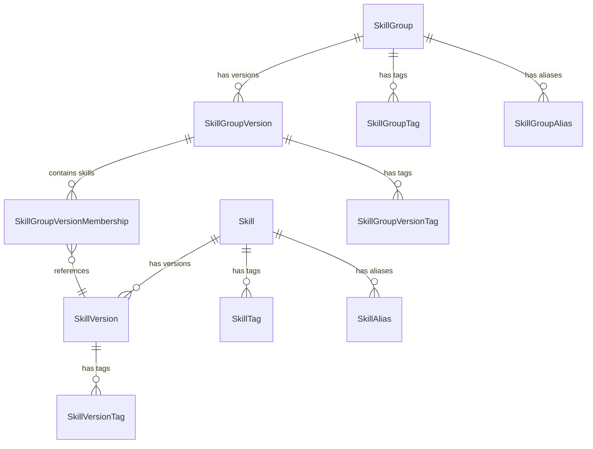

# RFC: Skill Registry

| Author(s)              | Bill Murdock (Red Hat) |
| :--------------------- | :-- |
| **Date Last Modified** | 2026-04-27 |
| **AI Assistant(s)**    | Claude Code (Opus 4.6) |

# Summary

Add a Skill Registry to MLflow: a governed, metadata-first registry for
AI agent skills. The registry stores metadata and typed source pointers
(to Git repos, OCI registries, ZIP archives, etc.) rather than skill
artifacts directly. It provides enterprise governance on top of existing
skill distribution mechanisms: lifecycle management, security scan
tracking, usage analytics via traces, and federated discovery across
sources.

The registry also introduces skill groups as a first-class concept,
allowing related skills to be organized into coherent toolboxes or
workflows and discovered as a unit.

# Basic example

## Register a skill and publish it

```python
import mlflow

# Create the logical skill asset
skill = mlflow.skills.create_skill(
    name="code-review",
    description="Reviews pull requests for correctness, style, and security",
)

# Register a version pointing to a Git source
version = mlflow.skills.create_skill_version(
    name="code-review",
    version="1.0.0",
    source_type="git",
    source="https://github.com/acme/agent-skills/tree/v1.0.0/code-review",
    content_digest="sha256:a3f2b8c...",
)
# version.publish_state == "draft"

# Publish the version so downstream consumers can discover it
mlflow.skills.update_skill_version(
    name="code-review",
    version="1.0.0",
    publish_state="published",
)

# Set an alias for stable resolution
mlflow.skills.set_skill_alias(
    name="code-review",
    alias="production",
    version="1.0.0",
    source_type="git",
)

# Record a security scan result as a tag
mlflow.skills.set_skill_version_tag(
    name="code-review",
    version="1.0.0",
    source_type="git",
    key="scan.prompt-injection.status",
    value="pass",
)
mlflow.skills.set_skill_version_tag(
    name="code-review",
    version="1.0.0",
    source_type="git",
    key="scan.prompt-injection.date",
    value="2026-04-22",
)
```

## Create a skill group with a versioned membership snapshot

```python
from mlflow.entities import SkillGroupVersionMembership

# Create a group for related skills
group = mlflow.skills.create_skill_group(
    name="pr-workflow",
    description="End-to-end pull request review workflow",
)

# Create a group version that pins specific skill versions
group_version = mlflow.skills.create_skill_group_version(
    name="pr-workflow",
    version="1.0.0",
    members=[
        SkillGroupVersionMembership(
            group_name="pr-workflow", group_version="1.0.0",
            skill_name="code-review", skill_version="1.0.0", skill_source_type="git",
        ),
        SkillGroupVersionMembership(
            group_name="pr-workflow", group_version="1.0.0",
            skill_name="test-coverage", skill_version="2.1.0", skill_source_type="git",
        ),
        SkillGroupVersionMembership(
            group_name="pr-workflow", group_version="1.0.0",
            skill_name="security-scan", skill_version="1.0.0", skill_source_type="oci",
        ),
    ],
)

# Publish the group version
mlflow.skills.update_skill_group_version(
    name="pr-workflow",
    version="1.0.0",
    publish_state="published",
)

# Set an alias for stable resolution
mlflow.skills.set_skill_group_alias(
    name="pr-workflow",
    alias="production",
    version="1.0.0",
)
```

## Discover and consume skills

```python
# Search for published skill versions
versions = mlflow.skills.search_skill_versions(
    name="code-review",
    filter_string="publish_state = 'published'",
)

# Search for active skill groups
groups = mlflow.skills.search_skill_groups(
    filter_string="status = 'active'",
)

# Get a specific version
version = mlflow.skills.get_skill_version(
    name="code-review",
    version="1.0.0",
    source_type="git",
)
# version.source_type == "git"
# version.source == "https://github.com/acme/agent-skills/tree/v1.0.0/code-review"

# Resolve by alias
version = mlflow.skills.get_skill_version_by_alias(
    name="code-review",
    alias="production",
)

# Get a group version and its pinned skill versions
group_version = mlflow.skills.get_skill_group_version(
    name="pr-workflow",
    version="1.0.0",
)
# group_version.members == [SkillGroupVersionMembership(...), ...]

# Resolve a group alias
group_version = mlflow.skills.get_skill_group_version_by_alias(
    name="pr-workflow",
    alias="production",
)
```

## CLI usage

```bash
# Register a skill pointing to a Git source
mlflow skills create --name code-review \
    --description "Reviews pull requests"
mlflow skills create-version --name code-review --version 1.0.0 \
    --source-type git \
    --source https://github.com/acme/agent-skills/tree/v1.0.0/code-review \
    --content-digest sha256:a3f2b8c...

# Publish and alias
mlflow skills update-version --name code-review --version 1.0.0 \
    --source-type git --publish-state published
mlflow skills set-alias --name code-review --alias production \
    --version 1.0.0 --source-type git

# Create a group and a versioned membership snapshot
mlflow skill-groups create --name pr-workflow \
    --description "End-to-end PR review workflow"
mlflow skill-groups create-version --name pr-workflow --version 1.0.0 \
    --member code-review:1.0.0:git \
    --member test-coverage:2.1.0:git \
    --member security-scan:1.0.0:oci
mlflow skill-groups update-version --name pr-workflow --version 1.0.0 \
    --publish-state published
mlflow skill-groups set-alias --name pr-workflow --alias production \
    --version 1.0.0

# Search published skill versions
mlflow skills search-versions --name code-review \
    --filter "publish_state = 'published'"

# Search active groups
mlflow skill-groups search --filter "status = 'active'"
```

## Motivation

### The problem

AI agent skills (reusable tool definitions, workflow steps, and coding
assistant capabilities) are becoming a critical asset class in
enterprise AI platforms. As organizations adopt agentic AI, they
accumulate skills across teams and repositories.

Today, skills are managed as ad-hoc files in Git repositories. This
works well for individual developers and small teams. GitHub provides
versioning, collaboration, and access control.

However, enterprises face governance challenges that Git alone does not
address:

1. **No publish-state lifecycle.** Git has no concept of "this skill
   version is approved for production use" vs. "this is a draft." Teams
   resort to branch naming conventions or external tracking to manage
   skill promotion.

2. **No security scan tracking.** Skills may contain executable code or
   be vulnerable to prompt injection. There is no standard place to
   record whether a skill version has been scanned and what the results
   were.

3. **Fragmented discovery.** Skills may live in multiple Git repos, OCI
   registries, or other distribution systems. There is no single
   discovery layer across all of these.

4. **No skill grouping.** Skills often work together as coherent
   toolboxes or multi-step workflows. Agent harnesses like Claude Code
   support plugin-level grouping, but there is no agent-neutral way to
   represent these relationships.

5. **No usage analytics linkage.** MLflow traces can capture skill
   metadata, but without a governed registry, there is no way to link
   trace data back to a governed skill record to understand adoption
   across an organization.

### Use cases

1. **Governed registration**: Platform administrators register skill
   metadata with typed source pointers to where the skill content lives
   (Git, OCI, ZIP). The registry governs; the source system stores.

2. **Lifecycle management**: Skill versions move through publish states
   (draft, published, deprecated, retired) to control downstream
   surfacing. This is the governance layer that Git lacks.

3. **Security scan tracking**: Scan results (prompt injection, code
   vulnerabilities, etc.) are recorded as version-level tags. The
   registry does not perform scans; it provides the metadata layer for
   recording and querying results.

4. **Skill grouping**: Related skills are organized into groups for
   discovery and governance. A skill can belong to multiple groups.
   Groups have their own publish state and tags.

5. **Federated discovery**: Users discover published skills and groups
   across all source types from a single search interface, without
   requiring skill content to be centralized.

6. **Usage analytics**: Agent traces record which skill versions were
   used. Combined with registry metadata, this enables organizations to
   understand adoption and make data-driven promotion decisions.

### Out of scope

- **Skill artifact storage.** The registry stores metadata and source
  pointers. Skill content remains in Git, OCI, or other distribution
  systems.
- **Skill authoring or development tools.** The registry manages
  published skills, not the process of writing them.
- **Skill format specification.** The registry is format-agnostic. It
  does not define or enforce what a skill looks like (SKILL.md, plugin
  manifests, etc.).
- **Security scanning execution.** The registry records scan results; it
  does not perform scans. Scanning tools are separate.
- **Agent harness integration.** How a specific agent harness (Claude
  Code, Codex, Cursor, etc.) installs or loads skills from the registry
  is outside this RFC. The registry provides the metadata; harness
  integration layers consume it.
- **Approval workflows or review gates.** Publish state transitions are
  sufficient for initial governance. Approval chains can be built on top
  via external systems.
- **Detailed UI/UX design.** This RFC describes the UI surface and
  placement but does not specify interaction patterns.

## Detailed design

### Entities and data model



#### Skill

The logical governed asset, scoped to a workspace.

```python
from dataclasses import dataclass, field
from enum import StrEnum


class SkillStatus(StrEnum):
    ACTIVE = "active"
    DEPRECATED = "deprecated"
    RETIRED = "retired"


@dataclass
class Skill:
    name: str
    description: str | None = None
    workspace: str | None = None
    status: SkillStatus = SkillStatus.ACTIVE
    tags: dict[str, str] = field(default_factory=dict)
    aliases: list[SkillAlias] = field(default_factory=list)
    last_registered_version: str | None = None
    created_by: str | None = None
    last_updated_by: str | None = None
    creation_timestamp: int | None = None
    last_updated_timestamp: int | None = None
```

| Field | Type | Description |
|---|---|---|
| `name` | `str` | Stable logical asset name, unique within a workspace |
| `status` | `SkillStatus` | Skill-level lifecycle: `active`, `deprecated`, `retired` |
| `aliases` | `list[SkillAlias]` | Stable version pointers, each resolving to a `(version, source_type)` pair |
| `last_registered_version` | `str` | Most recently registered version string |
| `workspace` | `str` | Visibility boundary |

#### SkillVersion

A versioned record containing a typed source pointer, publish state,
and tags.

```python
class SkillPublishState(StrEnum):
    DRAFT = "draft"
    PUBLISHED = "published"
    DEPRECATED = "deprecated"
    RETIRED = "retired"


class SkillSourceType(StrEnum):
    GIT = "git"
    OCI = "oci"
    ZIP = "zip"


@dataclass
class SkillVersion:
    name: str
    version: str
    source_type: SkillSourceType
    source: str
    publish_state: SkillPublishState = SkillPublishState.DRAFT
    content_digest: str | None = None
    tags: dict[str, str] = field(default_factory=dict)
    run_id: str | None = None
    workspace: str | None = None
    created_by: str | None = None
    last_updated_by: str | None = None
    creation_timestamp: int | None = None
    last_updated_timestamp: int | None = None
```

| Field | Type | Description |
|---|---|---|
| `version` | `str` | Publisher-supplied version string. Semver recommended but not enforced |
| `source_type` | `SkillSourceType` | Distribution mechanism: `git`, `oci`, `zip` |
| `source` | `str` | Pointer to the skill content in the source system (URL, OCI reference, etc.) |
| `content_digest` | `str` | Optional digest for integrity verification (e.g., `sha256:abc123...`). Aligns with OCI digest terminology |
| `publish_state` | `SkillPublishState` | Per-version surfacing lifecycle |
| `run_id` | `str` | Optional MLflow run association for trace linkage |

**Source type extensibility.** The `source_type` enum is intentionally
small for the initial implementation. New source types (e.g., `s3`,
`azure-blob`) can be added without schema changes since the column
stores a string value.

**Version uniqueness.** The combination of `(name, version, source_type)`
is unique within a workspace. This allows the same skill version to be
registered from multiple distribution mechanisms (e.g., Git and OCI)
without requiring different version strings.

**Content integrity.** The optional `content_digest` field stores a
digest of the skill content at registration time (e.g.,
`sha256:abc123...`). Consumers can use this to verify that the content
at `source` has not changed since registration. For OCI sources,
this is the native image digest. For Git sources, this is a digest of
the skill file contents at the pinned commit. For ZIP sources, this is
a digest of the archive. The registry stores the digest but does not
verify it on read; verification is the consumer's responsibility.

**Immutability contract.** `source_type`, `source`, `content_digest`,
and `version` are immutable after creation. To point to different content,
register a new version. Mutable fields (`publish_state`, `tags`) can be
updated independently.

#### SkillGroup

The logical group asset, scoped to a workspace. Follows the same
pattern as Skill: a top-level entity with versions, tags, and aliases.

```python
class SkillGroupStatus(StrEnum):
    ACTIVE = "active"
    DEPRECATED = "deprecated"
    RETIRED = "retired"


@dataclass
class SkillGroup:
    name: str
    description: str | None = None
    workspace: str | None = None
    status: SkillGroupStatus = SkillGroupStatus.ACTIVE
    tags: dict[str, str] = field(default_factory=dict)
    aliases: list["SkillGroupAlias"] = field(default_factory=list)
    last_registered_version: str | None = None
    created_by: str | None = None
    last_updated_by: str | None = None
    creation_timestamp: int | None = None
    last_updated_timestamp: int | None = None
```

#### SkillGroupVersion

A versioned snapshot of a skill group's membership. Each version
captures a specific set of skill versions that work together.

```python
@dataclass
class SkillGroupVersion:
    name: str
    version: str
    publish_state: SkillPublishState = SkillPublishState.DRAFT
    tags: dict[str, str] = field(default_factory=dict)
    members: list["SkillGroupVersionMembership"] = field(default_factory=list)
    workspace: str | None = None
    created_by: str | None = None
    last_updated_by: str | None = None
    creation_timestamp: int | None = None
    last_updated_timestamp: int | None = None
```

**Version uniqueness.** The combination of `(name, version)` is unique
within a workspace.

**Immutability contract.** The membership list of a group version is
immutable after creation. To change the set of skills, register a new
group version. Mutable fields (`publish_state`, `tags`) can be updated
independently.

#### SkillGroupVersionMembership

Each membership entry pins a specific skill version (including source
type).

```python
@dataclass(frozen=True)
class SkillGroupVersionMembership:
    group_name: str
    group_version: str
    skill_name: str
    skill_version: str
    skill_source_type: SkillSourceType
    workspace: str | None = None
```

A skill can appear in multiple groups and multiple group versions.
Membership is at the skill version level, so a group version is a
reproducible snapshot of "these specific skill versions work together."

#### SkillGroupAlias

```python
@dataclass(frozen=True)
class SkillGroupAlias:
    name: str      # parent SkillGroup name
    alias: str     # e.g., "production", "staging"
    version: str   # group version string this alias points to
```

#### SkillAlias and SkillTag

```python
@dataclass(frozen=True)
class SkillAlias:
    name: str                       # parent Skill name
    alias: str                      # e.g., "production", "staging"
    version: str                    # version string this alias points to
    source_type: SkillSourceType    # source type this alias points to

@dataclass(frozen=True)
class SkillTag:
    key: str
    value: str
```

Tags use the same structure for skill-level, version-level, and
group-level tags. The distinction is maintained at the storage and API
layer (separate tables, separate endpoints).

### Publish state and lifecycle

#### Per-version publish state

Each `SkillVersion` has an independent publish state:

| State | Meaning | Downstream surfacing |
|---|---|---|
| `draft` | Registered but not ready for consumption | Not surfaced |
| `published` | Ready for downstream use | Surfaced to discovery, traces, consumers |
| `deprecated` | Still functional but no longer recommended | Surfaced with deprecation signal |
| `retired` | Preserved for history, no longer active | Not surfaced |

Allowed transitions:

| From | To |
|---|---|
| `draft` | `published`, `retired` |
| `published` | `deprecated` |
| `deprecated` | `published`, `retired` |

`published` cannot return to `draft`. `deprecated` can return to
`published` (re-publish) for cases where a deprecation was premature.

#### Skill group version publish state

Each `SkillGroupVersion` has its own publish state lifecycle, following
the same transitions as `SkillVersion`. A group version's publish state
is independent of its member skills' publish states. Publishing a group
version does not require its member skill versions to be published,
though consumers will typically want to verify this.

#### Skill-level status

`Skill.status` is a separate lifecycle for the logical asset as a whole
(`active`, `deprecated`, `retired`). Setting a skill to `deprecated`
does not automatically change individual version publish states.

### Database schema

Twelve tables, created via a single Alembic migration. All tables are
workspace-scoped.

#### `skills`

| Column | Type | Notes |
|--------|------|-------|
| `workspace` | `String(63)` | PK, default `'default'` |
| `name` | `String(256)` | PK |
| `description` | `String(5000)` | |
| `status` | `String(20)` | default `'active'` |
| `last_registered_version` | `String(256)` | |
| `created_by` | `String(256)` | |
| `last_updated_by` | `String(256)` | |
| `creation_timestamp` | `BigInteger` | millis since epoch |
| `last_updated_timestamp` | `BigInteger` | millis since epoch |

#### `skill_versions`

| Column | Type | Notes |
|--------|------|-------|
| `workspace` | `String(63)` | PK, FK |
| `name` | `String(256)` | PK, FK |
| `version` | `String(256)` | PK, publisher-supplied |
| `source_type` | `String(20)` | PK; `git`, `oci`, `zip`, etc. |
| `source` | `String(2048)` | pointer to skill content |
| `content_digest` | `String(512)` | optional integrity digest |
| `publish_state` | `String(20)` | default `'draft'` |
| `run_id` | `String(32)` | optional MLflow run linkage |
| `created_by` | `String(256)` | |
| `last_updated_by` | `String(256)` | |
| `creation_timestamp` | `BigInteger` | millis since epoch |
| `last_updated_timestamp` | `BigInteger` | millis since epoch |

FK: `(workspace, name)` references `skills`, CASCADE delete.

#### `skill_tags`

| Column | Type | Notes |
|--------|------|-------|
| `workspace` | `String(63)` | PK, FK |
| `name` | `String(256)` | PK, FK |
| `key` | `String(256)` | PK |
| `value` | `Text` | |

#### `skill_version_tags`

| Column | Type | Notes |
|--------|------|-------|
| `workspace` | `String(63)` | PK, FK |
| `name` | `String(256)` | PK, FK |
| `version` | `String(256)` | PK, FK |
| `source_type` | `String(20)` | PK, FK |
| `key` | `String(256)` | PK |
| `value` | `Text` | |

#### `skill_aliases`

| Column | Type | Notes |
|--------|------|-------|
| `workspace` | `String(63)` | PK, FK |
| `name` | `String(256)` | PK, FK |
| `alias` | `String(256)` | PK |
| `version` | `String(256)` | target version string |
| `source_type` | `String(20)` | target source type |

#### `skill_groups`

| Column | Type | Notes |
|--------|------|-------|
| `workspace` | `String(63)` | PK, default `'default'` |
| `name` | `String(256)` | PK |
| `description` | `String(5000)` | |
| `status` | `String(20)` | default `'active'` |
| `last_registered_version` | `String(256)` | |
| `created_by` | `String(256)` | |
| `last_updated_by` | `String(256)` | |
| `creation_timestamp` | `BigInteger` | millis since epoch |
| `last_updated_timestamp` | `BigInteger` | millis since epoch |

#### `skill_group_versions`

| Column | Type | Notes |
|--------|------|-------|
| `workspace` | `String(63)` | PK, FK |
| `name` | `String(256)` | PK, FK |
| `version` | `String(256)` | PK, publisher-supplied |
| `publish_state` | `String(20)` | default `'draft'` |
| `created_by` | `String(256)` | |
| `last_updated_by` | `String(256)` | |
| `creation_timestamp` | `BigInteger` | millis since epoch |
| `last_updated_timestamp` | `BigInteger` | millis since epoch |

FK: `(workspace, name)` references `skill_groups`, CASCADE delete.

#### `skill_group_version_memberships`

| Column | Type | Notes |
|--------|------|-------|
| `workspace` | `String(63)` | PK |
| `group_name` | `String(256)` | PK, FK to `skill_group_versions` |
| `group_version` | `String(256)` | PK, FK to `skill_group_versions` |
| `skill_name` | `String(256)` | PK, FK to `skill_versions` |
| `skill_version` | `String(256)` | PK, FK to `skill_versions` |
| `skill_source_type` | `String(20)` | PK, FK to `skill_versions` |

FK: `(workspace, group_name, group_version)` references `skill_group_versions`, CASCADE delete.
FK: `(workspace, skill_name, skill_version, skill_source_type)` references `skill_versions`, RESTRICT delete.

#### `skill_group_tags`

| Column | Type | Notes |
|--------|------|-------|
| `workspace` | `String(63)` | PK, FK |
| `name` | `String(256)` | PK, FK |
| `key` | `String(256)` | PK |
| `value` | `Text` | |

#### `skill_group_version_tags`

| Column | Type | Notes |
|--------|------|-------|
| `workspace` | `String(63)` | PK, FK |
| `name` | `String(256)` | PK, FK |
| `version` | `String(256)` | PK, FK |
| `key` | `String(256)` | PK |
| `value` | `Text` | |

#### `skill_group_aliases`

| Column | Type | Notes |
|--------|------|-------|
| `workspace` | `String(63)` | PK, FK |
| `name` | `String(256)` | PK, FK |
| `alias` | `String(256)` | PK |
| `version` | `String(256)` | target group version string |

**Workspace handling.** All tables use `(workspace, ...)` as the leading
primary key components. Single-tenant deployments use `'default'`.

**Timestamps.** Set at the application layer via
`get_current_time_millis()`, not via DDL defaults.

### Abstract store interface

The store interface follows MLflow's abstract store pattern.

```python
from abc import abstractmethod


class AbstractSkillRegistryStore:
    # --- Skill operations ---

    @abstractmethod
    def create_skill(
        self, name: str, description: str | None = None,
    ) -> Skill: ...

    @abstractmethod
    def get_skill(self, name: str) -> Skill: ...

    @abstractmethod
    def search_skills(
        self,
        filter_string: str | None = None,
        max_results: int = 100,
        page_token: str | None = None,
    ) -> PagedList[Skill]: ...

    @abstractmethod
    def update_skill(
        self,
        name: str,
        description: str | None = None,
        status: SkillStatus | None = None,
    ) -> Skill: ...

    @abstractmethod
    def delete_skill(self, name: str) -> None: ...

    # --- SkillVersion operations ---

    @abstractmethod
    def create_skill_version(
        self,
        name: str,
        version: str,
        source_type: str,
        source: str,
        publish_state: SkillPublishState = SkillPublishState.DRAFT,
        content_digest: str | None = None,
        run_id: str | None = None,
    ) -> SkillVersion: ...

    @abstractmethod
    def get_skill_version(
        self, name: str, version: str, source_type: str,
    ) -> SkillVersion: ...

    @abstractmethod
    def get_skill_version_by_alias(
        self, name: str, alias: str,
    ) -> SkillVersion: ...

    @abstractmethod
    def get_latest_skill_version(self, name: str) -> SkillVersion: ...

    @abstractmethod
    def search_skill_versions(
        self,
        name: str,
        filter_string: str | None = None,
        max_results: int = 100,
        page_token: str | None = None,
    ) -> PagedList[SkillVersion]: ...

    @abstractmethod
    def update_skill_version(
        self,
        name: str,
        version: str,
        source_type: str,
        publish_state: SkillPublishState | None = None,
    ) -> SkillVersion: ...

    @abstractmethod
    def delete_skill_version(
        self, name: str, version: str, source_type: str,
    ) -> None: ...

    # --- Tag operations ---

    @abstractmethod
    def set_skill_tag(
        self, name: str, key: str, value: str,
    ) -> None: ...

    @abstractmethod
    def delete_skill_tag(self, name: str, key: str) -> None: ...

    @abstractmethod
    def set_skill_version_tag(
        self, name: str, version: str, source_type: str,
        key: str, value: str,
    ) -> None: ...

    @abstractmethod
    def delete_skill_version_tag(
        self, name: str, version: str, source_type: str, key: str,
    ) -> None: ...

    # --- Alias operations ---

    @abstractmethod
    def set_skill_alias(
        self, name: str, alias: str, version: str, source_type: str,
    ) -> None: ...

    @abstractmethod
    def delete_skill_alias(
        self, name: str, alias: str,
    ) -> None: ...

    # --- SkillGroup operations ---

    @abstractmethod
    def create_skill_group(
        self, name: str, description: str | None = None,
    ) -> SkillGroup: ...

    @abstractmethod
    def get_skill_group(self, name: str) -> SkillGroup: ...

    @abstractmethod
    def search_skill_groups(
        self,
        filter_string: str | None = None,
        max_results: int = 100,
        page_token: str | None = None,
    ) -> PagedList[SkillGroup]: ...

    @abstractmethod
    def update_skill_group(
        self,
        name: str,
        description: str | None = None,
        status: SkillGroupStatus | None = None,
    ) -> SkillGroup: ...

    @abstractmethod
    def delete_skill_group(self, name: str) -> None: ...

    # --- SkillGroupVersion operations ---

    @abstractmethod
    def create_skill_group_version(
        self,
        name: str,
        version: str,
        members: list[SkillGroupVersionMembership],
        publish_state: SkillPublishState = SkillPublishState.DRAFT,
    ) -> SkillGroupVersion: ...

    @abstractmethod
    def get_skill_group_version(
        self, name: str, version: str,
    ) -> SkillGroupVersion: ...

    @abstractmethod
    def get_skill_group_version_by_alias(
        self, name: str, alias: str,
    ) -> SkillGroupVersion: ...

    @abstractmethod
    def get_latest_skill_group_version(
        self, name: str,
    ) -> SkillGroupVersion: ...

    @abstractmethod
    def search_skill_group_versions(
        self,
        name: str,
        filter_string: str | None = None,
        max_results: int = 100,
        page_token: str | None = None,
    ) -> PagedList[SkillGroupVersion]: ...

    @abstractmethod
    def update_skill_group_version(
        self,
        name: str,
        version: str,
        publish_state: SkillPublishState | None = None,
    ) -> SkillGroupVersion: ...

    @abstractmethod
    def delete_skill_group_version(
        self, name: str, version: str,
    ) -> None: ...

    # --- SkillGroup tag operations ---

    @abstractmethod
    def set_skill_group_tag(
        self, name: str, key: str, value: str,
    ) -> None: ...

    @abstractmethod
    def delete_skill_group_tag(
        self, name: str, key: str,
    ) -> None: ...

    @abstractmethod
    def set_skill_group_version_tag(
        self, name: str, version: str,
        key: str, value: str,
    ) -> None: ...

    @abstractmethod
    def delete_skill_group_version_tag(
        self, name: str, version: str, key: str,
    ) -> None: ...

    # --- SkillGroup alias operations ---

    @abstractmethod
    def set_skill_group_alias(
        self, name: str, alias: str, version: str,
    ) -> None: ...

    @abstractmethod
    def delete_skill_group_alias(
        self, name: str, alias: str,
    ) -> None: ...
```

### REST API

The REST API uses RESTful nested resource paths, following the pattern
from the MCP Server Registry proposal.

#### Skill endpoints

All paths relative to `/ajax-api/3.0/mlflow/skills`.

| Method | Path | Description |
|---|---|---|
| `POST` | `/` | Create a skill |
| `GET` | `/` | Search skills |
| `GET` | `/{name}` | Get skill by name |
| `PATCH` | `/{name}` | Update skill fields |
| `DELETE` | `/{name}` | Delete skill (cascades) |
| `POST` | `/{name}/versions` | Create a skill version |
| `GET` | `/{name}/versions` | Search versions |
| `GET` | `/{name}/versions/{version}/{source_type}` | Get a specific version |
| `PATCH` | `/{name}/versions/{version}/{source_type}` | Update version |
| `DELETE` | `/{name}/versions/{version}/{source_type}` | Delete a version |
| `POST` | `/{name}/tags` | Set a skill-level tag |
| `DELETE` | `/{name}/tags/{key}` | Delete a skill-level tag |
| `POST` | `/{name}/versions/{version}/{source_type}/tags` | Set a version-level tag |
| `DELETE` | `/{name}/versions/{version}/{source_type}/tags/{key}` | Delete a version tag |
| `POST` | `/{name}/aliases` | Set an alias |
| `GET` | `/{name}/aliases/{alias}` | Resolve alias to `SkillVersion` (returns version and source_type) |
| `DELETE` | `/{name}/aliases/{alias}` | Delete an alias |

#### Skill group endpoints

All paths relative to `/ajax-api/3.0/mlflow/skill-groups`.

| Method | Path | Description |
|---|---|---|
| `POST` | `/` | Create a skill group |
| `GET` | `/` | Search skill groups |
| `GET` | `/{name}` | Get group by name |
| `PATCH` | `/{name}` | Update group fields |
| `DELETE` | `/{name}` | Delete group (cascades versions) |
| `POST` | `/{name}/versions` | Create a group version with members |
| `GET` | `/{name}/versions` | Search group versions |
| `GET` | `/{name}/versions/{version}` | Get a specific group version |
| `PATCH` | `/{name}/versions/{version}` | Update group version publish state |
| `DELETE` | `/{name}/versions/{version}` | Delete a group version |
| `POST` | `/{name}/tags` | Set a group-level tag |
| `DELETE` | `/{name}/tags/{key}` | Delete a group-level tag |
| `POST` | `/{name}/versions/{version}/tags` | Set a group version tag |
| `DELETE` | `/{name}/versions/{version}/tags/{key}` | Delete a group version tag |
| `POST` | `/{name}/aliases` | Set a group alias |
| `GET` | `/{name}/aliases/{alias}` | Resolve group alias to version |
| `DELETE` | `/{name}/aliases/{alias}` | Delete a group alias |

#### Pagination and filtering

Search endpoints use page-token-based pagination and `filter_string`
expressions following existing MLflow conventions.

**Skills and skill groups:** `name LIKE '%review%'`, `status = 'active'`,
`tags.team = 'platform'`

**Skill versions:** `publish_state = 'published'`,
`source_type = 'git'`, `tags.scan.prompt-injection.status = 'pass'`

**Skill group versions:** `publish_state = 'published'`,
`tags.approved = 'true'`

### Python SDK and CLI

The `mlflow.skills` module exposes top-level functions delegating to
`MlflowClient`, with a 1:1 mapping to the abstract store methods above.
Two CLI command groups (`mlflow skills` and `mlflow skill-groups`)
provide the same operations from the command line. See the basic
examples at the top of this RFC for usage.

### Error handling

| Scenario | Error code | HTTP status |
|---|---|---|
| Skill, version, or group not found | `RESOURCE_DOES_NOT_EXIST` | 404 |
| Duplicate skill name, version, or group | `RESOURCE_ALREADY_EXISTS` | 409 |
| Invalid publish state transition | `INVALID_PARAMETER_VALUE` | 400 |
| Unknown source type | `INVALID_PARAMETER_VALUE` | 400 |
| Alias references non-existent version | `RESOURCE_DOES_NOT_EXIST` | 404 |
| Group version member references non-existent skill version | `RESOURCE_DOES_NOT_EXIST` | 404 |
| Delete skill version referenced by a group version | `INVALID_PARAMETER_VALUE` | 400 |
| Delete skill with versions referenced by a group | `INVALID_PARAMETER_VALUE` | 400 |
| Delete skill or group with no group references | Cascading delete (succeeds) | 200 |

### Workspace scoping

All skill registry operations are workspace-scoped, following the model
registry pattern:

- Workspace is resolved via `resolve_entity_workspace_name()`
- Single-tenant deployments use `"default"`
- All database queries filter by workspace
- The REST API derives workspace from the authenticated caller's context
- Version, tag, alias, and group membership operations inherit workspace
  from their parent entity

Cross-workspace sharing (e.g., a platform team publishing skills
visible to all workspaces) is not addressed by this RFC. This is a
cross-registry concern that applies equally to skills, MCP servers,
and other AI asset registries. It is expected to be solved at the
platform level across all MLflow registries rather than piecemeal in
each one.

### UI

The Skills page lives under the GenAI workflow in the MLflow sidebar,
alongside Experiments, Prompts, and other AI asset pages.

The list view shows skills and skill groups in a card-based or table
layout, with name, description, latest version, status, and tags. Users
can filter by status, source type, and search by name or description. A
toggle switches between individual skills and skill groups.

The detail view for a skill shows metadata, version list, aliases, tags
(including security scan results), and group memberships.

The detail view for a skill group shows its description, status, version
list, aliases, and tags. Each group version shows its publish state and
the pinned skill versions it contains.

### Security scan tracking

The registry does not perform security scans. It provides a metadata
layer for recording and querying scan results using version-level tags.

Recommended tag conventions:

| Tag key | Example value | Description |
|---|---|---|
| `scan.prompt-injection.status` | `pass`, `fail`, `warning` | Scan result |
| `scan.prompt-injection.date` | `2026-04-22` | When the scan was run |
| `scan.prompt-injection.tool` | `garak-0.9` | Which tool performed the scan |
| `scan.code-vuln.status` | `pass` | Code vulnerability scan result |
| `scan.code-vuln.date` | `2026-04-22` | When the scan was run |

These are conventions, not enforced schema. Organizations can define
additional scan tag prefixes for their own scanning tools and criteria.

The publish state lifecycle supports scan-gated promotion workflows:
a skill version stays in `draft` until scans pass, then is moved to
`published`. The registry does not enforce this workflow, but the
combination of publish state and scan tags makes it easy to implement.

## Drawbacks

- **Source pointer validity.** The registry stores source pointers but
  cannot guarantee they remain valid. The optional `content_digest`
  field mitigates content tampering but does not prevent link rot. This
  is inherent to a metadata-first design.
- **No artifact storage.** This design does not provide a self-contained
  backup of skill content. If the source system goes away, the metadata
  remains but the content is lost.

# Alternatives

## Store skill artifacts directly in MLflow

Store skill bundles (SKILL.md + scripts + assets) as MLflow artifacts
alongside the metadata.

Rejected because skills are already versioned and stored in Git, OCI, or
other systems. Source pointers federate across distribution mechanisms
naturally; artifact storage forces centralization. Organizations that
want artifact backup can use OCI registries, which already provide
versioned, content-addressable storage.

## Use Git alone (no registry)

Continue using Git repositories as the sole mechanism for skill
management.

This is sufficient for individual developers and small teams. This RFC
proposes a governance layer on top of Git for enterprises that need
publish-state lifecycle, security scan tracking, and federated discovery.
The two approaches are complementary.

# Adoption strategy

This is a new feature, not a breaking change. Adoption is incremental:

**Initial release:**
- Entities, database schema, store implementation, REST API, Python SDK,
  CLI, and basic UI.
- Users can register skills with source pointers, manage publish state,
  record scan results as tags, organize skills into groups, and discover
  published skills.
- Existing MLflow functionality is unaffected.

**Follow-up:**
- Agent trace integration: traces automatically record which registered
  skill version was used, linking back to the registry.
- Usage analytics dashboard based on trace metadata.
- Shared base extraction across AI asset registries (skills, MCP
  servers, etc.) once patterns are validated.
- Additional source types as demand emerges.
