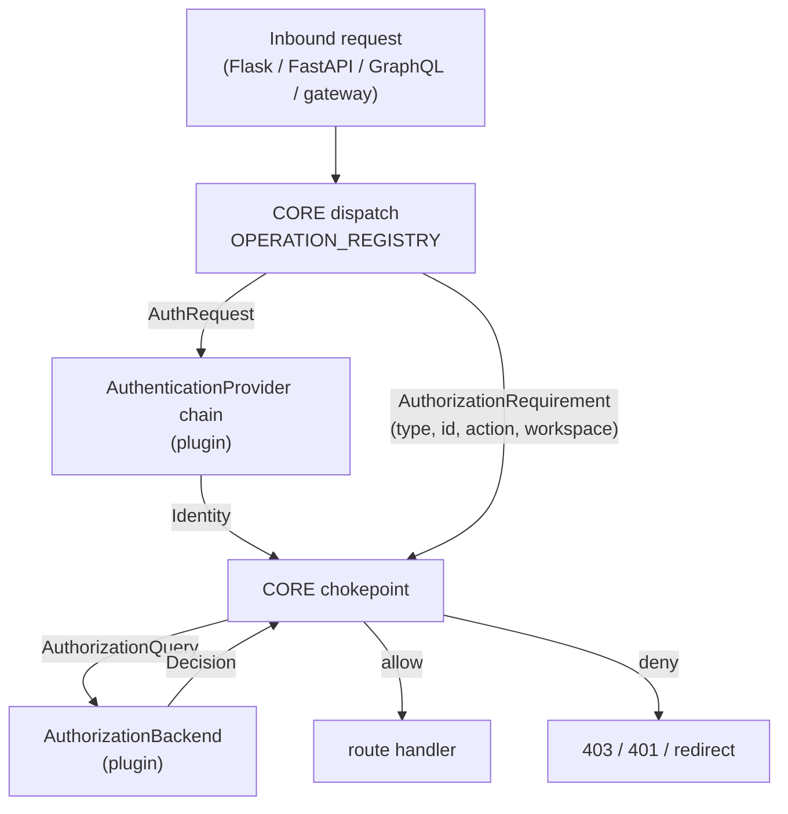

<!-- markdownlint-disable-file MD041 -->

| Author(s)              | [Patrick Koss](https://github.com/PatrickKoss)     |
| :--------------------- | :------------------------------------------------- |
| **Date Last Modified** | 2026-05-27                                         |

<!-- markdownlint-disable MD025 -->

# Summary: Pluggable Enterprise Authentication and Authorization

MLflow's only built-in auth surface is a single configurable
`authorization_function` (`mlflow/server/auth/config.py`). That one hook
conflates two distinct concerns — *who are you* (authentication) and *what may
you do* (authorization) — into one function that returns a
`werkzeug.datastructures.Authorization` carrying nothing but a username. It is
too thin for bearer tokens, OIDC claims, group membership, or just-in-time user
provisioning, and the FastAPI request path silently refuses any non-default
function at all (`mlflow/server/auth/__init__.py:4141`). Worse, the knowledge of
*which permission a given route requires* is fused inside ~200 validator
functions spread across six dispatch structures. Any external authorization
system — Kubernetes `SubjectAccessReview`, OPA, a corporate policy engine — has
to rediscover and duplicate that entire mapping, and re-sync it every time
MLflow adds a route.

This RFC proposes splitting auth into **two small plugin contracts** while
keeping the expensive, churning knowledge in core:

- **`AuthenticationProvider`** — turns an inbound request (headers, cookies,
  token) into a rich `Identity`. Reference adapters: OAuth/OIDC bearer tokens,
  Kubernetes `TokenReview`, and upstream proxy identity headers.
- **`AuthorizationBackend`** — owns the allow/deny decision given an `Identity`
  and a **normalized** `AuthorizationRequirement`. Reference adapters: the
  default database-backed RBAC resolver, Kubernetes `SubjectAccessReview`, and
  OPA.

The load-bearing design rule: **core retains sole ownership of the
route → requirement mapping**, expressed as a single authoritative
`OPERATION_REGISTRY`. Plugins never see a route, a protobuf class, or a GraphQL
field — only the tuple `(resource_type, resource_id, action, workspace)`. A CI
guard fails the build if any route ships without declaring a requirement.

This is the extension RFC that **RFC 0005** ("Role-Based Access Control for
MLflow OSS") explicitly flagged as future work in its *"Extension point:
resolver interface"* section. It builds on 0005's role model, its
`get_role_permission_for_resource(...)` / `list_accessible_workspace_names(...)`
resolver surface, and its `READ/USE/EDIT/MANAGE` permission levels. It does not
change 0005's role storage. The default plugins reproduce today's behavior
byte-for-byte.

# Basic example

The operator-facing change is a small config edit. The shape of the config
mirrors the existing basic-auth INI (`mlflow/server/auth/basic_auth.ini`).

**Default — identical to today's behavior.** An operator who upgrades and
changes nothing gets exactly the current basic-auth + database RBAC:

```ini
[mlflow]
default_permission = READ
database_uri = sqlite:///auth.db
admin_username = admin
admin_password = password

authn_providers = basic-auth   # ordered chain; first to authenticate or challenge wins
authz_backend = database       # the RFC 0005 role resolver, wrapped as a backend
```

**Kubernetes deployment — OIDC tokens, decisions delegated to the API server:**

```ini
[mlflow]
default_permission = NO_PERMISSIONS
database_uri = sqlite:///auth.db
admin_username = admin
admin_password = password

authn_providers = oidc, basic-auth
authz_backend = k8s-sar

[authn.oidc]
issuer = https://idp.example.com
audience = mlflow
group_claim = groups
provision = true

[authz.k8s-sar]
api_server = https://kubernetes.default.svc
on_error = deny
cache_ttl_seconds = 30
```

**The plugin author's whole job.** An authorization plugin implements one
method, and it never learns MLflow's routing:

```python
class SarBackend:
    name = "k8s-sar"

    def authorize(self, query: AuthorizationQuery) -> Decision:
        req = query.requirement   # ("experiment", "42", "update", "ml-research")
        # ...POST a SubjectAccessReview, read status.allowed...
        return Decision(allowed=..., reason=...)
```

The plugin sees `("experiment", "42", "update", "ml-research")`. It never sees
`POST /api/2.0/mlflow/runs/log-metric`, never imports `LogMetric`, never learns
that logging a metric requires `update` on the run's *parent experiment*. That
derivation stays in core.

## Motivation

The legacy auth surface has three structural problems. They mirror the
three-problem framing of RFC 0005, one layer up.

**First, authentication and authorization are a single string.** The only hook
is `auth_config.authorization_function`, a dotted path resolved through
`importlib` (`mlflow/server/auth/__init__.py:2467`). The default,
`authenticate_request_basic_auth` (`:2486`), both reads the `Authorization`
header *and* decides the user is who they claim. There is no way to express the
common enterprise shape "authenticate with OIDC, but delegate the *decision* to
Kubernetes RBAC or an OPA policy." The two concerns are welded together.

**Second, the identity is too thin.** `authenticate_request()` returns a
`werkzeug Authorization`, whose only useful attribute is `.username`. Real
enterprise deployments need to validate a JWT against an IdP's JWKS, carry the
user's group membership for group→permission mapping, provision a user row on
first login, and link an external identity to an existing local user. None of
that fits through a username string. Today operators bolt an OAuth proxy
(oauth2-proxy, Authelia, Pomerium) in front of MLflow; the proxy authenticates,
but MLflow stays blind to who the user is and cannot use IdP groups in its own
RBAC.

**Third, and most damaging for maintainability, the route → requirement mapping
is fused inside the validators and scattered across six structures.** Each entry
in `BEFORE_REQUEST_HANDLERS` (`:2148`) maps a protobuf request class to a
validator that *both* extracts the resource *and* decides
(`validate_can_read_run` pulls the run id, resolves its parent experiment and
workspace, queries grants, and returns a boolean). That knowledge is replicated
across `BEFORE_REQUEST_VALIDATORS` (`:2280`), three parameterized regex dicts
(`TRACE_*`, `LOGGED_MODEL_*`, `WEBHOOK_*`), the FastAPI dispatcher
`_find_fastapi_validator` (`:4079`), and the hardcoded GraphQL `PROTECTED_FIELDS`
set (`:3779`). An external authorization integration — for example Kubeflow's
`mlflow-integration`, which the issue thread cites — cannot consume any of this.
It must rediscover that "GetRun means read on the parent experiment," redo it for
every one of ~200 operations, and re-sync on every MLflow release that adds a
route. That duplication is the single hardest thing to maintain in a plugin
approach, and it is exactly what this RFC is designed to prevent.

The demand is concrete and named in the issue: Kubernetes `TokenReview` +
`SubjectAccessReview`, OPA, OAuth/OIDC, Kerberos, and proxy-provided identity
headers. RFC 0005 deferred the "pluggable authorization resolver" and flagged the
small resolver interface as a known hook-in point for "a future extension RFC."
This is that RFC.

### Out of scope

- **A full OIDC/SAML login experience.** Login pages, server-side sessions,
  cookie lifecycle, single logout, and SDK token-acquisition flows are the
  concern of a *specific* authentication provider plugin, not this framework
  RFC. We define the `AuthenticationProvider` interface and show a bearer-token
  OIDC adapter as an illustration; a full browser-SSO provider is a separate
  plugin (and possibly its own RFC). This matches the maintainer's stated
  preference: make MLflow pluggable, let the community maintain the plugins, with
  some donated back.
- **Changing RFC 0005's role storage.** The `roles` / `role_permissions` /
  `user_role_assignments` tables and the role API are a prerequisite, not a
  subject, of this RFC.
- **Building an identity provider.** MLflow delegates authentication to external
  systems.
- **The group → MLflow-role mapping *policy*.** *Where* IdP groups get mapped to
  MLflow permissions (in the provider, in a core mapping table, or entirely
  inside the authz backend) is a real decision but is flagged as an open question
  rather than settled here.

## Detailed design

### The three layers

The design is three layers with a hard boundary between them. The boundary is
the whole point: it is what keeps route knowledge out of plugins.

| Layer | Owner | Sees | Produces |
| :--- | :--- | :--- | :--- |
| **Dispatch** (route → requirement) | **MLflow core**, never a plugin | Flask `Request`, Starlette `Request`, GraphQL `info`, protobuf class, gateway path/body | an `AuthorizationRequirement` |
| **Authentication** | `AuthenticationProvider` plugin(s) | the raw request (headers, cookies, body) | an `Identity` (or skip / challenge) |
| **Authorization** | `AuthorizationBackend` plugin (one) | `Identity` + `AuthorizationRequirement` + context | a `Decision` |



A plugin author never learns what a "trace tag PATCH" is, never parses a
protobuf, never re-derives that `LogMetric` requires `update` on the parent
experiment. Core resolves every surface into the same tuple and hands that tuple
to the backend.

### Identity

The authn output and the authz subject. It replaces the thin `Authorization`.

```python
@dataclass(frozen=True)
class Identity:
    # Stable principal key. The authz subject, and the link key for a
    # JIT-provisioned local user row. MUST be stable across logins.
    username: str

    # Richer attributes; None when the provider does not supply them.
    email: str | None = None
    display_name: str | None = None
    groups: tuple[str, ...] = ()          # IdP groups/roles, consumed by group→permission mapping
    is_admin: bool = False                # provider may assert super-admin (e.g. an IdP claim)

    # Provenance + raw material for backends (OPA input, audit, SAR extras).
    provider: str = "basic-auth"          # entry-point name of the authenticating provider
    claims: Mapping[str, Any] = field(default_factory=dict)  # raw JWT claims / SAML attrs / headers

    # JIT provisioning signal. When True, core ensures a local user row exists
    # (with email/display_name/groups) before authorization runs.
    provision_if_absent: bool = False
```

Each field earns its place against a real requirement: `claims` carries JWT/SAML
material for token validation and OPA policies; `groups` feeds group→permission
mapping; `provision_if_absent` plus the attributes drive JIT provisioning;
`is_admin` lets an IdP assert super-admin via a claim. `frozen=True` makes the
identity safe to use as part of a cache key.

### AuthenticationProvider

```python
@dataclass
class AuthChallenge:
    status_code: int = 401
    headers: Mapping[str, str] = field(default_factory=dict)  # WWW-Authenticate, Location, Set-Cookie
    body: str = ""
    # When True, core emits a 302 redirect for HTML clients and a 401 for
    # API clients (decided by content negotiation, in core).
    is_redirect: bool = False


class AuthenticationResult:
    """Exactly one outcome per provider call."""
    @staticmethod
    def authenticated(identity: Identity) -> "AuthenticationResult": ...
    @staticmethod
    def skip() -> "AuthenticationResult": ...                 # "not my credential type" — try next provider
    @staticmethod
    def challenge(response: AuthChallenge) -> "AuthenticationResult": ...


class AuthenticationProvider(Protocol):
    name: str  # matches the entry-point name; stamped into Identity.provider
    def authenticate(self, request: "AuthRequest") -> AuthenticationResult: ...
```

Three decisions:

- **`skip()` vs `challenge()`.** `skip()` means "this credential isn't mine"
  (no `Authorization: Bearer` header, no session cookie) — core moves to the
  next provider in the chain. `challenge()` means "this *is* mine but it's
  absent or invalid; here is how the client should authenticate." Only after
  *every* provider skips does core emit the default challenge. This is what lets
  a chain coexist — bearer token, then session cookie, then basic auth — without
  each provider guessing about the others.
- **Browser-redirect vs API-401 is decided by core.** The provider only
  declares *intent* via `AuthChallenge.is_redirect`; core performs content
  negotiation (an `Accept: text/html` browser gets a 302 to `Location`; an API
  client gets a 401). Providers never touch a Flask `Response` or a Starlette
  `RedirectResponse`. Contrast `authenticate_request_basic_auth()` today
  (`:2486`), which returns a raw Flask `Response` and therefore cannot work on
  the FastAPI path.
- **JIT provisioning flows through core, not the plugin.** When a provider
  returns `authenticated(Identity(provision_if_absent=True, ...))`, the core
  chokepoint calls a small `IdentityStore.ensure_user(identity)` that creates the
  local user row keyed by `username`, populating email/display_name and
  (optionally) syncing group→role assignments, *before* authorization runs.
  Providers never write to the auth database.

### AuthRequest: one interface, both frameworks

MLflow runs both Flask (WSGI, `_before_request` at `:2552`) and FastAPI/Starlette
(`_find_fastapi_validator` at `:4079`). These are two separate auth code paths
today, and the FastAPI path *rejects any non-default `authorization_function`*
(`:4141`) — so custom auth doesn't even work for gateway routes right now. We
must not perpetuate that split.

Both Flask and Starlette requests are wrapped into one read-only adapter so a
provider is written once:

```python
class AuthRequest(Protocol):
    @property
    def method(self) -> str: ...
    @property
    def path(self) -> str: ...
    @property
    def headers(self) -> Mapping[str, str]: ...   # case-insensitive
    @property
    def cookies(self) -> Mapping[str, str]: ...
    @property
    def query(self) -> Mapping[str, str]: ...
    def body_json(self) -> dict | None: ...        # cached parse, shared with dispatch + handler
    @property
    def framework(self) -> Literal["flask", "starlette"]: ...
```

The one subtle point is body reads. A Starlette body is single-read and async
(MLflow already caches it in `request.state.cached_body`, see
`mlflow/server/auth/__init__.py:4031`). The adapter caches the parsed body so the
provider, the requirement extractor, and the route handler all share one parse;
on the FastAPI side the async middleware pre-reads it so the synchronous provider
stays synchronous. The adapter is ~40 lines and lives in core.

Writing the provider once matters: an OIDC/Bearer/Kerberos provider's logic —
validate the token against JWKS, map the claims — is identical regardless of
framework. Two entry points would double the surface that can drift.

Reference authentication adapters:

| Adapter | How it authenticates | Identity it emits |
| :--- | :--- | :--- |
| `basic-auth` (default) | reads the `Authorization: Basic` header, `store.authenticate_user` | `Identity(username=..., provider="basic-auth")` |
| `oidc` (bearer) | validates a JWT against the IdP JWKS, checks `iss`/`aud`/`exp` | `Identity(username, email, groups, claims=<jwt>, provision_if_absent=True)` |
| `k8s-tokenreview` | POSTs a `TokenReview` to the API server; reads `status.user` | `Identity(username, groups=status.user.groups)` |
| `proxy-header` | trusts `X-Forwarded-User` / `X-Forwarded-Groups` from a vetted upstream proxy | `Identity(username, groups)` |

### AuthorizationBackend: the permission store that owns the decision

```python
@dataclass(frozen=True)
class AuthorizationRequirement:
    resource_type: str           # permissions.VALID_RESOURCE_TYPES, plus "workspace" / "system"
    resource_id: str | None      # concrete id / name / pattern; None for create-in-workspace and pure workspace ops
    action: str                  # "read" | "use" | "update" | "delete" | "manage" | "create"
    workspace: str | None        # resolved workspace name, or None when workspaces disabled


@dataclass(frozen=True)
class AuthorizationQuery:
    subject: Identity
    requirement: AuthorizationRequirement
    context: "RequestContext"    # method, path, request_id, claims passthrough for OPA / SAR


@dataclass(frozen=True)
class Decision:
    allowed: bool
    effective_permission: str | None = None  # READ/USE/EDIT/MANAGE/NO_PERMISSIONS; None if the backend can't express a level
    is_admin: bool = False                   # backend may assert the subject is super-admin
    reason: str | None = None                # surfaced in the 403 body and the audit log
    cache_ttl_seconds: int | None = None     # backend's cache hint; None => use the configured default


class AuthorizationBackend(Protocol):
    name: str
    def authorize(self, query: AuthorizationQuery) -> Decision: ...
    # Batch entry point for list/search filtering (see "search filtering" below).
    def authorize_batch(self, queries: Sequence[AuthorizationQuery]) -> Sequence[Decision]: ...
    # Optional fast path for the read-predicate. The DB backend overrides it with a single
    # grant query; remote backends fall back to authorize_batch.
    def list_readable(
        self, subject: Identity, resource_type: str, workspace: str | None,
        candidate_ids: Sequence[str],
    ) -> set[str]: ...
```

The **six action verbs** map onto the existing `Permission` booleans
(`mlflow/server/auth/permissions.py`): `read→can_read`, `use→can_use`,
`update→can_update`, `delete→can_delete`, `manage→can_manage`, plus `create`,
which today is a workspace-level gate (`_user_can_create_in_workspace()` at
`:548`, a workspace-wide `can_use` check). These six cover every existing
validator.

#### The default DB backend reproduces today's behavior exactly

`DefaultDbAuthorizationBackend.authorize(query)`:

1. If `query.subject.is_admin` or the local user row is admin, return
   `Decision(allowed=True, is_admin=True)` — reproduces the `sender_is_admin()`
   short-circuit at `:2568`.
2. For `create`, reproduce `_user_can_create_in_workspace()` (`:548`).
3. Otherwise call the *existing* resolver:
   `perm = store.get_role_permission_for_resource(user.id, requirement.resource_type,
   requirement.resource_id, requirement.workspace)`, fold against
   `default_permission` exactly as `_get_role_permission_or_default()` does
   (`:524`), then `allowed = getattr(perm, f"can_{action}")`. Return
   `Decision(allowed, effective_permission=perm.name)`.

This is a mechanical extraction of the body already inside every `validate_can_*`
function — the same `_role_permission_for()` / `_get_role_permission_or_default()`
chain (`:640`, `:524`). The default backend is byte-for-byte today's behavior,
which is the backward-compatibility requirement.

#### Kubernetes SubjectAccessReview adapter

`authorize(query)` builds a `SubjectAccessReview` and POSTs it to the API server:

```json
{ "apiVersion": "authorization.k8s.io/v1", "kind": "SubjectAccessReview",
  "spec": { "user": "<subject.username>", "groups": ["<...subject.groups>"],
    "resourceAttributes": { "verb": "<mapped action>", "group": "mlflow.org",
      "resource": "<resource_type>", "name": "<resource_id>",
      "namespace": "<workspace>" } } }
```

The requirement tuple was deliberately shaped to match SAR's
`resourceAttributes`:

| Requirement field | SAR field | Mapping |
| :--- | :--- | :--- |
| `action` | `verb` | read→get, use→use, update→update, delete→delete, manage→`*`, create→create |
| `resource_type` | `resource` | direct |
| `resource_id` | `name` | direct |
| `workspace` | `namespace` | direct |

The response `status.allowed` → `Decision.allowed`, `status.reason` →
`Decision.reason`. `effective_permission` is `None` — SAR answers a boolean per
`(verb, resource)`, and core only needs the boolean for a single check.
`SelfSubjectAccessReview` is the variant when the provider passed the user's own
bearer token through (the API server fills in the user). This is the donated
Kubeflow integration's natural home.

#### OPA adapter

`authorize(query)` POSTs JSON `input` to `POST /v1/data/<policy_path>`:

```json
{ "input": {
    "subject": { "user": "...", "groups": ["..."], "is_admin": false },
    "resource": { "type": "experiment", "id": "42", "workspace": "ml-research" },
    "action": "update",
    "claims": { "...": "subject.claims passthrough" } } }
```

The response `{"result": {"allow": true, "level": "EDIT", "reason": "..."}}` maps
to `Decision(allowed=result.allow, effective_permission=result.get("level"),
reason=result.get("reason"))`. The full `claims` passthrough is why
`Identity.claims` exists — OPA policies can reason over arbitrary IdP attributes.

#### What each backend can express

| Capability | DB (default) | K8s SAR | OPA |
| :--- | :--- | :--- | :--- |
| `allowed` | yes | yes | yes |
| `effective_permission` level | yes | no (boolean only) | optional |
| `is_admin` assertion | yes (user row) | via policy | via policy |
| cheap `list_readable` | yes (one grant query) | no (N calls or batch) | partial-eval, else N |
| per-check cost | in-process | one network call | one network call |

### Core keeps owning route → requirement (the centerpiece)

#### Today's shape and why it traps plugins

Each `BEFORE_REQUEST_HANDLERS` entry (`:2148`) maps a protobuf class to a
validator that *both* resolves the requirement *and* decides inline. `GetRun →
validate_can_read_run` extracts the run id, looks up the experiment, resolves the
workspace, queries grants, and returns a boolean — all fused. A remote backend
cannot reuse any of it without re-deriving "GetRun means read on the parent
experiment." That re-derivation, multiplied across ~200 operations and re-synced
every release, is the maintenance trap.

#### The refactor: validators become requirement descriptors

Split each validator into two halves:

- **Requirement resolver** (stays in core, one per operation): a pure extraction
  `resolve(request) -> [AuthorizationRequirement]`. It pulls `run_id` from the
  body, resolves its experiment and workspace, and returns
  `AuthorizationRequirement("experiment", experiment_id, "read", workspace)`. No
  decision.
- **The decision** moves to a single chokepoint that calls `backend.authorize`.

The dispatch tables change from `class → validator()` to
`class → RequirementDescriptor`:

```python
@dataclass(frozen=True)
class RequirementDescriptor:
    # Pure extraction. May return several requirements (e.g. a bulk metric-history
    # read across N runs checks read on each).
    resolve: Callable[["AuthRequest"], list[AuthorizationRequirement]]

# BEFORE_REQUEST_HANDLERS becomes, e.g.:
GetRun:           RequirementDescriptor(resolve=lambda r: [_require_run(r, "read")]),
LogMetric:        RequirementDescriptor(resolve=lambda r: [_require_run(r, "update")]),
CreateExperiment: RequirementDescriptor(resolve=lambda r: [_require_workspace_create(r)]),
```

`_require_run(r, action)` is the extraction half of today's
`_get_permission_from_run_id`; it returns a requirement instead of a `Permission`.
The single chokepoint — replacing the validator call in `_before_request`
(`:2572`) and the FastAPI validator call inside the middleware (`:4108`+) — is:

```python
def _authorize(req: AuthRequest, identity: Identity, descriptor) -> Response | None:
    if descriptor is None:
        return _handle_unmapped_route(req)          # fail-closed; see the registry section
    for requirement in descriptor.resolve(req):
        decision = backend.authorize(AuthorizationQuery(identity, requirement, _ctx(req)))
        if not decision.allowed:
            return make_forbidden_response(decision.reason)
    return None
```

The dispatch functions (`_find_validator` at `:2505`, `_find_fastapi_validator`
at `:4079`) keep their structure — the same regex/exact-match ordering
(logged-models → webhooks → exact `(path, method)` → traces regex → gateway →
otel) — they just return a `RequirementDescriptor` instead of a
`Callable[[], bool]`. The fail-closed trace default (`lambda: False` at `:2547`)
becomes a descriptor that always denies.

The plugin never sees `_find_validator`, the protobuf classes, the gateway path
regexes, or the GraphQL field names. It only ever receives an
`AuthorizationQuery`. That is the property the issue's point about core owning the
mapping demands.

#### Special cases that already exist and survive cleanly

- **`sender_is_admin` validators** (webhooks at `:2412`, budget policies):
  become a descriptor producing `("system", None, "manage", None)`. The backend's
  admin short-circuit (or core's super-admin gate — see Open questions) handles
  it.
- **`lambda: True` "authenticated but unrestricted" routes** (e.g.
  `GET_CURRENT_USER`, jobs, assistant): become a `REQUIRE_AUTHENTICATED` sentinel
  — identity required, no backend call. This is distinct from *public* (no
  identity needed at all).
- **After-request grant/filter handlers** (`AFTER_REQUEST_PATH_HANDLERS` at
  `:3227`, e.g. `set_can_manage_experiment_permission`, search-result filtering)
  are a separate concern, addressed under "search filtering" and "Drawbacks."
  They stay in core and are not part of the plugin contract.

### The authoritative OPERATION_REGISTRY and the CI guard

#### One source of truth

Today the mapping is spread across at least six structures:
`BEFORE_REQUEST_HANDLERS` (`:2148`), `BEFORE_REQUEST_VALIDATORS` plus three
`.update()` blocks (`:2280`+), `TRACE_PARAMETERIZED_*`, `LOGGED_MODEL_*`,
`WEBHOOK_*`, `_find_fastapi_validator` (`:4079`), and
`GraphQLAuthorizationMiddleware.PROTECTED_FIELDS` (`:3779`). A new route can ship
unprotected: the FastAPI middleware literally returns `await call_next(request)`
when no validator matches (`:4138`) — silent fail-open.

Consolidate into one declarative registry, keyed by a stable operation id, with
an explicit protection classification:

```python
class Protection(Enum):
    PUBLIC = "public"               # no auth at all (health, static, landing page)
    AUTHENTICATED = "authenticated" # identity required, no authz check
    AUTHORIZED = "authorized"       # identity + backend.authorize(requirement)


@dataclass(frozen=True)
class OperationSpec:
    operation: str                  # "GetRun", "graphql.mlflowSearchRuns", "gateway.invoke"
    protection: Protection
    descriptor: RequirementDescriptor | None  # required iff AUTHORIZED


OPERATION_REGISTRY: dict[str, OperationSpec] = { ... }
```

The existing dispatch tables become *derived* from this registry (so the lookup
structures keep their current shape and performance — no behavior change), but
the registry is the authority and the thing reviewers edit.

#### The CI guard

A test enumerates every registered operation across all four surfaces:

- **Flask/protobuf:** walk `get_endpoints(...)` (the generator already used at
  `:2282`) → every `(path, method)`.
- **FastAPI:** introspect the FastAPI route table for `/gateway/*`,
  `/v1/traces`, `/ajax-api/3.0/*`.
- **GraphQL:** every field on the schema's query and mutation types.

For each, assert it appears in `OPERATION_REGISTRY` with an explicit
`Protection`. A new route with no entry fails CI. No more silent fail-open. This
test is the most valuable maintainability artifact in the proposal: it forces the
route → requirement knowledge to stay complete and in one place.

#### GraphQL: always-on, registry-driven

Today `PROTECTED_FIELDS` (`:3779`) is a hardcoded set of seven fields, gated
behind `MLFLOW_SERVER_ENABLE_GRAPHQL_AUTH` (off by default, `:3902`); any field
not in the set is unprotected. Under the plugin model the GraphQL field →
requirement map joins `OPERATION_REGISTRY` (operation ids like
`graphql.mlflowGetRun`) and becomes **always-on** when the auth server is
enabled — the flag is dropped. The middleware (`:3789`) resolves each field to a
requirement and calls the same `backend.authorize` chokepoint as REST; its
existing two-phase pattern (pre-resolve check + post-resolve filter at `:3878`)
maps onto `authorize` (pre) and `list_readable` (post). The CI guard enforces
that *every* query/mutation field is classified: read-only metadata fields may be
`AUTHENTICATED`; data-bearing fields must be `AUTHORIZED`. This is a deliberate
fail-closed correction — see Adoption strategy for the behavior-change note.

#### Gateway granularity

Every gateway invocation today checks `USE` on the `gateway_endpoint` resource
(`_validate_gateway_use_permission`), with the endpoint name extracted from path
or body (`_extract_gateway_endpoint_name`). The assessment:

- `gateway_endpoint` `USE` for invocation is the right primary granularity —
  keep it. It's the resource a caller "uses."
- `gateway_secret` and `gateway_model_definition` have CRUD validators in
  `BEFORE_REQUEST_HANDLERS`, but the *invocation* path checks only the endpoint,
  not the underlying secret or model definition. For most deployments that is
  correct: the secret is an admin artifact bound to the endpoint. **Decision:
  invocation authorizes on the endpoint only; secret and model definition are
  management-time resources.** A backend that wants finer control can inspect
  `requirement.context` (which carries the resolved endpoint→secret binding), but
  core will not issue a second mandatory check.

The gateway extractor stays in core (it is route knowledge); the requirement it
emits is `("gateway_endpoint", endpoint_id, "use", workspace)`. The current
allow-all proxy passthrough becomes an explicit `AUTHENTICATED` (or `PUBLIC`)
registry entry instead of a silently-true validator, making the intentional
openness auditable.

### Configuration

Keep the existing INI `[mlflow]` section (`mlflow/server/auth/config.py`) and the
entry-point plugin pattern (`get_entry_points` at
`mlflow/server/__init__.py:219`). Use entry-point groups for the
*implementations*; INI keys *select* them by name. A single dotted-path string
(today's `authorization_function`) doesn't scale to "a chain of three authn
providers, each with its own config block," and entry points give third-party
packages a clean install-and-declare story consistent with `mlflow.app`.

New entry-point groups:

```toml
[project.entry-points."mlflow.auth.authn_provider"]
basic-auth = "mlflow.server.auth.providers:BasicAuthProvider"
oidc       = "mlflow_oidc_plugin:OidcProvider"

[project.entry-points."mlflow.auth.authz_backend"]
database   = "mlflow.server.auth.backends:DefaultDbAuthorizationBackend"
k8s-sar    = "mlflow_k8s_auth:SarBackend"
opa        = "mlflow_opa_auth:OpaBackend"
```

`AuthConfig` gains `authn_providers: list[str]`, `authz_backend: str`, and a
`plugin_configs: dict[str, dict]` populated from `[authn.<name>]` /
`[authz.<name>]` sections, which are handed to each plugin's factory.

**Backward-compatibility shim:** if the legacy `authorization_function` key is
present and the new keys are absent, core synthesizes
`authn_providers = <that function, wrapped as a provider>` and
`authz_backend = database`. Existing configs keep working unchanged.

### Caching, error handling, fail-closed

Remote backends (SAR/OPA) cost a network round-trip per check, and a single page
load fans out to many checks. Three mechanisms.

**Decision cache.** Core wraps the configured backend in a
`CachingAuthorizationBackend` keyed by `(subject.username, resource_type,
resource_id, action, workspace)`. TTL precedence:
`Decision.cache_ttl_seconds` (the backend's hint) → `[authz.<name>]
cache_ttl_seconds` → global default. This reuses the TTL-cache machinery already
in `AuthConfig` (`auth_cache_ttl_seconds`, `workspace_cache_ttl_seconds`), with
the same per-worker staleness caveat documented there (revocation lag is bounded
by the TTL). Default TTL is short for remote backends (e.g. 30s); for the
in-process DB backend, caching is optional.

**`on_error` policy** (per backend, config-driven), applied when `authorize`
raises or times out:

| `on_error` | Behavior | When to use |
| :--- | :--- | :--- |
| `deny` (default) | treat as `Decision(allowed=False)` | production; fail-closed |
| `fallback` | consult the default DB backend | hybrid: remote authoritative, DB as degraded mode |
| `allow` | `Decision(allowed=True)` | dev only; logged loudly |

Fail-closed is the default everywhere, matching the existing posture: unknown
trace paths deny (`:2547`), workspace-lookup failure denies, and RFC 0005's
`check_user_permission` denies unknown resources. The unmapped-route handler
denies; a timeout is an error subject to `on_error`.

## Drawbacks

- **Per-request remote latency.** Every protected request becomes a network call
  for SAR/OPA backends, mitigated but not eliminated by the decision cache. A
  busy UI page issuing many REST/GraphQL calls multiplies this.
- **Two caches, two staleness windows.** The decision cache plus the existing
  workspace cache mean revocation isn't instant; it's bounded by TTL. This is
  already true of today's auth cache, but the proposal adds a second window.
- **SAR loses the effective permission level.** SAR answers booleans, so
  `Decision.effective_permission` is `None`, so RFC 0005's admin-UI
  "what is Bob's level on experiment 42?" (`check_user_permission`) degrades to
  allow/deny under a SAR deployment. Acceptable, but it must be documented.
- **Grant authoring is DB-backend-specific.** The after-request handler
  `set_can_manage_experiment_permission` (`:2581`) writes a grant on resource
  creation — meaningless for SAR/OPA, where grants live externally. Core must
  make these handlers no-ops when the configured backend is not the DB backend.
  The `AuthorizationBackend` protocol is deliberately *decision-only*; grant
  *authoring* (RFC 0005's role API, the after-create MANAGE grant) is
  DB-backend-specific and is skipped under an external backend that owns its own
  grants. This is real coupling and is surfaced rather than hidden.
- **Implementation cost.** Splitting ~200 fused validators into extraction +
  descriptor, then routing every surface through one chokepoint, is a sizeable
  refactor of `mlflow/server/auth/__init__.py`. The risk is mitigated by the
  default backend reproducing exact behavior and by a characterization test that
  runs the existing auth integration suite against the new chokepoint.

## Alternatives

**Keep the single `authorization_function` string; don't split authn/authz.**
Rejected. It conflates the two concerns the issue explicitly asks to separate, it
can't express "OIDC authn + SAR authz," and the FastAPI path already demonstrates
the single-function model breaking down (it rejects custom functions outright at
`:4141`).

**Let plugins own routing — each plugin re-derives route → requirement.**
Rejected. This is exactly the maintainability trap the issue's point about core
owning the mapping calls out. Every plugin would duplicate the ~200-entry mapping
and drift on every new MLflow route. The whole design exists to prevent this.

**Two authentication entry points (one Flask, one FastAPI) instead of
`AuthRequest`.** Rejected. It doubles the provider implementation surface for
identical token-validation logic, and a doubled surface drifts.

**Per-resource backend methods** (`can_read_experiment`, `can_use_gateway`, …)
mirroring the pre-RBAC layout. Rejected for the same reason RFC 0005 rejected
per-table storage: it preserves fan-out. One `authorize(query)` is the
consolidation.

**Impact of not doing this.** Enterprises keep running an OAuth proxy in front of
MLflow (extra infrastructure, MLflow blind to identity) or fork the auth server.
External integrations like Kubeflow's `mlflow-integration` keep duplicating the
route → permission map and re-syncing it every release — the precise cost the
issue raises.

# Adoption strategy

The change is largely additive, with a few deliberate behavior corrections.

**basic-auth is unchanged.** It becomes `BasicAuthProvider` (the authn half of
today's `authenticate_request_basic_auth`) plus `DefaultDbAuthorizationBackend`
(the authz half — the RFC 0005 resolver). The default config selects exactly
these, so an operator who upgrades and changes nothing sees identical behavior.
This is asserted by the CI guard plus a characterization test that runs the
existing auth integration suite against the new chokepoint.

**Additive (non-breaking):** the `Identity` / `Decision` types, the entry-point
groups, the `OPERATION_REGISTRY`, the `authn_providers` / `authz_backend` config
keys, and the FastAPI path *gaining* custom-auth support (today it rejects it at
`:4141` — a strict improvement).

**Behavior changes, called out explicitly:**

- **GraphQL auth becomes always-on** when the auth server is enabled (the
  `MLFLOW_SERVER_ENABLE_GRAPHQL_AUTH` flag is dropped). Anyone who relied on
  GraphQL being unauthorized by default is affected. This is a deliberate
  fail-closed correction, scoped to the auth-enabled server.
- **The FastAPI unmapped-route path flips from fail-open to fail-closed** via the
  registry. A gateway-adjacent route not in the registry starts returning 403.
  The CI guard makes this discoverable before release; operators who mount custom
  FastAPI routes on the auth app must register them.
- **`Identity` replaces the `Authorization` return contract** of
  `authenticate_request()`. A third party that wrote a custom
  `authorization_function` returning a `werkzeug Authorization` is shimmed (the
  returned object is adapted to `Identity(username=...)`), so it keeps working but
  is soft-deprecated.

**Sequencing.** Ship the provider/backend split with the legacy
`authorization_function` shim live; document the entry-point migration; deprecate
the shim one minor release later. RFC 0005's role model and resolver interface are
a prerequisite — this RFC assumes 0005 has landed.

# Open questions

- **Where does group → MLflow-role mapping live?** In the authn provider (it
  emits MLflow roles directly), in core (a configurable group→role table), or
  entirely in the authz backend (OPA reasons over `Identity.groups`)? The
  cleanest default is probably a core mapping table consulted during JIT
  provisioning, but a policy-engine deployment may want it all in the backend.
- **Are `system` / super-admin operations backend-gated or core-only?** Truly
  global operations (create user, delete workspace) use `sender_is_admin` today.
  Do we model them as `("system", None, "manage")` and let a backend authorize
  them, or keep super-admin a core-only gate that a backend can only *assert*
  (via `Decision.is_admin`) but not *grant*? Leaning toward core-only for
  `system` ops, backend-assertable everywhere else.
- **Is `authorize_batch` mandatory or default-looped?** Mandatory pushes
  complexity onto every backend author; a default loop over `authorize` is
  simpler but slow for remote backends. Leaning toward default-looped with a
  strong documentation nudge.
- **The N+1 search-filtering problem — the genuinely hard part.**
  `search_experiments`, `search_logged_models`, `search_registered_models`,
  `search_model_versions`, and the GraphQL model-version filter must drop results
  the caller can't read. Today this is one grant query feeding an in-memory
  predicate — cheap because the DB backend can enumerate grants. A remote SAR
  backend cannot enumerate; filtering 500 results naively is 500 SAR calls. The
  `list_readable` hook concentrates the problem behind the interface (the DB
  backend keeps its single query; OPA can use partial evaluation to return the
  allowed set in one query; SAR batches client-side with bounded concurrency),
  but a SAR backend filtering a large unfiltered search *will* be slow. The
  honest mitigation is to narrow candidate sets before the store query (the
  existing `filter_experiment_ids` pattern) and document the cost. Whether to
  push the predicate down into the tracking-store query for backends that can
  express grants as a filter is left to a follow-up.
- **Per-request workspace-resolution cost under remote backends.** The workspace
  lookup happens in core, *before* the backend call, to build the requirement. It
  stays in core and keeps its existing cache, but it adds a store round-trip per
  request that a remote backend can't avoid.
