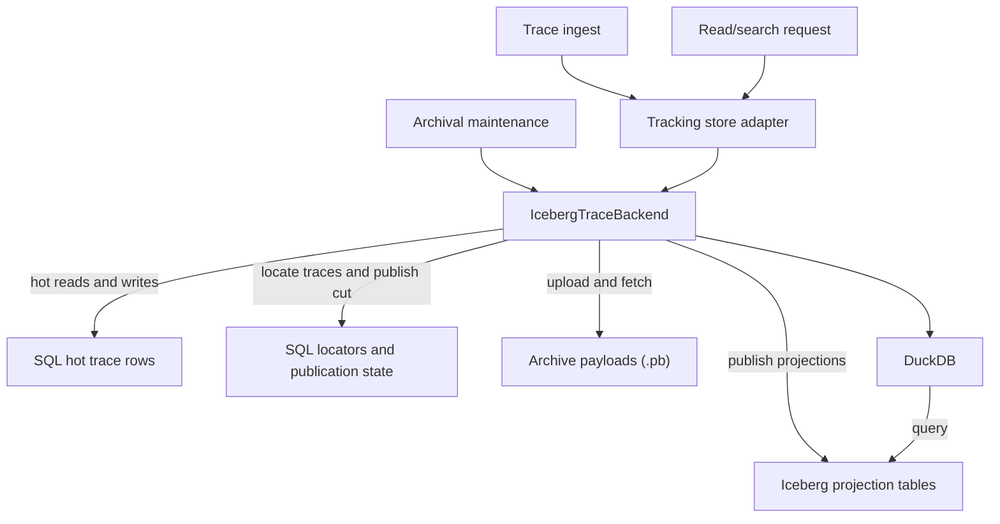

# Iceberg Trace Archival

| Author(s)                                  |
| :----------------------------------------- |
| [Matthew Prahl](https://github.com/mprahl) |

## Summary

This RFC makes two related decisions:

1. Introduce a pluggable trace backend interface that separates trace persistence, search, and
   analytics from the rest of the tracking store while giving a backend explicit access to the
   selected tracking store for hot-data operations and shared MLflow metadata.
2. Provide an Iceberg-backed hybrid trace backend as the first implementation of that interface.

The Iceberg backend keeps fresh traces in the tracking database, archives older trace payloads to
deterministic object-storage paths as serialized OpenTelemetry protobuf messages, and projects
archived trace metadata into Apache Iceberg tables for search and analytics. It preserves MLflow's
simple deployment model by using PyIceberg and DuckDB inside the MLflow server process instead of
introducing a separate always-on query service. The interface also leaves room for a future
ClickHouse backend for deployments that prefer a separately operated analytical database.

Unlike [RFC-0001](../0001-trace-archival/0001-trace-archival.md), which only moved span payloads out
of the database while leaving trace metadata in SQL forever, this design also moves archived trace
metadata and analytics state into Iceberg. The result is a true hot/cold split: recent traces remain
in the selected SQLAlchemy tracking store for writes and low-latency reads, while archived traces
are served from Iceberg plus archive payloads.

## Motivation

[RFC-0001](../0001-trace-archival/0001-trace-archival.md) reduced database size by moving trace
payloads to artifact storage, but it intentionally kept trace metadata and search state in the
tracking database. At large scale, that is still not enough. The `trace_info`, `trace_tags`,
`spans`, `assessments`, and related index structures continue to grow without bound as traces age.
Even if hot payload storage is removed, the database still accumulates historical trace metadata,
span search state, and analytics rows.

This RFC extends MLflow's existing trace archival model into a hybrid storage architecture:

- The selected SQLAlchemy tracking store remains the write-optimized hot store for fresh traces and
  the system of record for active writes.
- Archived payload bytes live in cheap object storage or the filesystem as serialized OpenTelemetry
  `TracesData` protobuf messages at deterministic per-trace paths.
- Archived search and analytics state is projected into Iceberg tables stored as Parquet files.
- DuckDB runs in-process inside each MLflow server worker to query Iceberg directly.

This matters for three reasons:

1. It lets MLflow scale trace retention while preserving its authorization and trace-query
   semantics, without requiring a separate analytics service.
2. It creates a path for MLflow to use a storage engine better suited for large historical trace
   scans while keeping experiment tracking, model registry, and other metadata in the existing SQL
   backend.
3. It lets deployments choose a trace backend with different performance and operational trade-offs
   without replacing MLflow's tracking store or changing its trace API.

The reusable trace backend contract keeps the Iceberg storage and query design separate from the
tracking-store class hierarchy and provides the same extension point for future backends.

### Out of scope

- A ClickHouse, Tempo, or other external trace backend implementation. This RFC defines the
  extension point and ships the Iceberg implementation first.
- Trace ingestion directly to Iceberg with no hot SQL stage. New traces still land in the SQL hot
  store first.
- A restore flow that moves archived traces back into the hot SQL store.
- Warehouse backends beyond local filesystem and S3 for the initial implementation.
- Mutation of archived trace tags, spans, trace metadata, payloads, or assessments. Assessments
  remain mutable in SQL until they are independently archived, and archived traces and assessments
  can still be deleted asynchronously.

## Detailed design

### Background

Readers already familiar with [Parquet](https://parquet.apache.org/),
[Iceberg](https://iceberg.apache.org/), and [DuckDB](https://duckdb.org/) can skip to
[Trace Backend Interface](#trace-backend-interface).

#### What are Parquet files?

Parquet is a columnar file format optimized for analytic scans. Instead of storing complete rows
together, Parquet stores values by column, which makes it efficient to read only the columns needed
for a query. This matters for trace analytics because many queries only need a few fields such as
`experiment_id`, `request_time_ms`, `trace_name`, `status`, token counts, or cost columns rather
than the full trace payload.

Parquet also supports:

- column projection, so scans can skip unused columns
- predicate pushdown, so readers can avoid opening files or row groups that cannot match a filter
- compression, which is especially effective for repeated metadata keys and categorical fields

In this design, Iceberg stores trace search and analytics tables as Parquet files with Zstd
compression.

#### What is Iceberg?

Apache Iceberg is an open table format for large analytic datasets stored in object storage or
filesystems. It sits above Parquet and provides table-level metadata, partition tracking, snapshot
history, and atomic publication of new table versions.

That matters here because MLflow needs more than a pile of Parquet files:

- readers need a consistent view while archival is publishing new files
- the server needs partition pruning by experiment and day
- compaction needs a standard way to rewrite small files into larger ones
- the system needs an internal catalog that tracks current metadata locations and snapshots

The proposed implementation uses PyIceberg's SQL catalog. The catalog is internal to the MLflow
server process and is stored in regular tracking-store database tables. MLflow does not expose the
Iceberg catalog as a separate user-managed service.

#### What is DuckDB?

DuckDB is an in-process analytical SQL engine with Python bindings. It is not a separate service.
Each MLflow server worker can open DuckDB connections in memory and use DuckDB's Iceberg and
`httpfs` extensions to read Iceberg metadata and Parquet data files directly from the configured
warehouse (S3 or filesystem).

DuckDB is used here as the execution engine for cold-data reads:

- compile MLflow trace search or metrics requests into SQL
- point that SQL at Iceberg tables and, when merging hot and cold data, at Arrow tables built from
  SQL results
- let DuckDB perform projection, filtering, grouping, and merging efficiently

This keeps deployment simple: operators still run MLflow, a relational database, and object storage,
without adding a long-running Trino, Spark, or ClickHouse service.

### Trace Backend Interface

MLflow currently defines
[trace methods](https://github.com/mlflow/mlflow/blob/v3.14.0/mlflow/store/tracking/abstract_store.py#L285-L788)
directly on
[`AbstractStore`](https://github.com/mlflow/mlflow/blob/v3.14.0/mlflow/store/tracking/abstract_store.py#L60)
alongside experiment, run, registry-adjacent, and other tracking methods. Implementing Iceberg
directly in SQL tracking-store subclasses would couple the backend to the SQLAlchemy class hierarchy
and would not provide a reusable extension point for a future ClickHouse or other trace storage
backend.

This RFC extracts the trace contract into `AbstractTraceBackend`. `AbstractStore` inherits that
contract so existing tracking stores remain valid trace backends and existing third-party tracking
store implementations do not need to adopt a second object immediately.

The extracted contract covers the trace data plane:

- trace creation, span logging, and trace retrieval
- metadata and full-payload batch retrieval
- trace search, deterministic pagination, completed-session discovery, metrics, and correlation
- trace-tag and assessment reads and mutations
- trace deletion and archival
- trace-to-run and prompt-to-trace associations because those operations validate trace existence

Experiment, run, workspace, model-registry, artifact, and trace-archival configuration resolution
remain tracking-store responsibilities.

The following classes illustrate the ownership model. The `AbstractTraceBackend` signatures define
the complete public plugin contract, although its implementation may use internal mixins. The
repeated not-supported bodies are abbreviated for readability; `AbstractStore` preserves its
existing method-specific validation and defaults for compatibility.

Each backend implements the contract directly. A hybrid backend may explicitly delegate an operation
to its tracking store, but there is no generic passthrough base class; every method therefore
requires a deliberate routing decision.

```python
class AbstractTraceBackend(ABC):
    @property
    def supports_trace_archival(self) -> bool:
        return False

    def start_trace(self, trace_info: TraceInfo) -> TraceInfo:
        raise MlflowNotImplementedException()

    def delete_traces(
        self,
        experiment_id: str,
        max_timestamp_millis: int | None = None,
        max_traces: int | None = None,
        trace_ids: list[str] | None = None,
    ) -> int:
        raise MlflowNotImplementedException()

    def get_trace_info(self, trace_id: str) -> TraceInfo:
        raise MlflowNotImplementedException()

    def get_trace(self, trace_id: str, *, allow_partial: bool = False) -> Trace:
        raise MlflowNotImplementedException()

    def batch_get_traces(
        self, trace_ids: list[str], location: str | None = None
    ) -> list[Trace]:
        raise MlflowNotImplementedException()

    def batch_get_trace_infos(
        self, trace_ids: list[str], location: str | None = None
    ) -> list[TraceInfo]:
        raise MlflowNotImplementedException()

    def archive_traces(
        self,
        *,
        resolved_trace_archival_location: str,
        broader_retention: str,
        long_retention_allowlist: set[str] | list[str] | None = None,
        max_traces_per_pass: int | None = None,
    ) -> int:
        raise MlflowNotImplementedException()

    def get_online_trace_details(
        self,
        trace_id: str,
        source_inference_table: str,
        source_databricks_request_id: str,
    ) -> str:
        raise MlflowNotImplementedException()

    def search_traces(
        self,
        experiment_ids: list[str] | None = None,
        filter_string: str | None = None,
        max_results: int = SEARCH_TRACES_DEFAULT_MAX_RESULTS,
        order_by: list[str] | None = None,
        page_token: str | None = None,
        model_id: str | None = None,
        locations: list[str] | None = None,
    ) -> tuple[list[TraceInfo], str | None]:
        raise MlflowNotImplementedException()

    def find_completed_sessions(
        self,
        experiment_id: str,
        min_last_trace_timestamp_ms: int,
        max_last_trace_timestamp_ms: int,
        max_results: int | None = None,
        filter_string: str | None = None,
    ) -> list[CompletedSession]:
        raise MlflowNotImplementedException()

    def query_trace_metrics(
        self,
        experiment_ids: list[str],
        view_type: MetricViewType,
        metric_name: str,
        aggregations: list[MetricAggregation],
        dimensions: list[str] | None = None,
        filters: list[str] | None = None,
        time_interval_seconds: int | None = None,
        start_time_ms: int | None = None,
        end_time_ms: int | None = None,
        max_results: int = MAX_RESULTS_QUERY_TRACE_METRICS,
        page_token: str | None = None,
    ) -> PagedList[list[MetricDataPoint]]:
        raise MlflowNotImplementedException()

    def set_trace_tag(self, trace_id: str, key: str, value: str) -> None:
        raise MlflowNotImplementedException()

    def delete_trace_tag(self, trace_id: str, key: str) -> None:
        raise MlflowNotImplementedException()

    def get_assessment(self, trace_id: str, assessment_id: str) -> Assessment:
        raise MlflowNotImplementedException()

    def create_assessment(self, assessment: Assessment) -> Assessment:
        raise MlflowNotImplementedException()

    def update_assessment(
        self,
        trace_id: str,
        assessment_id: str,
        name: str | None = None,
        expectation: str | None = None,
        feedback: str | None = None,
        rationale: str | None = None,
        metadata: dict[str, str] | None = None,
    ) -> Assessment:
        raise MlflowNotImplementedException()

    def delete_assessment(self, trace_id: str, assessment_id: str) -> None:
        raise MlflowNotImplementedException()

    def log_spans(
        self, location: str, spans: list[Span], tracking_uri=None
    ) -> list[Span]:
        raise MlflowNotImplementedException()

    def link_traces_to_run(self, trace_ids: list[str], run_id: str) -> None:
        raise MlflowNotImplementedException()

    def unlink_traces_from_run(self, trace_ids: list[str], run_id: str) -> None:
        raise MlflowNotImplementedException()

    def link_prompts_to_trace(
        self, trace_id: str, prompt_versions: list[PromptVersion]
    ) -> None:
        raise MlflowNotImplementedException()

    def calculate_trace_filter_correlation(
        self,
        experiment_ids: list[str],
        filter_string1: str,
        filter_string2: str,
        base_filter: str | None = None,
    ) -> TraceFilterCorrelationResult:
        raise MlflowNotImplementedException()


class AbstractStore(AbstractTraceBackend, GatewayStoreMixin):
    """Tracking store and the default trace backend for compatibility."""


class IcebergTraceBackend(AbstractTraceBackend):
    """Hybrid SQL/Iceberg implementation described by this RFC."""

    def __init__(self, tracking_store: AbstractStore):
        # This is the raw, undecorated store. Calls cannot recurse through this backend.
        self.tracking_store = tracking_store

    def start_trace(self, trace_info: TraceInfo) -> TraceInfo:
        return self.tracking_store.start_trace(trace_info)

    # Each remaining method explicitly delegates or implements hybrid behavior.
```

#### Runtime Composition

Tracking-store selection remains authoritative. MLflow constructs the configured tracking store as
it does today, then optionally decorates it with a trace backend:

```python
tracking_store = tracking_store_registry.get_store(store_uri, artifact_uri)
trace_backend = trace_backend_registry.get_backend(
    name=configured_trace_backend,
    tracking_store=tracking_store,
)
store = TraceBackendTrackingStore(tracking_store, trace_backend)
```

`TraceBackendTrackingStore` exposes the existing tracking-store API. It forwards methods in the
`AbstractTraceBackend` contract to `trace_backend` and forwards every other method and property to
the selected `tracking_store`.

```python
class TraceBackendTrackingStore:
  def __init__(
    self,
    tracking_store: AbstractStore,
    trace_backend: AbstractTraceBackend,
  ):
    self._tracking_store = tracking_store
    self._trace_backend = trace_backend

  @property
  def supports_trace_archival(self) -> bool:
    return self._trace_backend.supports_trace_archival

  def start_trace(self, trace_info: TraceInfo) -> TraceInfo:
    return self._trace_backend.start_trace(trace_info)

  def search_traces(
    self,
    experiment_ids: list[str] | None = None,
    filter_string: str | None = None,
    max_results: int = SEARCH_TRACES_DEFAULT_MAX_RESULTS,
    order_by: list[str] | None = None,
    page_token: str | None = None,
    model_id: str | None = None,
    locations: list[str] | None = None,
  ) -> tuple[list[TraceInfo], str | None]:
    return self._trace_backend.search_traces(
      experiment_ids,
      filter_string,
      max_results,
      order_by,
      page_token,
      model_id,
      locations,
    )

  # Every other AbstractTraceBackend method is delegated explicitly in the same way.

  def __getattr__(self, name: str):
    # Only the non-trace tracking-store surface reaches this fallback.
    return getattr(self._tracking_store, name)
```

Trace capabilities come from the backend; general capabilities come from the tracking store. The
adapter rejects incompatible combinations. Explicit trace delegation keeps this boundary auditable
and ensures that new trace operations require a compatibility decision.

Association methods remain in the trace contract even when their rows stay in the tracking store,
because they may need to validate a trace owned by the backend.

#### Discovery and Configuration

MLflow adds a `TraceBackendRegistry` following its existing store-registry pattern. Built-in and
third-party backends register a short identifier and a builder with the signature
`builder(tracking_store, backend_config) -> AbstractTraceBackend`. Third-party discovery uses a
dedicated `mlflow.trace_backends` Python entry-point group.

The `MLFLOW_TRACE_BACKEND` environment variable or equivalent CLI flag selects the backend. When
unset, the tracking store is unchanged. MLflow decorates the selected store at most once in its
shared construction path.

Builders validate store compatibility and backend capabilities before serving requests. The Iceberg
backend requires a SQLAlchemy store, implements a workspace-aware hot/cold split and server-owned
archival, supports asynchronous deletion, and rejects other archived mutations. Backends may also
provide schema validation and migration, warming, health, and shutdown hooks.

### Iceberg Implementation

`IcebergTraceBackend` requires a SQLAlchemy tracking store because it directly queries and
transactionally updates hot trace rows, archived locators, and publication state. Its builder
rejects other tracking stores at startup.

Cold query planning must remain independent of DuckDB. The planner produces an internal plan that
describes Iceberg scans, projected columns, predicates, ordering, limits, the pinned published cut,
and any Arrow inputs. A cold-query executor translates that plan for an engine and returns typed
rows. DuckDB is the initial executor, while pagination and hot/cold result merging remain owned by
`IcebergTraceBackend`. DuckDB-specific SQL, connection management, and extension configuration must
not leak into the planner or trace API. This is to allow Trino or Spark support in the future if
desired.

#### Hot and Cold Storage

The Iceberg backend implements a hybrid storage model.



A trace is written and read from SQL until archival publishes its payload, Iceberg projections, and
locator. Subsequent reads use the same MLflow API and route to the published cold state.

Hot storage remains responsible for:

- `start_trace()` and `log_spans()` writes
- in-progress and recently completed traces
- low-latency point reads for fresh traces
- coordination state such as `db_payload_generation`

Cold storage is split into two parts:

- archive payload bytes stored in the configured archival repository as serialized OpenTelemetry
  `TracesData` protobuf messages at deterministic per-trace paths
- projected metadata and analytics rows stored in Iceberg tables

Once a trace is successfully archived in hybrid mode:

- its trace payload is subsequently served from the archive URI
- its searchable metadata comes from Iceberg
- its hot `trace_info` row and dependent trace-owned rows are deleted from SQL as part of
  publication
- its assessments remain in SQL until they independently reach the same archival age
- trace-to-run and prompt-to-trace associations remain in the tracking database, while the Iceberg
  backend validates archived trace IDs through locators instead of requiring a hot `trace_info` row

This is a stricter hot/cold split than [RFC-0001](../0001-trace-archival/0001-trace-archival.md),
which kept trace metadata in SQL forever.

#### Iceberg Catalog

The design uses PyIceberg's [SQL catalog](https://py.iceberg.apache.org/configuration/#sql-catalog)
([API reference](https://py.iceberg.apache.org/reference/pyiceberg/catalog/sql/)) directly from the
tracking database. PyIceberg's documentation names PostgreSQL and SQLite as supported catalog
databases. However, `SqlCatalog` uses SQLAlchemy for its database connection and catalog models, so
it is expected to work with every SQL database supported by MLflow. Because PyIceberg does not
document that broader compatibility, MLflow must verify each supported database through integration
tests.

The catalog uses these internal SQL tables:

- `iceberg_namespace_properties`
- `iceberg_tables`

These come from PyIceberg's SQL catalog model and are created through MLflow Alembic migrations so
they can be managed like other MLflow schema changes. This means literally copying the SQLAlchemy
schema into MLflow and generating an Alembic migration.

The backend also adds three MLflow-owned coordination tables:

- `iceberg_trace_publication_state`: the singleton record for the currently published Iceberg cut
- `archived_trace_locators`: a lightweight SQL index of archived traces
- `archived_entity_deletions`: durable tombstones awaiting physical deletion from Iceberg

`iceberg_trace_publication_state` stores:

- `state_key`, fixed to `"default"`
- `<table>_metadata_location` for each Iceberg table
- `<table>_snapshot_id` for each Iceberg table
- `schema_revision`

`state_key` is the primary key. Although the table has one logical row, the fixed key provides a
portable target for upserts, row locking, and atomic updates.

The metadata locations pin immutable Iceberg metadata files, the snapshot IDs make the intended
snapshots explicit for validation and recovery, and `schema_revision` identifies the reader-visible
schema for schema migrations. Cold reads use these values instead of mutable table heads and read
required locator or deletion rows from the same SQL snapshot, so a request cannot combine different
published cuts.

`archived_trace_locators` stores:

- `workspace`
- `experiment_id`
- `trace_id`
- `request_time_ms`
- `request_day`

Its primary key is `(workspace, experiment_id, trace_id)`. It also has indexes on:

- `(workspace, trace_id)` for point and batch lookup
- `(experiment_id, request_time_ms)` for counts, time bounds, and retention deletion
- `(experiment_id, request_day)` for Iceberg partition routing

The locator table intentionally retains one narrow SQL row per archived trace. It serves three
purposes:

- map a random `trace_id` to its Iceberg `experiment_id` and `request_day` partitions for efficient
  point and batch reads in Iceberg as it allows DuckDB to narrow down which Parquet files to scan.
- make publication retries, hot-row eviction, deletion, and payload cleanup idempotent
- provide inexpensive archived counts and time bounds without scanning Iceberg

It does not duplicate `TraceInfo` or the payload URI; cold reads load canonical metadata from
Iceberg and derive the payload location from the archival root, experiment ID, and trace ID. On
PostgreSQL the table is hash-partitioned by `trace_id` into 32 partitions; MySQL uses equivalent key
partitioning. This lets a random trace-ID lookup prune to one SQL partition. Experiment-scoped
counts and time bounds use the experiment indexes but fan out across the partitions. The table grows
with archived trace count, trading a small amount of SQL storage per trace for efficient point
lookup and publication coordination.

Recovery uses this published cut as its only authority, as described under
[Concurrency and Failure Handling](#concurrency-and-failure-handling).

#### Iceberg Schema Migrations

The Iceberg backend will provide a custom migration runner inspired by Alembic. Revisions have a
stable identifier, predecessor, compatibility floors, and an idempotent upgrade function. Revision
`0001` creates the complete schema, and later revisions make one reviewable change while preserving
Iceberg field IDs.

SQL Alembic creates `trace_backend_schema_migrations` with:

- `backend_name`
- `revision`
- `applied_at_ms`

Its primary key is `(backend_name, revision)`. The migration runner inserts a row only after the
revision has been applied to and verified against the live backend schema. The latest revision in
the backend's migration chain is therefore the applied revision, while
`iceberg_trace_publication_state.schema_revision` is the revision visible to readers. The running
MLflow version declares which revisions it can read and write.

Operators stop the Iceberg maintenance job before running `mlflow trace-backend upgrade`. The runner
applies and verifies pending revisions, then atomically publishes the new table heads and schema
revision. Readers remain on the previous published revision during the upgrade. Failed or
interrupted revisions have no ledger row and are rerun idempotently when the command is retried.

Operators roll back reversible revisions with
`mlflow trace-backend downgrade --revision <target-revision>`.

Startup validates that the configured warehouse, applied revision, published revision, and running
code are compatible. A reversible revision also defines an idempotent `downgrade()` that performs
the inverse schema, partition, sort-order, property, or data change. With maintenance stopped, the
migration runner applies the downgrade and verifies the result. It then atomically publishes the
target revision and removes ledger rows for the reverted revisions; readers remain on the previous
cut until that publication succeeds.

#### Iceberg Warehouse

The warehouse stores the Iceberg metadata and Parquet files. The initial implementation supports:

- a local filesystem path or `file://` URI
- an `s3://` URI

When MLflow uses SQLite and no explicit warehouse URI is set, the backend defaults to a sibling
`iceberg/warehouse` directory next to the SQLite database. For non-SQLite backends, the warehouse
must be configured explicitly. This follows the same zero-configuration local-development principle
as MLflow's default local artifact storage, but the warehouse is derived from the SQLite database
path rather than the artifact root. Requiring an explicit URI for remote database deployments avoids
silently placing warehouse data on one MLflow server's local filesystem.

The warehouse is internal implementation detail, not a user-facing catalog endpoint.

#### Iceberg Schema

The backend projects archived traces into eight Iceberg tables. Revision `0001` assigns stable field
IDs and required/optional markers; the proposed logical columns and types are listed below.

**`trace_index`** has one row per trace:

```text
trace_id string                    experiment_id string
request_time_ms long               request_day date
execution_duration_ms long         state string
trace_name string                  client_request_id string
request_preview string             response_preview string
session_id string                  source_run_id string
trace_user string                  input_tokens double
output_tokens double               total_tokens double
cache_read_input_tokens double     cache_creation_input_tokens double
tags_json string                   metadata_json string
workspace string                   input_cost double
output_cost double                 total_cost double
```

It partitions by `(experiment_id, request_day)` and sorts by
`(experiment_id ASC, request_time_ms DESC, trace_id ASC)`.

**`trace_tag_index`** has one row per trace tag:

```text
trace_id string        experiment_id string
request_day date       tag_key string
tag_value string       workspace string
```

It partitions by `(experiment_id, request_day)` and sorts by
`(experiment_id ASC, tag_key ASC, tag_value ASC, trace_id ASC)`.

**`span_index`** has one row per span:

```text
trace_id string          experiment_id string
span_id string           parent_span_id string
name string              span_type string
start_time_ns long       span_start_day date
end_time_ns long         status string
attributes_json string   span_json string
workspace string         model_name string
model_provider string    input_cost double
output_cost double       total_cost double
latency_ms double
```

It partitions by `(experiment_id, span_start_day)` and sorts by
`(experiment_id ASC, trace_id ASC, start_time_ns ASC, span_id ASC)`.

**`assessment_index`** has one row per assessment:

```text
assessment_id string             trace_id string
experiment_id string             assessment_name string
assessment_type string           assessment_value_json string
assessment_value_text string     aggregate_value double
create_time_ms long              assessment_create_day date
last_update_time_ms long         rationale string
run_id string                    span_id string
source_type string               source_id string
metadata_json string             overrides string
valid boolean                    assessment_json string
workspace string                 trace_request_time_ms long
trace_request_day date
```

It partitions by `(experiment_id, trace_request_day)` so delayed assessments remain grouped by trace
time, and sorts by `(experiment_id ASC, trace_id ASC, assessment_name ASC, assessment_id ASC)`. Rows
enter this table through the independent assessment archival flow, not as part of trace publication.

**`session_summary`** has one row per session:

```text
workspace string                 experiment_id string
session_id string                first_trace_timestamp_ms long
last_trace_timestamp_ms long
```

It partitions by `experiment_id` and sorts by
`(experiment_id ASC, last_trace_timestamp_ms ASC, session_id ASC)`.

This table accelerates unfiltered `find_completed_sessions()` calls by avoiding a full `trace_index`
scan and `MIN`/`MAX` aggregation for every session. Filtered session discovery still uses
`trace_index` because it must evaluate filters against the first trace in each session.

**`trace_metric_daily_rollups`** stores trace-level daily aggregates:

```text
workspace string       experiment_id string
rollup_day date        metric_name string
grouping_set string    trace_status string
sample_count long      sum_value double
min_value double       max_value double
p50_value double       p90_value double
p99_value double
```

It partitions by `(workspace, rollup_day)` and sorts by
`(experiment_id ASC, metric_name ASC, grouping_set ASC, trace_status ASC)`.

**`span_cost_daily_rollups`** stores model/provider cost aggregates:

```text
workspace string       experiment_id string
rollup_day date        metric_name string
grouping_set string    model_name string
model_provider string  sample_count long
sum_value double       min_value double
max_value double
```

It partitions by `(workspace, rollup_day)` and sorts by
`(experiment_id ASC, metric_name ASC, grouping_set ASC, model_provider ASC, model_name ASC)`.

**`assessment_daily_rollups`** stores assessment aggregates:

```text
workspace string       experiment_id string
rollup_day date        metric_name string
grouping_set string    sample_count long
sum_value double       min_value double
max_value double
```

It partitions by `(workspace, rollup_day)` and sorts by
`(experiment_id ASC, metric_name ASC, grouping_set ASC)`.

#### Changes from RFC-0006

[RFC-0006](../0006-postgres-optimizations/0006-traces-optimizations.md) rollups continue to cover
hot SQL rows. The Iceberg backend materializes the same rollup families and grouping sets for
archived rows. Archival refreshes affected Iceberg rollup partitions before publishing the new cold
cut, then rebuilds SQL rollups asynchronously after removing the hot rows.

Archived facts are immutable, so snapshot publication replaces RFC-0006's rebuild queue for cold
partitions. Pending SQL assessments or deletion tombstones make affected Iceberg rollups unsafe;
queries recompute those partitions from deduplicated fact rows. Otherwise, metric queries merge the
non-overlapping hot SQL and cold Iceberg rollups.

This schema intentionally stores search-ready and analytics-ready projections. Iceberg is not being
used as a raw blob store. The tables contain the published cold base rows; pending SQL assessment
rows and deletion tombstones form a small overlay on that base. Deletes and rewrites produce a new
table snapshot before MLflow publishes the next cut. All tables use Parquet with Zstd compression.

#### Exact Assessment Distributions

Assessment name/value distributions cannot use `assessment_daily_rollups` because arbitrary values
cannot be represented by the bounded rollup schema. These queries aggregate directly from
`assessment_index` in Iceberg and newer SQL assessments, with deletion tombstones applied.

Exact distributions remain enabled without a limit by default. Operators may set
`MLFLOW_ICEBERG_TRACE_ASSESSMENT_DISTRIBUTION_MAX_TRACES` to a positive trace limit. When a request
matches more traces than that limit, the API returns a resource-exhausted error rather than a
partial or approximate distribution. This limit protects the MLflow server when the Traces page
requests a distribution over a long historical range. The distribution covers every matching trace,
not only the current page, so the query may scan millions of traces.

The assessment-distribution UI must handle this error as an unavailable state and should tell the
user to narrow the time range.

#### Archive and Publication Flow

Candidate selection, retention resolution, generation checks, payload serialization, deterministic
archive paths, and malformed-trace handling follow
[RFC-0001](../0001-trace-archival/0001-trace-archival.md). The Iceberg backend changes publication
as follows:

1. It prepares candidates in bounded chunks and combines several chunks into one publication group
   to amortize Iceberg commits and rollup refreshes.
2. It uploads each protobuf payload and builds rows for `trace_index`, `trace_tag_index`,
   `span_index`, and `session_summary`.
3. It appends the group to Iceberg and refreshes affected Iceberg rollup partitions.
4. One SQL transaction publishes the new Iceberg cut and locators, then removes the corresponding
   hot trace-owned rows. Assessments and trace associations remain in SQL.
5. SQL rollups are rebuilt asynchronously for the remaining hot rows, and touched Iceberg partitions
   are compacted at the end of the maintenance pass.

Readers see either the previous published cut and hot rows or the new cut and locators, never a mix
of partially appended Iceberg table heads. Payloads must be staged or conditionally replaced so a
failed attempt cannot expose an unpublished payload generation.

The maintenance job also migrates traces already archived by RFC-0001. It selects
`SpansLocation.ARCHIVE_REPO` traces without an archived locator, loads trace metadata from SQL and
spans from the existing protobuf payload, and publishes them through the same bounded Iceberg flow.
RFC-0001 already uses the deterministic payload path required by this RFC, so the job reuses the
payload without copying it.

#### Assessment Archival and Archived Entity Deletion

**Assessment archival:** Assessments have their own hot/cold lifecycle:

- A hot trace has only SQL assessments.
- An archived trace may have recent assessments in SQL and older assessments in Iceberg.
- SQL assessments remain mutable. Iceberg assessments are immutable but can be deleted.

Assessments use the same retention duration as traces, but age from `last_update_time_ms`. An
assessment becomes eligible only after both it and its trace are old enough and the trace has been
archived. The `assessments.trace_id` foreign key to `trace_info.request_id` is removed so recent
assessments can remain in SQL after their trace moves to Iceberg. Application logic instead
validates the trace against `trace_info` or `archived_trace_locators`.

The assessment archival worker copies eligible rows to `assessment_index`, refreshes affected
rollups, and publishes the new Iceberg cut. It removes the SQL row only if `last_update_time_ms` is
unchanged; a concurrent update leaves the newer SQL row authoritative until a later archival pass.
After removal, update and `overrides` operations return a not-supported error.

**Archived entity deletion:** Trace and assessment deletion use the same asynchronous protocol. The
API inserts an `archived_entity_deletions` tombstone and returns immediately; reads hide the entity
as soon as the tombstone commits. The next maintenance pass removes the Iceberg rows and any trace
payload, rebuilds affected rollups and session summaries, and deletes the tombstone when it
publishes the new cut.

`archived_entity_deletions` stores:

- `workspace`
- `entity_type`, either `trace` or `assessment`
- `entity_id`
- `trace_id`
- `experiment_id`
- `request_day`
- `requested_at_ms`

Its primary key is `(workspace, entity_type, entity_id)`. Indexes on `(workspace, trace_id)`,
`(experiment_id, request_day)`, and `requested_at_ms` support read filtering, Iceberg partition
routing, and ordered draining. The denormalized routing fields remain available after the entity is
hidden from ordinary reads. Repeated deletion requests are idempotent.

Trace deletion also removes its locator, remaining SQL assessments, and SQL associations. A trace
tombstone covers all assessments for that trace and blocks new assessment writes.

#### Concurrency and Failure Handling

The candidate validation and malformed-trace handling from
[RFC-0001](../0001-trace-archival/0001-trace-archival.md) still apply.

**Recovery:** The SQL-published metadata locations and snapshot IDs are the only authoritative cut.
Before each maintenance run, the single writer compares the live table heads with that cut and rolls
back any mismatch before proceeding. Readers remain pinned to the published cut.

A pass that fails before the SQL publication transaction commits does not advance the published cut
or evict hot SQL rows. Reads continue from the previous published cut and the existing hot state.
Payloads or files written by an interrupted operation but never referenced by a committed snapshot
or locator may remain unreachable in storage. This is an accepted phase-one trade-off; a separate
CLI tool can be introduced in the future for admins to run on a schedule to detect orphaned
payloads.

**Single writer:** One designated MLflow instance runs the Iceberg maintenance job like the archival
job today. Within that job, trace and assessment publication, deletion-queue draining, compaction,
snapshot expiration, and recovery run serially. No other server process mutates Iceberg; API
requests only write SQL data or deletion tombstones. Schema upgrades and downgrades require the
maintenance job to be stopped.

**Parallel archival:** The scheduler prepares a bounded number of experiments concurrently while
processing chunks in order within each experiment. Payload serialization, upload, and projection
preparation run in parallel; the single writer publishes prepared groups in order. Worker limits
bound database connections, memory, object-store requests, and Iceberg commit pressure.

#### SQL Maintenance After Archival

Archival removes large numbers of rows from hot trace tables, including `trace_info`, `trace_tags`,
`spans`, and, through the independent assessment flow, `assessments`. Ordinary row deletion does not
necessarily return index space or keep planner statistics representative, so sustained archival can
leave the hot database with bloated trace indexes and progressively worse query plans even though
its logical row count remains bounded.

MLflow should therefore add a separate SQL maintenance job. Archival records the affected tables and
the number of archived traces and assessments since the last maintenance pass. Once that count
reaches `MLFLOW_TRACE_SQL_MAINTENANCE_ARCHIVE_THRESHOLD`, the next scheduled run maintains the
affected tables. The threshold defaults to `5,000,000`. The pass runs `REINDEX CONCURRENTLY` and
`VACUUM (ANALYZE)` on PostgreSQL, `OPTIMIZE TABLE` on MySQL, `VACUUM` and `PRAGMA optimize` on
SQLite, and online index rebuilds plus statistics updates on SQL Server.

Maintenance runs one table at a time, outside the archival publication transaction, and reports its
duration and failures. Because these operations can consume substantial I/O or briefly block
foreground work, `MLFLOW_TRACE_SQL_MAINTENANCE_CRON` has no default and must be configured to enable
the job. When trace archival is enabled without this schedule, MLflow logs a startup warning that
SQL maintenance is disabled.

#### Read Path

Point reads check the hot SQL store first. If the trace is archived, `archived_trace_locators`
routes the read to its Iceberg partition and payload. Archived traces merge recent SQL assessments
with older Iceberg assessments, with SQL taking precedence for the same `assessment_id`.

Search queries merge hot SQL and cold Iceberg results while preserving MLflow ordering and page
tokens. Pagination crosses the handoff boundary without returning duplicates or skipping traces.

Metric queries merge SQL and Iceberg aggregates. When rollups are complete and the affected
partitions have neither pending deletions nor SQL assessments on archived traces, the query reads
pre-computed aggregates without scanning individual traces. Partitions affected by deletion
tombstones or by SQL assessments on archived traces bypass stale rollups and recompute from
deduplicated fact rows.

All read paths suppress entities present in `archived_entity_deletions`.

#### Implementation Details

Several implementation details materially affect performance or correctness:

- **Pluggable cold-query executor:** query planning targets the internal engine-neutral plan rather
  than DuckDB SQL. DuckDB implements the first executor so another Iceberg engine can be added
  without changing routing, pagination, or result-merging semantics.
- **Request-scoped published-cut pinning:** each request pins to one published Iceberg cut so a
  multi-step read does not observe different Iceberg snapshots mid-request.
- **Arrow handoff for overlap recomputation:** converting hot SQL samples into Arrow and letting
  DuckDB recompute buckets that span the hot/cold boundary preserves aggregate semantics without a
  Python-side merge implementation.
- **DuckDB connection pooling:** the backend maintains a small per-process DuckDB connection pool
  and prioritizes point lookups, limited queries, and rollup reads over broad span or assessment
  fact scans.
- **DuckDB resource isolation:** the backend bounds aggregate DuckDB threads, memory, concurrent
  scans, and temporary spill storage per MLflow process. Queries that exceed those limits return a
  resource-exhausted error rather than risking the server process or host. These limits use
  conservative internal defaults rather than new operator settings.
- **DuckDB cache tuning:** the backend enables HTTP metadata cache, Parquet metadata cache, and
  no-validation external file cache, relying on Iceberg's immutable metadata/data files.
- **Scan pruning:** cold query plans project required columns and include workspace, experiment,
  day, time, and trace-ID predicates when available so DuckDB and Iceberg can prune files and
  columns before execution.
- **Parallel hot/cold execution:** search and metric paths use bounded thread pools to query hot and
  cold stores concurrently while propagating the request's pinned cut to worker threads.
- **Compaction service:** after a successful maintenance pass, the writer compacts each touched
  partition once using the table's declared sort order. Snapshot expiration runs after compaction.
- **Bounded completed-session queries:** filtered session discovery computes session bounds and the
  first trace per session in DuckDB instead of materializing every matching trace in Python.
- **DuckDB extension validation:** each pooled connection loads the `httpfs` and `iceberg`
  extensions during backend initialization, which fails if either extension is unavailable.

#### Operational Configuration

The feature is opt-in. The proposed environment variables are:

- Backend and storage: `MLFLOW_TRACE_BACKEND=iceberg`, `MLFLOW_ICEBERG_WAREHOUSE_URI`, and the
  existing `MLFLOW_TRACE_ARCHIVAL_CONFIG`. The migration command uses the same configuration.
- SQL maintenance: `MLFLOW_TRACE_SQL_MAINTENANCE_ARCHIVE_THRESHOLD`, defaulting to `5,000,000`, and
  `MLFLOW_TRACE_SQL_MAINTENANCE_CRON`, unset by default.
- Exact distributions: `MLFLOW_ICEBERG_TRACE_ASSESSMENT_DISTRIBUTION_MAX_TRACES`, unset by default;
  setting a positive value caps exact assessment distributions at that many matching traces across
  SQL and Iceberg.

DuckDB sizing, archival concurrency, batch sizes, snapshot retention, and maintenance batch limits
use conservative internal defaults. They should become operator settings only if production
experience demonstrates a need. SQL maintenance settings apply only to the designated maintenance
instance.

## Benchmarks

The full 20-request UI/API replay over 10 million traces produced these results:

| Backend                                                                                                         | Hot traces | Archived traces | Baseline / fresh replay | Immediate replay |
| --------------------------------------------------------------------------------------------------------------- | ---------: | --------------: | ----------------------: | ---------------: |
| [RFC-0006 PostgreSQL with rollups](../0006-postgres-optimizations/0006-traces-optimizations.md#expected-impact) | 10,000,000 |               0 |            36.8s median |     Not measured |
| [Filesystem Iceberg](benchmark-filesystem/README.md)                                                            |  2,773,333 |       7,226,667 |                   17.6s |            14.6s |
| [S3 Iceberg](benchmark-s3/README.md)                                                                            |  2,982,749 |       7,017,251 |                   72.7s |             8.4s |

All results use the same 10-million-trace dataset, replay workload, machine, and POC codebase. The
RFC-0006 result is a median PostgreSQL replay. The Iceberg results show a fresh MLflow process and
an immediate replay; for S3, the fresh replay also starts with cold remote-file metadata. The table
therefore compares the end-to-end storage layouts while also showing cache sensitivity.

## Drawbacks

- **More implementation and operational complexity:** MLflow must coordinate SQL, object storage,
  Iceberg, DuckDB, schema migrations, recovery, and maintenance without a separate query service.
- **Single-writer throughput:** all Iceberg publications and maintenance are serialized through one
  designated writer, which limits write throughput and requires explicit deployment ownership.
- **Cache-sensitive S3 reads:** an S3-backed warehouse can have higher and less predictable
  first-request latency while remote Iceberg metadata and files warm. The filesystem benchmark did
  not show the same penalty.
- **Restricted archived mutations:** archived trace data and assessments are immutable. Assessment
  writes remain mutable only while their rows are in SQL, and physical deletion is asynchronous.
- **Residual recovery artifacts:** interrupted operations are rolled back to the SQL-published cut,
  but unreferenced payloads or files may remain until separate cleanup detects them.

## Alternatives

### Continue With SQL Metadata Plus Payload Archival Only

This is essentially the [RFC-0001](../0001-trace-archival/0001-trace-archival.md) direction.

Advantages:

- far simpler implementation
- no Iceberg or DuckDB dependencies
- easier to teach and debug

Disadvantages:

- historical trace metadata still grows forever in SQL
- large historical searches and analytics remain tied to relational storage
- does not solve the long-term metadata/index growth problem that motivated this RFC

### Adopt Out of Process Iceberg Query Engine

An external engine such as Trino, Spark, or another service could query Iceberg more flexibly than
DuckDB and might offer stronger multi-replica coordination and more mature warehouse operations.

The downside is that it would materially change MLflow's deployment story. One of MLflow's core
value propositions is that it remains simple to install and run with a database and object storage.
The benchmark results show that DuckDB can support the proposed architecture without requiring a
separate service, so it remains the initial executor.

The implementation should nevertheless keep DuckDB behind an internal cold-query executor interface.
Query planning defines Iceberg scans, projections, predicates, ordering, limits, and the pinned
published cut independently of DuckDB; the executor translates that plan and returns typed rows for
MLflow's hot/cold merge logic. This boundary would allow a future Trino or similar executor to reuse
the Iceberg schema and publication protocol without changing the trace backend API.

### Adopt ClickHouse Database

ClickHouse or a similar analytics database is a natural future implementation of the trace backend
contract for very large deployments. It can provide distributed ingestion and query execution,
stable SQL ordering and pagination, high-cardinality filtering, materialized aggregates, and lower
cold-start sensitivity than in-process scans over remote Iceberg files.

A ClickHouse backend would keep experiments, runs, models, registry state, and authorization in the
selected tracking store while moving completed trace data out of PostgreSQL. It could use
`ReplacingMergeTree`-style versioned rows for mutable trace tags and assessments, with explicit
latest-version query semantics, and materialized views or projections for common metrics.

The disadvantages are operational. ClickHouse adds a separately deployed database, its own
replication, upgrades, backups, capacity planning, and merge behavior. Updates and deletes are not
ordinary OLTP operations and require versioning or carefully managed mutations. This RFC therefore
ships the embedded Iceberg backend first, but the ClickHouse implementation could follow up shortly
after thanks to the `TraceBackend` split in this RFC.

## Adoption strategy

The trace backend interface is additive, and deployments that never enable it behave as they do
today.

The Iceberg backend is opt-in. An operator configures the archival repository and Iceberg warehouse
and runs `mlflow trace-backend upgrade`. They then designate one MLflow instance to run Iceberg
maintenance and start the server with `MLFLOW_TRACE_BACKEND=iceberg`. Startup validates the backend
schema and warehouse before serving requests.

Deployments already using the existing trace archival (RFC-0001) do not need to restore archived
payloads before enabling Iceberg. The maintenance job incrementally migrates those traces as
described above while continuing to serve unmigrated traces through the existing path.

Before enabling maintenance, operators must configure every request-serving MLflow instance with the
same trace backend and warehouse. Only the designated maintenance instance performs ongoing Iceberg
publication and maintenance; schema upgrades and downgrades run separately with maintenance stopped.
Once publication removes hot SQL rows, disabling the backend does not restore those rows and is not
a rollback mechanism.

Clients continue to use the existing MLflow trace APIs and do not need warehouse credentials.
