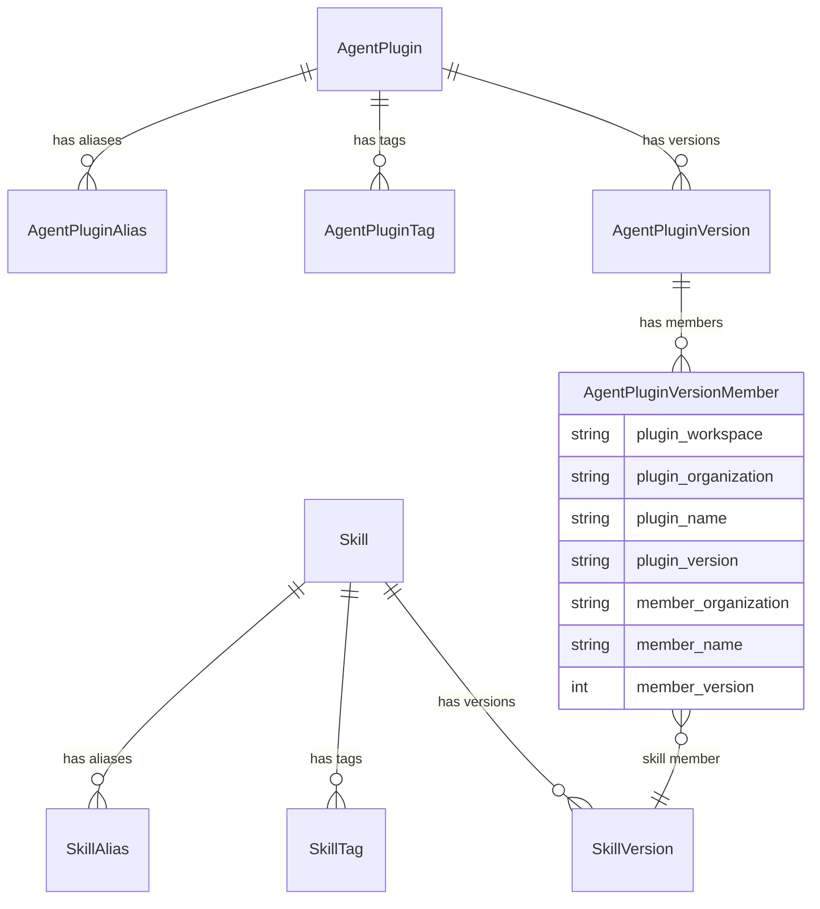
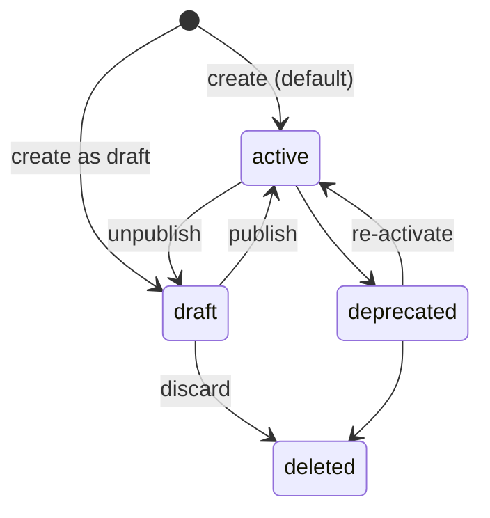

# RFC 0008: Skill Registry

| start_date   | 2026-04-22 |
| :----------- | :--------- |
| mlflow_issue | https://github.com/mlflow/mlflow/issues/22833 |
| rfc_pr       | https://github.com/mlflow/rfcs/pull/26 |

| Author(s)              | [Bill Murdock](https://github.com/jwm4) (Red Hat) |
| :--------------------- | :-- |
| **Date Last Modified** | 2026-08-11 |
| **AI Assistant(s)**    | Claude Code, Codex |

**Table of contents**

- [Summary](#summary)
- [Basic example](#basic-example)
- [Motivation](#motivation)
  - [The problem](#the-problem)
  - [User journeys](#user-journeys)
  - [Out of scope](#out-of-scope)
- [Detailed design](#detailed-design)
  - [Entities and data model](#entities-and-data-model)
  - [Status and lifecycle](#status-and-lifecycle)
  - [Plugin import](#plugin-import)
  - [Pull semantics](#pull-semantics)
  - [Workspace scoping](#workspace-scoping)
  - [Permissions](#permissions)
  - [UI](#ui)
  - [Implementation details](#implementation-details)
- [Drawbacks](#drawbacks)
- [Alternatives](#alternatives)
- [Adoption strategy](#adoption-strategy)
- [Open questions](#open-questions)

# Summary

Add a Skill Registry to MLflow: a governed, metadata-first registry for
AI agent skills. The registry stores metadata and typed source
pointers (to Git repos, OCI registries, ZIP archives, etc.). It can
also store content directly via MLflow artifact storage, but the
primary design is metadata-first. It provides enterprise governance
on top of existing distribution mechanisms: lifecycle management
and federated discovery across sources.

The registry manages two entity types under the `mlflow.genai` SDK
namespace, following the top-level public SDK pattern established by
the MCP Server Registry (RFC-0004). Each has full lifecycle
(versioning, aliases, tags, status). Skills use the `mlflow skills`
CLI group; agent plugins use `mlflow agent-plugins`. MLflow already
has an `mlflow skills` CLI group with `list` and `view` subcommands
that inspect bundled Assistant skills; the registry's subcommands
use different names, so there is no direct conflict.
See [implementation-details.md: Python SDK
and CLI](implementation-details.md#python-sdk-and-cli) for details.
The two entity types are:

- **Skills**: a directory containing a SKILL.md entry point plus
  supporting files (scripts, templates, reference material). See the
  [Agent Skills specification](https://agentskills.io/) for the
  complete format definition.
- **Agent plugins**: governed versions of the open
  [Agent Plugins](https://agent-plugins.org/) package format. Each version
  preserves the complete canonical `plugin.json` manifest and may reference
  registered skills for composition and governance.

**Minimize required inputs.** The CLI and SDK infer optional fields
from source content when possible, so the simplest invocation requires
only what cannot be derived. `source_type` is set by the server, which
needs no access to the content: a client that already knows the type
(the CLI's `register git`/`oci`/`zip` subcommands, the SDK's typed
source classes) submits it explicitly and the server validates it
against the source value, while a request without an explicit type
falls back to inference (from the source value for external pointers,
and from the creation flow otherwise). The stored discriminator is
server-set either way; `mlflow` content is always flow-derived and
never client-declared. Content-derived fields are read from the
skill's SKILL.md and computed by the client during local inspection and
submitted with the request: a skill's `name` and content `digest` always, and a
package member's `description` and `keywords` as well. The registry server never fetches a user-supplied source URL; this
keeps skill registration consistent with agent plugin import and keeps
fetching of untrusted URLs off the server.

`mlflow skills pull` provides a harness-agnostic way to fetch
registered content from its source.

The Agent Plugins format is the canonical package representation for
`AgentPluginVersion`. MLflow stores the complete
immutable `plugin.json`, extracts its name and version for registry identity,
and keeps lifecycle, aliases, tags, permissions, source information, and skill
member references outside the canonical payload. This follows the hybrid
storage pattern established by RFC-0004 for MCP `server_json`.

Existing Claude Code plugins remain importable through an adapter that
translates their metadata into canonical Agent Plugins manifests. Standard
Agent Plugins packages are validated and imported directly. Root `mcp.json`
content is recognized and preserved in packaged plugins but does not receive
individual registry entries in this RFC. Agent plugin versions with no skill
members, including MCP-only packages, are valid.

Follow-up work tracked as
[RFC-0010: Extended Agent Plugins](https://github.com/mlflow/rfcs/pull/27)
will add registry entries for non-skill components such as subagents and MCP
server references.

# Basic example

## Register a skill

```python
import mlflow
from mlflow.genai import GitSource

# Minimal: name inferred from SKILL.md content
mlflow.genai.register_skill(
    source=GitSource(
        url="https://github.com/acme/agent-skills.git",
        ref="v1.0.0",
        subpath="code-review",
    ),
)

# With explicit name
mlflow.genai.register_skill(
    name="code-review",
    source=GitSource(
        url="https://github.com/acme/agent-skills.git",
        ref="v1.0.0",
        subpath="code-review",
    ),
)
```

## Register an assembled agent plugin

```python
mlflow.genai.register_agent_plugin(
    plugin_json={
        "$schema": "https://agent-plugins.org/schemas/1.0.0/plugin.schema.json",
        "name": "pr-workflow",
        "version": "1.0.0",
        "description": "Skills for pull request review",
        "keywords": ["code-review", "pull-requests"],
    },
    skills=[
        "skills:/code-review/1",
        "skills:/style-check/1",
    ],
)
```

## Import an existing plugin

```bash
mlflow agent-plugins import \
    --source https://github.com/acme/plugins.git \
    --ref v1.0.0 --subpath release-suite
```

MLflow auto-detects a standard Agent Plugins package before falling back to the
Claude Code and generic skill-directory adapters. It validates or constructs a
canonical `plugin.json`, discovers skills using the selected format's rules,
and registers them as members of a packaged agent plugin. Each discovered skill
becomes an independently addressable skill whose source is derived from the
package (the package's source plus the skill's subpath within it). It preserves
the Git source and reports recognized package content, such as `mcp.json`, that
is preserved but not individually registered.

## Motivation

### The problem

AI agent skills are becoming a critical asset class in enterprise AI
platforms. A cross-harness portable format is emerging around SKILL.md:
a markdown file with structured instructions for the agent, supported
by Claude Code, Codex CLI, Cursor, GitHub Copilot, OpenClaw, Kilo
Code, Antigravity, and others.

Today, skills are managed as ad-hoc files in Git repositories. This
works well for individual developers and small teams. GitHub provides
versioning, collaboration, and access control.

However, enterprises face governance challenges that Git alone does not
address:

1. **No status lifecycle.** Git has no concept of "this version is
   approved for production use" vs. "this is deprecated." Teams resort
   to branch naming conventions or external tracking to manage
   promotion.

2. **Fragmented discovery.** Skills may live in multiple Git repos, OCI
   registries, or other distribution systems. There is no single
   discovery layer across all of these.

3. **No cross-source pull mechanism.** Skills may be distributed via
   Git, OCI registries, ZIP archives, or stored directly in MLflow.
   There is no standard way to fetch content from all of these with a
   single command.

### User journeys

These journeys illustrate the end-to-end workflows that the Skill
Registry enables. Each shows both CLI and UI paths. The evaluation
journeys below use existing MLflow tracing and evaluation
infrastructure; registry-specific trace linkage (SKILL spans,
`skill_context()`) is covered in a follow-on PR on this RFC.

#### Register an agent plugin

1. Register individual skill versions pointing to their sources:
   ```bash
   # Minimal: name inferred from SKILL.md
   mlflow skills register git \
       --url https://github.com/acme/agent-skills.git \
       --ref v1.0.0 --subpath code-review
   # Explicit: all fields specified
   mlflow skills register git --name code-review \
       --url https://github.com/acme/agent-skills.git \
       --ref v1.0.0 --subpath code-review
   mlflow skills register git --name style-check \
       --url https://github.com/acme/agent-skills.git \
       --ref v2.0.0 --subpath style-check
   ```
   **SDK equivalent:**
   ```python
   import mlflow
   from mlflow.genai import GitSource

   mlflow.genai.register_skill(
       name="code-review",
       source=GitSource(
           url="https://github.com/acme/agent-skills.git",
           ref="v1.0.0",
           subpath="code-review",
       ),
   )
   ```
   **UI path:** Navigate to the Skills page, click "Register Skill,"
   select the source type, fill in the fields, then submit.
2. Register an assembled agent plugin version that pins these members:
   ```bash
   mlflow agent-plugins register --name pr-workflow \
       --version 0.1.0 \
       --skill skills:/code-review/1 \
       --skill skills:/style-check/1
   ```
   Because no manifest is supplied, MLflow constructs a minimal valid
   `plugin.json` using the supplied version.
   **UI path:** Navigate to the Agent Plugins tab, click "Create Agent Plugin,"
   add members by searching and selecting from registered skills.
3. The agent plugin version is `active` by default. If needed,
   transition to `draft` for further review before making it
   available:
   ```bash
   mlflow agent-plugins update-version agent-plugins:/pr-workflow/0.1.0 \
       --status draft
   ```
   **UI path:** Open the agent plugin version detail page, use the status
   dropdown to change from "active" to "draft."
4. Set an alias for stable downstream resolution:
   ```bash
   mlflow agent-plugins set-alias agent-plugins:/pr-workflow \
       --alias production --version 0.1.0
   ```
   **UI path:** In the agent plugin detail page, click "Add Alias" and map
   `production` to version `0.1.0`.

#### Import an existing plugin as an agent plugin

1. Import a plugin from a remotely accessible source:
   ```bash
   mlflow agent-plugins import \
       --source https://github.com/acme/plugins.git \
       --ref v1.0.0 --subpath release-suite
   ```
2. MLflow fetches the source to a temporary directory in the client
   environment and auto-detects the input format. A recognized root
   `plugin.json` selects Agent Plugins v1; otherwise MLflow checks for a Claude
   Code manifest and then the generic skill-directory layout.
3. MLflow validates and preserves a standard manifest, or constructs one from
   the selected adapter. A supplied manifest version is used as the registry
   version. When the manifest does not include a version, the user must supply
   one explicitly (e.g., `--version` on the CLI).
4. MLflow registers each discovered skill as an independently addressable
   skill version whose source is derived from the package (the package's
   source plus the skill's subpath within it), and references it in the
   member list of a new packaged agent plugin version. The agent plugin
   retains the original source pointer for the package as a whole.
5. Root `mcp.json` is reported as recognized standard content that is preserved
   but not individually registered. Other non-skill content is also retained in
   the package and reported by introspection. A valid package with no skills is
   still registered with zero skill member references.
6. The created agent plugin and skills are available through the same
   discovery, lifecycle, and pull flows as manually registered
   entries.

#### Update an imported agent plugin

1. The plugin author releases an updated version. Re-import from the
   new source:
   ```bash
   mlflow agent-plugins import \
       --source https://github.com/acme/plugins.git \
       --ref v2.0.0 --subpath release-suite
   ```
2. MLflow uses the incoming manifest version (or the user-supplied
   `--version`) and rejects the import if that agent plugin version
   already exists. It looks up
   the most recently created non-`deleted` prior version of the
   `release-suite` agent plugin and compares discovered skill names against the
   member skill names in its member list.
3. Each discovered skill gets a new version; import never reuses an existing
   skill version, so every version keeps exactly one immutable,
   package-derived source. A name that matches an existing member adds the new
   version to that skill, with the discovered content digest recorded on it.
   When the content is unchanged the new version shares the previous version's
   digest, which is how a client later recognizes the member as unchanged
   (clean diffs between agent plugin versions, and traces before and after the
   re-import linking to the same content); the digest drives this on the read
   side rather than causing reuse at import time. A new name (not in this
   plugin's current member list) adds a new version to the existing skill when
   the name was previously a member of this same plugin (a reintroduced member,
   derived from the plugin's member rows); creates a new skill when the name is
   free in the organization; and is rejected when the name is already taken by
   another entity in the organization (a standalone skill or a member of a
   different plugin). Members whose names are no longer in the source are
   omitted from the new agent plugin version.
4. A new agent plugin version is created with the updated member
   references. Previous versions remain unchanged.

#### Update an assembled agent plugin after a member skill changes

1. A new version of the `code-review` skill is registered:
   ```bash
   mlflow skills register git --name code-review \
       --url https://github.com/acme/agent-skills.git \
       --ref v2.0.0 --subpath code-review
   ```
2. Find assembled agent plugins that include `code-review`:
   ```bash
   mlflow agent-plugins search --filter-string "member_name = 'code-review'"
   ```
   Memberships are discovered by searching agent plugins for the member,
   not stored as a field on the skill.
3. Create a new version of the agent plugin with the updated member:
   ```bash
   mlflow agent-plugins create-version agent-plugins:/pr-workflow \
       --plugin-json ./plugin-1.1.0.json \
       --skill skills:/code-review/2 \
       --skill skills:/style-check/1
   ```
4. The previous agent plugin version is unchanged. Agents using
   aliases like `agent-plugins:/pr-workflow@production` continue to resolve
   to the old version until the alias is updated.

#### Discover a skill for a specific purpose

1. Search the registry by keyword:
   ```bash
   mlflow skills search --filter-string "search_text LIKE '%review%' AND status = 'active'"
   ```
   **UI path:** Navigate to the Skills page, type "review" in the
   search bar to match names and descriptions, and filter by status "active"
   using the dropdown.
2. Browse the returned list of matching skills with names,
   descriptions, and latest versions.
   **UI path:** Scan the card-based list view. Each card shows the
   skill icon (the default skill glyph when the skill has no icons),
   name, description, latest version badge, status badge, and
   tags.
3. Get details on a promising result:
   ```bash
   mlflow skills get skills:/code-review
   ```
   **UI path:** Click a card to open the detail view with metadata,
   version history, aliases, and tags. To see which agent plugins include
   the skill, search agent plugins by member name.
4. Inspect a specific version's source and metadata:
   ```bash
   mlflow skills get-version skills:/code-review/1
   ```
5. Pull the skill locally to read the content and decide whether
   it fits:
   ```bash
   mlflow skills pull skills:/code-review/1 \
       --destination ./review-skill
   ```

#### Evaluate two agent plugin versions with LLM judges

MLflow's
[LLM judges](https://mlflow.org/docs/latest/genai/eval-monitor/scorers/)
can autonomously explore execution traces via MCP tools.

This scenario assumes `pr-workflow` already has an active version `1.0.0`
with the `production` alias pointing to it; the goal is to evaluate a
candidate `1.1.0` against it.

1. Register a new skill version and create the candidate draft agent plugin
   version `1.1.0` for evaluation:
   ```bash
   mlflow skills register git --name code-review \
       --url https://github.com/acme/agent-skills.git \
       --ref v2.0.0 --subpath code-review
   mlflow agent-plugins create-version agent-plugins:/pr-workflow \
       --plugin-json ./plugin-1.1.0.json \
       --skill skills:/code-review/2 \
       --skill skills:/style-check/1 \
       --status draft
   ```
2. Pull the current production version `1.0.0`, install it into the harness
   manually, and run it on a set of test inputs. Traces are recorded in
   MLflow under experiment A.
   ```bash
   mlflow agent-plugins pull agent-plugins:/pr-workflow/1.0.0 \
       --destination ./pr-workflow-1.0.0
   ```
3. Pull the candidate version `1.1.0`, install it into the harness manually,
   and run it on the same test inputs. Traces are recorded under
   experiment B.
   ```bash
   mlflow agent-plugins pull agent-plugins:/pr-workflow/1.1.0 \
       --destination ./pr-workflow-1.1.0
   ```
4. Use `mlflow.genai.evaluate()` with a `make_judge` scorer that
   uses the `{{ trace }}` template variable to score both sets of
   traces against quality criteria (correctness, helpfulness, safety).
5. Compare the evaluation results side by side in the MLflow UI to
   determine whether version `1.1.0` is an improvement.
6. If version `1.1.0` is better, transition it to active and update the
   production alias:
   ```bash
   mlflow agent-plugins update-version agent-plugins:/pr-workflow/1.1.0 \
       --status active
   mlflow agent-plugins set-alias agent-plugins:/pr-workflow \
       --alias production --version 1.1.0
   ```

#### Compare agent performance with and without a skill

A common evaluation scenario is measuring the impact of adding or
removing a skill from an agent's configuration. This uses the same
evaluation infrastructure as version comparison, but one experiment
runs the agent without the skill installed.

1. Run the agent without the skill on a set of test inputs. Traces
   are recorded in MLflow under experiment A (baseline).
2. Pull the skill and install it into the harness:
   ```bash
   mlflow skills pull skills:/code-review@production
   # Then install the pulled content into the harness manually
   ```
3. Run the same agent on the same test inputs. Traces are recorded
   under experiment B.
4. Use `mlflow.genai.evaluate()` with the same scorers on both
   experiments:
   ```python
   baseline_results = mlflow.genai.evaluate(
       data=baseline_traces, scorers=scorers,
   )
   skill_results = mlflow.genai.evaluate(
       data=skill_traces, scorers=scorers,
   )
   ```
5. Compare the evaluation results side by side in the MLflow UI.

The same pattern works for comparing different skill sets: pull and
manually install agent plugin A for one experiment, agent plugin B for another, and evaluate
both against the same inputs and scorers.

#### CI pipeline for automated regression detection

1. A CI job (e.g., GitHub Actions) triggers on pushes to the skill
   source repo.
2. The job registers a new skill version and creates a draft agent
   plugin version for evaluation:
   ```bash
   mlflow skills register git --name code-review \
       --url https://github.com/acme/agent-skills.git \
       --ref v1.1.0 --subpath code-review
   mlflow agent-plugins create-version agent-plugins:/pr-workflow \
       --plugin-json ./plugin-1.1.0.json \
       --skill skills:/code-review/2 \
       --skill skills:/style-check/1 \
       --status draft
   ```
3. The job pulls the new agent plugin version, manually installs it
   into the harness, and runs it against a benchmark dataset,
   collecting traces in a dedicated MLflow experiment.
4. The job runs
   [LLM judge](https://mlflow.org/docs/latest/genai/eval-monitor/scorers/)
   evaluation on the collected traces, producing scored results.
5. The job fetches the benchmark results from the previous production
   version (stored as MLflow metrics or evaluation artifacts).
6. The job compares the new scores against the previous scores. If
   any quality metric regresses beyond a configured threshold, it
   sends an alert (Slack, email, or fails the CI check).
7. If no regression is detected, the job transitions the new version
   to active and optionally updates the production alias.

See [implementation-details.md: SDK and CLI code
examples](implementation-details.md#sdk-and-cli-code-examples) for
additional SDK examples including OCI subpath registration and
discovery/search operations.

### Out of scope

- **Registry entries for non-skill content.** Agent plugins can contain
  non-skill content. Standard `mcp.json` and adapter-specific content are
  recognized and preserved in packaged plugins, but this RFC does not create
  individual registry entries or membership rows for non-skill components.
  Follow-up work tracked as
  [RFC-0010: Extended Agent Plugins](https://github.com/mlflow/rfcs/pull/27)
  will add those entries. The registry backend is designed to be
  extensible to these types.
- **Artifact storage as the only path.** The registry supports both
  external source pointers (Git, OCI, ZIP) and direct artifact storage
  (`source_type="mlflow"`). However, it is not an artifact-only store;
  the metadata-first, source-pointer model remains the primary design.
- **Authoring or development tools.** The registry manages published
  skills, not the process of writing them.
- **A new package specification.** Skills follow the Agent Skills specification,
  and agent plugins use the open Agent Plugins v1 format as their canonical
  representation. MLflow adds governance and composition metadata outside
  those payloads rather than defining another package format.
- **Agent routing or orchestration.** The registry is a metadata and
  governance layer. It does not decide which skills to invoke at
  runtime or how agents compose capabilities.
- **MCP server hosting.** MCP server deployment and runtime management
  are covered by the MCP Server Registry (RFC-0004) and the MCP
  Gateway.
- **Prompts.** MLflow already has a Prompt Registry for versioned
  prompt template management. Skills and prompts serve different
  purposes: a skill is a directory containing a SKILL.md entry point
  plus supporting files, with metadata controlling invocation. A
  prompt provides templated text for structured generation. Skills may
  reference prompts, but they belong in separate registries because
  they have different lifecycles and different audiences (harness-based
  agents vs. custom agentic code).

## Detailed design

### Entities and data model



The `member_*` columns are storage fields parsed from the member URI
string (e.g., `skills:/@acme/code-review/1` decomposes into
`member_organization`, `member_name`, and `member_version`). The
`plugin_*` columns identify the owning agent plugin version and come
from that parent, not from the member URI.

#### Skill

A skill is a directory containing a SKILL.md entry point plus
supporting files (scripts, templates, reference material). The
`Skill` entity is the logical governed asset, identified by the
composite key `(workspace, organization, name)`. The
`organization` field scopes ownership (e.g., a team or publisher
name) and defaults to `""` (empty string) when not specified.
Key fields include `name` (unique within workspace and
organization), `description`, `icons`,
`status` (read-only, derived from the parent-resolved version),
`latest_version` (read-only, highest active version number), and `aliases`.

`icons` is a mutable list of icon descriptors, MLflow-managed
presentation metadata following the same icon shape as the MCP Server
Registry (RFC-0004): each icon has a `src` plus optional `sizes`,
`mimeType`, and `theme`, so UIs can share one rendering path across
registries. Unlike RFC-0004, there is no payload to fall back to when
`icons` is unset: the Agent Skills format defines no icon field, so the
API returns exactly what was stored (null when never set) and the UI
shows its default skill glyph. The same field, with the same semantics,
exists on `AgentPlugin` (whose manifest format likewise defines no
icon).
A skill name is unique within its `(workspace, organization)`, whether the
skill was registered standalone or created by importing a packaged plugin.
Both standalone registration and packaged import reject a name that is already
taken in the organization by a different entity, so two entities can never
share a skill name. A packaged import that discovers a name already taken by a
standalone skill or by a member of a different plugin fails as a whole (see
Plugin import); the intended workaround for an unavoidable name clash is to
import under a different organization.

**UI fallback behavior**: for version-level fields shown on parent
cards (e.g., `source_type`),
the UI derives values from the latest-resolved
version. For Skills, latest resolution prefers the highest version number among
`active` versions; otherwise it falls back to the highest version number among
non-`deleted` non-`active` versions. Agent Plugins use the string-version
resolution rule below. This fallback is a UI concern only and is not applied in
the API or store layer.

#### SkillVersion

A versioned record containing a server-set `source_type` (`git`, `oci`,
`zip`, or `mlflow`), an optional typed source pointer for
external content, status, and tags. The `(workspace, organization, name, version)` tuple
is unique. Source pointers and version numbers are
immutable after creation; to point to different content, register a
new version. The optional `subpath` field identifies content within a
shared artifact (used with Git, OCI, and ZIP, and with an MLflow-stored
package on import). A skill created by importing a
packaged plugin uses this same source model: its `source_type` matches the
package, its `source` and `subpath` (persisted on the version) locate the
skill within the package, and for an MLflow-stored package the `source` is
the package's artifact tree, so the skill is pulled and addressed like any
other skill without reference to its membership. Because `mlflow` content
lives in MLflow artifact storage, `source_type="mlflow"` is supported only in
deployments where MLflow serves artifacts; the external source types (`git`,
`oci`, `zip`) have no such requirement.

`register_skill()` creates the parent Skill when needed (with null
`description` and `icons`) and otherwise reuses the existing parent, except that it fails
when the name is already taken by a member of a packaged plugin (see the
uniqueness rule above). To
set parent-level metadata, use `create_skill()` before registering
versions or `update_skill()` afterward. If the target
`(workspace, organization, name, version)` already exists,
registration fails with an error.
This matches the MCP Server Registry behavior
(`register_mcp_server()` in mlflow/mlflow#23696).

#### AgentPlugin

An agent plugin is the governed registry identity for an open Agent Plugins
package. It provides versioned package snapshots, optional registered-skill
membership, source pointers, and an independent lifecycle. The stable identity
is `(workspace, organization, name)`, where `name` is extracted from
`plugin_json["name"]` and follows the Agent Plugins naming constraints.
`organization` remains an MLflow registry namespace and is not written into the
canonical manifest.

The parent retains mutable MLflow-managed presentation metadata
(`description` and `icons`). Each version
separately preserves publisher metadata in its immutable `plugin_json`. When
the parent `description` is unset, the UI may fall back to the latest
resolved manifest metadata; the API returns parent fields as stored.
`icons` has no such fallback, because the Agent Plugins manifest defines
no icon field: when unset the UI shows its default plugin glyph.

Agent plugins use a dedicated URI namespace. A parent is addressed as
`agent-plugins:/<name>`, or `agent-plugins:/@<organization>/<name>` when an
organization is present; an exact version appends `/<version>` and an alias
appends `@<alias>` to the parent URI. An organization is marked by a leading
`@` and is omitted when empty. Because names cannot begin with `@`, the parser
identifies the organization by that marker rather than by inspecting whether a
segment parses as SemVer.

Follow-up work tracked as
[RFC-0010: Extended Agent Plugins](https://github.com/mlflow/rfcs/pull/27)
will add registry entries for non-skill components, enabling full
multi-component agent plugins.

#### AgentPluginVersion

A versioned snapshot containing an immutable canonical `plugin_json`, typed
source metadata, lifecycle state, and optional registered-skill membership.
The full manifest is stored in a JSON column following RFC-0004's hybrid
`server_json` precedent. MLflow-managed fields remain outside the payload.

The registry version is a string equal to the stored `plugin_json["version"]`.
A supplied version must be valid SemVer, or semverish (e.g., `1.0`), which is
normalized to full SemVer (`1.0.0`) on creation; non-SemVer version strings are
rejected. On ingest MLflow canonicalizes the version field: it normalizes the
value and writes the normalized form into the stored payload, so the registry
version and the stored `plugin_json["version"]` are always identical. This
version field is the only part of the manifest the registry sets during ingest;
every other field is preserved as submitted, and the stored `plugin_json` is
immutable after creation. When the manifest does not include a version, the user
must supply one explicitly (e.g., via `--version` on the CLI or the `version`
parameter in the SDK), and the registry writes the normalized value into the
payload. When both a manifest version and an explicit version are supplied, they
must agree after normalization, otherwise the request is rejected.

An assembled plugin may omit `plugin_json` entirely. In that case, the user
must supply a `version` and the server-side registry layer synthesizes a
minimal valid manifest from the parent name and supplied version before
persistence. Packaged import always submits
a complete manifest produced by validation or format translation. Every stored
agent plugin version therefore has a complete `plugin_json`.

Skill members are referenced by URI string following the
`models:/name/version` convention:
`skills:/name` (name only), `skills:/name/version` (pinned version), or
`skills:/name@alias` (alias resolution). All three forms are resolved to a
concrete version at creation time and frozen into the stored member record: a
name-only reference resolves to the skill's latest `active` version, and an
alias reference resolves to the version the alias points to. Because a member is
frozen rather than re-evaluated, name-only resolution never pins a `draft`
(unpublished) or `deprecated` (discouraged) version; if the skill has no
`active` version the create fails, directing the author to publish the skill or
pin an explicit version rather than freezing a draft when the plugin is
registered prematurely. Individual `get`/`pull`, which re-evaluate on each call,
keep the broader latest-resolution rule. Membership is
therefore always pinned to a specific version, even when the reference did not
name one, so a later change to the skill's latest version or alias target does
not alter an existing plugin version's members. Member names must be unique
within an agent plugin version: two members cannot share a name, regardless of
their organization or version. For an assembled plugin this is because pull
writes each member to `skills/<member-name>/`, keyed on the name alone, so a
collision would be ambiguous on disk, and the create request is rejected when
its member list repeats a name. For a packaged plugin the importer derives
each skill's name from its `SKILL.md` and rejects a package in which
two skills resolve to the same name; distinct `skills/*/SKILL.md` directories do
not by themselves guarantee distinct names, because the name is declared in
`SKILL.md` rather than taken from the directory. A consequence is that a single
plugin version cannot assemble two skills that share a name from different
organizations; compose them under distinct names or as separate plugins.
An agent plugin version is one of two kinds:

- **Assembled:** captures member references for individual skills.
  Each member skill has its own independent source. `pull` fetches members
  individually.
- **Packaged:** has its own package containing a complete Agent Plugins
  package, either an external source pointer (e.g., a single OCI image or
  Git repo) or a tree stored in MLflow artifact storage, plus member
  references. Each member skill is registered as an independently
  addressable skill whose source is derived from the package: the same
  `source_type` and `source` as the package, with a `subpath` locating the
  skill within it. `pull` on the agent plugin fetches the package as a unit
  (including non-skill content such as `mcp.json`), while `pull` on an
  individual member fetches just that skill from its derived source.

A version's kind is derived from its `source_type`: `assembled` is an
assembled plugin, and any external or MLflow-stored package
(`git`, `oci`, `zip`, `mlflow`) is packaged. Each version is internally
consistent (exactly one kind), but kind is not fixed across an agent plugin's
versions: a single name such as `pr-workflow` may be packaged in one version
and assembled in another. Kind is always resolved per version, so pull,
latest-resolution, and member sourcing read the kind of the specific version
they operate on and are unaffected by other versions. This lets an author
migrate a plugin between authoring styles under a stable name rather than
forcing consumers to adopt a new name and update their pinned references. A
name-only pull, which resolves to the latest version, can therefore change
behavior across a kind boundary (packaged fetches the whole package as a unit;
assembled fetches each member individually); a version-pinned reference is
unaffected.

A packaged plugin has an agent plugin-level source and its members carry
sources derived from that same package (subpaths of it); an assembled plugin
has no agent plugin-level source and its members carry their own independent
sources. What a plugin version cannot do is combine an agent plugin-level
source with members whose sources are independent of that package, since then
it would be ambiguous which source is authoritative for a skill's content. In
the packaged case there is no such ambiguity because the member sources are
derived from, and therefore consistent with, the package source.
Both kinds have canonical `plugin_json` and may have zero skill members.
Standard `mcp.json` content in a packaged source is preserved but does not
create membership rows in this RFC.

#### Aliases and tags

All entity types use the same alias pattern: a frozen `(name, alias,
version)` tuple mapping a stable name (e.g., `production`) to a
specific version. Skill aliases target integer versions; agent plugin aliases
target manifest version strings. Tags are `(key, value)` pairs at both the
entity level and version level. Manifest `keywords` are immutable publisher
metadata and are not copied into mutable MLflow tags.

Dataclass definitions, field tables, source type details, and
database schema for all entity types are in
[implementation-details.md](implementation-details.md).

### Status and lifecycle

This lifecycle aligns with the MCP Server Registry (RFC-0004).

#### Per-version status

Each `SkillVersion` and `AgentPluginVersion` has an independent
status:



| State | Meaning | Downstream surfacing |
|---|---|---|
| `draft` | Registered but not yet marked ready for general use | Reachable by an explicit version or alias; never preferred by latest resolution while an `active` version exists, but when no `active` version exists it can win `latest` if it is the highest non-`deleted` non-`active` version |
| `active` | Ready for downstream use | Surfaced to discovery and consumers |
| `deprecated` | Still functional but no longer recommended | Surfaced with deprecation signal |
| `deleted` | Soft-deleted; preserved internally for history, no longer active | Not surfaced by normal get/search/list APIs |

New versions default to `active` upon creation.

Allowed transitions:

| From | To |
|---|---|
| `draft` | `active`, `deleted` |
| `active` | `draft`, `deprecated` |
| `deprecated` | `active`, `deleted` |

`draft` allows a version to be registered and reviewed before it is
recommended to consumers. A draft is still reachable by an explicit
version pin or alias, so a publisher can share it for review, and it
never wins latest resolution while an `active` version exists. When the
entity has no `active` version, a draft can still resolve `latest` if it
is the highest non-`deleted` non-`active` version (for example, a
brand-new entity whose first version is still a draft, or a newer draft
that outranks an older `deprecated` version). `active` can
return to `draft` (unpublish) for cases where a version needs to be
pulled back for further review.
`deprecated` can return to `active` (re-activate) for cases where a
deprecation was premature. `deleted` is terminal.

Normal version delete operations (`delete_skill_version` and
`delete_agent_plugin_version`) transition the version to `deleted`
rather than physically removing the version row. Active versions must
first be unpublished or deprecated before they can be deleted.
Deleting a version also removes aliases that point to that version.

Soft delete is a withdrawal that propagates to consumers. A `deleted`
skill version is removed from standalone discovery, and it also withdraws
every agent plugin version that contains it, whether the skill is a pinned
member of an assembled plugin or a member of a packaged
plugin. A plugin version that contains a `deleted` member is treated as
`deleted` for resolution, discovery, and pull: it is not resolved as
latest, is excluded from default get/search/list, and its pull fails with
an error identifying the withdrawn member. This makes soft delete a kill
switch for a compromised or vulnerable skill across both plugin kinds. The
withdrawal is derived, not materialized: the containing plugin version's
stored `status` is unchanged, so one owner's delete does not rewrite
another owner's state. The plugin owner can publish a replacement plugin
version that references a fixed member (moving any alias). To retire a
member without breaking consumers, deprecate it instead: a `deprecated`
member does not trigger withdrawal, so plugin versions that contain it
still resolve and pull.

Top-level entity delete operations (`delete_skill` and
`delete_agent_plugin`) are administrative hard deletes that remove the
parent and cascade to its own versions, tags, and aliases, following the
Model Registry registered-model pattern. Member skills of a packaged plugin
are ordinary skills with their own identity, so `delete_agent_plugin` takes
an explicit `cascade` option that governs them:

- **Without cascade (the default),** only the plugin and its own rows are
  removed; the member skills remain in the registry. This is safe because a
  member skill keeps its own source pointer, persisted on the skill version
  rather than resolved through its membership: for an externally sourced
  package the member still resolves against the external repository or image,
  and for an MLflow-stored package the member carries an explicit pointer to
  the package artifact tree, which is retained until the last skill referencing
  it is gone. Removing the membership rows therefore leaves no member pointing
  at absent or unlocatable content.
  The user can then hard-delete individual member skills afterward if desired.
- **With cascade,** the plugin and its member skills are hard-deleted
  together, subject to the referential-integrity check below.

In all cases these operations are subject to referential-integrity checks: a
skill version referenced by a live (non-`deleted`) agent plugin version cannot
be physically removed while that reference exists. Membership rows held only by
soft-deleted plugin versions do not block a hard delete and are purged along
with the member. The check runs before anything is removed,
so if a cascade would hit a member still referenced by a live plugin
version other than the one being deleted, the whole delete fails atomically and
nothing is removed; the operator
clears the other reference and retries. If two plugins reference each other's
members so that each cascade blocks the other, the operator breaks the deadlock
by deleting one plugin without cascade first, then retrying the cascade delete
of the other. Failing this way is less surprising than
deleting most members and silently keeping the referenced ones, and it still
guarantees a cascade never breaks a different live plugin that shares a member. A
member skill can also be hard-deleted on its own through `delete_skill`, subject
to the same check. Routine,
non-breaking retirement should use version deprecation, which keeps a
pinned member resolvable; version soft delete withdraws content and is
the kill switch described above, while top-level hard delete is reserved
for administrative removal.

#### Entity-level status

`Skill.status` and `AgentPlugin.status` are read-only. They are derived from the
same latest-resolved version used for each entity's `latest_version`. Resolution
prefers eligible `active` versions and otherwise falls back to non-`deleted`
non-`active` versions. Deleted versions never drive parent status, and for
agent plugins a version withdrawn because it contains a `deleted` member is
likewise excluded. When an entity has no resolvable version, neither
`deleted` nor, for agent plugins, withdrawn, it has no resolved latest
version: both `status` and `latest_version` are `None`.

#### `latest_version` resolution

Skill version numbers are server-assigned monotonic integers. Each new
version for a given skill receives the next integer, computed atomically
as one more than the highest number ever assigned to the skill;
soft-deleted versions keep their numbers, so numbers are never reused.
`get_latest_skill_version(name, organization)` returns the highest
version number among `active` versions if one exists, otherwise the
highest version number among non-`deleted` non-`active` versions. If the
skill has no non-`deleted` version, there is no latest version and the
call raises `RESOURCE_DOES_NOT_EXIST`.

`latest_version` is a read-only computed field on the parent entity
(not manually pinnable); aliases cover the use case of pointing a
stable name (e.g., `production`) at a specific version.

Setting an alias requires the target version to exist and not be
`deleted`. `set_skill_alias` and `set_agent_plugin_alias` reject a
missing or deleted target so an alias can never dangle. An alias may
point at a `draft`, `active`, or `deprecated` version: pointing an alias
at a version is an explicit choice, so it resolves regardless of status.
That "regardless of status" rule covers the target's own lifecycle status,
not a withdrawn version. For agent plugins, a version withdrawn because it
contains a `deleted` member (see the withdrawal rule under Per-version
status) is treated as `deleted` for alias purposes too: it is not a valid
target for
`set_agent_plugin_alias`, and an existing alias that points to it stops
resolving while it is withdrawn, so an alias cannot bypass the kill
switch. (Only agent plugin versions can be withdrawn this way; skill
versions have no members, so a `set_skill_alias` target is excluded only
when it is itself `deleted`.) Deleting a version continues to remove any
aliases that point to it.

The alias name `latest` is reserved:
`set_skill_alias(name, alias="latest", organization, ...)` is
rejected, while
`get_skill_version_by_alias(name, alias="latest", organization)`
is treated as a convenience alias for
`get_latest_skill_version(name, organization)`.

Agent plugin versions instead use the immutable string extracted from or added
to `plugin_json["version"]`. All versions are valid SemVer (semverish inputs
are normalized on creation). Among eligible `active` versions, semantic
precedence selects `latest`. Creation time breaks equal SemVer precedence,
such as versions that differ only in build metadata. When there is no active
version, the same rule applies to non-`deleted` non-`active` candidates. A
version withdrawn because it contains a `deleted` member (see the
withdrawal rule under Per-version status) is excluded from resolution
candidates in the same way as a `deleted` version. If the plugin has no
version that is neither `deleted`
nor withdrawn, there is no latest version and
`get_latest_agent_plugin_version` raises `RESOURCE_DOES_NOT_EXIST`.

The reserved alias behavior also applies to agent plugins:
`set_agent_plugin_alias(name, alias="latest", organization, ...)`
is rejected, while
`get_agent_plugin_version_by_alias(name, alias="latest", organization)`
delegates to
`get_latest_agent_plugin_version(name, organization)`.

This aligns with the MCP Server Registry's use of publisher-supplied canonical
versions and its enforcement of SemVer for version ordering. The Agent Plugins
specification recommends but does not require SemVer; MLflow is opinionated
here in favor of predictable latest resolution.

> **Skill versioning divergence from RFC-0004.** Skills continue to use
> server-assigned monotonic integers because the Agent Skills format does not
> declare package versions. Agent plugins use their canonical manifest version
> strings. Consequently, an imported agent plugin version such as `"1.2.0"` may
> reference an independently assigned member skill version such as `7`.

> **Default status divergence from RFC-0004.** The MCP Server
> Registry defaults new versions to `draft`. This RFC defaults to
> `active` because skill registration is typically a publish action:
> the user is registering a known-good version from an existing
> source. Users who need a review gate before activation can
> explicitly set `status="draft"` at registration time.

### Plugin import

`mlflow agent-plugins import` is a client-side convenience operation for
registering an existing package as a packaged agent plugin. Import fetches the
source, applies the requested subpath, and auto-detects formats in this order:

1. A root `plugin.json` declaring a recognized Agent Plugins schema.
2. A `.claude-plugin/plugin.json` Claude Code manifest.
3. The generic skill-directory layout previously supported by this RFC.

The standard root manifest takes precedence when more than one marker exists.
A manifest with an Agent Plugins `$schema` identifier that fails validation
of required fields causes import to fail rather than silently falling back
to a looser adapter.

Before importing, users can call `mlflow agent-plugins introspect` or the SDK
`introspect_agent_plugin()` function to preview the detected format, canonical
manifest, skills, recognized unregistered content, and warnings. Introspection is read-only,
accepts either a local path or a remotely accessible source, and does not
create registry records. Import still requires a remote source so the
registered agent plugin retains a pullable source pointer.

For Agent Plugins v1, MLflow validates the fields it needs (`name`, `version`,
known structures) and discovers immediate child directories matching
`skills/*/SKILL.md`. Fatal violations of required fields reject import.
Unknown top-level fields and a non-object `extensions` field produce nonfatal
warnings and are preserved but ignored semantically. The `$schema` identifier
is not gated on a specific version; manifests with newer schema identifiers
(e.g., `v1.1.0`) are accepted as long as the required fields are present.
This matches the forward-compatibility approach used by RFC-0004 for MCP
`server_json`.

For Claude Code and generic inputs, an adapter constructs a minimal canonical
Agent Plugins manifest while preserving available metadata. If the canonical
manifest supplies `version`, MLflow validates it as SemVer (normalizing
semverish values like `1.0` to `1.0.0`) and rejects non-SemVer strings.
Otherwise the user must supply a version explicitly (e.g., `--version` on
the CLI). MLflow inserts the supplied version into the stored payload.

After inspecting the source locally, the client submits the prepared manifest
and the discovered skill definitions to a dedicated import-registration
endpoint (the registry server never fetches user-supplied URLs). In one
transaction the server creates the member skill versions, each with a source
derived from the package and persisted on the skill version (the package's
`source_type` and `source`, plus the `subpath` locating the skill within it;
for an MLflow-stored package the member's `source` is set to the package's
artifact tree so the member resolves without consulting membership),
references each in the member list, and
creates a packaged agent plugin version whose source fields preserve the
original package location. Committing them together means a failure at any step
leaves no partially registered skills behind. The complete `plugin_json` is
immutable after creation; importing an existing `(workspace, organization, name,
version)` fails rather than overwriting it.

Non-skill content remains in the source artifact but is not registered
as entities or members. Root `mcp.json` is reported as recognized standard
content that is preserved but not individually registered. Other content is
reported so that the user understands the complete package. A valid Agent
Plugins package with no skills is registered with zero skill members.
Import does not install the plugin or translate an MLflow agent plugin
into another agent plugin format.

When importing a source into an agent plugin that already has previous
versions, import matches discovered skills to existing members by
comparing each discovered skill's name against the member skill names
in the most recently created non-`deleted` agent plugin version's member
list. Import never reuses an existing skill version: every discovered member
gets a new version whose source is derived from the newly imported package, so
each version keeps exactly one immutable source and a plugin version never
contains a member pointing into an older package. A matching name adds the new
version to that existing skill, with the discovered content digest recorded on
it.
For a name not in that current member list, the importer resolves it against the
plugin's membership history, which the server derives from the plugin's member
rows rather than a stored ownership field: if a skill with that name has been a
member of any version of this same plugin (for example, a member dropped in an
earlier version and now reintroduced), the import adds a new version to that
skill; if the name is free across the
whole organization, the import creates a
new skill; and if the name is already taken in the organization by an entity
that is not one of this plugin's own past members (a standalone skill or a
member of a different plugin), the import is rejected. A previous
member whose name no longer appears in the source is omitted from
the new agent plugin version but remains in the registry. A skill that
is renamed between versions is treated as a removed skill and a new one.
Recording the content digest on each version lets a client group versions by
content after the fact (recognizing unchanged members across agent plugin
versions and linking traces to the same content) without import having to reuse
versions.

See [implementation-details.md: Plugin
import](implementation-details.md#plugin-import) for the SDK return
type, CLI mapping, discovery rules, and conflict behavior.

### Pull semantics

`pull` is a client-side operation. The SDK reads the version metadata
from the registry via the REST API, including its `source_type` and any
source pointer when present, then fetches content directly from the
source system to the caller's local filesystem. The registry server is
not involved in content transfer. `pull` is source-type-aware:

| `source_type` | Pull behavior |
|---|---|
| `git` | `git clone` or `git archive` of the referenced path/ref |
| `oci` | `oci pull` of the referenced image/tag; if `subpath` is set, extract only that path from the image |
| `zip` | HTTP download and extract; if `subpath` is set, extract only that path from the archive |
| `mlflow` | Download the version's MLflow-managed artifact directory tree using the same artifact APIs and credentials as other MLflow artifact operations |
| `assembled` | Agent plugin versions only; pull each member individually by its own `source_type` (see agent plugin pull below) |

**Single skill pull.** Routing is by `source_type`. For `git`, `oci`, and
`zip`, the client fetches the content at the skill version's `source` to the
destination directory; if `subpath` is set, only the content at that path
within the artifact is extracted. For `mlflow`, the artifact base is always the
version's `source`: the server-stored upload path for a standalone skill, or a
package tree pointer for an imported member; the client downloads the tree at
that base, extracting only `subpath` when set. A skill created by importing a packaged plugin pulls
through this same path: its derived source, persisted on the skill version,
locates the skill within the package (for an externally sourced package, the
package's `source` plus a `subpath`; for an MLflow-stored package,
`source_type=mlflow` with `source` set to the package's artifact tree plus a
`subpath` into it), so pulling the skill fetches just that skill's content
from the package, without needing to pull the whole plugin or consult its
membership.

**Agent plugin pull.** Routing follows the version's kind, which is
derived from `source_type`. For a packaged plugin, fetch the plugin
package as a single unit to the destination directory: from the plugin's
`source` for `git`/`oci`/`zip`, or by downloading the plugin's artifact
directory tree for `mlflow`. This pulls the whole package, including
`mcp.json` and anything else it contains, not just the skill members. For
an assembled plugin
(`source_type="assembled"`), pull each member individually by its own
`source_type` (an external source, or the member's stored artifact path
for an `mlflow` member) to `skills/<member-name>/` under the destination,
matching the Agent Plugins `skills/*/SKILL.md` discovery layout. If a
member's content cannot be resolved (for example, its source is
unavailable), the pull fails rather than producing a partial local agent
plugin. A plugin version is also not
pullable while it contains a `deleted` member, whether a pinned member of
an assembled plugin or a member of a packaged plugin: the
pull fails and the error identifies the withdrawn member rather than
serving withdrawn content, per the withdrawal rule under Per-version
status. A member that is only `deprecated` still resolves and pulls. In
all cases, the stored
`plugin.json` manifest is written to the destination root. For an assembled
plugin the members are laid out as `skills/<member-name>/`, so the pulled
result is a conformant Agent Plugins package. For a packaged plugin the
packaged tree is written as stored: it is a conformant Agent Plugins package
when the stored tree already followed the `skills/*/SKILL.md` layout, but a
package whose tree does not (for example, a Claude Code import or a directly
registered source) keeps its original internal layout, so the pulled result
reflects the source tree rather than a guaranteed Agent Plugins layout.

**Digest verification.** When a pulled skill version has a `digest` set,
the client recomputes the content digest over the fetched tree using the
canonical hashing rule (see Content digest) and fails the pull if it does not
match the recorded value, rather than installing content that differs from
what the registering client asserted. On an agent plugin pull the same check
runs per member: each member whose version carries a `digest` is verified
against its fetched content, and any mismatch fails the whole pull rather than
producing a divergent local plugin. A version with no `digest` is pulled
without this check. Because the digest is client-asserted rather than
server-verified, this compares the fetched content against the asserted
identity; it is a client-side integrity check, not a registry guarantee.

`pull` is harness-agnostic. It downloads content but does not generate
harness-specific manifests or place files in harness-specific
directories.

See [implementation-details.md: Pull semantics
details](implementation-details.md#pull-semantics-details) for source
authentication mechanisms, error handling, and credential management.

### Workspace scoping

All skill registry operations are workspace-scoped, following MLflow's
existing workspace-aware registry patterns (model registry, MCP
registry). Cross-workspace sharing is out of scope for this RFC and
should be solved at the platform level across all MLflow registries.

### Permissions

The skill registry integrates with MLflow's existing permission
framework (READ / EDIT / MANAGE), applied at the `Skill` and
`AgentPlugin` level. Versions, tags, aliases, and memberships inherit
permissions from their parent entity. A skill created by importing a
packaged plugin is an ordinary skill with its own ACL, evaluated
independently of the plugin (see below).

| Permission | Operations |
|---|---|
| `READ` | Search entities (including finding agent plugins by member), get versions, resolve aliases, list tags |
| `EDIT` | Create entities, create versions, set tags, update presentation metadata (description, icons), status transitions (activate, deprecate), set aliases. Mapped to `can_update` in MLflow's permission framework. |
| `MANAGE` | Delete aliases, delete tags, soft-delete versions, hard-delete entities, manage permissions. Mapped to `can_delete` in MLflow's permission framework. |

This follows the same pattern as the model registry and MCP Server
Registry (RFC-0004).
- **Creator gets MANAGE.** When a user creates a standalone skill or an
  agent plugin, they automatically receive MANAGE permission, following
  the MLflow model registry pattern. Importing a packaged plugin creates
  the plugin and its member skills in the same transaction, so the
  importer receives MANAGE on the plugin and on each newly created member
  skill.
- **Imported skills are ordinary skills.** A skill created by importing a
  packaged plugin has its own independent ACL, evaluated the same way as
  any other skill: reading it requires READ on the skill, creating a new
  version requires EDIT on the skill, and hard-deleting it requires MANAGE
  on the skill. Because such a skill has a real derived source and is
  standalone-pullable, it carries its own permission grants rather than
  deferring to the plugin. Membership does not alter this; permission on
  the plugin and permission on a member skill are evaluated separately.

### UI

The Skills page lives under the GenAI workflow in the MLflow sidebar,
alongside Experiments, Prompts, MCP Servers, and AI Gateway. It
provides list and detail views for skills and agent plugins. The list view
supports structured filtering by status, organization, tags, source type, and,
for agent plugins, membership (by member name). A separate free-text search
input covers user-visible discovery metadata: Skill name and description; and
Agent Plugin
name, parent description, resolved manifest description, manifest keywords,
manifest author name, and organization. Manifest keywords remain distinct from
mutable MLflow tags. List cards and detail views show the entity's icon,
falling back to a default glyph when `icons` is unset (icons are not part
of free-text search or structured filtering). Detail views show metadata, version history, aliases, and
tags; an agent plugin's detail also lists its skill members. To find which
agent plugins include a given skill, search agent plugins by member name rather
than reading a stored field on the skill.
Because manifest search metadata comes from the latest-resolved version,
lifecycle changes that alter which version resolves as latest may also change
the parent agent plugin's free-text search matches.
Specific layouts and card designs will be determined through UI mocks.

### Implementation details

Database schema (table definitions), store interface (method
signatures), entity dataclass definitions, REST API endpoints,
pagination/filtering, SDK convenience functions, and CLI mapping are
in [implementation-details.md](implementation-details.md).

## Drawbacks

- **Source pointer validity.** For external sources (git, oci, zip),
  the registry cannot guarantee pointers remain valid. Users who
  need self-contained storage can use
  `source_type="mlflow"` to store content directly in MLflow artifact
  storage.

- **Artifact upload atomicity.** For a local-path source, registration
  stores the content and creates the version in a single atomic
  operation, so a failure creates no version at all rather than a
  content-less or partially uploaded one. Because a skill is small, the
  content travels with the registration request; there is no separate
  upload phase or finalize step to leave a version in an in-flight state.

# Alternatives

## Store skill artifacts only in MLflow (no source pointers)

Make MLflow artifact storage the sole storage mechanism, with no
support for external source pointers.

Rejected because most organizations already manage skills in Git or
OCI. Source pointers federate across existing distribution mechanisms
without requiring migration. The current design supports both:
`source_type="mlflow"` for direct artifact storage alongside
`source_type="git"`, `"oci"`, and `"zip"` for external sources.

## Use Git alone (no registry)

Continue using Git repositories as the sole mechanism for skill
management.

This is sufficient for individual developers and small teams. This RFC
proposes a governance layer on top of Git for enterprises that need
status lifecycle and federated discovery.
The two approaches are complementary.

# Adoption strategy

New feature, not a breaking change. This RFC delivers Skill and
AgentPlugin entities, store, REST API, SDK, CLI, UI,
`mlflow skills pull`, canonical Agent Plugins manifests, and standard, Claude
Code, and generic plugin import adapters.

#### Future improvements

- **Trace integration.** Trace-to-skill linking is proposed in
  [RFC-0009: Skill Tracing](https://github.com/mlflow/rfcs/pull/37).
- **Installation and package manager integration.** Harness-specific
  installation commands, the package manager plugin interface, the
  `mlflow-skills.lock` resolution lock, and `install_count` will be
  covered in a separate RFC.
- **Registry entries for non-skill components.** Individual registry
  entries for non-skill content (e.g., subagents, MCP server references)
  are deferred to
  [RFC-0010: Extended Agent Plugins](https://github.com/mlflow/rfcs/pull/27).
- **Agent setup integration.** Add an option to
  `uvx mlflow@latest agent setup` that teaches the agent how to query
  the MLflow skills registry for capabilities, similar to
  [Google ADK's skills registry integration](https://adk.dev/integrations/skills-registry/).
- **MCP server for skill search.** Expose skill registry search
  through the MLflow MCP server so that agents can discover skills
  at runtime.
- **Skill signatures and trusted publishers.** Support cryptographic
  signatures on skill content (similar to
  [NVIDIA's skill.oms.sig](https://github.com/NVIDIA/skills/blob/main/skills/cudaq-guide/skill.oms.sig))
  to enable publisher verification and trusted-publisher filtering
  in the registry UI.
- **Relevance-based search.** Free-text discovery currently relies on
  boolean substring matching (`search_text LIKE '%...%'`) through
  `filter_string`, which cannot rank results by relevance. A future
  capability could add relevance-ranked search (e.g., BM25 or dense
  vector retrieval) so that the most pertinent skills and agent plugins
  surface first for realistic queries. Because the same need applies to
  MCP servers (RFC-0004) and other registered assets, this is better
  addressed as a cross-registry capability with a shared search model
  rather than a skill-specific feature.

# Open questions

- **Security scan results.** Structured scan metadata on version
  entities (scan type, pass/fail status, tool, date) would be valuable
  for skill governance. However, the same need applies to MCP servers
  (RFC-0004) and other registered assets. This should be addressed as a
  cross-registry capability rather than a skill-specific feature, so
  that all registries share a consistent scan result model.
