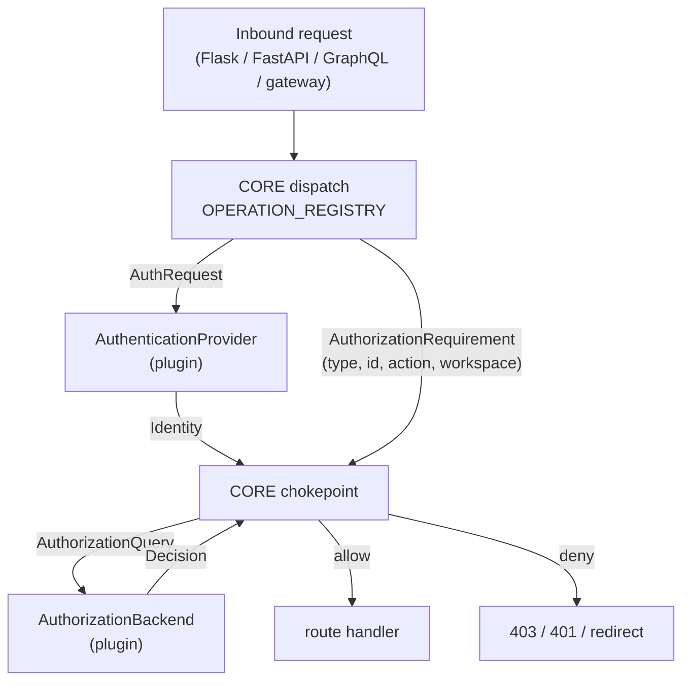

<!-- markdownlint-disable-file MD041 -->

| Author(s)              | [Patrick Koss](https://github.com/PatrickKoss)     |
| :--------------------- | :------------------------------------------------- |
| **Date Last Modified** | 2026-08-05                                         |

<!-- markdownlint-disable MD025 -->

> **Code references.** Every `file:line` reference in this document was verified
> against MLflow `3.15.2.dev0` (commit `be812f5a1`). The auth server changes
> often; treat the symbol names as authoritative and the line numbers as a
> snapshot.

# Summary: Pluggable Enterprise Authentication and Authorization

MLflow's only built-in auth surface is a single configurable
`authorization_function` (`mlflow/server/auth/config.py:15`). That one hook
conflates two distinct concerns — *who are you* (authentication) and *what may
you do* (authorization) — into one function that returns a
`werkzeug.datastructures.Authorization` carrying nothing but a username. It is
too thin for bearer tokens, OIDC claims, group membership, or linking an
external identity to a local user record. Worse, the knowledge of *which
permission a given route requires* is fused inside ~105 validator functions
spread across six dispatch structures. Any external authorization system has to
rediscover and duplicate that entire mapping, and re-sync it every time MLflow
adds a route.

This RFC proposes splitting auth into **two small plugin contracts** while
keeping the expensive, churning knowledge in core:

- **`AuthenticationProvider`** — turns an inbound request (headers, cookies)
  into an `Identity`.
- **`AuthorizationBackend`** — owns the allow/deny decision given an `Identity`
  and a **normalized** `AuthorizationRequirement`.

Exactly one of each is configured per server.

The load-bearing design rule: **core retains sole ownership of the
route → requirement mapping**, expressed as a single authoritative
`OPERATION_REGISTRY`. Plugins never see a route, a protobuf class, or a GraphQL
field — only the tuple `(resource_type, resource_id, action, workspace)`. A CI
guard fails the build if any route ships without declaring a requirement.

**This RFC defines contracts, not plugins.** No OIDC provider, no Kubernetes
adapter, and no policy-engine adapter ships as part of this work. Concrete
plugins are expected to live outside the MLflow repo and be community
maintained, with some possibly donated back later. Where this document names
Kubernetes `SubjectAccessReview`, OPA, or OIDC, it does so *only* to demonstrate
that the interface shape is sufficient — those are worked examples, not
deliverables.

This is the extension RFC that **RFC 0005** ("Role-Based Access Control for
MLflow OSS") explicitly flagged as future work in its *"Extension point:
resolver interface"* section. It builds on 0005's
`get_role_permission_for_resource(...)` /
`list_accessible_workspace_names(...)` resolver surface
(`mlflow/server/auth/sqlalchemy_store.py:2075`, `:996`) and its
`READ/USE/EDIT/MANAGE` permission levels. It does not change 0005's role
storage. **The default plugins reproduce today's behavior exactly: every
authorization check that exists before this change exists after it, with the
same outcome for the same input.**

# Basic example

The operator-facing change is a small config edit. The shape of the config
mirrors the existing basic-auth INI (`mlflow/server/auth/basic_auth.ini`).

**Default — identical to today's behavior.** An operator who upgrades and
changes nothing gets exactly the current basic-auth + database RBAC:

```ini
[mlflow]
default_permission = READ
database_uri = sqlite:///auth.db
admin_username = admin
admin_password = password

authn_provider = basic-auth   # the authn half of today's basic auth
authz_backend  = database     # the RFC 0005 role resolver, wrapped as a backend
```

An external deployment selects different plugins by name. The plugins configure
themselves — MLflow's INI carries only the *selection*:

```ini
[mlflow]
authn_provider = my-oidc
authz_backend  = my-policy-engine
```

**The plugin author's whole job.** An authorization plugin implements one
required method, and it never learns MLflow's routing:

```python
class MyBackend:
    name = "my-policy-engine"

    def authorize(self, query: AuthorizationQuery) -> Decision:
        req = query.requirement   # ("experiment", "42", "update", "ml-research")
        # ...ask whatever system owns the decision...
        return Decision(allowed=..., reason=...)
```

The plugin sees `("experiment", "42", "update", "ml-research")`. It never sees
`POST /api/2.0/mlflow/runs/log-metric`, never imports `LogMetric`, never learns
that logging a metric requires `update` on the run's *parent experiment*. That
derivation stays in core.

## Motivation

The legacy auth surface has three structural problems. They mirror the
three-problem framing of RFC 0005, one layer up.

**First, authentication and authorization are a single string.** The only hook
is `auth_config.authorization_function`, a dotted path resolved through
`importlib` (`mlflow/server/auth/__init__.py:2982`, `:2989`). The default,
`authenticate_request_basic_auth` (`:3001`), both reads the `Authorization`
header *and* decides the user is who they claim. There is no way to express the
common enterprise shape "authenticate against an external IdP, but delegate the
*decision* to an external policy system." The two concerns are welded together.

**Second, the identity is too thin.** `authenticate_request()` returns a
`werkzeug Authorization`, whose only useful attribute is `.username`. Real
enterprise deployments need to validate a token against an IdP, carry attributes
the authorization system will reason over, and link an external identity to a
local record so the UI can display a real name and the review-queue features can
assign work to a person. None of that fits through a username string. Today
operators bolt an OAuth proxy (oauth2-proxy, Authelia, Pomerium) in front of
MLflow; the proxy authenticates, but MLflow stays blind to who the user is
beyond a header value.

The custom-function hook also has a framework shape baked in. It is written
against Flask's request context (`flask.request`), so the FastAPI path has to
bridge it: `_authenticate_custom_for_fastapi` (`:4499`) constructs a synthetic
Flask request context from the Starlette request, calls the custom function
inside it, and converts a returned Flask `Response` back to a Starlette one
(`_flask_response_to_starlette`, `:4546`). This works today — custom auth
functions *are* honored on FastAPI routes — but it means every provider is
written against a framework it may not be serving, and the adapter is a
correctness surface that has to stay in sync with both frameworks. Deployments
that want to avoid the bridge entirely can skip the basic-auth app and register
their own FastAPI middleware; this is what Kubeflow's `mlflow-integration` does.
That works, but it puts the whole route → permission mapping on the integrator.

**Third, and most damaging for maintainability, the route → requirement mapping
is fused inside the validators and scattered across six structures.** Each entry
in `BEFORE_REQUEST_HANDLERS` (`:2605`, ~119 protobuf classes) maps a request
class to a validator that *both* extracts the resource *and* decides
(`validate_can_read_run` at `:1152` pulls the run id, resolves its parent
experiment and workspace, queries grants, and returns a boolean). That knowledge
is replicated across:

| Structure | Location | Surface |
| :--- | :--- | :--- |
| `BEFORE_REQUEST_HANDLERS` | `:2605` | protobuf request class → validator |
| `BEFORE_REQUEST_VALIDATORS` (+ three `.update()` blocks) | `:2762`, `:2780`, `:2804`, `:2849` | exact `(path, method)` |
| `TRACE_PARAMETERIZED_BEFORE_REQUEST_VALIDATORS` | `:2872` | trace paths with path params |
| `LOGGED_MODEL_BEFORE_REQUEST_VALIDATORS` | `:2894` | logged-model paths |
| `WEBHOOK_BEFORE_REQUEST_VALIDATORS` | `:2923` | webhook paths |
| `_find_fastapi_validator` | `:4970` | gateway, OTel, jobs, assistant, MCP, native artifact proxy |
| `GraphQLAuthorizationMiddleware.PROTECTED_FIELDS` | `:4302` | seven GraphQL fields |

An external authorization integration cannot consume any of this. It must
rediscover that "GetRun means read on the parent experiment," redo it for every
operation, and re-sync on every MLflow release that adds a route. The surface
keeps growing — MCP servers, review queues, scorers, gateway model definitions,
and prompt-optimization jobs are all recent additions with their own validators.
That duplication is the single hardest thing to maintain in a plugin approach,
and it is exactly what this RFC is designed to prevent.

RFC 0005 deferred the "pluggable authorization resolver" and flagged the small
resolver interface as a known hook-in point for "a future extension RFC." This
is that RFC.

### Out of scope

- **Shipping any concrete plugin.** This RFC defines the two contracts and the
  core-side refactor that makes them viable. OIDC, Kubernetes, policy engines,
  Kerberos, and proxy-header providers are separate work, expected to be
  community maintained. This matches the maintainer's stated preference: make
  MLflow pluggable, let the community maintain the plugins, with some donated
  back.
- **A full OIDC/SAML login experience.** Login pages, server-side sessions,
  cookie lifecycle, single logout, and SDK token-acquisition flows are the
  concern of a specific authentication provider plugin, not this framework RFC.
- **Multiple simultaneous providers.** Exactly one `AuthenticationProvider` and
  one `AuthorizationBackend` per server. See "Alternatives" for why a chain was
  dropped.
- **Plugin configuration format.** MLflow's INI selects plugins by name. How a
  plugin reads its own settings (env vars, its own file, a secret mount) is the
  plugin's business.
- **Plugin-side caching.** Each plugin owns its own cache, TTL, and invalidation
  strategy. Core does not wrap backends in a decision cache.
- **Changing RFC 0005's role storage or the MLflow role model.** Roles remain a
  concept of the built-in database backend. An external authorization system maps
  its own groups/roles/policies to permissions inside its own plugin code; it does
  not populate MLflow's role tables.
- **Building an identity provider.** MLflow delegates authentication to external
  systems.

## Detailed design

### The three layers

The design is three layers with a hard boundary between them. The boundary is
the whole point: it is what keeps route knowledge out of plugins.

| Layer | Owner | Sees | Produces |
| :--- | :--- | :--- | :--- |
| **Dispatch** (route → requirement) | **MLflow core**, never a plugin | Flask `Request`, Starlette `Request`, GraphQL `info`, protobuf class, gateway path/body | an `AuthorizationRequirement` |
| **Authentication** | `AuthenticationProvider` plugin | the request's method, path, headers, cookies, query | an `Identity` (or a challenge) |
| **Authorization** | `AuthorizationBackend` plugin | `Identity` + `AuthorizationRequirement` + `RequestContext` | a `Decision` |



A plugin author never learns what a "trace tag PATCH" is, never parses a
protobuf, never re-derives that `LogMetric` requires `update` on the parent
experiment. Core resolves every surface into the same tuple and hands that tuple
to the backend.

### Identity

The authn output and the authz subject. It replaces the thin `Authorization`.

The field set is deliberately minimal: **the only first-class attributes are the
ones core itself consumes.** Everything else an authorization system might want
to reason over — IdP groups, raw token claims, tenant ids, employee numbers —
travels in one opaque `metadata` mapping that core never interprets.

```python
@dataclass(frozen=True)
class Identity:
    # Stable principal key. The authz subject, and the link key for the local
    # identity record. MUST be stable across logins.
    username: str

    # Optional display attributes. Core stores these on the identity record and
    # uses them for UI rendering and work assignment. None when the provider
    # does not supply them.
    email: str | None = None
    display_name: str | None = None
    profile_url: str | None = None   # the user's page on the IdP; hyperlinked in the UI

    # Opaque provider payload, passed through to the authorization backend
    # verbatim. Core never reads a key out of this. Groups, JWT claims, SAML
    # attributes, and tenant ids all live here.
    metadata: Mapping[str, Any] = field(default_factory=dict)
```

`frozen=True` makes the identity hashable, which matters for plugins that key
their own caches on it.

#### The identity record and why core stores it

Core keeps its own table of authenticated identities, keyed by `username`,
holding `email`, `display_name`, `profile_url`, the provider name, and
first-seen / last-seen timestamps. On every successful authentication core
upserts the row before authorization runs:

```python
class IdentityStore(Protocol):
    def upsert(self, identity: Identity, provider: str) -> None: ...
```

This is **a new table, separate from basic auth's `users` table.** Basic auth
sits behind the same plugin boundary as any other provider, so core must be
agnostic to its storage. Mixing external identities into the basic-auth users
table would conflate "principal MLflow has seen" with "local account with a
password hash," and would make basic auth's schema a de facto core dependency.

The record exists because several MLflow features need to name a person who is
not necessarily a local account:

- **Review queues** assign work to a user and stamp an owner
  (`_get_request_username()` in `mlflow/server/handlers.py:4778`, fed by
  `g.mlflow_authenticated_user` at `mlflow/server/auth/__init__.py:3083`).
- **The UI** renders a display name rather than a raw principal string, and can
  hyperlink `profile_url`.
- **Audit** needs a stable record of principals the server has authenticated.

Providers never write to this table; core does. The upsert is idempotent and
attribute-refreshing, so a display name changed at the IdP propagates on next
login.

#### Trusting identity over request payload

Several MLflow write paths currently take user attribution from the request body
— most visibly the `mlflow.user` tag on run creation. With a resolved `Identity`
in hand, core should **overwrite** those attributions from the authenticated
principal rather than trusting a client-supplied value, whenever an auth provider
is active. Kubeflow's MLflow auth integration already does this downstream; it
belongs in core once identity is a first-class object. The seam exists
(`g.mlflow_authenticated_user`); this RFC makes it authoritative.

### AuthenticationProvider

```python
@dataclass(frozen=True)
class AuthChallenge:
    """How the client should authenticate. Core turns this into a response."""
    status_code: int = 401
    headers: Mapping[str, str] = field(default_factory=dict)  # WWW-Authenticate, Location, Set-Cookie
    # When True, core emits a 302 redirect for HTML clients and a 401 for API
    # clients (decided by content negotiation, in core).
    is_redirect: bool = False


@dataclass(frozen=True)
class AuthenticationResult:
    """Exactly one outcome per provider call."""
    kind: Literal["authenticated", "challenge"]
    identity: Identity | None = None
    challenge: AuthChallenge | None = None

    @property
    def is_authenticated(self) -> bool:
        return self.kind == "authenticated"

    # Factories the *plugin* calls to build its return value.
    @staticmethod
    def success(identity: Identity) -> "AuthenticationResult":
        return AuthenticationResult("authenticated", identity=identity)

    @staticmethod
    def needs_challenge(challenge: AuthChallenge) -> "AuthenticationResult":
        return AuthenticationResult("challenge", challenge=challenge)


class AuthenticationProvider(Protocol):
    name: str  # matches the entry-point name; recorded on the identity record

    def authenticate(self, request: "AuthRequest") -> AuthenticationResult: ...
```

`AuthenticationProvider.authenticate` is **the only method core calls.**
`AuthenticationResult.success(...)` / `.needs_challenge(...)` are constructors
the plugin uses to build what it returns; core never calls them.

### AuthRequest: one interface, both frameworks

MLflow runs both Flask (WSGI, `_before_request` at `:3068`) and FastAPI/Starlette
(`fastapi_permission_middleware` at `:5125`). Custom auth functions today are
Flask-shaped and reach FastAPI only through the request-context bridge at
`:4499`. We should not perpetuate that: a provider should be written once,
against neither framework.

Both Flask and Starlette requests are wrapped into one read-only adapter:

```python
class AuthRequest(Protocol):
    @property
    def method(self) -> str: ...
    @property
    def path(self) -> str: ...
    @property
    def headers(self) -> Mapping[str, str]: ...   # case-insensitive
    @property
    def cookies(self) -> Mapping[str, str]: ...
    @property
    def query(self) -> Mapping[str, str]: ...
```

### AuthorizationBackend: the component that owns the decision

```python
@dataclass(frozen=True)
class AuthorizationRequirement:
    resource_type: str           # permissions.VALID_RESOURCE_TYPES, plus "system"
    resource_id: str | None      # concrete id / name; None for create-in-workspace and pure workspace ops
    action: str                  # "read" | "use" | "update" | "delete" | "manage" | "create"
    workspace: str | None        # resolved workspace name, or None when workspaces are disabled


@dataclass(frozen=True)
class RequestContext:
    """Built by core, read-only, one per request. Provided so a backend can log,
    correlate, or apply request-shaped policy — never so it can re-derive the
    requirement."""
    operation: str               # the OPERATION_REGISTRY key, e.g. "GetRun", "graphql.mlflowGetRun"
    method: str                  # HTTP method
    path: str                    # request path
    request_id: str              # per-request correlation id, also emitted in audit logs
    surface: Literal["rest", "graphql", "gateway"]


@dataclass(frozen=True)
class AuthorizationQuery:
    subject: Identity
    requirement: AuthorizationRequirement
    context: RequestContext


@dataclass(frozen=True)
class Decision:
    allowed: bool
    # READ/USE/EDIT/MANAGE/NO_PERMISSIONS. None when the backend does not model
    # permission levels (a boolean-only system).
    effective_permission: str | None = None
    # True/False when the backend has an administrator concept and can answer;
    # None when it has no such concept, in which case core falls back to its own
    # super-admin rule.
    is_admin: bool | None = None
    reason: str | None = None    # surfaced in the 403 body and the audit log


class AuthorizationBackend(Protocol):
    name: str

    def authorize(self, query: AuthorizationQuery) -> Decision: ...

    # Declares which resource types and actions this backend can decide.
    # Called once at server startup. See "Capability negotiation".
    def capabilities(self) -> "BackendCapabilities": ...

    # Optional. Enumerates what the subject may access, so core can push a filter
    # into the store query instead of filtering the response. See "Search".
    def list_authorized(
        self, subject: Identity, resource_type: str, action: str, workspace: str | None
    ) -> "AuthorizedResources": ...
```

`RequestContext` is constructed by core at the chokepoint and is deliberately
narrow: it carries provenance and correlation, not raw request material. It does
**not** carry the request body, the protobuf message, or the framework request
object — handing those to a plugin would reopen the route-knowledge boundary this
RFC exists to close.

The **six action verbs** map onto the existing `Permission` booleans
(`mlflow/server/auth/permissions.py:8`): `read→can_read`, `use→can_use`,
`update→can_update`, `delete→can_delete`, `manage→can_manage`, plus `create`,
which today is a workspace-level gate (`_user_can_create_in_workspace()` at
`:642`, ultimately a workspace-wide check in `_can_create_in_workspace()` at
`:608`). These six cover every existing validator.

#### Capability negotiation

MLflow adds resource types (recently: `mcp_server`, `scorer`,
`gateway_model_definition`). A backend pinned to an older MLflow may not know how
to decide on a newer one. Silently allowing — or silently denying — is
unacceptable in both directions, so the backend declares what it covers and core
enforces the boundary at startup:

```python
@dataclass(frozen=True)
class BackendCapabilities:
    resource_types: frozenset[str]           # e.g. permissions.VALID_RESOURCE_TYPES | {"system"}
    actions: frozenset[str]                  # subset of the six verbs
    supports_list_authorized: bool = False
```

At startup, core computes the set of `(resource_type, action)` pairs the
`OPERATION_REGISTRY` can emit and diffs it against `capabilities()`. Behavior on
a gap is operator-selectable:

| `authz_compatibility` | Behavior on an uncovered `(resource_type, action)` |
| :--- | :--- |
| `strict` (default) | server refuses to start, naming the uncovered pairs |
| `lenient` | server starts with a loud warning; requests hitting an uncovered pair are **denied** at request time with an explanatory reason |

`strict` is the default because it turns a silent authorization gap into a
startup failure. `lenient` exists for operators who want MLflow patch updates
without waiting on a plugin release, and who do not use the newer features — they
accept that those features are unreachable until the plugin catches up.

#### The default DB backend reproduces today's behavior exactly

`DefaultDbAuthorizationBackend.authorize(query)`:

1. If the local user row is admin, return `Decision(allowed=True, is_admin=True)`
   — reproduces the `sender_is_admin()` short-circuit at `:3089` (`sender_is_admin`
   itself at `:1374`).
2. For `create`, reproduce `_user_can_create_in_workspace()` (`:642`).
3. Otherwise call the *existing* resolver:
   `perm = store.get_role_permission_for_resource(user.id, requirement.resource_type,
   requirement.resource_id, requirement.workspace)`
   (`mlflow/server/auth/sqlalchemy_store.py:2075`), fold against
   `default_permission` exactly as `_get_role_permission_or_default()` does
   (`:584`), then `allowed = getattr(perm, f"can_{action}")`. Return
   `Decision(allowed, effective_permission=perm.name)`.

This is a mechanical extraction of the body already inside every `validate_can_*`
function — the same `_role_permission_for()` / `_get_role_permission_or_default()`
chain (`:705`, `:584`). **The default backend is today's behavior, unchanged.**
Every check that runs before the refactor runs after it, against the same store
methods, producing the same allow/deny. That is the backward-compatibility
requirement, and it is asserted by a characterization test (see "Adoption
strategy").

#### Worked example: is the interface sufficient?

To show the tuple is rich enough for an external system without shipping one,
consider a Kubernetes `SubjectAccessReview`. The requirement was deliberately
shaped so the mapping is mechanical:

| Requirement field | SAR field | Mapping |
| :--- | :--- | :--- |
| `action` | `verb` | read→get, use→use, update→update, delete→delete, manage→`*`, create→create |
| `resource_type` | `resource` | direct |
| `resource_id` | `name` | direct |
| `workspace` | `namespace` | direct |

A policy-engine backend has an even simpler job: serialize
`(subject.username, subject.metadata, requirement, context)` as the policy input
and read `allow` back. `Identity.metadata` is what makes that work — a policy can
reason over arbitrary IdP attributes without MLflow knowing what they are.

Neither adapter is proposed for the MLflow repo. They are here to show the
contract holds.

#### What a backend can express

| Capability | DB (default) | A boolean external system | A policy engine |
| :--- | :--- | :--- | :--- |
| `allowed` | yes | yes | yes |
| `effective_permission` level | yes | no (boolean only) | optional |
| `is_admin` | yes (user row) | `None` (no concept), or via policy | via policy |
| cheap `list_authorized` | yes (one grant query) | usually not | often, via partial evaluation |
| per-check cost | in-process | one network call | one network call |

### Core keeps owning route → requirement (the centerpiece)

#### Today's shape and why it traps plugins

Each `BEFORE_REQUEST_HANDLERS` entry (`:2605`) maps a protobuf class to a
validator that *both* resolves the requirement *and* decides inline. `GetRun →
validate_can_read_run` (`:1152`) extracts the run id, looks up the experiment,
resolves the workspace, queries grants, and returns a boolean — all fused. A
remote backend cannot reuse any of it without re-deriving "GetRun means read on
the parent experiment." That re-derivation, multiplied across ~105 validators and
re-synced every release, is the maintenance trap.

#### The refactor: validators become requirement descriptors

Split each validator into two halves:

- **Requirement resolver** (stays in core, one per operation): a pure extraction
  `resolve(request) -> [AuthorizationRequirement]`. It pulls `run_id` from the
  body, resolves its experiment and workspace, and returns
  `AuthorizationRequirement("experiment", experiment_id, "read", workspace)`. No
  decision.
- **The decision** moves to a single chokepoint that calls `backend.authorize`.

The dispatch tables change from `class → validator()` to
`class → RequirementDescriptor`:

```python
@dataclass(frozen=True)
class RequirementDescriptor:
    # Pure extraction. May return several requirements (e.g. a bulk metric-history
    # read across N runs checks read on each).
    resolve: Callable[[Request], list[AuthorizationRequirement]]

# BEFORE_REQUEST_HANDLERS becomes, e.g.:
GetRun:           RequirementDescriptor(resolve=lambda r: [_require_run(r, "read")]),
LogMetric:        RequirementDescriptor(resolve=lambda r: [_require_run(r, "update")]),
CreateExperiment: RequirementDescriptor(resolve=lambda r: [_require_workspace_create(r)]),
```

`_require_run(r, action)` is the extraction half of today's
`_get_permission_from_run_id` (`:887`); it returns a requirement instead of a
`Permission`. The single chokepoint — replacing the validator call in
`_before_request` (`:3068`) and the validator call inside
`fastapi_permission_middleware` (`:5125`) — is:

```python
def _authorize(req, identity: Identity, descriptor) -> Response | None:
    if descriptor is None:
        return _handle_unmapped_route(req)          # fail-closed; see the registry section
    requirements = descriptor.resolve(req)
    for decision in backend_authorize_all(identity, requirements, _ctx(req)):
        if not decision.allowed:
            return make_forbidden_response(decision.reason)
    return None
```

`backend_authorize_all` issues one `authorize` per requirement, concurrently and
with bounded parallelism when there is more than one — which is why the backend
protocol needs no batch method.

The dispatch functions (`_find_validator` at `:3020`, `_find_fastapi_validator`
at `:4970`) keep their structure — the same regex/exact-match ordering
(logged-models → webhooks → exact `(path, method)` → traces regex, and on the
FastAPI side gateway → OTel → jobs → assistant → native artifact proxy → MCP) —
they just return a `RequirementDescriptor` instead of a `Callable[[], bool]`. The
fail-closed trace default (`lambda: False` at `:3062`) becomes a descriptor that
always denies.

The plugin never sees `_find_validator`, the protobuf classes, the gateway path
regexes, or the GraphQL field names. It only ever receives an
`AuthorizationQuery`.

#### Special cases that already exist and survive cleanly

- **`sender_is_admin` validators** (webhooks at `:2909`, and the admin-gated
  user/role routes): become a descriptor producing
  `("system", None, "manage", None)`. Core's super-admin gate, or the backend's
  `Decision.is_admin`, handles it.
- **`lambda: True` "authenticated but unrestricted" routes** (jobs and assistant
  via `_get_require_authentication_validator()` at `:4862`, plus
  `GET_CURRENT_USER`): become a `REQUIRE_AUTHENTICATED` sentinel — identity
  required, no backend call. This is distinct from *public* (no identity needed at
  all, `is_unprotected_route` at `:485`).
- **After-request grant/filter handlers** (`AFTER_REQUEST_PATH_HANDLERS` at
  `:3749`, e.g. `set_can_manage_experiment_permission` at `:3103`, and the
  search-result filters at `:3440`+) are a separate concern, addressed under
  "Search and list filtering" and "Drawbacks." They stay in core and are not part
  of the plugin contract.

### The authoritative OPERATION_REGISTRY and the CI guard

#### One source of truth

The six structures listed in "Motivation" consolidate into one declarative
registry, keyed by a stable operation id, with an explicit protection
classification:

```python
class Protection(Enum):
    PUBLIC = "public"               # no auth at all (health, static, landing page)
    AUTHENTICATED = "authenticated" # identity required, no authz check
    AUTHORIZED = "authorized"       # identity + backend.authorize(requirement)


@dataclass(frozen=True)
class OperationSpec:
    operation: str                  # "GetRun", "graphql.mlflowSearchRuns", "gateway.invoke"
    protection: Protection
    descriptor: RequirementDescriptor | None  # required iff AUTHORIZED


OPERATION_REGISTRY: dict[str, OperationSpec] = { ... }
```

The existing dispatch tables become *derived* from this registry (so the lookup
structures keep their current shape and performance — no behavior change), but the
registry is the authority and the thing reviewers edit. It is also what the
startup capability check diffs against `BackendCapabilities`.

#### The CI guard

A test enumerates every registered operation across all surfaces:

- **Flask/protobuf:** walk `get_endpoints(...)` (the generator already used to
  build `BEFORE_REQUEST_VALIDATORS` at `:2762`) → every `(path, method)`.
- **FastAPI:** introspect the FastAPI route table for `/gateway/*`, `/v1/traces`,
  `/ajax-api/3.0/*`, MCP server paths, and native proxy-artifact paths.
- **GraphQL:** every field on the schema's query and mutation types.

For each, assert it appears in `OPERATION_REGISTRY` with an explicit
`Protection`. A new route with no entry fails CI. This test is the most valuable
maintainability artifact in the proposal: it forces the route → requirement
knowledge to stay complete and in one place. It also closes today's silent
fail-open on the FastAPI path, where an unmatched route falls through to
`return await call_next(request)` (`:5135`).

#### GraphQL: registry-driven

Today `PROTECTED_FIELDS` (`:4302`) is a hardcoded set of seven fields; any field
not in the set is unprotected. The gate `MLFLOW_SERVER_ENABLE_GRAPHQL_AUTH`
(`:4425`) defaults to **on** (`mlflow/environment_variables.py:1602`), so GraphQL
auth is enabled by default today — but only for those seven fields.

Under the plugin model the GraphQL field → requirement map joins
`OPERATION_REGISTRY` (operation ids like `graphql.mlflowGetRun`) and the flag is
dropped. The middleware (`resolve` at `:4312`) resolves each field to a
requirement and calls the same `backend.authorize` chokepoint as REST; its
existing two-phase pattern (pre-resolve check, then `_post_resolve` filtering at
`:4401`) maps onto `authorize` (pre) and `list_authorized` (post). The CI guard
enforces that *every* query/mutation field is classified: read-only metadata
fields may be `AUTHENTICATED`; data-bearing fields must be `AUTHORIZED`.

#### Gateway granularity

Every gateway invocation today checks `USE` on the `gateway_endpoint` resource
(`_validate_gateway_use_permission` at `:4591`), with the endpoint name extracted
from path or body (`_extract_gateway_endpoint_name` at `:4566`,
`_get_gateway_validator` at `:4617`). The assessment:

- `gateway_endpoint` `USE` for invocation is the right primary granularity — keep
  it. It's the resource a caller "uses."
- `gateway_secret` and `gateway_model_definition` have CRUD validators in
  `BEFORE_REQUEST_HANDLERS`, but the *invocation* path checks only the endpoint,
  not the underlying secret or model definition. For most deployments that is
  correct: the secret is an admin artifact bound to the endpoint. **Decision:
  invocation authorizes on the endpoint only; secret and model definition are
  management-time resources.** Core will not issue a second mandatory check.

The gateway extractor stays in core (it is route knowledge); the requirement it
emits is `("gateway_endpoint", endpoint_id, "use", workspace)`. The current
allow-all proxy passthrough (`validate_gateway_proxy` at `:2321`) becomes an
explicit `AUTHENTICATED` registry entry instead of a silently-true validator,
making the intentional openness auditable.

### Search and list filtering

This is the part of today's design that most needs replacing, independent of
plugins.

**Today:** core runs the store query, then filters the response and *backfills*
by re-querying to top the page back up — `filter_search_experiments` (`:3440`),
`filter_search_logged_models` (`:3485`), `filter_search_registered_models`
(`:3555`), `filter_search_model_versions` (`:3611`), and
`_backfill_readable_mcp_results` (`:4762`). If a user can read one experiment out
of a thousand, the server can walk most of the workspace to fill a single page.
The page-token arithmetic that keeps pagination coherent across a filtered
response is also the fiddliest code in the auth server.

**Proposed:** ask the authorization system what the subject can see, then push
that down into the store query as a filter, so pagination works natively and no
backfill is needed.

```python
@dataclass(frozen=True)
class AuthorizedResources:
    # True  => the subject may perform `action` on every resource of this type
    #          in this workspace. Core issues the query unmodified, no filtering.
    # False => `resource_ids` is the exact allowed set; core pushes it into the
    #          store query as an id filter.
    # None  => the backend cannot enumerate. Core falls back to per-result
    #          authorization (concurrent `authorize` calls over the page).
    all: bool | None
    resource_ids: frozenset[str] | None = None
```

- The **DB backend** answers from one grant query — the same query
  `_role_based_read_predicate` (`:1704`) and `filter_experiment_ids` (`:1749`)
  already use, so this is a reshape, not new cost. It returns `all=True` for a
  workspace admin, otherwise the explicit id set.
- A **policy engine** can often answer via partial evaluation.
- A **boolean-only external system** returns `all=None`; core falls back to
  filtering the page it fetched, with concurrent per-item `authorize` calls. This
  is the honest worst case, and it is bounded by page size rather than by
  workspace size — strictly better than today's backfill.

`list_authorized` is optional; a backend that does not implement it is treated as
`all=None`. `BackendCapabilities.supports_list_authorized` lets core log which
mode a deployment is in.

Whether to push the predicate all the way into the tracking-store SQL (rather
than as an id list on the request) is an optimization left to implementation.

### Configuration

MLflow's INI stays what it is today: **basic auth's config file**. It gains
exactly three keys, all of them *selection*, not plugin settings:

| Key | Default | Meaning |
| :--- | :--- | :--- |
| `authn_provider` | `basic-auth` | entry-point name of the authentication provider |
| `authz_backend` | `database` | entry-point name of the authorization backend |
| `authz_compatibility` | `strict` | startup behavior on a capability gap |

**Plugins configure themselves.** A plugin decides whether it reads env vars, its
own file, a mounted secret, or a service-discovery endpoint. Core does not define
`[authn.<name>]` sections, does not parse plugin settings, and does not pass a
config dict to plugin factories. This keeps `AuthConfig`
(`mlflow/server/auth/config.py:10`) from becoming a registry of every plugin's
schema, and it means a plugin's configuration can evolve without an MLflow
release.

Implementations are discovered through the entry-point pattern MLflow already
uses (`get_entry_points` at `mlflow/server/__init__.py:220`, as with
`mlflow.app`):

```toml
[project.entry-points."mlflow.auth.authn_provider"]
basic-auth = "mlflow.server.auth.providers:BasicAuthProvider"

[project.entry-points."mlflow.auth.authz_backend"]
database   = "mlflow.server.auth.backends:DefaultDbAuthorizationBackend"
```

**Backward-compatibility shim:** if the legacy `authorization_function` key is
present and `authn_provider` is absent, core synthesizes a provider that wraps
that function (adapting its `Authorization` return to `Identity(username=...)`)
and selects `authz_backend = database`. Existing configs keep working unchanged,
including on the FastAPI path — the shim replaces the synthetic-request-context
bridge at `:4499`, so custom functions stop needing Flask at all.

### Error handling and fail-closed

An exception or timeout from either plugin is a **deny**. There is no
`allow-on-error` mode and no cross-backend fallback: with a single configured
backend there is nothing coherent to fall back *to*, and an escape hatch that
turns an outage into open access is not something core should offer.

This matches the existing posture: unknown trace paths deny (`:3062`),
workspace-lookup failure denies, and RFC 0005's `check_user_permission` denies
unknown resources. The unmapped-route handler denies. Denials carry
`Decision.reason` (or a generic reason for a raised exception) into the 403 body
and the audit log, and plugin exceptions are logged with a stack trace so an
outage is diagnosable rather than merely opaque.

## Drawbacks

- **Per-request remote latency.** For a network-backed authorization plugin every
  protected request becomes a round trip. Core no longer provides a decision
  cache, so mitigation is entirely the plugin's responsibility — a deliberate
  trade (plugins know their invalidation semantics; core does not) but a real
  one. A busy UI page issuing many REST/GraphQL calls multiplies this.
- **A boolean backend loses the effective permission level.** A system that
  answers only allow/deny leaves `Decision.effective_permission` as `None`, so
  RFC 0005's admin-UI "what is Bob's level on experiment 42?" degrades to
  allow/deny under such a deployment. Acceptable, but it must be documented.
- **Grant authoring is DB-backend-specific.** The after-request handler
  `set_can_manage_experiment_permission` (`:3103`) writes a grant on resource
  creation — meaningless for a backend whose grants live externally. Core must
  make these handlers no-ops when the configured backend is not the DB backend.
  The `AuthorizationBackend` protocol is deliberately *decision-only*; grant
  *authoring* (RFC 0005's role API, the after-create MANAGE grant) stays
  DB-backend-specific and is skipped under an external backend that owns its own
  grants. This is real coupling and is surfaced rather than hidden.
- **Capability negotiation can block upgrades.** `strict` mode means a lagging
  plugin blocks an MLflow upgrade. That is the point, but `lenient` exists
  precisely because it is sometimes the wrong trade-off.
- **Implementation cost.** Splitting ~105 fused validators into extraction +
  descriptor, then routing every surface through one chokepoint, is a sizeable
  refactor of `mlflow/server/auth/__init__.py` (5,407 lines today). The risk is
  mitigated by the default backend reproducing exact behavior and by a
  characterization test that runs the existing auth integration suite against the
  new chokepoint.

## Alternatives

**Keep the single `authorization_function` string; don't split authn/authz.**
Rejected. It conflates the two concerns the issue explicitly asks to separate, it
can't express "external authn + external authz," and its Flask-shaped signature
forces the synthetic-request-context bridge (`:4499`) to make it work on FastAPI
routes at all.

**An ordered chain of authentication providers.** Rejected, after review. It
sounds convenient (bearer, then cookie, then basic) but it requires each provider
to answer a question it usually cannot: "is this credential mine but invalid, or
not mine at all?" A provider that cannot distinguish those either swallows real
failures or breaks the chain, and the resulting challenge comes from whichever
provider happened to be last. One provider per server is unambiguous, and a
deployment that genuinely needs multi-scheme authentication can implement one
composite provider whose internal ordering it fully controls.

**Let plugins own routing — each plugin re-derives route → requirement.**
Rejected. This is exactly the maintainability trap the issue calls out. Every
plugin would duplicate the mapping and drift on every new MLflow route. The whole
design exists to prevent this.

**Two authentication entry points (one Flask, one FastAPI) instead of
`AuthRequest`.** Rejected. It doubles the provider implementation surface for
identical token-validation logic, and a doubled surface drifts. That is the
lesson of the bridge that exists today.

**Per-resource backend methods** (`can_read_experiment`, `can_use_gateway`, …)
mirroring the pre-RBAC layout. Rejected for the same reason RFC 0005 rejected
per-table storage: it preserves fan-out, and it makes every new resource type a
breaking protocol change. One `authorize(query)` plus declared capabilities is
the consolidation.

**A core-managed decision cache.** Rejected on review. Core cannot know a
backend's invalidation semantics; a fixed-TTL wrapper is either too aggressive
for a system with push invalidation or too lax for one without. Plugins cache.

**Impact of not doing this.** Enterprises keep running an OAuth proxy in front of
MLflow (extra infrastructure, MLflow blind to identity) or fork the auth server.
External integrations keep duplicating the route → permission map and re-syncing
it every release — the precise cost the issue raises.

# Adoption strategy

The change is largely additive, with a few deliberate behavior corrections.

**basic-auth is unchanged.** It becomes `BasicAuthProvider` (the authn half of
today's `authenticate_request_basic_auth`) plus `DefaultDbAuthorizationBackend`
(the authz half — the RFC 0005 resolver). The default config selects exactly
these, so an operator who upgrades and changes nothing sees identical behavior.
**All authorization checks remain the same after the migration**: same resources,
same required permission levels, same admin short-circuit, same fail-closed
defaults. This is asserted by the CI guard plus a characterization test that runs
the existing auth integration suite unmodified against the new chokepoint.

**Additive (non-breaking):** the `Identity` / `Decision` types, the identity
record table, the entry-point groups, the `OPERATION_REGISTRY`, and the
`authn_provider` / `authz_backend` / `authz_compatibility` config keys.

**Behavior changes, called out explicitly:**

- **GraphQL authorization extends beyond the seven hardcoded fields.** GraphQL
  auth is already on by default (`MLFLOW_SERVER_ENABLE_GRAPHQL_AUTH` defaults to
  `True`), but only `PROTECTED_FIELDS` (`:4302`) is checked. Under the registry
  every field is classified, so fields that are currently reachable without an
  authorization check start being checked. This is a deliberate fail-closed
  correction, scoped to the auth-enabled server; the flag itself is dropped.
- **The FastAPI unmapped-route path flips from fail-open to fail-closed.** Today
  an unmatched FastAPI route falls through to `call_next` (`:5135`). Under the
  registry it denies. The CI guard makes this discoverable before release;
  operators who mount custom FastAPI routes on the auth app must register them.
- **User attribution is taken from the authenticated identity**, not from a
  client-supplied request field, when an auth provider is active. A client that
  currently sets `mlflow.user` to an arbitrary value will see it overwritten.
- **`Identity` replaces the `Authorization` return contract** of
  `authenticate_request()`. A third party that wrote a custom
  `authorization_function` returning a `werkzeug Authorization` is shimmed (the
  returned object is adapted to `Identity(username=...)`), so it keeps working but
  is soft-deprecated.

**Sequencing.**

1. Land the `OPERATION_REGISTRY` + descriptor refactor and the CI guard with the
   decision still made by the existing DB code path. No plugin surface yet; this
   is pure consolidation and is independently valuable.
2. Introduce the two protocols, the identity record, and the default plugins,
   with the legacy `authorization_function` shim live.
3. Document the entry-point migration; deprecate the shim one minor release
   later.

RFC 0005's role model and resolver interface are a prerequisite — this RFC
assumes 0005 has landed.

# Open questions

- **Are `system` / super-admin operations backend-gated or core-only?** Truly
  global operations (create user, delete workspace) use `sender_is_admin` today
  (`:1374`). Do we model them as `("system", None, "manage")` and let a backend
  authorize them, or keep super-admin a core-only gate that a backend can only
  *assert* (via `Decision.is_admin`) but not *grant*? Leaning toward core-only for
  `system` ops, backend-decided everywhere else.
- **How is `is_admin=None` resolved?** When a backend reports no admin concept,
  core falls back to "its own super-admin rule" — which today means the local user
  row's `is_admin` flag. Under an external provider there may be no local row with
  meaningful admin state. Options: a configured list of admin principals, an
  `authorize(("system", None, "manage", None))` probe, or simply no admins outside
  the DB backend.
- **Does `list_authorized` need an id-set size bound?** Pushing a
  hundred-thousand-id filter into a store query is its own problem. A cap that
  degrades to `all=None` above some threshold is probably right, but the threshold
  is an implementation question.
- **Should the identity record be writable by MLflow admins?** Correcting a
  display name locally, or marking a principal disabled independently of the IdP,
  is plausible but expands the record from a cache into a store with its own
  conflict-resolution rules. Leaning toward read-only-from-IdP for v1.
- **Per-request workspace-resolution cost under remote backends.** The workspace
  lookup happens in core, *before* the backend call, to build the requirement. It
  stays in core and keeps its existing cache (`workspace_cache_ttl_seconds`), but
  it adds a store round-trip per request that a remote backend can't avoid.
